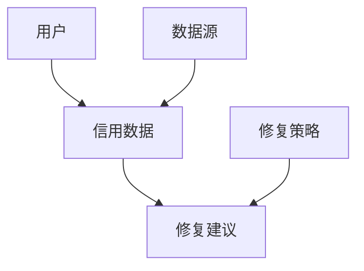
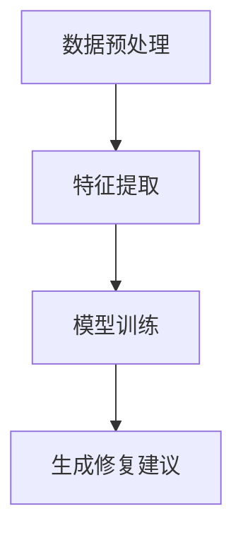
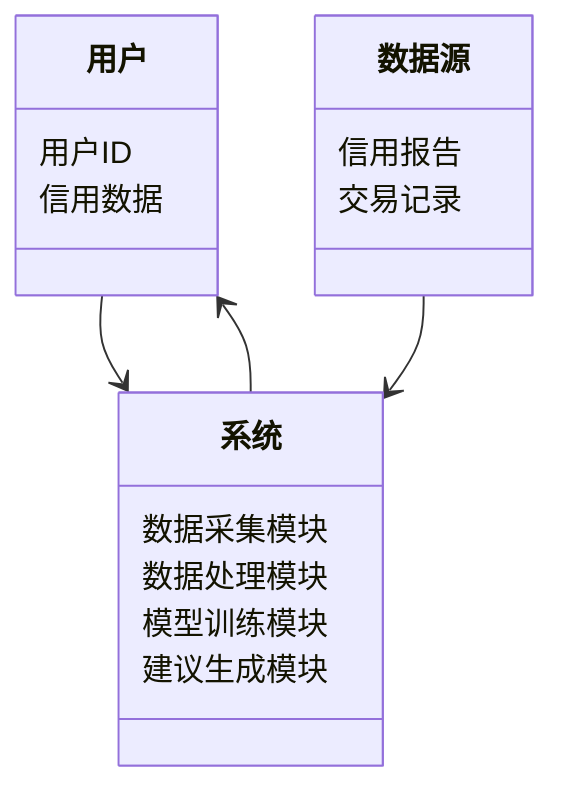

                 


# 智能个人信用修复建议系统

## 关键词：人工智能、信用修复、信用评分、机器学习、数据挖掘、推荐系统

## 摘要：  
本文介绍了一种基于人工智能的智能个人信用修复建议系统，该系统通过分析个人信用数据，利用机器学习算法生成修复建议，优化个人信用评分。文章详细阐述了系统的背景、核心概念、算法原理、架构设计及项目实战，并探讨了系统的最佳实践与未来发展方向。

---

# 正文

## 第1章: 个人信用修复的背景与需求

### 1.1 信用的重要性与修复的必要性

信用是个人在经济活动中的重要资产，直接影响贷款申请、信用卡额度、就业机会等。然而，由于各种原因，许多人可能会出现信用记录污点，如逾期还款、欠款等，导致信用评分下降。传统信用修复方法依赖人工操作，效率低且难以个性化处理。因此，智能信用修复系统的出现解决了这一问题。

### 1.2 传统信用修复方法的局限性

传统信用修复方法主要依赖人工审查和简单的规则匹配，难以覆盖复杂的信用问题。例如，传统方法难以根据个体情况制定最优修复策略，且修复效果难以量化。智能系统通过机器学习和大数据分析，能够更精准地识别信用问题并制定个性化修复方案。

### 1.3 智能个人信用修复建议系统的定义与目标

智能个人信用修复建议系统通过收集和分析个人信用数据，利用机器学习算法生成修复建议，帮助用户优化信用评分。系统的目标是提高修复效率，降低修复成本，同时保护用户隐私。

---

## 第2章: 智能信用修复系统的核心概念与联系

### 2.1 核心概念的定义与属性对比

以下是智能信用修复系统的核心概念及其属性对比：

| 实体 | 属性 | 描述 |
|------|------|------|
| 用户 | 信用评分 | 衡量用户信用状况的指标 |
| 数据源 | 数据类型 | 包括信用报告、交易记录等 |
| 修复策略 | 策略类型 | 如按时还款、债务重组等 |
| 修复建议 | 建议内容 | 如优化消费习惯、增加信用记录等 |

### 2.2 实体关系图

以下是系统实体关系的Mermaid流程图：



---

## 第3章: 基于机器学习的信用修复推荐算法

### 3.1 算法原理概述

智能信用修复系统采用混合推荐模型，结合协同过滤和基于内容的推荐算法。

#### 3.1.1 协同过滤推荐算法

协同过滤通过分析用户行为相似性，推荐相似用户的修复策略。公式如下：

$$ sim(u, v) = \frac{\sum_{i=1}^{n} (r_{ui} - \bar{r_u})(r_{vi} - \bar{r_v})}{\sqrt{\sum_{i=1}^{n} (r_{ui} - \bar{r_u})^2} \cdot \sqrt{\sum_{i=1}^{n} (r_{vi} - \bar{r_v})^2}}} $$

其中，$sim(u, v)$ 表示用户 $u$ 和 $v$ 的相似度，$\bar{r_u}$ 和 $\bar{r_v}$ 是用户 $u$ 和 $v$ 的平均评分。

#### 3.1.2 基于内容的推荐算法

基于内容的推荐算法通过分析信用数据的特征，生成修复建议。例如，使用TF-IDF提取关键词。

#### 3.1.3 混合推荐模型

混合推荐模型结合协同过滤和基于内容的推荐算法，利用加权投票法生成最终修复建议。

### 3.2 算法流程图

以下是算法执行过程的Mermaid流程图：



---

## 第4章: 智能信用修复系统的架构设计

### 4.1 系统功能模块

系统功能模块包括：

- 数据采集模块：从多个数据源获取信用数据。
- 数据处理模块：清洗和预处理数据。
- 模型训练模块：训练推荐算法模型。
- 建议生成模块：根据模型输出修复建议。

### 4.2 系统架构图

以下是系统架构的Mermaid图：



---

## 第5章: 项目实战

### 5.1 环境安装

建议使用Python 3.8及以上版本，安装以下库：

```bash
pip install pandas numpy scikit-learn
```

### 5.2 核心代码实现

以下是修复建议生成的代码示例：

```python
from sklearn.metrics.pairwise import cosine_similarity

# 数据预处理
def preprocess_data(data):
    # 数据清洗和特征提取
    return processed_data

# 模型训练
def train_model(data):
    model = cosine_similarity(data)
    return model

# 生成修复建议
def generate_recommendations(model, user_id):
    recommendations = model[user_id]
    return recommendations
```

### 5.3 实际案例分析

通过实际案例分析修复建议的效果，例如：

1. 用户A因逾期还款导致信用评分下降，系统建议其按时还款并优化消费习惯。
2. 用户B因多笔小额欠款，系统建议其优先偿还高息债务。

---

## 第6章: 总结与展望

### 6.1 系统优势与改进建议

智能信用修复系统的优势包括高效性、个性化和精准性。未来可以通过引入更多数据源和优化推荐算法进一步提升修复效果。

### 6.2 未来展望

未来，智能信用修复系统可能与区块链技术结合，进一步提高数据安全性和修复效率。同时，随着AI技术的进步，系统将更加智能化和个性化。

---

## 作者：AI天才研究院 & 禅与计算机程序设计艺术

本文作者：AI天才研究院（AI Genius Institute）与“禅与计算机程序设计艺术”（Zen And The Art of Computer Programming）联合创作。

