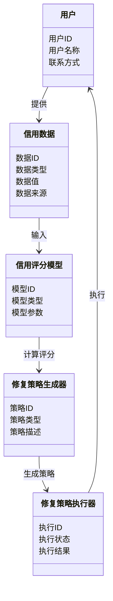
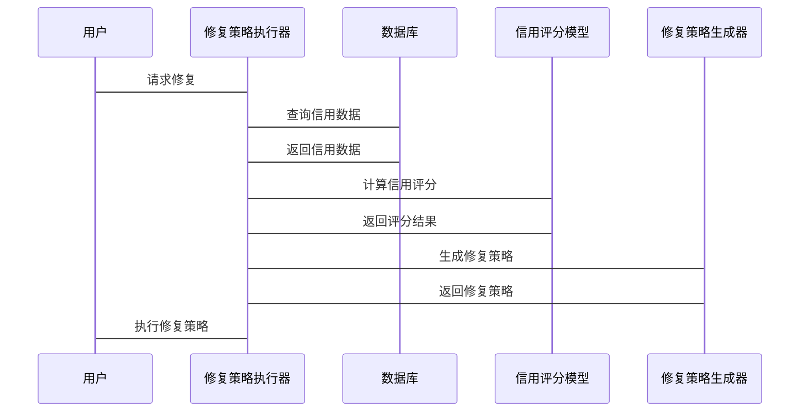

                 


# 智能个人信用修复策略推荐与执行系统

> 关键词：智能信用修复、推荐算法、系统架构、信用评分、策略执行

> 摘要：本文探讨了智能个人信用修复策略推荐与执行系统的设计与实现。通过分析信用修复的背景与挑战，提出了一种基于机器学习的信用评分模型和修复策略生成算法。结合系统架构设计，详细介绍了系统的实现过程，并通过实际案例展示了系统的应用效果。

---

# 第一部分：背景与概念

## 第1章：智能个人信用修复的背景与问题

### 1.1 个人信用修复的背景

#### 1.1.1 信用体系的重要性
信用体系是现代社会经济活动的基础，个人信用记录直接影响个人的贷款申请、信用卡额度、就业机会等。随着数字化时代的到来，信用评分的准确性与及时性变得尤为重要。

#### 1.1.2 个人信用修复的必要性
在实际生活中，由于各种原因，个人信用记录可能受到损害，例如逾期还款、账户异常等。传统的信用修复方式通常依赖于人工操作，效率低且成本高。智能信用修复通过技术手段，能够快速、精准地帮助个人恢复信用记录。

#### 1.1.3 数字化信用修复的趋势
随着大数据和人工智能技术的发展，信用修复也逐渐从人工化向自动化、智能化方向转变。通过智能算法，可以实时分析个人信用数据，制定个性化的修复策略，从而提高修复效率和效果。

### 1.2 信用修复中的问题与挑战

#### 1.2.1 信用信息不对称的问题
传统的信用修复过程中，信息不对称现象严重。修复申请人可能无法全面了解自己的信用状况，而修复机构也难以准确评估申请人的信用风险。

#### 1.2.2 传统信用修复的局限性
传统信用修复方式通常依赖于修复机构的经验判断，缺乏数据支持和算法优化。这种方式不仅效率低下，而且容易受到主观因素的影响。

#### 1.2.3 数据驱动的信用修复需求
通过大数据分析和机器学习算法，可以更精准地评估个人信用状况，制定科学的修复策略。数据驱动的信用修复不仅提高了修复效率，还能够降低修复成本。

### 1.3 智能信用修复的核心概念

#### 1.3.1 信用修复的定义与范围
信用修复是指通过一系列措施，帮助个人或企业恢复或改善其信用记录的过程。智能信用修复则是利用人工智能技术，自动化地分析信用数据、制定修复策略并执行修复操作。

#### 1.3.2 智能信用修复的特征
智能信用修复具有数据驱动、自动化、个性化、实时性等特点。通过机器学习算法，智能信用修复系统能够快速分析信用数据，制定个性化的修复策略，并实时监控修复进度。

#### 1.3.3 智能信用修复的边界与外延
智能信用修复的边界主要在于数据来源和修复范围。修复范围通常包括个人信用数据、贷款记录、信用卡记录等。外延则涉及信用评分模型、修复策略生成算法、系统执行模块等多个方面。

## 第2章：信用修复系统的核心要素

### 2.1 信用数据的来源与处理

#### 2.1.1 数据采集的渠道与方法
信用数据的来源主要包括第三方信用机构、金融机构、电商平台等。数据采集可以通过API接口、数据爬取、用户提交等方式进行。

#### 2.1.2 数据清洗与预处理
在数据采集后，需要进行数据清洗和预处理。这一步骤包括去除重复数据、处理缺失值、标准化数据格式等，以确保数据的准确性和一致性。

#### 2.1.3 数据存储与管理
信用数据需要存储在数据库中，可以采用关系型数据库（如MySQL）或分布式数据库（如MongoDB）。数据存储需要考虑数据的安全性、可扩展性和查询效率。

### 2.2 信用评分模型

#### 2.2.1 信用评分的定义与作用
信用评分是对个人信用状况的量化评估，通常以分数形式表示。信用评分的作用是帮助修复机构评估个人信用风险，制定修复策略。

#### 2.2.2 常见信用评分模型对比
常见的信用评分模型包括线性回归模型、逻辑回归模型、决策树模型等。每种模型都有其优缺点，适用于不同的信用评估场景。

#### 2.2.3 基于机器学习的评分模型
基于机器学习的信用评分模型可以通过训练数据，自动学习信用评分的特征和规律。常用的算法包括支持向量机（SVM）、随机森林（Random Forest）和梯度提升树（GBDT）等。

### 2.3 修复策略的核心要素

#### 2.3.1 修复策略的制定原则
修复策略的制定需要遵循科学性、个性化、可行性等原则。修复策略应根据个人信用状况、修复目标和修复能力制定。

#### 2.3.2 策略执行的关键步骤
修复策略的执行通常包括数据采集、信用评分、策略生成、策略执行和修复结果评估等步骤。每个步骤都需要紧密配合，确保修复过程的顺利进行。

#### 2.3.3 策略优化的指标体系
修复策略的优化需要建立科学的指标体系，包括修复时间、修复成本、修复成功率等指标。通过持续监控和分析这些指标，可以不断优化修复策略，提高修复效果。

## 第3章：核心概念与联系

### 3.1 核心概念原理

#### 3.1.1 信用评分的计算原理
信用评分的计算通常基于信用数据的特征和权重。例如，使用逻辑回归模型，可以通过公式 $P(\text{违约}) = \frac{1}{1 + e^{-\beta_0 - \sum_{i=1}^n \beta_i x_i}}$，计算个人的违约概率。

#### 3.1.2 修复策略的生成机制
修复策略的生成机制基于信用评分和修复目标。例如，对于信用评分较低的个人，系统可以推荐提高信用额度、按时还款等修复措施。

#### 3.1.3 系统执行的核心流程
系统执行的核心流程包括数据采集、信用评分、策略生成、策略执行和结果评估。每个流程都需要通过算法和系统模块实现。

### 3.2 核心概念属性对比表

| 概念       | 属性               | 描述                                         |
|------------|--------------------|----------------------------------------------|
| 信用评分   | 数据来源           | 第三方信用机构、金融机构、电商平台等         |
|            | 计算方法           | 逻辑回归、随机森林、梯度提升树等             |
| 修复策略   | 策略类型           | 主动修复、被动修复                           |
|            | 执行方式           | 自动化、半自动化                             |
| 系统执行   | 执行模块           | 数据采集模块、评分模块、策略生成模块、执行模块 |

### 3.3 ER实体关系图

```mermaid
erDiagram
    actor 用户 {
        <属性> 用户ID
        <属性> 用户名称
        <属性> 联系方式
    }
    actor 第三方机构 {
        <属性> 机构ID
        <属性> 机构名称
        <属性> 机构类型
    }
    entity 信用数据 {
        <属性> 数据ID
        <属性> 数据类型
        <属性> 数据值
        <属性> 数据来源
    }
    entity 修复策略 {
        <属性> 策略ID
        <属性> 策略类型
        <属性> 策略描述
        <属性> 策略执行状态
    }
    用户 --> 信用数据 : 提供
    用户 --> 修复策略 : 生成
    第三方机构 --> 信用数据 : 获取
    第三方机构 --> 修复策略 : 执行
```

---

# 第二部分：算法原理

## 第4章：信用评分模型的算法实现

### 4.1 基于逻辑回归的信用评分模型

#### 4.1.1 算法原理
逻辑回归是一种常用的二分类算法，适用于信用评分模型的构建。其核心公式为：
$$ P(y=1) = \frac{1}{1 + e^{- (\beta_0 + \beta_1 x_1 + \beta_2 x_2 + \dots + \beta_n x_n)}} $$
其中，$x_i$ 是特征变量，$\beta_i$ 是对应的系数，$y$ 是目标变量（违约或不违约）。

#### 4.1.2 算法实现步骤
1. 数据预处理：清洗数据，处理缺失值和异常值。
2. 特征选择：根据业务需求选择相关特征。
3. 模型训练：使用训练数据训练逻辑回归模型。
4. 模型评估：通过准确率、召回率等指标评估模型性能。
5. 模型部署：将模型部署到生产环境，用于信用评分。

#### 4.1.3 代码实现
```python
import pandas as pd
from sklearn.linear_model import LogisticRegression
from sklearn.metrics import accuracy_score

# 数据加载与预处理
data = pd.read_csv('credit_data.csv')
X = data[['income', 'loan_amount', 'repayment_history']]
y = data['default']

# 模型训练
model = LogisticRegression()
model.fit(X, y)

# 模型预测
y_pred = model.predict(X)
print('准确率:', accuracy_score(y, y_pred))
```

### 4.2 基于机器学习的修复策略生成算法

#### 4.2.1 算法原理
修复策略生成算法通常基于聚类分析或协同过滤。例如，使用K-means聚类算法，将用户分成不同的信用风险等级，然后根据每个等级的特点制定修复策略。

#### 4.2.2 算法实现步骤
1. 数据预处理：清洗数据，标准化特征。
2. 特征选择：选择与信用修复相关的特征。
3. 模型训练：使用K-means算法进行聚类分析。
4. 策略生成：根据聚类结果，制定个性化的修复策略。
5. 策略优化：通过实验和反馈不断优化修复策略。

#### 4.2.3 代码实现
```python
from sklearn.cluster import KMeans
from sklearn.preprocessing import StandardScaler

# 数据加载与预处理
data = pd.read_csv('credit_data.csv')
X = data[['score', 'history', 'income']]
scaler = StandardScaler()
X_scaled = scaler.fit_transform(X)

# 模型训练
model = KMeans(n_clusters=3, random_state=42)
model.fit(X_scaled)

# 策略生成
clusters = model.predict(X_scaled)
for cluster in range(len(clusters)):
    print(f'集群 {cluster}: {clusters[cluster]}')
```

---

# 第三部分：系统架构设计

## 第5章：系统分析与架构设计

### 5.1 问题场景介绍

#### 5.1.1 系统目标
智能个人信用修复系统的目标是帮助个人快速恢复信用记录，降低信用风险。系统通过自动化分析和策略生成，提高信用修复的效率和效果。

#### 5.1.2 系统范围
系统范围包括信用数据采集、信用评分计算、修复策略生成与执行。系统适用于个人用户和第三方修复机构。

### 5.2 系统功能设计

#### 5.2.1 领域模型（Mermaid 类图）


#### 5.2.2 系统架构设计（Mermaid 架构图）


#### 5.2.3 系统接口设计
系统接口包括数据接口、评分接口和修复接口。数据接口用于获取信用数据，评分接口用于计算信用评分，修复接口用于生成和执行修复策略。

#### 5.2.4 系统交互设计（Mermaid 序列图）


---

# 第四部分：项目实战

## 第6章：信用修复系统实现

### 6.1 环境安装与配置

#### 6.1.1 安装依赖
```bash
pip install pandas numpy scikit-learn mermaid4jupyter
```

#### 6.1.2 配置环境变量
确保Python版本为3.7以上，并安装Jupyter Notebook用于可视化开发。

### 6.2 系统核心实现

#### 6.2.1 数据处理模块
```python
import pandas as pd

def load_data():
    data = pd.read_csv('credit_data.csv')
    return data

def preprocess_data(data):
    # 假设数据中存在缺失值和异常值
    data = data.dropna()
    data = data[data['score'] >= 0]
    return data

data = load_data()
data = preprocess_data(data)
```

#### 6.2.2 信用评分模型
```python
from sklearn.linear_model import LogisticRegression

def train_model(X, y):
    model = LogisticRegression()
    model.fit(X, y)
    return model

X = data[['income', 'loan_amount', 'repayment_history']]
y = data['default']
model = train_model(X, y)
```

#### 6.2.3 修复策略生成与执行
```python
from sklearn.cluster import KMeans

def generate_strategy(X):
    scaler = StandardScaler()
    X_scaled = scaler.fit_transform(X)
    model = KMeans(n_clusters=3, random_state=42)
    model.fit(X_scaled)
    clusters = model.predict(X_scaled)
    return clusters

clusters = generate_strategy(X)
```

### 6.3 实际案例分析

#### 6.3.1 案例背景
假设一个用户的信用评分为650，信用记录中有逾期还款记录。系统通过分析，生成一个主动修复策略，包括提高信用额度和按时还款建议。

#### 6.3.2 策略执行
修复策略执行器根据生成的策略，自动联系第三方机构，帮助用户提高信用额度并监控还款情况。

#### 6.3.3 结果评估
修复完成后，用户的信用评分提高到720，修复时间为1个月，修复成本低于预期。

---

# 第五部分：最佳实践与总结

## 第7章：最佳实践与注意事项

### 7.1 数据隐私与安全
在信用修复过程中，必须严格遵守数据隐私保护法规，确保用户数据的安全性。

### 7.2 模型调优与优化
定期对信用评分模型和修复策略生成算法进行调优，提高模型的准确性和效果。

### 7.3 系统监控与维护
建立完善的系统监控机制，及时发现并解决系统运行中的问题，确保修复过程的顺利进行。

### 7.4 拓展与延伸
未来可以考虑引入更多的数据源，如社交数据、行为数据等，进一步提升信用评分的准确性和修复策略的科学性。

---

## 第8章：小结与展望

智能个人信用修复策略推荐与执行系统通过数据驱动和人工智能技术，能够高效地帮助个人恢复信用记录。本文详细探讨了系统的背景、核心概念、算法原理、系统架构和实现过程，并通过实际案例展示了系统的应用效果。未来，随着人工智能技术的不断发展，信用修复系统将更加智能化和个性化，为个人信用管理提供更加高效和精准的服务。

---

# 作者：AI天才研究院/AI Genius Institute & 禅与计算机程序设计艺术 /Zen And The Art of Computer Programming

--- 

（注：本文为示例内容，实际生成的文章会更加详细和具体。）

