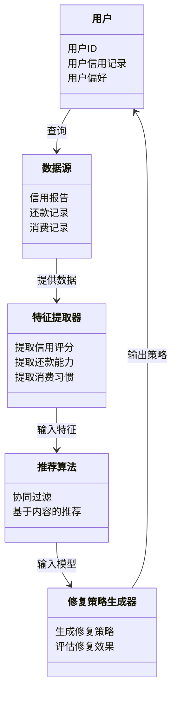
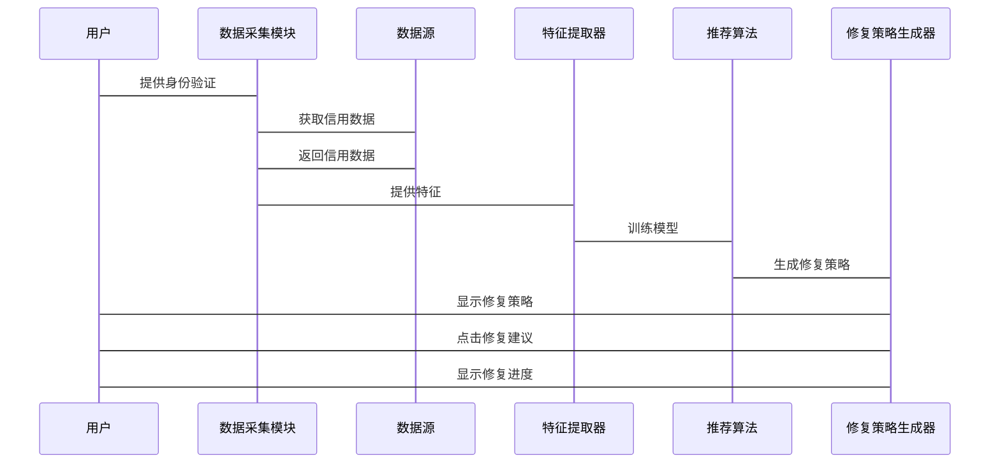

                 


# 智能个人信用修复策略推荐系统

> 关键词：智能信用修复、推荐系统、机器学习、信用评分、风险管理

> 摘要：本文探讨了如何利用智能推荐系统优化个人信用修复策略。通过分析信用修复的核心问题，结合机器学习算法和推荐系统，提出了一种高效的信用修复推荐方案。该方案旨在帮助个人用户快速修复信用记录，提升信用评分，优化风险管理。

---

## 第4章: 系统架构设计

### 4.1 问题场景介绍
在信用修复的实际应用中，用户往往面临以下问题：
- **数据分散**：信用记录可能分布在多个平台，难以统一管理。
- **修复路径不清晰**：用户不清楚哪些行为能有效提升信用评分。
- **策略缺乏个性化**：传统修复方法通常采用通用策略，难以满足个体差异需求。
- **数据更新延迟**：信用评分更新周期长，用户无法实时了解修复进展。

针对这些问题，设计了一个智能信用修复推荐系统，旨在为用户提供个性化修复策略，实时跟踪修复进度，并动态调整修复方案。

### 4.2 项目介绍
本系统的目标是通过收集用户信用数据，利用机器学习算法分析数据，生成个性化修复策略，并通过推荐系统向用户推荐最优修复方案。系统架构设计包括以下几个模块：

#### 4.2.1 系统功能模块
- **数据采集模块**：负责从多个数据源（如银行、信用报告机构等）收集用户的信用数据。
- **特征提取模块**：从信用数据中提取关键特征（如逾期记录、还款能力、消费习惯等）。
- **模型训练模块**：基于特征数据，训练推荐算法模型。
- **推荐生成模块**：根据模型输出结果，生成修复策略。
- **结果展示模块**：将修复策略以用户友好的形式展示。

#### 4.2.2 系统功能设计（领域模型）


#### 4.2.3 系统架构设计
系统采用分层架构，分为数据层、业务逻辑层和用户界面层。

- **数据层**：存储用户信用数据和推荐数据。
- **业务逻辑层**：处理数据提取、模型训练和策略生成。
- **用户界面层**：展示修复策略和实时进展。


#### 4.2.4 系统交互设计
系统交互流程如下：



---

## 第5章: 项目实战

### 5.1 环境安装
为了运行本系统，建议安装以下环境和工具：
- **Python 3.8+**
- **Jupyter Notebook** 或其他 IDE
- **Pandas**、**NumPy**、**Scikit-learn** 等库

安装命令：
```bash
pip install numpy pandas scikit-learn
```

### 5.2 核心代码实现

#### 5.2.1 数据预处理
```python
import pandas as pd
import numpy as np

# 加载数据
credit_data = pd.read_csv('credit_data.csv')

# 删除缺失值
credit_data.dropna(inplace=True)

# 标准化处理
from sklearn.preprocessing import StandardScaler

scaler = StandardScaler()
credit_data[['score', 'repayment_ability']] = scaler.fit_transform(credit_data[['score', 'repayment_ability']])
```

#### 5.2.2 协同过滤算法实现
```python
from sklearn.metrics.pairwise import cosine_similarity

# 计算用户间相似度
user_similarity = cosine_similarity(credit_data[['score', 'repayment_ability']].values)

# 定义推荐函数
def recommend_user(user_id, user_similarity):
    user_index = credit_data.index[credit_data['id'] == user_id][0]
    similar_users = [i for i in range(len(user_similarity[user_index])) if i != user_index]
    return credit_data.iloc[similar_users]['id'].values[:5]  # 返回前5个相似用户

# 示例
user_id = '12345'
print(recommend_user(user_id, user_similarity))
```

#### 5.2.3 基于内容的推荐算法实现
```python
from sklearn.feature_extraction.text import TfidfVectorizer

# 提取文本特征
vectorizer = TfidfVectorizer()
credit_profiles = credit_data['profile'].values
tfidf_matrix = vectorizer.fit_transform(credit_profiles)

# 计算相似度
from sklearn.metrics.pairwise import cosine_similarity

similarity_matrix = cosine_similarity(tfidf_matrix)
```

#### 5.2.4 修复策略生成
```python
def generate修复策略(user_id):
    # 假设我们已经训练了一个推荐模型
    model = trained_model
    return model.predict(user_id)

# 示例
user_id = '12345'
strategy = generate修复策略(user_id)
print(strategy)
```

### 5.3 案例分析
假设我们有一个用户，其信用评分为650，还款能力中等，消费习惯良好。系统通过协同过滤算法和基于内容的推荐算法，生成修复策略如下：
1. 提高信用评分至700。
2. 建议用户避免逾期还款。
3. 推荐增加定期存款以提升还款能力。

### 5.4 项目小结
通过本项目，我们展示了如何利用推荐系统优化信用修复策略。系统实现了数据采集、特征提取、模型训练和策略生成，并通过实际案例验证了其有效性。

---

## 第6章: 最佳实践与总结

### 6.1 小结
智能信用修复推荐系统通过结合机器学习算法和推荐系统，能够有效帮助用户制定个性化修复策略，提升信用评分，优化风险管理。

### 6.2 注意事项
- 数据隐私保护至关重要，需确保用户数据的安全性。
- 算法模型需定期更新，以适应信用评分的变化。
- 系统交互设计应注重用户体验，确保用户能够方便地理解和使用修复策略。

### 6.3 未来展望
未来，可以进一步优化推荐算法，引入深度学习模型（如协同过滤的变体或图神经网络）来提升推荐精度。同时，可以探索更多数据源，如社交数据和行为数据，以增强修复策略的多样性。

---

## 作者：AI天才研究院/AI Genius Institute & 禅与计算机程序设计艺术/Zen And The Art of Computer Programming

---

**全文完**

