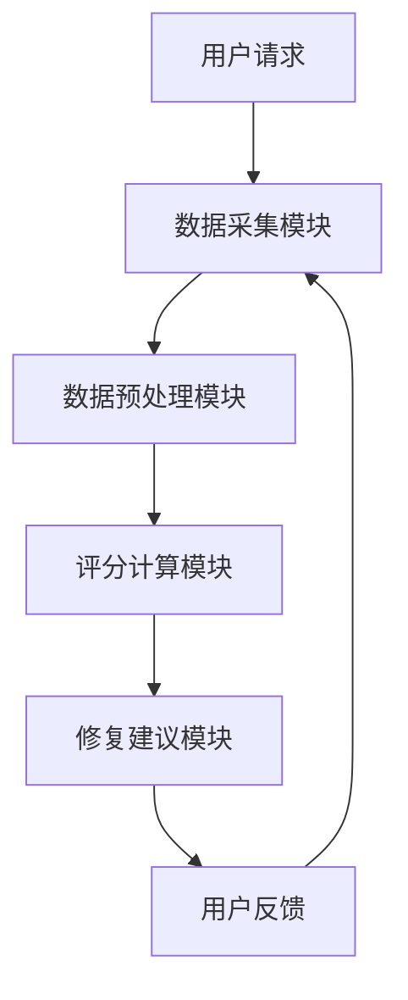
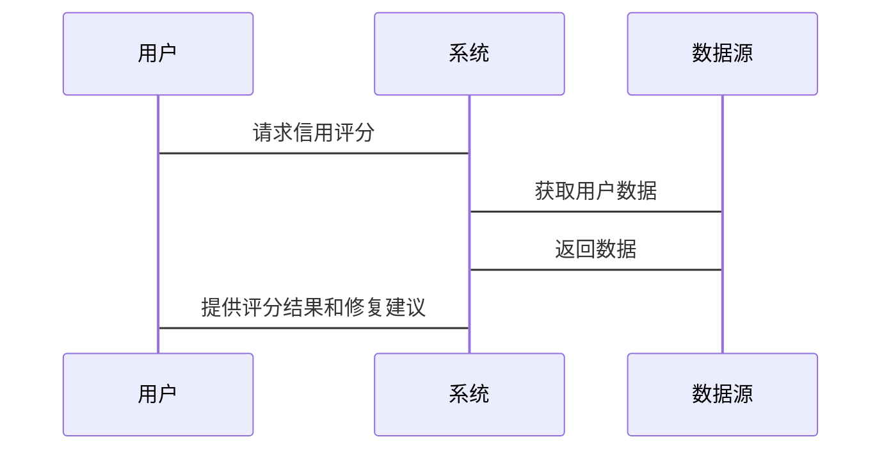

                 


# 智能个人信用评分优化与修复建议系统

## 关键词：
智能信用评分、机器学习、信用修复、数据挖掘、评分优化

## 摘要：
本文详细探讨了智能个人信用评分优化与修复建议系统的构建与应用。通过分析传统信用评分体系的局限性，引入机器学习和数据挖掘技术，提出了一种基于梯度提升树模型的智能评分优化方法。文章还设计了一个模块化的评分系统架构，并通过实际案例展示了如何利用该系统进行信用评分优化和修复建议。最后，总结了系统的优势及未来发展方向。

---

## 第一部分：背景介绍

### 第1章：智能个人信用评分概述

#### 1.1 信用评分的基本概念
- **1.1.1 信用评分的定义**
  信用评分是评估个人或企业在信用交易中按时履行债务的能力的一种量化指标。常见的信用评分模型包括FICO评分（主要用于美国）和VantageScore（通用评分系统）。
  
- **1.1.2 信用评分的重要性**
  信用评分直接影响个人或企业的贷款审批、信用卡额度、利率等金融行为。良好的信用评分能够帮助个人或企业获得更低的贷款利率和更高的信用额度。

- **1.1.3 信用评分的分类**
  - **个人信用评分**：主要用于个人消费信贷评估。
  - **企业信用评分**：用于评估企业的信用风险。
  - **行业特定评分**：针对特定行业设计的信用评分模型。

#### 1.2 个人信用评分优化的背景与问题
- **1.2.1 当前信用评分体系的局限性**
  传统信用评分系统主要依赖于历史信用记录和静态数据，难以捕捉实时动态变化的信用状况。此外，传统评分系统缺乏个性化，对不同风险级别的用户区分度不足。

- **1.2.2 个人信用评分优化的必要性**
  随着大数据和人工智能技术的发展，利用动态数据和先进算法优化信用评分，能够提高评分的准确性和实时性，从而更好地服务于金融机构和个人用户。

- **1.2.3 问题描述与目标**
  - 问题描述：传统信用评分系统存在数据单一、模型静态、缺乏实时性等问题，导致评分结果不够准确，无法满足多样化的金融需求。
  - 目标：通过引入机器学习和实时数据，构建一个动态、智能的信用评分系统，优化评分结果并提供修复建议。

#### 1.3 智能信用评分系统的优势
- **1.3.1 数据驱动的评分优化**
  利用大数据技术，整合多源数据（如交易数据、社交媒体数据、行为数据等），构建更全面的用户画像，提升评分的准确性。

- **1.3.2 机器学习在评分中的应用**
  通过训练机器学习模型（如随机森林、梯度提升树等），捕捉数据中的非线性关系和复杂模式，提高评分的精准度。

- **1.3.3 提高评分准确性和实时性的方法**
  引入实时数据流处理技术（如Kafka、Flafka），实现评分的动态更新，提升评分的实时性。

---

## 第二部分：核心概念与联系

### 第2章：智能个人信用评分系统的核心概念

#### 2.1 数据采集与处理
- **2.1.1 数据来源的多样性**
  智能信用评分系统需要整合多源数据，包括：
  - **交易数据**：信用卡交易记录、贷款记录。
  - **行为数据**：用户在线行为、消费习惯。
  - **社交数据**：社交媒体上的互动记录、好友关系。
  - **身份验证数据**：身份证信息、社交账号验证。

- **2.1.2 数据清洗与预处理**
  在数据采集后，需要进行清洗和预处理，包括：
  - **去重**：去除重复数据。
  - **缺失值处理**：填补或删除缺失数据。
  - **异常值处理**：识别并处理异常值。
  - **特征提取**：从原始数据中提取有用的特征。

- **2.1.3 数据特征的提取**
  通过特征工程，提取对信用评分有影响的关键特征，如：
  - **还款历史**：逾期次数、最长逾期天数。
  - **信用使用情况**：信用额度使用率、平均每月信用余额。
  - **信用历史**：信用历史长度、信用查询频率。
  - **还款能力**：收入水平、资产状况。

#### 2.2 智能评分模型的构建
- **2.2.1 传统评分模型与智能模型的对比**
  | 对比维度         | 传统评分模型               | 智能评分模型               |
  |------------------|---------------------------|---------------------------|
  | 数据来源         | 仅依赖历史信用数据         | 多源数据（交易、行为、社交）|
  | 模型类型         | 线性回归、逻辑回归         | 机器学习（随机森林、梯度提升）|
  | 实时性           | 低                        | 高                        |
  | 可解释性         | 高                        | 中等至低                  |
  | 个性化           | 有限                      | 高                        |

- **2.2.2 基于机器学习的评分模型**
  - **模型选择**：随机森林和梯度提升树（如XGBoost、LightGBM）是常用的模型。
  - **模型优势**：能够捕捉非线性关系，处理高维数据，提高评分的准确性。

- **2.2.3 深度学习在评分中的应用**
  - **模型类型**：使用神经网络模型（如DNN、RNN）处理复杂数据。
  - **优势**：能够自动提取特征，适用于非结构化数据（如文本、图像）。

#### 2.3 评分结果的反馈与优化
- **2.3.1 结果的可解释性**
  评分结果需要具有一定的可解释性，便于金融机构和用户理解评分依据。

- **2.3.2 模型的持续优化**
  - **反馈机制**：根据用户行为和新的数据，持续优化模型。
  - **自动调优**：使用自动机器学习（AutoML）技术优化模型参数。

- **2.3.3 用户反馈对评分系统的影响**
  用户对评分结果的反馈可以作为模型优化的依据，提升模型的准确性和用户满意度。

---

## 第三部分：算法原理讲解

### 第3章：评分优化算法的原理与实现

#### 3.1 梯度提升树模型（如XGBoost、LightGBM）

- **3.1.1 算法简介**
  梯度提升树是一种集成学习方法，通过多棵决策树的组合，提升模型的准确性和鲁棒性。

- **3.1.2 算法流程**
  ```mermaid
  graph TD
      A[开始] --> B[数据预处理]
      B --> C[特征选择]
      C --> D[模型训练]
      D --> E[模型评估]
      E --> F[模型优化]
      F --> G[结束]
  ```

- **3.1.3 算法实现**
  ```python
  import xgboost as xgb
  from sklearn.model_selection import train_test_split
  from sklearn.metrics import accuracy_score

  # 数据准备
  X_train, X_test, y_train, y_test = train_test_split(X, y, test_size=0.2, random_state=42)

  # 模型训练
  dtrain = xgb.DMatrix(X_train, label=y_train)
  params = {
      'objective': 'binary:logistic',
      'learning_rate': 0.1,
      'max_depth': 6,
      'n_estimators': 100
  }
  model = xgb.train(params, dtrain)

  # 模型预测
  dtest = xgb.DMatrix(X_test)
  y_pred = model.predict(dtest)
  ```

- **3.1.4 数学模型和公式**
  - **损失函数**：对数损失函数（Log Loss）用于评估模型的预测准确性。
  $$ \text{Log Loss} = -\frac{1}{N} \sum_{i=1}^{N} [y_i \ln p_i + (1 - y_i) \ln (1 - p_i)] $$
  - **目标函数**：梯度提升树的目标函数通常是最小化损失函数。
  $$ \text{Objective} = \text{Loss} + \text{Regularization} $$

---

## 第四部分：系统分析与架构设计方案

### 第4章：智能个人信用评分系统架构

#### 4.1 应用场景介绍
智能个人信用评分系统可以应用于以下几个场景：
- **金融机构**：用于贷款审批、信用卡额度调整。
- **电子商务平台**：用于信用赊购服务。
- **个人用户**：提供信用评分查询和修复建议。

#### 4.2 系统功能设计
- **数据采集模块**：收集多源数据。
- **评分计算模块**：基于机器学习模型计算信用评分。
- **修复建议模块**：提供评分优化建议。

#### 4.3 系统架构设计


#### 4.4 接口设计
- **数据接口**：与数据源（如银行、社交平台）对接，获取用户数据。
- **评分接口**：提供信用评分查询服务。
- **修复建议接口**：提供基于评分结果的修复建议。

#### 4.5 交互流程


---

## 第五部分：项目实战

### 第5章：智能个人信用评分系统实现

#### 5.1 环境搭建
- **安装Python**：版本3.6及以上。
- **安装库**：`pandas`, `numpy`, `xgboost`, `sklearn`, `matplotlib`。

#### 5.2 核心代码实现
```python
import pandas as pd
import numpy as np
from sklearn.model_selection import train_test_split
from xgboost import XGBClassifier
from sklearn.metrics import accuracy_score, confusion_matrix

# 数据加载
data = pd.read_csv('credit_data.csv')

# 数据预处理
# 假设目标变量是 'score'，特征变量是其他列
X = data.drop('score', axis=1)
y = data['score']

# 划分训练集和测试集
X_train, X_test, y_train, y_test = train_test_split(X, y, test_size=0.2, random_state=42)

# 模型训练
model = XGBClassifier(n_estimators=100, learning_rate=0.1, max_depth=6)
model.fit(X_train, y_train)

# 模型预测
y_pred = model.predict(X_test)

# 评估模型
print("Accuracy:", accuracy_score(y_test, y_pred))
print("Confusion Matrix:", confusion_matrix(y_test, y_pred))
```

#### 5.3 代码解读与分析
- **数据加载**：读取CSV文件中的数据。
- **数据预处理**：删除目标变量，将数据分为训练集和测试集。
- **模型训练**：使用XGBoost模型进行训练。
- **模型预测**：对测试集进行预测。
- **模型评估**：计算准确率和混淆矩阵。

#### 5.4 实际案例分析
假设我们有一个数据集，其中包含用户的交易记录、行为数据和社交数据。通过模型训练，我们可以预测用户的信用评分，并提供修复建议。

#### 5.5 项目小结
通过本项目，我们展示了如何利用机器学习技术构建智能信用评分系统，提高了评分的准确性和实时性，同时为用户提供个性化的修复建议。

---

## 第六部分：最佳实践 tips

### 第6章：智能个人信用评分系统优化与维护

#### 6.1 数据质量的重要性
- 确保数据的完整性和准确性。
- 定期更新数据，保持数据的实时性。

#### 6.2 模型解释性和实时性的提升
- 使用可解释性更强的模型（如随机森林）。
- 引入实时数据流处理技术，提升评分的实时性。

#### 6.3 合规性与隐私保护
- 确保数据处理符合相关法律法规。
- 保护用户隐私，避免数据泄露。

#### 6.4 模型优化建议
- 定期重新训练模型，引入新的数据。
- 根据业务需求调整模型参数。

---

## 小结

智能个人信用评分优化与修复建议系统的构建和应用，不仅能够提高信用评分的准确性和实时性，还能为用户提供个性化的修复建议。通过机器学习和大数据技术，我们能够更精准地评估用户的信用状况，为金融机构和个人用户带来更大的便利。

---

## 注意事项

- 本文档中的代码示例仅供参考，实际应用中需要根据具体数据和业务需求进行调整。
- 系统的部署和维护需要专业的技术支持，确保系统的稳定性和安全性。

---

## 拓展阅读

- 《Python机器学习》—— Andreas Müller, 深入介绍机器学习算法及其在Python中的实现。
- 《深入浅出机器学习》—— Rob Hyndman & Gareth James，适合初学者的机器学习入门书籍。
- 《信用评分模型开发与应用》—— 介绍信用评分模型的开发和实际应用。

---

## 作者

作者：AI天才研究院 & 禅与计算机程序设计艺术

---

通过本文的详细讲解，我们希望能够为读者提供一个全面的智能个人信用评分系统构建指南，帮助您更好地理解和应用这些技术。

