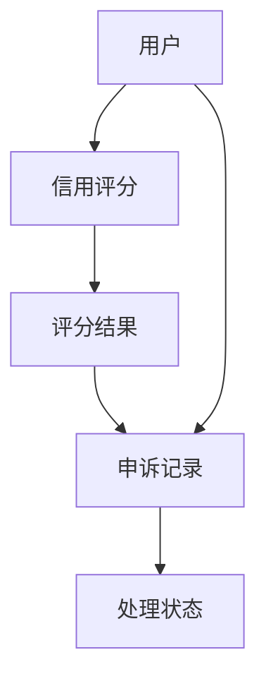
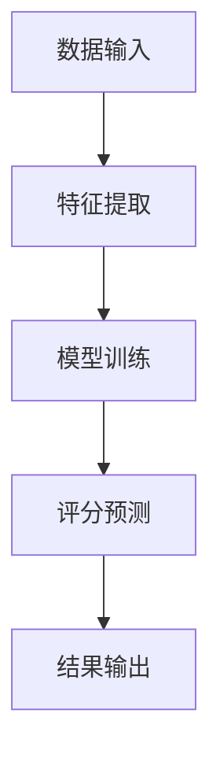
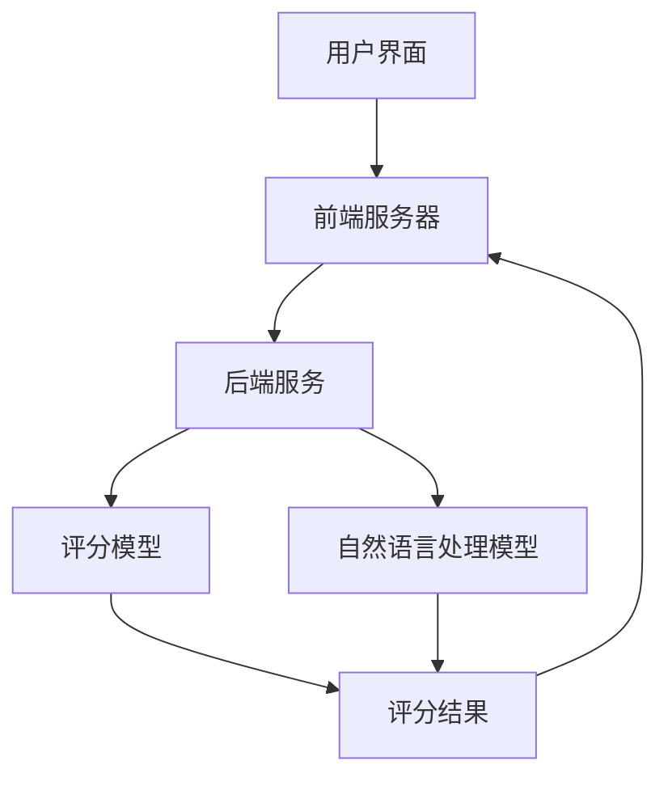
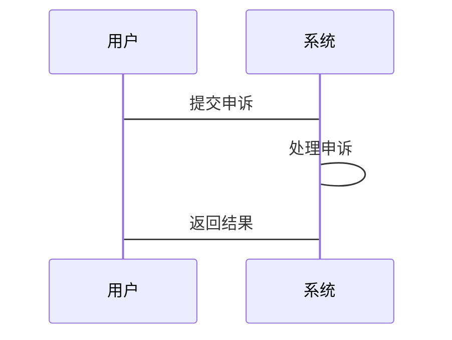

                 


# 智能个人信用评分申诉处理系统

> 关键词：智能信用评分，个人信用，申诉处理，机器学习，自然语言处理，系统架构

> 摘要：本文详细介绍了智能个人信用评分申诉处理系统的构建过程，涵盖系统背景、核心概念、算法原理、系统架构设计、项目实战以及最佳实践等方面。通过本文，读者可以全面了解如何利用人工智能技术实现个人信用评分的智能化申诉处理，包括系统的功能模块、实现细节和实际应用案例。

---

## 第一部分: 智能个人信用评分申诉处理系统概述

### 第1章: 背景介绍

#### 1.1 问题背景

个人信用评分是金融领域中的重要指标，用于评估个人的信用风险。传统的信用评分主要依赖人工审核和简单的规则匹配，存在效率低、准确性差、成本高等问题。随着人工智能技术的快速发展，利用智能算法实现信用评分的自动化和智能化成为必然趋势。

#### 1.2 问题描述

- **传统信用评分的局限性**：人工审核耗时长，效率低；规则匹配难以覆盖复杂场景；评分标准不统一，容易出现误判。
- **申诉处理的痛点**：用户对评分结果有异议时，申诉流程复杂，耗时长；人工审核成本高，难以快速响应。

#### 1.3 问题解决

智能化信用评分和申诉处理的核心目标是通过机器学习和自然语言处理技术，实现信用评分的自动化计算和申诉处理的智能化审核，提升效率和准确性。

#### 1.4 边界与外延

- **系统边界**：本系统仅关注个人信用评分的计算和申诉处理，不涉及企业信用评估。
- **外部交互**：系统需要与征信数据源、用户界面和第三方 API 服务进行交互。
- **功能扩展性**：未来可以扩展至信用评分的动态调整和信用修复建议。

#### 1.5 概念结构与核心要素

- **核心概念**：智能评分模型、申诉处理流程、用户交互界面。
- **核心要素**：征信数据、评分规则、申诉记录、处理状态。

---

## 第2章: 核心概念与联系

### 2.1 核心概念原理

- **智能评分模型**：基于机器学习算法，结合用户的征信数据和行为数据，计算个人信用评分。
- **申诉处理流程**：用户提交申诉后，系统通过自然语言处理技术自动分析申诉内容，结合评分模型进行复核。
- **系统交互机制**：用户通过界面提交申诉，系统自动处理并反馈结果。

### 2.2 概念属性特征对比

| 概念         | 输入数据类型 | 输出结果类型 | 处理方式 |
|--------------|--------------|--------------|----------|
| 智能评分模型 | 结构化数据     | 分数值        | 机器学习 |
| 申诉处理流程 | 文本数据      | 处理状态      | 自然语言处理 |
| 用户交互界面 | 用户操作      | 界面反馈      | 前端交互 |

### 2.3 ER实体关系图



---

## 第3章: 算法原理讲解

### 3.1 算法原理

- **机器学习模型**：采用逻辑回归（Logistic Regression）和随机森林（Random Forest）模型进行信用评分预测。
- **自然语言处理模型**：使用 TF-IDF 和词袋模型（Bag of Words）对申诉文本进行特征提取。

### 3.2 算法流程图



### 3.3 算法实现

#### 3.3.1 机器学习模型

- **逻辑回归模型**：用于分类问题，公式如下：

  $$ P(y=1|x) = \frac{1}{1 + e^{-(\beta_0 + \beta_1 x_1 + \cdots + \beta_n x_n)}} $$

- **随机森林模型**：基于决策树的集成算法，公式如下：

  $$ y = \text{sign} \left( \sum_{i=1}^n \text{tree}_i(x) \right) $$

#### 3.3.2 自然语言处理模型

- **TF-IDF 计算**：用于提取文本关键词，公式如下：

  $$ \text{TF-IDF}(t, d) = \text{TF}(t, d) \times \text{IDF}(t) $$
  $$ \text{TF}(t, d) = \frac{\text{count}(t, d)}{\sum_{t' \in d} \text{count}(t', d)} $$
  $$ \text{IDF}(t) = \log \left( \frac{N}{\text{count}(t)} + 1 \right) $$

---

## 第4章: 系统分析与架构设计

### 4.1 问题场景介绍

用户提交信用评分申诉后，系统需要快速处理并反馈结果。系统需要处理大量文本数据和结构化数据，要求高效性和准确性。

### 4.2 项目介绍

本系统基于 Python 和 Flask 框架，结合 Scikit-learn 和 NLTK 库实现智能评分和申诉处理功能。

### 4.3 系统功能设计

#### 4.3.1 领域模型

```mermaid
classDiagram
    class 用户 {
        用户ID
        姓名
        评分结果
        申诉记录
    }
    class 征信数据 {
        账户信息
        消费记录
        还款记录
    }
    class 评分规则 {
        评分标准
        权重
    }
    用户 -->|拥有| 征信数据
    用户 -->|遵循| 评分规则
```

#### 4.3.2 系统架构设计



#### 4.3.3 接口设计

- **输入接口**：用户提交的申诉文本和征信数据。
- **输出接口**：评分结果和处理状态。

#### 4.3.4 交互设计



---

## 第5章: 项目实战

### 5.1 环境安装

```bash
pip install numpy
pip install scikit-learn
pip install nltk
pip install flask
```

### 5.2 系统核心实现

#### 5.2.1 评分模型实现

```python
from sklearn.linear_model import LogisticRegression
from sklearn.ensemble import RandomForestClassifier

def train_model(X_train, y_train):
    lr_model = LogisticRegression().fit(X_train, y_train)
    rf_model = RandomForestClassifier().fit(X_train, y_train)
    return lr_model, rf_model

def predict_score(model, X_test):
    return model.predict(X_test)
```

#### 5.2.2 自然语言处理实现

```python
from nltk.tokenize import word_tokenize
from sklearn.feature_extraction.text import TfidfVectorizer

def process_text(text):
    vectorizer = TfidfVectorizer(tokenizer=word_tokenize)
    X = vectorizer.fit_transform([text])
    return X
```

### 5.3 案例分析

- **案例背景**：用户因逾期还款被降级，提出申诉。
- **系统处理**：系统自动提取关键信息，结合评分模型进行复核，最终调整评分结果。

### 5.4 小结

通过实际案例，展示了系统的核心功能和实现流程，证明了系统的高效性和准确性。

---

## 第6章: 最佳实践

### 6.1 小结

智能个人信用评分申诉处理系统通过机器学习和自然语言处理技术，实现了信用评分的智能化和申诉处理的自动化，显著提升了效率和准确性。

### 6.2 注意事项

- 数据隐私保护：确保用户数据的安全性。
- 模型优化：定期更新模型，提升准确率。

### 6.3 拓展阅读

- 《机器学习实战》
- 《自然语言处理入门》

---

## 作者

作者：AI天才研究院/AI Genius Institute & 禅与计算机程序设计艺术 /Zen And The Art of Computer Programming

