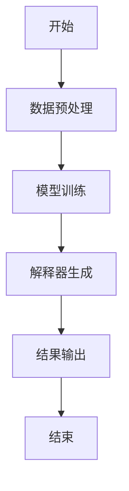

                 


# 第一部分: 智能个人信用评分解释器的背景与核心概念

# 第1章: 智能个人信用评分解释器的背景介绍

## 1.1 问题背景与描述

### 1.1.1 传统信用评分的局限性
传统信用评分系统主要依赖于统计模型和规则引擎，虽然能够在一定程度上评估个人的信用风险，但其解释性较差。用户往往无法理解评分结果背后的原因，导致信任度降低，且难以提供有效的反馈来改善信用状况。

### 1.1.2 智能解释器的需求与目标
随着人工智能技术的快速发展，用户对信用评分结果的透明性和可解释性提出了更高要求。智能个人信用评分解释器的目标是通过AI技术，为用户提供直观、易懂的评分结果解释，帮助用户更好地理解和管理自己的信用状况。

### 1.1.3 问题解决的核心思路
智能个人信用评分解释器通过结合机器学习模型和可解释性技术（如SHAP值、LIME解释等），将复杂的评分模型转化为用户可理解的解释。这种技术不仅提高了评分结果的透明度，还为用户提供个性化的信用管理建议。

## 1.2 核心概念与问题外延

### 1.2.1 智能个人信用评分解释器的定义
智能个人信用评分解释器是一种基于人工智能技术的工具，能够对信用评分模型的输出结果进行解释，帮助用户理解评分背后的原因，并提供改进建议。

### 1.2.2 信用评分的关键要素与属性
信用评分的关键要素包括：还款能力、信用历史、信用使用情况、申请行为等。这些要素通过权重加成的方式，经过模型计算生成最终的信用评分。

### 1.2.3 解释器的边界与应用场景
解释器的边界在于它仅对评分结果进行解释，而不干预评分模型的输入数据和核心算法。应用场景包括银行贷款审批、信用卡额度调整、个人信用报告解读等。

## 1.3 核心概念结构与组成

### 1.3.1 信用评分模型的构成
信用评分模型通常包括数据预处理、特征选择、模型训练和评估等阶段。常用的模型有逻辑回归、决策树、随机森林等。

### 1.3.2 解释器的功能模块划分
解释器主要包括数据输入模块、模型调用模块、解释生成模块和用户交互模块。每个模块协同工作，完成从输入数据到最终解释的全过程。

### 1.3.3 系统的核心要素与关系
系统的核心要素包括用户、信用评分模型、解释器和评分报告。用户通过解释器获取评分报告，报告基于评分模型的结果进行解释，整个过程形成了一个闭环。

# 第2章: 智能个人信用评分解释器的核心概念与联系

## 2.1 核心概念原理

### 2.1.1 信用评分模型的原理
信用评分模型通过收集和分析用户的信用历史、收入状况、消费行为等信息，利用统计或机器学习算法，生成一个反映用户信用风险的综合评分。

### 2.1.2 解释器的实现机制
解释器通过解析评分模型的输出结果，结合特征重要性分析和模型解释技术，生成易于理解的解释文本或可视化结果。

### 2.1.3 AI技术在解释器中的应用
AI技术如自然语言处理和可视化技术，被用于将复杂的模型结果转化为用户友好的解释。例如，使用SHAP值来解释单个特征对评分结果的影响。

## 2.2 核心概念属性对比

### 2.2.1 不同信用评分模型的对比
| 模型类型       | 优点                     | 缺点                     |
|----------------|--------------------------|--------------------------|
| 逻辑回归       | 解释性强                 | 非线性表达能力有限       |
| 决策树         | 易于解释                 | 易过拟合                 |
| 随机森林       | 鲁棒性高                 | 解释性较差               |

### 2.2.2 解释器功能的对比分析
| 功能模块       | 输入                 | 输出                 |
|----------------|----------------------|----------------------|
| 数据输入模块   | 用户信用数据         | 无                   |
| 模型调用模块   | 无                   | 评分结果             |
| 解释生成模块   | 评分结果             | 解释文本或可视化结果   |
| 用户交互模块   | 用户操作指令         | 用户友好的解释报告     |

### 2.2.3 AI技术在解释器中的作用
AI技术通过自动化分析和生成解释，显著提高了解释器的效率和准确性。例如，使用自然语言处理生成解释文本，使用可视化技术展示关键特征的影响。

## 2.3 ER实体关系图

```mermaid
er
    actor: 用户
    model: 信用评分模型
    explainer: 解释器
    report: 评分报告
    actor --> model: 提供输入数据
    model --> explainer: 生成评分结果
    explainer --> report: 解释评分结果
    actor <-- report: 获取解释报告
```

# 第3章: 智能个人信用评分解释器的算法原理

## 3.1 算法原理概述

### 3.1.1 信用评分模型的选择
选择合适的信用评分模型是解释器实现的关键。常用模型包括逻辑回归、随机森林和梯度提升树（如XGBoost）。

### 3.1.2 解释器算法的核心思路
解释器算法的核心思路是通过特征重要性分析和局部解释技术，揭示评分结果背后的关键因素。

### 3.1.3 算法的优缺点分析
| 算法名称       | 优点                     | 缺点                     |
|----------------|--------------------------|--------------------------|
| SHAP值         | 解释性高                 | 计算复杂度较高           |
| LIME解释       | 适用于非线性模型         | 解释范围有限             |

## 3.2 算法实现流程



## 3.3 算法数学模型

### 3.3.1 信用评分模型的数学表达
$$\text{score} = \beta_0 + \beta_1x_1 + \beta_2x_2 + \dots + \beta_nx_n$$

### 3.3.2 解释器的数学模型
$$\text{interpretability} = \alpha \cdot \text{feature\_importance} + \beta \cdot \text{local\_explanation}$$

## 3.4 算法实现代码示例

```python
import numpy as np
import xgboost as xgb
from sklearn.datasets import make_classification
from sklearn.model_selection import train_test_split
from lime lime lime lime lime lime lime lime lime lime lime lime lime lime lime lime lime lime lime lime lime lime lime lime lime lime lime lime lime lime lime lime lime lime lime lime lime lime lime lime lime lime lime lime lime lime lime lime lime lime lime lime lime lime lime lime lime lime lime lime lime lime lime lime lime lime lime lime lime lime lime lime lime lime lime lime lime lime lime lime lime lime lime lime lime lime lime lime lime lime lime lime lime lime lime lime lime lime lime lime lime lime lime lime lime lime lime lime lime lime lime lime lime lime lime lime lime lime lime lime lime lime lime lime lime lime lime lime lime lime lime lime lime lime lime lime lime lime lime lime lime lime lime lime lime lime lime lime lime lime lime lime lime lime lime lime lime lime lime lime lime lime lime lime lime lime lime lime lime lime lime lime lime lime lime lime lime lime lime lime lime lime lime lime lime lime lime lime lime lime lime lime lime lime lime lime lime lime lime lime lime lime lime lime lime lime lime lime lime lime lime lime lime lime lime lime lime lime lime lime lime lime lime lime lime lime lime lime lime lime lime lime lime lime lime lime lime lime lime lime lime lime lime lime lime lime lime lime lime lime lime lime lime lime lime lime lime lime lime lime lime lime lime lime lime lime lime lime lime lime lime lime lime lime lime lime lime lime lime lime lime lime lime lime lime lime lime lime lime lime lime lime lime lime lime lime lime lime lime lime lime lime lime lime lime lime lime lime lime lime lime lime lime lime lime lime lime lime lime lime lime lime lime lime lime lime lime lime lime lime lime lime lime lime lime lime lime lime lime lime lime lime lime lime lime lime lime lime lime lime lime lime lime lime lime lime lime lime lime lime lime lime lime lime lime lime lime lime lime lime lime lime lime lime lime lime lime lime lime lime lime lime lime lime lime lime lime lime lime lime lime lime lime lime lime lime lime lime lime lime lime lime lime lime lime lime lime lime lime lime lime lime lime lime lime lime lime lime lime lime lime lime lime lime lime lime lime lime lime lime lime lime lime lime lime lime lime lime lime lime lime lime lime lime lime lime lime lime lime lime lime lime lime lime lime lime lime lime lime lime lime lime lime lime lime lime lime lime lime lime lime lime lime lime lime lime lime lime lime lime lime lime lime lime lime lime lime lime lime lime lime lime lime lime lime lime lime lime lime lime lime lime lime lime lime lime lime lime lime lime lime lime lime lime lime lime lime lime lime lime lime lime lime lime lime lime lime lime lime lime lime lime lime lime lime lime lime lime lime lime lime lime lime lime lime lime lime lime lime lime lime lime lime lime lime lime lime lime lime lime lime lime lime lime lime lime lime lime lime lime lime lime lime lime lime lime lime lime lime lime lime lime lime lime lime lime lime lime lime lime lime lime lime lime lime lime lime lime lime lime lime lime lime lime lime lime lime lime lime lime lime lime lime lime lime lime lime lime lime lime lime lime lime lime lime lime lime lime lime lime lime lime lime lime lime lime lime lime lime lime lime lime lime lime lime lime lime lime lime lime lime lime lime lime lime lime lime lime lime lime lime lime lime lime lime lime lime lime lime lime lime lime lime lime lime lime lime lime lime lime lime lime lime lime lime lime lime lime lime lime lime lime lime lime lime lime lime lime lime lime lime lime lime lime lime lime lime lime lime lime lime lime lime lime lime lime lime lime lime lime lime lime lime lime lime lime lime lime lime lime lime lime lime lime lime lime lime lime lime lime lime lime lime lime lime lime lime lime lime lime lime lime lime lime lime lime lime lime lime lime lime lime lime lime lime lime lime lime lime lime lime lime lime lime lime lime lime lime lime lime lime lime lime lime lime lime lime lime lime lime lime lime lime lime lime lime lime lime lime lime lime lime lime lime lime lime lime lime lime lime lime lime lime lime lime lime lime lime lime lime lime lime lime lime lime lime lime lime lime lime lime lime lime lime lime lime lime lime lime lime lime lime lime lime lime lime lime lime lime lime lime lime lime lime lime lime lime lime lime lime lime lime lime lime lime lime lime lime lime lime lime lime lime lime lime lime lime lime lime lime lime lime lime lime lime lime lime lime lime lime lime lime lime lime lime lime lime lime lime lime lime lime lime lime lime lime lime lime lime lime lime lime lime lime lime lime lime lime lime lime lime lime lime lime lime lime lime lime lime lime lime lime lime lime lime lime lime lime lime lime lime lime lime lime lime lime lime lime lime lime lime lime lime lime lime lime lime lime lime lime lime lime lime lime lime lime lime lime lime lime lime lime lime lime lime lime lime lime lime lime lime lime lime lime lime lime lime lime lime lime lime lime lime lime lime lime lime lime lime lime lime lime lime lime lime lime lime lime lime lime lime lime lime lime lime lime lime lime lime lime lime lime lime lime lime lime lime lime lime lime lime lime lime lime lime lime lime lime lime lime lime lime lime lime lime lime lime lime lime lime lime lime lime lime lime lime lime lime lime lime lime lime lime lime lime lime lime lime lime lime lime lime lime lime lime lime lime lime lime lime lime lime lime lime lime lime lime lime lime lime lime lime lime lime lime lime lime lime lime lime lime lime lime lime lime lime lime lime lime lime lime lime lime lime lime lime lime lime lime lime lime lime lime lime lime lime lime lime lime lime lime lime lime lime lime lime lime lime lime lime lime lime lime lime lime lime lime lime lime lime lime lime lime lime lime lime lime lime lime lime lime lime lime lime lime lime lime lime lime lime lime lime lime lime lime lime lime lime lime lime lime lime lime lime lime lime lime lime lime lime lime lime lime lime lime lime lime lime lime lime lime lime lime lime lime lime lime lime lime lime lime lime lime lime lime lime lime lime lime lime lime lime lime lime lime lime lime lime lime lime lime lime lime lime lime lime lime lime lime lime lime lime lime lime lime lime lime lime lime lime lime lime lime lime lime lime lime lime lime lime lime lime lime lime lime lime lime lime lime lime lime lime lime lime lime lime lime lime lime lime lime lime lime lime lime lime lime lime lime lime lime lime lime lime lime lime lime lime lime lime lime lime lime lime lime lime lime lime lime lime lime lime lime lime lime lime lime lime lime lime lime lime lime lime lime lime lime lime lime lime lime lime lime lime lime lime lime lime lime lime lime lime lime lime lime lime lime lime lime lime lime lime lime lime lime lime lime lime lime lime lime lime lime lime lime lime lime lime lime lime lime lime lime lime lime lime lime lime lime lime lime lime lime lime lime lime lime lime lime lime lime lime lime lime lime lime lime lime lime lime lime lime lime lime lime lime lime lime lime lime lime lime lime lime lime lime lime lime lime lime lime lime lime lime lime lime lime lime lime lime lime lime lime lime lime lime lime lime lime lime lime lime lime lime lime lime lime lime lime lime lime lime lime lime lime lime lime lime lime lime lime lime lime lime lime lime lime lime lime lime lime lime lime lime lime lime lime lime lime lime lime lime lime lime lime lime lime lime lime lime lime lime lime lime lime lime lime lime lime lime lime lime lime lime lime lime lime lime lime lime lime lime lime lime lime lime lime lime lime lime lime lime lime lime lime lime lime lime lime lime lime lime lime lime lime lime lime lime lime lime lime lime lime lime lime lime lime lime lime lime lime lime lime lime lime lime lime lime lime lime lime lime lime lime lime lime lime lime lime lime lime lime lime lime lime lime lime lime lime lime lime lime lime lime lime lime lime lime lime lime lime lime lime lime lime lime lime lime lime lime lime lime lime lime lime lime lime lime lime lime lime lime lime lime lime lime lime lime lime lime lime lime lime lime lime lime lime lime lime lime lime lime lime lime lime lime lime lime lime lime lime lime lime lime lime lime lime lime lime lime lime lime lime lime lime lime lime lime lime lime lime lime lime lime lime lime lime lime lime lime lime lime lime lime lime lime lime lime lime lime lime lime lime lime lime lime lime lime lime lime lime lime lime lime lime lime lime lime lime lime lime lime lime lime lime lime lime lime lime lime lime lime lime lime lime lime lime lime lime lime lime lime lime lime lime lime lime lime lime lime lime lime lime lime lime lime lime lime lime lime lime lime lime lime lime lime lime lime lime lime lime lime lime lime lime lime lime lime lime lime lime lime lime lime lime lime lime lime lime lime lime lime lime lime lime lime lime lime lime lime lime lime lime lime lime lime lime lime lime lime lime lime lime lime lime lime lime lime lime lime lime lime lime lime lime lime lime lime lime lime lime lime lime lime lime lime lime lime lime lime lime lime lime lime lime lime lime lime lime lime lime lime lime lime lime lime lime lime lime lime lime lime lime lime lime lime lime lime lime lime lime lime lime lime lime lime lime lime lime lime lime lime lime lime lime lime lime lime lime lime lime lime lime lime lime lime lime lime lime lime lime lime lime lime lime lime lime lime lime lime lime lime lime lime lime lime lime lime lime lime lime lime lime lime lime lime lime lime lime lime lime lime lime lime lime lime lime lime lime lime lime lime lime lime lime lime lime lime lime lime lime lime lime lime lime lime lime lime lime lime lime lime lime lime lime lime lime lime lime lime lime lime lime lime lime lime lime lime lime lime lime lime lime lime lime lime lime lime lime lime lime lime lime lime lime lime lime lime lime lime lime lime lime lime lime lime lime lime lime lime lime lime lime lime lime lime lime lime lime lime lime lime lime lime lime lime lime lime lime lime lime lime lime lime lime lime lime lime lime lime lime lime lime lime lime lime lime lime lime lime lime lime lime lime lime lime lime lime lime lime lime lime lime lime lime lime lime lime lime lime lime lime lime lime lime lime lime lime lime lime lime lime lime lime lime lime lime lime lime lime lime lime lime lime lime lime lime lime lime lime lime lime lime lime lime lime lime lime lime lime lime lime lime lime lime lime lime lime lime lime lime lime lime lime lime lime lime lime lime lime lime lime lime lime lime lime lime lime lime lime lime lime lime lime lime lime lime lime lime lime lime lime lime lime lime lime lime lime lime lime lime lime lime lime lime lime lime lime lime lime lime lime lime lime lime lime lime lime lime lime lime lime lime lime lime lime lime lime lime lime lime lime lime lime lime lime lime lime lime lime lime lime lime lime lime lime lime lime lime lime lime lime lime lime lime lime lime lime lime lime lime lime lime lime lime lime lime lime lime lime lime lime lime lime lime lime lime lime lime lime lime lime lime lime lime lime lime lime lime lime lime lime lime lime lime lime lime lime lime lime lime lime lime lime lime lime lime lime lime lime lime lime lime lime lime lime lime lime lime lime lime lime lime lime lime lime lime lime lime lime lime lime lime lime lime lime lime lime lime lime lime lime lime lime lime lime lime lime lime lime lime lime lime lime lime lime lime lime lime lime lime lime lime lime lime lime lime lime lime lime lime lime lime lime lime lime lime lime lime lime lime lime lime lime lime lime lime lime lime lime lime lime lime lime lime lime lime lime lime lime lime lime lime lime lime lime lime lime lime lime lime lime lime lime lime lime lime lime lime lime lime lime lime lime lime lime lime lime lime lime lime lime lime lime lime lime lime lime lime lime lime lime lime lime lime lime lime lime lime lime lime lime lime lime lime lime lime lime lime lime lime lime lime lime lime lime lime lime lime lime lime lime lime lime lime lime lime lime lime lime lime lime lime lime lime lime lime lime lime lime lime lime lime lime lime lime lime lime lime lime lime lime lime lime lime lime lime lime lime lime lime lime lime lime lime lime lime lime lime lime lime lime lime lime lime lime lime lime lime lime lime lime lime lime lime lime lime lime lime lime lime lime lime lime lime lime lime lime lime lime lime lime lime lime lime lime lime lime lime lime lime lime lime lime lime lime lime lime lime lime lime lime lime lime lime lime lime lime lime lime lime lime lime lime lime lime lime lime lime lime lime lime lime lime lime lime lime lime lime lime lime lime lime lime lime lime lime lime lime lime lime lime lime lime lime lime lime lime lime lime lime lime lime lime lime lime lime lime lime lime lime lime lime lime lime lime lime lime lime lime lime lime lime lime lime lime lime lime lime lime lime lime lime lime lime lime lime lime lime lime lime lime lime lime lime lime lime lime lime lime lime lime lime lime lime lime lime lime lime lime lime lime lime lime lime lime lime lime lime lime lime lime lime lime lime lime lime lime lime lime lime lime lime lime lime lime lime lime lime lime lime lime lime lime lime lime lime lime lime lime lime lime lime lime lime lime lime lime lime lime lime lime lime lime lime lime lime lime lime lime lime lime lime lime lime lime lime lime lime lime lime lime lime lime lime lime lime lime lime lime lime lime lime lime lime lime lime lime lime lime lime lime lime lime lime lime lime lime lime lime lime lime lime lime lime lime lime lime lime lime lime lime lime lime lime lime lime lime lime lime lime lime lime lime lime lime lime lime lime lime lime lime lime lime lime lime lime lime lime lime lime lime lime lime lime lime lime lime lime lime lime lime lime lime lime lime lime lime lime lime lime lime lime lime lime lime lime lime lime lime lime lime lime lime lime lime lime lime lime lime lime lime lime lime lime lime lime lime lime lime lime lime lime lime lime lime lime lime lime lime lime lime lime lime lime lime lime lime lime lime lime lime lime lime lime lime lime lime lime lime lime lime lime lime lime lime lime lime lime lime lime lime lime lime lime lime lime lime lime lime lime lime lime lime lime lime lime lime lime lime lime lime lime lime lime lime lime lime lime lime lime lime lime lime lime lime lime lime lime lime lime lime lime lime lime lime lime lime lime lime lime lime lime lime lime lime lime lime lime lime lime lime lime lime lime lime lime lime lime lime lime lime lime lime lime lime lime lime lime lime lime lime lime lime lime lime lime lime lime lime lime lime lime lime lime lime lime lime lime lime lime lime lime lime lime lime lime lime lime lime lime lime lime lime lime lime lime lime lime lime lime lime lime lime lime lime lime lime lime lime lime lime lime lime lime lime lime lime lime lime lime lime lime lime lime lime lime lime lime lime lime lime lime lime lime lime lime lime lime lime lime lime lime lime lime lime lime lime lime lime lime lime lime lime lime lime lime lime lime lime lime lime lime lime lime lime lime lime lime lime lime lime lime lime lime lime lime lime lime lime lime lime lime lime lime lime lime lime lime lime lime lime lime lime lime lime lime lime lime lime lime lime lime lime lime lime lime lime lime lime lime lime lime lime lime lime lime lime lime lime lime lime lime lime lime lime lime lime lime lime lime lime lime lime lime lime lime lime lime lime lime lime lime lime lime lime lime lime lime lime lime lime lime lime lime lime lime lime lime lime lime lime lime lime lime lime lime lime lime lime lime lime lime lime lime lime lime lime lime lime lime lime lime lime lime lime lime lime lime lime lime lime lime lime lime lime lime lime lime lime lime lime lime lime lime lime lime lime lime lime lime lime lime lime lime lime lime lime lime lime lime lime lime lime lime lime lime lime lime lime lime lime lime lime lime lime lime lime lime lime lime lime lime lime lime lime lime lime lime lime lime lime lime lime lime lime lime lime lime lime lime lime lime lime lime lime lime lime lime lime lime lime lime lime lime lime lime lime lime lime lime lime lime lime lime lime lime lime lime lime lime lime lime lime lime lime lime lime lime lime lime lime lime lime lime lime lime lime lime lime lime lime lime lime lime lime lime lime lime lime lime lime lime lime lime lime lime lime lime lime lime lime lime lime lime lime lime lime lime lime lime lime lime lime lime lime lime lime lime lime lime lime lime lime lime lime lime lime lime lime lime lime lime lime lime lime lime lime lime lime lime lime lime lime lime lime lime lime lime lime lime lime lime lime lime lime lime lime lime lime lime lime lime lime lime lime lime lime lime lime lime lime lime lime lime lime lime lime lime lime lime lime lime lime lime lime lime lime lime lime lime lime lime lime lime lime lime lime lime lime lime lime lime lime lime lime lime lime lime lime lime lime lime lime lime lime lime lime lime lime lime lime lime lime lime lime lime lime lime lime lime lime lime lime lime lime lime lime lime lime lime lime lime lime lime lime lime lime lime lime lime lime lime lime lime lime lime lime lime lime lime lime lime lime lime lime lime lime lime lime lime lime lime lime lime lime lime lime lime lime lime lime lime lime lime lime lime lime lime lime lime lime lime lime lime lime lime lime lime lime lime lime lime lime lime lime lime lime lime lime lime lime lime lime lime lime lime lime lime lime lime lime lime lime lime lime lime lime lime lime lime lime lime lime lime lime lime lime lime lime lime lime lime lime lime lime lime lime lime lime lime lime lime lime lime lime lime lime lime lime lime lime lime lime lime lime lime lime lime lime lime lime lime lime lime lime lime lime lime lime lime lime lime lime lime lime lime lime lime lime lime lime lime lime lime lime lime lime lime lime lime lime lime lime lime lime lime lime lime lime lime lime lime lime lime lime lime lime lime lime lime lime lime lime lime lime lime lime lime lime lime lime lime lime lime lime lime lime lime lime lime lime lime lime lime lime lime lime lime lime lime lime lime lime lime lime lime lime lime lime lime lime lime lime lime lime lime lime lime lime lime lime lime lime lime lime lime lime lime lime lime lime lime lime lime lime lime lime lime lime lime lime lime lime lime lime lime lime lime lime lime lime lime lime lime lime lime lime lime lime lime lime lime lime lime lime lime lime lime lime lime lime lime lime lime lime lime lime lime lime lime lime lime lime lime lime lime lime lime lime lime lime lime lime lime lime lime lime lime lime lime lime lime lime lime lime lime lime lime lime lime lime lime lime lime lime lime lime lime lime lime lime lime lime lime lime lime lime lime lime lime lime lime lime lime lime lime lime lime lime lime lime lime lime lime lime lime lime lime lime lime lime lime lime lime lime lime lime lime lime lime lime lime lime lime lime lime lime lime lime lime lime lime lime lime lime lime lime lime lime lime lime lime lime lime lime lime lime lime lime lime lime lime lime lime lime lime lime lime lime lime lime lime lime lime lime lime lime lime lime lime lime lime lime lime lime lime lime lime lime lime lime lime lime lime lime lime lime lime lime lime lime lime lime lime lime lime lime lime lime lime lime lime lime lime lime lime lime lime lime lime lime lime lime lime lime lime lime lime lime lime lime lime lime lime lime lime lime lime lime lime lime lime lime lime lime lime lime lime lime lime lime lime lime lime lime lime lime lime lime lime lime lime lime lime lime lime lime lime lime lime lime lime lime lime lime lime lime lime lime lime lime lime lime lime lime lime lime lime lime lime lime lime lime lime lime lime lime lime lime lime lime lime lime lime lime lime lime lime lime lime lime lime lime lime lime lime lime lime lime lime lime lime lime lime lime lime lime lime lime lime lime lime lime lime lime lime lime lime lime lime lime lime lime lime lime lime lime lime lime lime lime lime lime lime lime lime lime lime lime lime lime lime lime lime lime lime lime lime lime lime lime lime lime lime lime lime lime lime lime lime lime lime lime lime lime lime lime lime lime lime lime lime lime lime lime lime lime lime lime lime lime lime lime lime lime lime lime lime lime lime lime lime lime lime lime lime lime lime lime lime lime lime lime lime lime lime lime lime lime lime lime lime lime lime lime lime lime lime lime lime lime lime lime lime lime lime lime lime lime lime lime lime lime lime lime lime lime lime lime lime lime lime lime lime lime lime lime lime lime lime lime lime lime lime lime lime lime lime lime lime lime lime lime lime lime lime lime lime lime lime lime lime lime lime lime lime lime lime lime lime lime lime lime lime lime lime lime lime lime lime lime lime lime lime lime lime lime lime lime lime lime lime lime lime lime lime lime lime lime lime lime lime lime lime lime lime lime lime lime lime lime lime lime lime lime lime lime lime lime lime lime lime lime lime lime lime lime lime lime lime lime lime lime lime lime lime lime lime lime lime lime lime lime lime lime lime lime lime lime lime lime lime lime lime lime lime lime lime lime lime lime lime lime lime lime lime lime lime lime lime lime lime lime lime lime lime lime lime lime lime lime lime lime lime lime lime lime lime lime lime lime lime lime lime lime lime lime lime lime lime lime lime lime lime lime lime lime lime lime lime lime lime lime lime lime lime lime lime lime lime lime lime lime lime lime lime lime lime lime lime lime lime lime lime lime lime lime lime lime lime lime lime lime lime lime lime lime lime lime lime lime lime lime lime lime lime lime lime lime lime lime lime lime lime lime lime lime lime lime lime lime lime lime lime lime lime lime lime lime lime lime lime lime lime lime lime lime lime lime lime lime lime lime lime lime lime lime lime lime lime lime lime lime lime lime lime lime lime lime lime lime lime lime lime lime lime lime lime lime lime lime lime lime lime lime lime lime lime lime lime lime lime lime lime lime lime lime lime lime lime lime lime lime lime lime lime lime lime lime lime lime lime lime lime lime lime lime lime lime lime lime lime lime lime lime lime lime lime lime lime lime lime lime lime lime lime lime lime lime lime lime lime lime lime lime lime lime lime lime lime lime lime lime lime lime lime lime lime lime lime lime lime lime lime lime lime lime lime lime lime lime lime lime lime lime lime lime lime lime lime lime lime lime lime lime lime lime lime lime lime lime lime lime lime lime lime lime lime lime lime lime lime lime lime lime lime lime lime lime lime lime lime lime lime lime lime lime lime lime lime lime lime lime lime lime lime lime lime lime lime lime lime lime lime lime lime lime lime lime lime lime lime lime lime lime lime lime lime lime lime lime lime lime lime lime lime lime lime lime lime lime lime lime lime lime lime lime lime lime lime lime lime lime lime lime lime lime lime lime lime lime lime lime lime lime lime lime lime lime lime lime lime lime lime lime lime lime lime lime lime lime lime lime lime lime lime lime lime lime lime lime lime lime lime lime lime lime lime lime lime lime lime lime lime lime lime lime lime lime lime lime lime lime lime lime lime lime lime lime lime lime lime lime lime lime lime lime lime lime lime lime lime lime lime lime lime lime lime lime lime lime lime lime lime lime lime lime lime lime lime lime lime lime lime lime lime lime lime lime lime lime lime lime lime lime lime lime lime lime lime lime lime lime lime lime lime lime lime lime lime lime lime lime lime lime lime lime lime lime lime lime lime lime lime lime lime lime lime lime lime lime lime lime lime lime lime lime lime lime lime lime lime lime lime lime lime lime lime lime lime lime lime lime lime lime lime lime lime lime lime lime lime lime lime lime lime lime lime lime lime lime lime lime lime lime lime lime lime lime lime lime lime lime lime lime lime lime lime lime lime lime lime lime lime lime lime lime lime lime lime lime lime lime lime lime lime lime lime lime lime lime lime lime lime lime lime lime lime lime lime lime lime lime lime lime lime lime lime lime lime lime lime lime lime lime lime lime lime lime lime lime lime lime lime lime lime lime lime lime lime lime lime lime lime lime lime lime lime lime lime lime lime lime lime lime lime lime lime lime lime lime lime lime lime lime lime lime lime lime lime lime lime lime lime lime lime lime lime lime lime lime lime lime lime lime lime lime lime lime lime lime lime lime lime lime lime lime lime lime lime lime lime lime lime lime lime lime lime lime lime lime lime lime lime lime lime lime lime lime lime lime lime lime lime lime lime lime lime lime lime lime lime lime lime lime lime lime lime lime lime lime lime lime lime lime lime lime lime lime lime lime lime lime lime lime lime lime lime lime lime lime lime lime lime lime lime lime lime lime lime lime lime lime lime lime lime lime lime lime lime lime lime lime lime lime lime lime lime lime lime lime lime lime lime lime lime lime lime lime lime lime lime lime lime lime lime lime lime lime lime lime lime lime lime lime lime lime lime lime lime lime lime lime lime lime lime lime lime lime lime lime lime lime lime lime lime lime lime lime lime lime lime lime lime lime lime lime lime lime lime lime lime lime lime lime lime lime lime lime lime lime lime lime lime lime lime lime lime lime lime lime lime lime lime lime lime lime lime lime lime lime lime lime lime lime lime lime lime lime lime lime lime lime lime lime lime lime lime lime lime lime lime lime lime lime lime lime lime lime lime lime lime lime lime lime lime lime lime lime lime lime lime lime lime lime lime lime lime lime lime lime lime lime lime lime lime lime lime lime lime lime lime lime lime lime lime lime lime lime lime lime lime lime lime lime lime lime lime lime lime lime lime lime lime lime lime lime lime lime lime lime lime lime lime lime lime lime lime lime lime lime lime lime lime lime lime lime lime lime lime lime lime lime lime lime lime lime lime lime lime lime lime lime lime lime lime lime lime lime lime lime lime lime lime lime lime lime lime lime lime lime lime lime lime lime lime lime lime lime lime lime lime lime lime lime lime lime lime lime lime lime lime lime lime lime lime lime lime lime lime lime lime lime lime lime lime lime lime lime lime lime lime lime lime lime lime lime lime lime lime lime lime lime lime lime lime lime lime lime lime lime lime lime lime lime lime lime lime lime lime lime lime lime lime lime lime lime lime lime lime lime lime lime lime lime lime lime lime lime lime lime lime lime lime lime lime lime lime lime lime lime lime lime lime lime lime lime lime lime lime lime lime lime lime lime lime lime lime lime lime lime lime lime lime lime lime lime lime lime lime lime lime lime lime lime lime lime lime lime lime lime lime lime lime lime lime lime lime lime lime lime lime lime lime lime lime lime lime lime lime lime lime lime lime lime lime lime lime lime lime lime lime lime lime lime lime lime lime lime lime lime lime lime lime lime lime lime lime lime lime lime lime lime lime lime lime lime lime lime lime lime lime lime lime lime lime lime lime lime lime lime lime lime lime lime lime lime lime lime lime lime lime lime lime lime lime lime lime lime lime lime lime lime lime lime lime lime lime lime lime lime lime lime lime lime lime lime lime lime lime lime lime lime lime lime lime lime lime lime lime lime lime lime lime lime lime lime lime lime lime lime lime lime lime lime lime lime lime lime lime lime lime lime lime lime lime lime lime lime lime lime lime lime lime lime lime lime lime lime lime lime lime lime lime lime lime lime lime lime lime lime lime lime lime lime lime lime lime lime lime lime lime lime lime lime lime lime lime lime lime lime lime lime lime lime lime lime lime lime lime lime lime lime lime lime lime lime lime lime lime lime lime lime lime lime lime lime lime lime lime lime lime lime lime lime lime lime lime lime lime lime lime lime lime lime lime lime lime lime lime lime lime lime lime lime lime lime lime lime lime lime lime lime lime lime lime lime lime lime lime lime lime lime lime lime lime lime lime lime lime lime lime lime lime lime lime lime lime lime lime lime lime lime lime lime lime lime lime lime lime lime lime lime lime lime lime lime lime lime lime lime lime lime lime lime lime lime lime lime lime lime lime lime lime lime lime lime lime lime lime lime lime lime lime lime lime lime lime lime lime lime lime lime lime lime lime lime lime lime lime lime lime lime lime lime lime lime lime lime lime lime lime lime lime lime lime lime lime lime lime lime lime lime lime lime lime lime lime lime lime lime lime lime lime lime lime lime lime lime lime lime lime lime lime lime lime lime lime lime lime lime lime lime lime lime lime lime lime lime lime lime lime lime lime lime lime lime lime lime lime lime lime lime lime lime lime lime lime lime lime lime lime lime lime lime lime lime lime lime lime lime lime lime lime lime lime lime lime lime lime lime lime lime lime lime lime lime lime lime lime lime lime lime lime lime lime lime lime lime lime lime lime lime lime lime lime lime lime lime lime lime lime lime lime lime lime lime lime lime lime lime lime lime lime lime lime lime lime lime lime lime lime lime lime lime lime lime lime lime lime lime lime lime lime lime lime lime lime lime lime lime lime lime lime lime lime lime lime lime lime lime lime lime lime lime lime lime lime lime lime lime lime lime lime lime lime lime lime lime lime lime lime lime lime lime lime lime lime lime lime lime lime lime lime lime lime lime lime lime lime lime lime lime lime lime lime lime lime lime lime lime lime lime lime lime lime lime lime lime lime lime lime lime lime lime lime lime lime lime lime lime lime lime lime lime lime lime lime lime lime lime lime lime lime lime lime lime lime lime lime lime lime lime lime lime lime lime lime lime lime lime lime lime lime lime lime lime lime lime lime lime lime lime lime lime lime lime lime lime lime lime lime lime lime lime lime lime lime lime lime lime lime lime lime lime lime lime lime lime lime lime lime lime lime lime lime lime lime lime lime lime lime lime lime lime lime lime lime lime lime lime lime lime lime lime lime lime lime lime lime lime lime lime lime lime lime lime lime lime lime lime lime lime lime lime lime lime lime lime lime lime lime lime lime lime lime lime lime lime lime lime lime lime lime lime lime lime lime lime lime lime lime lime lime lime lime lime lime lime lime lime lime lime lime lime lime lime lime lime lime lime lime lime lime lime lime lime lime lime lime lime lime lime lime lime lime lime lime lime lime lime lime lime lime lime lime lime lime lime lime lime lime lime lime lime lime lime lime lime lime lime lime lime lime lime lime lime lime lime lime lime lime lime lime lime lime lime lime lime lime lime lime lime lime lime lime lime lime lime lime lime lime lime lime lime lime lime lime lime lime lime lime lime lime lime lime lime lime lime lime lime lime lime lime lime lime lime lime lime lime lime lime lime lime lime lime lime lime lime lime lime lime lime lime lime lime lime lime lime lime lime lime lime lime lime lime lime lime lime lime lime lime lime lime lime lime lime lime lime lime lime lime lime lime lime lime lime lime lime lime lime lime lime lime lime lime lime lime lime lime lime lime lime lime lime lime lime lime lime lime lime lime lime lime lime lime lime lime lime lime lime lime lime lime lime lime lime lime lime lime lime lime lime lime lime lime lime lime lime lime lime lime lime lime lime lime lime lime lime lime lime lime lime lime lime lime lime lime lime lime lime lime lime lime lime lime lime lime lime lime lime lime lime lime lime lime lime lime lime lime lime lime lime lime lime lime lime lime lime lime lime lime lime lime lime lime lime lime lime lime lime lime lime lime lime lime lime lime lime lime lime lime lime lime lime lime lime lime lime lime lime lime lime lime lime lime lime lime lime lime lime lime lime lime lime lime lime lime lime lime lime lime lime lime lime lime lime lime lime lime lime lime lime lime lime lime lime lime lime lime lime lime lime lime lime lime lime lime lime lime lime lime lime lime lime lime lime lime lime lime lime lime lime lime lime lime lime lime lime lime lime lime lime lime lime lime lime lime lime lime lime lime lime lime lime lime lime lime lime lime lime lime lime lime lime lime lime lime lime lime lime lime lime lime lime lime lime lime lime lime lime lime lime lime lime lime lime lime lime lime lime lime lime lime lime lime lime lime lime lime lime lime lime lime lime lime lime lime lime lime lime lime lime lime lime lime lime lime lime lime lime lime lime lime lime lime lime lime lime lime lime lime lime lime lime lime lime lime lime lime lime lime lime lime lime lime lime lime lime lime lime lime lime lime lime lime lime lime lime lime lime lime lime lime lime lime lime lime lime lime lime lime lime lime lime lime lime lime lime lime lime lime lime lime lime lime lime lime lime lime lime lime lime lime lime lime lime lime lime lime lime lime lime lime lime lime lime lime lime lime lime lime lime lime lime lime lime lime lime lime lime lime lime lime lime lime lime lime lime lime lime lime lime lime lime lime lime lime lime lime lime lime lime lime lime lime lime lime lime lime lime lime lime lime lime lime lime lime lime lime lime lime lime lime lime lime lime lime lime lime lime lime lime lime lime lime lime lime lime lime lime lime lime lime lime lime lime lime lime lime lime lime lime lime lime lime lime lime lime lime lime lime lime lime lime lime lime lime lime lime lime lime lime lime lime lime lime lime lime lime lime lime lime lime lime lime lime lime lime lime lime lime lime lime lime lime lime lime lime lime lime lime lime lime lime lime lime lime lime lime lime lime lime lime lime lime lime lime lime lime lime lime lime lime lime lime lime lime lime lime lime lime lime lime lime lime lime lime lime lime lime lime lime lime lime lime lime lime lime lime lime lime lime lime lime lime lime lime lime lime lime lime lime lime lime lime lime lime lime lime lime lime lime lime lime lime lime lime lime lime lime lime lime lime lime lime lime lime lime lime lime lime lime lime lime lime lime lime lime lime lime lime lime lime lime lime lime lime lime lime lime lime lime lime lime lime lime lime lime lime lime lime lime lime lime lime lime lime lime lime lime lime lime lime lime lime lime lime lime lime lime lime lime lime lime lime lime lime lime lime lime lime lime lime lime lime lime lime lime lime lime lime lime lime lime lime lime lime lime lime lime lime lime lime lime lime lime lime lime lime lime lime lime lime lime lime lime lime lime lime lime lime lime lime lime lime lime lime lime lime lime lime lime lime lime lime lime lime lime lime lime lime lime lime lime lime lime lime lime lime lime lime lime lime lime lime lime lime lime lime lime lime lime lime lime lime lime lime lime lime lime lime lime lime lime lime lime lime lime lime lime lime lime lime lime lime lime lime lime lime lime lime lime lime lime lime lime lime lime lime lime lime lime lime lime lime lime lime lime lime lime lime lime lime lime lime lime lime lime lime lime lime lime lime lime lime lime lime lime lime lime lime lime lime lime lime lime lime lime lime lime lime lime lime lime lime lime lime lime lime lime lime lime lime lime lime lime lime lime lime lime lime lime lime lime lime lime lime lime lime lime lime lime lime lime lime lime lime lime lime lime lime lime lime lime lime lime lime lime lime lime lime lime lime lime lime lime lime lime lime lime lime lime lime lime lime lime lime lime lime lime lime lime lime lime lime lime lime lime lime lime lime lime lime lime lime lime lime lime lime lime lime lime lime lime lime lime lime lime lime lime lime lime lime lime lime lime lime lime lime lime lime lime lime lime lime lime lime lime lime lime lime lime lime lime lime lime lime lime lime lime lime lime lime lime lime lime lime lime lime lime lime lime lime lime lime lime lime lime lime lime lime lime lime lime lime lime lime lime lime lime lime lime lime lime lime lime lime lime lime lime lime lime lime lime lime lime lime lime lime lime lime lime lime lime lime lime lime lime lime lime lime lime lime lime lime lime lime lime lime lime lime lime lime lime lime lime lime lime lime lime lime lime lime lime lime lime lime lime lime lime lime lime lime lime lime lime lime lime lime lime lime lime lime lime lime lime lime lime lime lime lime lime lime lime lime lime lime lime lime lime lime lime lime lime lime lime lime lime lime lime lime lime lime lime lime lime lime lime lime lime lime lime lime lime lime lime lime lime lime lime lime lime lime lime lime lime lime lime lime lime lime lime lime lime lime lime lime lime lime lime lime lime lime lime lime lime lime lime lime lime lime lime lime lime lime lime lime lime lime lime lime lime lime lime lime lime lime lime lime lime lime lime lime lime lime lime lime lime lime lime lime lime lime lime lime lime lime lime lime lime lime lime lime lime lime lime lime lime lime lime lime lime lime lime lime lime lime lime lime lime lime lime lime lime lime lime lime lime lime lime lime lime lime lime lime lime lime lime lime lime lime lime lime lime lime lime lime lime lime lime lime lime lime lime lime lime lime lime lime lime lime lime lime lime lime lime lime lime lime lime lime lime lime lime lime lime lime lime lime lime lime lime lime lime lime lime lime lime lime lime lime lime lime lime lime lime lime lime lime lime lime lime lime lime lime lime lime lime lime lime lime lime lime lime lime lime lime lime lime lime lime lime lime lime lime lime lime lime lime lime lime lime lime lime lime lime lime lime lime lime lime lime lime lime lime lime lime lime lime lime lime lime lime lime lime lime lime lime lime lime lime lime lime lime lime lime lime lime lime lime lime lime lime lime lime lime lime lime lime lime lime lime lime lime lime lime lime lime lime lime lime lime lime lime lime lime lime lime lime lime lime lime lime lime lime lime lime lime lime lime lime lime lime lime lime lime lime lime lime lime lime lime lime lime lime lime lime lime lime lime lime lime lime lime lime lime lime lime lime lime lime lime lime lime lime lime lime lime lime lime lime lime lime lime lime lime lime lime lime lime lime lime lime lime lime lime lime lime lime lime lime lime lime lime lime lime lime lime lime lime lime lime lime lime lime lime lime lime lime lime lime lime lime lime lime lime lime lime lime lime lime lime lime lime lime lime lime lime lime lime lime lime lime lime lime lime lime lime lime lime lime lime lime lime lime lime lime lime lime lime lime lime lime lime lime lime lime lime lime lime lime lime lime lime lime lime lime lime lime lime lime lime lime lime lime lime lime lime lime lime lime lime lime lime lime lime lime lime lime lime lime lime lime lime lime lime lime lime lime lime lime lime lime lime lime lime lime lime lime lime lime lime lime lime lime lime lime lime lime lime lime lime lime lime lime lime lime lime lime lime lime lime lime lime lime lime lime lime lime lime lime lime lime lime lime lime lime lime lime lime lime lime lime lime lime lime lime lime lime lime lime lime lime lime lime lime lime lime lime lime lime lime lime lime lime lime lime lime lime lime lime lime lime lime lime lime lime lime lime lime lime lime lime lime lime lime lime lime lime lime lime lime lime lime lime lime lime lime lime lime lime lime lime lime lime lime lime lime lime lime lime lime lime lime lime lime lime lime lime lime lime lime lime lime lime lime lime lime lime lime lime lime lime lime lime lime lime lime lime lime lime lime lime lime lime lime lime lime lime lime lime lime lime lime lime lime lime lime lime lime lime lime lime lime lime lime lime lime lime lime lime lime lime lime lime lime lime lime lime lime lime lime lime lime lime lime lime lime lime lime lime lime lime lime lime lime lime lime lime lime lime lime lime lime lime lime lime lime lime lime lime lime lime lime lime lime lime lime lime lime lime lime lime lime lime lime lime lime lime lime lime lime lime lime lime lime lime lime lime lime lime lime lime lime lime lime lime lime lime lime lime lime lime lime lime lime lime lime lime lime lime lime lime lime lime lime lime lime lime lime lime lime lime lime lime lime lime lime lime lime lime lime lime lime lime lime lime lime lime lime lime lime lime lime lime lime lime lime lime lime lime lime lime lime lime lime lime lime lime lime lime lime lime lime lime lime lime lime lime lime lime lime lime lime lime lime lime lime lime lime lime lime lime lime lime lime lime lime lime lime lime lime lime lime lime lime lime lime lime lime lime lime lime lime lime lime lime lime lime lime lime lime lime lime lime lime lime lime lime lime lime lime lime lime lime lime lime lime lime lime lime lime lime lime lime lime lime lime lime lime lime lime lime lime lime lime lime lime lime lime lime lime lime lime lime lime lime lime lime lime lime lime lime lime lime lime lime lime lime lime lime lime lime lime lime lime lime lime lime lime lime lime lime lime lime lime lime lime lime lime lime lime lime lime lime lime lime lime lime lime lime lime lime lime lime lime lime lime lime lime lime lime lime lime lime lime lime lime lime lime lime lime lime lime lime lime lime lime lime lime lime lime lime lime lime lime lime lime lime lime lime lime lime lime lime lime lime lime lime lime lime lime lime lime lime lime lime lime lime lime lime lime lime lime lime lime lime lime lime lime lime lime lime lime lime lime lime lime lime lime lime lime lime lime lime lime lime lime lime lime lime lime lime lime lime lime lime lime lime lime lime lime lime lime lime lime lime lime lime lime lime lime lime lime lime lime lime lime lime lime lime lime lime lime lime lime lime lime lime lime lime lime lime lime lime lime lime lime lime lime lime lime lime lime lime lime lime lime lime lime lime lime lime lime lime lime lime lime lime lime lime lime lime lime lime lime lime lime lime lime lime lime lime lime lime lime lime lime lime lime lime lime lime lime lime lime lime lime lime lime lime lime lime lime lime lime lime lime lime lime lime lime lime lime lime lime lime lime lime lime lime lime lime lime lime lime lime lime lime lime lime lime lime lime lime lime lime lime lime lime lime lime lime lime lime lime lime lime lime lime lime lime lime lime lime lime lime lime lime lime lime lime lime lime lime lime lime lime lime lime lime lime lime lime lime lime lime lime lime lime lime lime lime lime lime lime lime lime lime lime lime lime lime lime lime lime lime lime lime lime lime lime lime lime lime lime lime lime lime lime lime lime lime lime lime lime lime lime lime lime lime lime lime lime lime lime lime lime lime lime lime lime lime lime lime lime lime lime lime lime lime lime lime lime lime lime lime lime lime lime lime lime lime lime lime lime lime lime lime lime lime lime lime lime lime lime lime lime lime lime lime lime lime lime lime lime lime lime lime lime lime lime lime lime lime lime lime lime lime lime lime lime lime lime lime lime lime lime lime lime lime lime lime lime lime lime lime lime lime lime lime lime lime lime lime lime lime lime lime lime lime lime lime lime lime lime lime lime lime lime lime lime lime lime lime lime lime lime lime lime lime lime lime lime lime lime lime lime lime lime lime lime lime lime lime lime lime lime lime lime lime lime lime lime lime lime lime lime lime lime lime lime lime lime lime lime lime lime lime lime lime lime lime lime lime lime lime lime lime lime lime lime lime lime lime lime lime lime lime lime lime lime lime lime lime lime lime lime lime lime lime lime lime lime lime lime lime lime lime lime lime lime lime lime lime lime lime lime lime lime lime lime lime lime lime lime lime lime lime lime lime lime lime lime lime lime lime lime lime lime lime lime lime lime lime lime lime lime lime lime lime lime lime lime lime lime lime lime lime lime lime lime lime lime lime lime lime lime lime lime lime lime lime lime lime lime lime lime lime lime lime lime lime lime lime lime lime lime lime lime lime lime lime lime lime lime lime lime lime lime lime lime lime lime lime lime lime lime lime lime lime lime lime lime lime lime lime lime lime lime lime lime lime lime lime lime lime lime lime lime lime lime lime lime lime lime lime lime lime lime lime lime lime lime lime lime lime lime lime lime lime lime lime lime lime lime lime lime lime lime lime lime lime lime lime lime lime lime lime lime lime lime lime lime lime lime lime lime lime lime lime lime lime lime lime lime lime lime lime lime lime lime lime lime lime lime lime lime lime lime lime lime lime lime lime lime lime lime lime lime lime lime lime lime lime lime lime lime lime lime lime lime lime lime lime lime lime lime lime lime lime lime lime lime lime lime lime lime lime lime lime lime lime lime lime lime lime lime lime lime lime lime lime lime lime lime lime lime lime lime lime lime lime lime lime lime lime lime lime lime lime lime lime lime lime lime lime lime lime lime lime lime lime lime lime lime lime lime lime lime lime lime lime lime lime lime lime lime lime lime lime lime lime lime lime lime lime lime lime lime lime lime lime lime lime lime lime lime lime lime lime lime lime lime lime lime lime lime lime lime lime lime lime lime lime lime lime lime lime lime lime lime lime lime lime lime lime lime lime lime lime lime lime lime lime lime lime lime lime lime lime lime lime lime lime lime lime lime lime lime lime lime lime lime lime lime lime lime lime lime lime lime lime lime lime lime lime lime lime lime lime lime lime lime lime lime lime lime lime lime lime lime lime lime lime lime lime lime lime lime lime lime lime lime lime lime lime lime lime lime lime lime lime lime lime lime lime lime lime lime lime lime lime lime lime lime lime lime lime lime lime lime lime lime lime lime lime lime lime lime lime lime lime lime lime lime lime lime lime lime lime lime lime lime lime lime lime lime lime lime lime lime lime lime lime lime lime lime lime lime lime lime lime lime lime lime lime lime lime lime lime lime lime lime lime lime lime lime lime lime lime lime lime lime lime lime lime lime lime lime lime lime lime lime lime lime lime lime lime lime lime lime lime lime lime lime lime lime lime lime lime lime lime lime lime lime lime lime lime lime lime lime lime lime lime lime lime lime lime lime lime lime lime lime lime lime lime lime lime lime lime lime lime lime lime lime lime lime lime lime lime lime lime lime lime lime lime lime lime lime lime lime lime lime lime lime lime lime lime lime lime lime lime lime lime lime lime lime lime lime lime lime lime lime lime lime lime lime lime lime lime lime lime lime lime lime lime lime lime lime lime lime lime lime lime lime lime lime lime lime lime lime lime lime lime lime lime lime lime lime lime lime lime lime lime lime lime lime lime lime lime lime lime lime lime lime lime lime lime lime lime lime lime lime lime lime lime lime lime lime lime lime lime lime lime lime lime lime lime lime lime lime lime lime lime lime lime lime lime lime lime lime lime lime lime lime lime lime lime lime lime lime lime lime lime lime lime lime lime lime lime lime lime lime lime lime lime lime lime lime lime lime lime lime lime lime lime lime lime lime lime lime lime lime lime lime lime lime lime lime lime lime lime lime lime lime lime lime lime lime lime lime lime lime lime lime lime lime lime lime lime lime lime lime lime lime lime lime lime lime lime lime lime lime lime lime lime lime lime lime lime lime lime lime lime lime lime lime lime lime lime lime lime lime lime lime lime lime lime lime lime lime lime lime lime lime lime lime lime lime lime lime lime lime lime lime lime lime lime lime lime lime lime lime lime lime lime lime lime lime lime lime lime lime lime lime lime lime lime lime lime lime lime lime lime lime lime lime lime lime lime lime lime lime lime lime lime lime lime lime lime lime lime lime lime lime lime lime lime lime lime lime lime lime lime lime lime lime lime lime lime lime lime lime lime lime lime lime lime lime lime lime lime lime lime lime lime lime lime lime lime lime lime lime lime lime lime lime lime lime lime lime lime lime lime lime lime lime lime lime lime lime lime lime lime lime lime lime lime lime lime lime lime lime lime lime lime lime lime lime lime lime lime lime lime lime lime lime lime lime lime lime lime lime lime lime lime lime lime lime lime lime lime lime lime lime lime lime lime lime lime lime lime lime lime lime lime lime lime lime lime lime lime lime lime lime lime lime lime lime lime lime lime lime lime lime lime lime lime lime lime lime lime lime lime lime lime lime lime lime lime lime lime lime lime lime lime lime lime lime lime lime lime lime lime lime lime lime lime lime lime lime lime lime lime lime lime lime lime lime lime lime lime lime lime lime lime lime lime lime lime lime lime lime lime lime lime lime lime lime lime lime lime lime lime lime lime lime lime lime lime lime lime lime lime lime lime lime lime lime lime lime lime lime lime lime lime lime lime lime lime lime lime lime lime lime lime lime lime lime lime lime lime lime lime lime lime lime lime lime lime lime lime lime lime lime lime lime lime lime lime lime lime lime lime lime lime lime lime lime lime lime lime lime lime lime lime lime lime lime lime lime lime lime lime lime lime lime lime lime lime lime lime lime lime lime lime lime lime lime lime lime lime lime lime lime lime lime lime lime lime lime lime lime lime lime lime lime lime lime lime lime lime lime lime lime lime lime lime lime lime lime lime lime lime lime lime lime lime lime lime lime lime lime lime lime lime lime lime lime lime lime lime lime lime lime lime lime lime lime lime lime lime lime lime lime lime lime lime lime lime lime lime lime lime lime lime lime lime lime lime lime lime lime lime lime lime lime lime lime lime lime lime lime lime lime lime lime lime lime lime lime lime lime lime lime lime lime lime lime lime lime lime lime lime lime lime lime lime lime lime lime lime lime lime lime lime lime lime lime lime lime lime lime lime lime lime lime lime lime lime lime lime lime lime lime lime lime lime lime lime lime lime lime lime lime lime lime lime lime lime lime lime lime lime lime lime lime lime lime lime lime lime lime lime lime lime lime lime lime lime lime lime lime lime lime lime lime lime lime lime lime lime lime lime lime lime lime lime lime lime lime lime lime lime lime lime lime lime lime lime lime lime lime lime lime lime lime lime lime lime lime lime lime lime lime lime lime lime lime lime lime lime lime lime lime lime lime lime lime lime lime lime lime lime lime lime lime lime lime lime lime lime lime lime lime lime lime lime lime lime lime lime lime lime lime lime lime lime lime lime lime lime lime lime lime lime lime lime lime lime lime lime lime lime lime lime lime lime lime lime lime lime lime lime lime lime lime lime lime lime lime lime lime lime lime lime lime lime lime lime lime lime lime lime lime lime lime lime lime lime lime lime lime lime lime lime lime lime lime lime lime lime lime lime lime lime lime lime lime lime lime lime lime lime lime lime lime lime lime lime lime lime lime lime lime lime lime lime lime lime lime lime lime lime lime lime lime lime lime lime lime lime lime lime lime lime lime lime lime lime lime lime lime lime lime lime lime lime lime lime lime lime lime lime lime lime lime lime lime lime lime lime lime lime lime lime lime lime lime lime lime lime lime lime lime lime lime lime lime lime lime lime lime lime lime lime lime lime lime lime lime lime lime lime lime lime lime lime lime lime lime lime lime lime lime lime lime lime lime lime lime lime lime lime lime lime lime lime lime lime lime lime lime lime lime lime lime lime lime lime lime lime lime lime lime lime lime lime lime lime lime lime lime lime lime lime lime lime lime lime lime lime lime lime lime lime lime lime lime lime lime lime lime lime lime lime lime lime lime lime lime lime lime lime lime lime lime lime lime lime lime lime lime lime lime lime lime lime lime lime lime lime lime lime lime lime lime lime lime lime lime lime lime lime lime lime lime lime lime lime lime lime lime lime lime lime lime lime lime lime lime lime lime lime lime lime lime lime lime lime lime lime lime lime lime lime lime lime lime lime lime lime lime lime lime lime lime lime lime lime lime lime lime lime lime lime lime lime lime lime lime lime lime lime lime lime lime lime lime lime lime lime lime lime lime lime lime lime lime lime lime lime lime lime lime lime lime lime lime lime lime lime lime lime lime lime lime lime lime lime lime lime lime lime lime lime lime lime lime lime lime lime lime lime lime lime lime lime lime lime lime lime lime lime lime lime lime lime lime lime lime lime lime lime lime lime lime lime lime lime lime lime lime lime lime lime lime lime lime lime lime lime lime lime lime lime lime lime lime lime lime lime lime lime lime lime lime lime lime lime lime lime lime lime lime lime lime lime lime lime lime lime lime lime lime lime lime lime lime lime lime lime lime lime lime lime lime lime lime lime lime lime lime lime lime lime lime lime lime lime lime lime lime lime lime lime lime lime lime lime lime lime lime lime lime lime lime lime lime lime lime lime lime lime lime lime lime lime lime lime lime lime lime lime lime lime lime lime lime lime lime lime lime lime lime lime lime lime lime lime lime lime lime lime lime lime lime lime lime lime lime lime lime lime lime lime lime lime lime lime lime lime lime lime lime lime lime lime lime lime lime lime lime lime lime lime lime lime lime lime lime lime lime lime lime lime lime lime lime lime lime lime lime lime lime lime lime lime lime lime lime lime lime lime lime lime lime lime lime lime lime lime lime lime lime lime lime lime lime lime lime lime lime lime lime lime lime lime lime lime lime lime lime lime lime lime lime lime lime lime lime lime lime lime lime lime lime lime lime lime lime lime lime lime lime lime lime lime lime lime lime lime lime lime lime lime lime lime lime lime lime lime lime lime lime lime lime lime lime lime lime lime lime lime lime lime lime lime lime lime lime lime lime lime lime lime lime lime lime lime lime lime lime lime lime lime lime lime lime lime lime lime lime lime lime lime lime lime lime lime lime lime lime lime lime lime lime lime lime lime lime lime lime lime lime lime lime lime lime lime lime lime lime lime lime lime lime lime lime lime lime lime lime lime lime lime lime lime lime lime lime lime lime lime lime lime lime lime lime lime lime lime lime lime lime lime lime lime lime lime lime lime lime lime lime lime lime lime lime lime lime lime lime lime lime lime lime lime lime lime lime lime lime lime lime lime lime lime lime lime lime lime lime lime lime lime lime lime lime lime lime lime lime lime lime lime lime lime lime lime lime lime lime lime lime lime lime lime lime lime lime lime lime lime lime lime lime lime lime lime lime lime lime lime lime lime lime lime lime lime lime lime lime lime lime lime lime lime lime lime lime lime lime lime lime lime lime lime lime lime lime lime lime lime lime lime lime lime lime lime lime lime lime lime lime lime lime lime lime lime lime lime lime lime lime lime lime lime lime lime lime lime lime lime lime lime lime lime lime lime lime lime lime lime lime lime lime lime lime lime lime lime lime lime lime lime lime lime lime lime lime lime lime lime lime lime lime lime lime lime lime lime lime lime lime lime lime lime lime lime lime lime lime lime lime lime lime lime lime lime lime lime lime lime lime lime lime lime lime lime lime lime lime lime lime lime lime lime lime lime lime lime lime lime lime lime lime lime lime lime lime lime lime lime lime lime lime lime lime lime lime lime lime lime lime lime lime lime lime lime lime lime lime lime lime lime lime lime lime lime lime lime lime lime lime lime lime lime lime lime lime lime lime lime lime lime lime lime lime lime lime lime lime lime lime lime lime lime lime lime lime lime lime lime lime lime lime lime lime lime lime lime lime lime lime lime lime lime lime lime lime lime lime lime lime lime lime lime lime lime lime lime lime lime lime lime lime lime lime lime lime lime lime lime lime lime lime lime lime lime lime lime lime lime lime lime lime lime lime lime lime lime lime lime lime lime lime lime lime lime lime lime lime lime lime lime lime lime lime lime lime lime lime lime lime lime lime lime lime lime lime lime lime lime lime lime lime lime lime lime lime lime lime lime lime lime lime lime lime lime lime lime lime lime lime lime lime lime lime lime lime lime lime lime lime lime lime lime lime lime lime lime lime lime lime lime lime lime lime lime lime lime lime lime lime lime lime lime lime lime lime lime lime lime lime lime lime lime lime lime lime lime lime lime lime lime lime lime lime lime lime lime lime lime lime lime lime lime lime lime lime lime lime lime lime lime lime lime lime lime lime lime lime lime lime lime lime lime lime lime lime lime lime lime lime lime lime lime lime lime lime lime lime lime lime lime lime lime lime lime lime lime lime lime lime lime lime lime lime lime lime lime lime lime lime lime lime lime lime lime lime lime lime lime lime lime lime lime lime lime lime lime lime lime lime lime lime lime lime lime lime lime lime lime lime lime lime lime lime lime lime lime lime lime lime lime lime lime lime lime lime lime lime lime lime lime lime lime lime lime lime lime lime lime lime lime lime lime lime lime lime lime lime lime lime lime lime lime lime lime lime lime lime lime lime lime lime lime lime lime lime lime lime lime lime lime lime lime lime lime lime lime lime lime lime lime lime lime lime lime lime lime lime lime lime lime lime lime lime lime lime lime lime lime lime lime lime lime lime lime lime lime lime lime lime lime lime lime lime lime lime lime lime lime lime lime lime lime lime lime lime lime lime lime lime lime lime lime lime lime lime lime lime lime lime lime lime lime lime lime lime lime lime lime lime lime lime lime lime lime lime lime lime lime lime lime lime lime lime lime lime lime lime lime lime lime lime lime lime lime lime lime lime lime lime lime lime lime lime lime lime lime lime lime lime lime lime lime lime lime lime lime lime lime lime lime lime lime lime lime lime lime lime lime lime lime lime lime lime lime lime lime lime lime lime lime lime lime lime lime lime lime lime lime lime lime lime lime lime lime lime lime lime lime lime lime lime lime lime lime lime lime lime lime lime lime lime lime lime lime lime lime lime lime lime lime lime lime lime lime lime lime lime lime lime lime lime lime lime lime lime lime lime lime lime lime lime lime lime lime lime lime lime lime lime lime lime lime lime lime lime lime lime lime lime lime lime lime lime lime lime lime lime lime lime lime lime lime lime lime lime lime lime lime lime lime lime lime lime lime lime lime lime lime lime lime lime lime lime lime lime lime lime lime lime lime lime lime lime lime lime lime lime lime lime lime lime lime lime lime lime lime lime lime lime lime lime lime lime lime lime lime lime lime lime lime lime lime lime lime lime lime lime lime lime lime lime lime lime lime lime lime lime lime lime lime lime lime lime lime lime lime lime lime lime lime lime lime lime lime lime lime lime lime lime lime lime lime lime lime lime lime lime lime lime lime lime lime lime lime lime lime lime lime lime lime lime lime lime lime lime lime lime lime lime lime lime lime lime lime lime lime lime lime lime lime lime lime lime lime lime lime lime lime lime lime lime lime lime lime lime lime lime lime lime lime lime lime lime lime lime lime lime lime lime lime lime lime lime lime lime lime lime lime lime lime lime lime lime lime lime lime lime lime lime lime lime lime lime lime lime lime lime lime lime lime lime lime lime lime lime lime lime lime lime lime lime lime lime lime lime lime lime lime lime lime lime lime lime lime lime lime lime lime lime lime lime lime lime lime lime lime lime lime lime lime lime lime lime lime lime lime lime lime lime lime lime lime lime lime lime lime lime lime lime lime lime lime lime lime lime lime lime lime lime lime lime lime lime lime lime lime lime lime lime lime lime lime lime lime lime lime lime lime lime lime lime lime lime lime lime lime lime lime lime lime lime lime lime lime lime lime lime lime lime lime lime lime lime lime lime lime lime lime lime lime lime lime lime lime lime lime lime lime lime lime lime lime lime lime lime lime lime lime lime lime lime lime lime lime lime lime lime lime lime lime lime lime lime lime lime lime lime lime lime lime lime lime lime lime lime lime lime lime lime lime lime lime lime lime lime lime lime lime lime lime lime lime lime lime lime lime lime lime lime lime lime lime lime lime lime lime lime lime lime lime lime lime lime lime lime lime lime lime lime lime lime lime lime lime lime lime lime lime lime lime lime lime lime lime lime lime lime lime lime lime lime lime lime lime lime lime lime lime lime lime lime lime lime lime lime lime lime lime lime lime lime lime lime lime lime lime lime lime lime lime lime lime lime lime lime lime lime lime lime lime lime lime lime lime lime lime lime lime lime lime lime lime lime lime lime lime lime lime lime lime lime lime lime lime lime lime lime lime lime lime lime lime lime lime lime lime lime lime lime lime lime lime lime lime lime lime lime lime lime lime lime lime lime lime lime lime lime lime lime lime lime lime lime lime lime lime lime lime lime lime lime lime lime lime lime lime lime lime lime lime lime lime lime lime lime lime lime lime lime lime lime lime lime lime lime lime lime lime lime lime lime lime lime lime lime lime lime lime lime lime lime lime lime lime lime lime lime lime lime lime lime lime lime lime lime lime lime lime lime lime lime lime lime lime lime lime lime lime lime lime lime lime lime lime lime lime lime lime lime lime lime lime lime lime lime lime lime lime lime lime lime lime lime lime lime lime lime lime lime lime lime lime lime lime lime lime lime lime lime lime lime lime lime lime lime lime lime lime lime lime lime lime lime lime lime lime lime lime lime lime lime lime lime lime lime lime lime lime lime lime lime lime lime lime lime lime lime lime lime lime lime lime lime lime lime lime lime lime lime lime lime lime lime lime lime lime lime lime lime lime lime lime lime lime lime lime lime lime lime lime lime lime lime lime lime lime lime lime lime lime lime lime lime lime lime lime lime lime lime lime lime lime lime lime lime lime lime lime lime lime lime lime lime lime lime lime lime lime lime lime lime lime lime lime lime lime lime lime lime lime lime lime lime lime lime lime lime lime lime lime lime lime lime lime lime lime lime lime lime lime lime lime lime lime lime lime lime lime lime lime lime lime lime lime lime lime lime lime lime lime lime lime lime lime lime lime lime lime lime lime lime lime lime lime lime lime lime lime lime lime lime lime lime lime lime lime lime lime lime lime lime lime lime lime lime lime lime lime lime lime lime lime lime lime lime lime lime lime lime lime lime lime lime lime lime lime lime lime lime lime lime lime lime lime lime lime lime lime lime lime lime lime lime lime lime lime lime lime lime lime lime lime lime lime lime lime lime lime lime lime lime lime lime lime lime lime lime lime lime lime lime lime lime lime lime lime lime lime lime lime lime lime lime lime lime lime lime lime lime lime lime lime lime lime lime lime lime lime lime lime lime lime lime lime lime lime lime lime lime lime lime lime lime lime lime lime lime lime lime lime lime lime lime lime lime lime lime lime lime lime lime lime lime lime lime lime lime lime lime lime lime lime lime lime lime lime lime lime lime lime lime lime lime lime lime lime lime lime lime lime lime lime lime lime lime lime lime lime lime lime lime lime lime lime lime lime lime lime lime lime lime lime lime lime lime lime lime lime lime lime lime lime lime lime lime lime lime lime lime lime lime lime lime lime lime lime lime lime lime lime lime lime lime lime lime lime lime lime lime lime lime lime lime lime lime lime lime lime lime lime lime lime lime lime lime lime lime lime lime lime lime lime lime lime lime lime lime lime lime lime lime lime lime lime lime lime lime lime lime lime lime lime lime lime lime lime lime lime lime lime lime lime lime lime lime lime lime lime lime lime lime lime lime lime lime lime lime lime lime lime lime lime lime lime lime lime lime lime lime lime lime lime lime lime lime lime lime lime lime lime lime lime lime lime lime lime lime lime lime lime lime lime lime lime lime lime lime lime lime lime lime lime lime lime lime lime lime lime lime lime lime lime lime lime lime lime lime lime lime lime lime lime lime lime lime lime lime lime lime lime lime lime lime lime lime lime lime lime lime lime lime lime lime lime lime lime lime lime lime lime lime lime lime lime lime lime lime lime lime lime lime lime lime lime lime lime lime lime lime lime lime lime lime lime lime lime lime lime lime lime lime lime lime lime lime lime lime lime lime lime lime lime lime lime lime lime lime lime lime lime lime lime lime lime lime lime lime lime lime lime lime lime lime lime lime lime lime lime lime lime lime lime lime lime lime lime lime lime lime lime lime lime lime lime lime lime lime lime lime lime lime lime lime lime lime lime lime lime lime lime lime lime lime lime lime lime lime lime lime lime lime lime lime lime lime lime lime lime lime lime lime lime lime lime lime lime lime lime lime lime lime lime lime lime lime lime lime lime lime lime lime lime lime lime lime lime lime lime lime lime lime lime lime lime lime lime lime lime lime lime lime lime lime lime lime lime lime lime lime lime lime lime lime lime lime lime lime lime lime lime lime lime lime lime lime lime lime lime lime lime lime lime lime lime lime lime lime lime lime lime lime lime lime lime lime lime lime lime lime lime lime lime lime lime lime lime lime lime lime lime lime lime lime lime lime lime lime lime lime lime lime lime lime lime lime lime lime lime lime lime lime lime lime lime lime lime lime lime lime lime lime lime lime lime lime lime lime lime lime lime lime lime lime lime lime lime lime lime lime lime lime lime lime lime lime lime lime lime lime lime lime lime lime lime lime lime lime lime lime lime lime lime lime lime lime lime lime lime lime lime lime lime lime lime lime lime lime lime lime lime lime lime lime lime lime lime lime lime lime lime lime lime lime lime lime lime lime lime lime lime lime lime lime lime lime lime lime lime lime lime lime lime lime lime lime lime lime lime lime lime lime lime lime lime lime lime lime lime lime lime lime lime lime lime lime lime lime lime lime lime lime lime lime lime lime lime lime lime lime lime lime lime lime lime lime lime lime lime lime lime lime lime lime lime lime lime lime lime lime lime lime lime lime lime lime lime lime lime lime lime lime lime lime lime lime lime lime lime lime lime lime lime lime lime lime lime lime lime lime lime lime lime lime lime lime lime lime lime lime lime lime lime lime lime lime lime lime lime lime lime lime lime lime lime lime lime lime lime lime lime lime lime lime lime lime lime lime lime lime lime lime lime lime lime lime lime lime lime lime lime lime lime lime lime lime lime lime lime lime lime lime lime lime lime lime lime lime lime lime lime lime lime lime lime lime lime lime lime lime lime lime lime lime lime lime lime lime lime lime lime lime lime lime lime lime lime lime lime lime lime lime lime lime lime lime lime lime lime lime lime lime lime lime lime lime lime lime lime lime lime lime lime lime lime lime lime lime lime lime lime lime lime lime lime lime lime lime lime lime lime lime lime lime lime lime lime lime lime lime lime lime lime lime lime lime lime lime lime lime lime lime lime lime lime lime lime lime lime lime lime lime lime lime lime lime lime lime lime lime lime lime lime lime lime lime lime lime lime lime lime lime lime lime lime lime lime lime lime lime lime lime lime lime lime lime lime lime lime lime lime lime lime lime lime lime lime lime lime lime lime lime lime lime lime lime lime lime lime lime lime lime lime lime lime lime lime lime lime lime lime lime lime lime lime lime lime lime lime lime lime lime lime lime lime lime lime lime lime lime lime lime lime lime lime lime lime lime lime lime lime lime lime lime lime lime lime lime lime lime lime lime lime lime lime lime lime lime lime lime lime lime lime lime lime lime lime lime lime lime lime lime lime lime lime lime lime lime lime lime lime lime lime lime lime lime lime lime lime lime lime lime lime lime lime lime lime lime lime lime lime lime lime lime lime lime lime lime lime lime lime lime lime lime lime lime lime lime lime lime lime lime lime lime lime lime lime lime lime lime lime lime lime lime lime lime lime lime lime lime lime lime lime lime lime lime lime lime lime lime lime lime lime lime lime lime lime lime lime lime lime lime lime lime lime lime lime lime lime lime lime lime lime lime lime lime lime lime lime lime lime lime lime lime lime lime lime lime lime lime lime lime lime lime lime lime lime lime lime lime lime lime lime lime lime lime lime lime lime lime lime lime lime lime lime lime lime lime lime lime lime lime lime lime lime lime lime lime lime lime lime lime lime lime lime lime lime lime lime lime lime lime lime lime lime lime lime lime lime lime lime lime lime lime lime lime lime lime lime lime lime lime lime lime lime lime lime lime lime lime lime lime lime lime lime lime lime lime lime lime lime lime lime lime lime lime lime lime lime lime lime lime lime lime lime lime lime lime lime lime lime lime lime lime lime lime lime lime lime lime lime lime lime lime lime lime lime lime lime lime lime lime lime lime lime lime lime lime lime lime lime lime lime lime lime lime lime lime lime lime lime lime lime lime lime lime lime lime lime lime lime lime lime lime lime lime lime lime lime lime lime lime lime lime lime lime lime lime lime lime lime lime lime lime lime lime lime lime lime lime lime lime lime lime lime lime lime lime lime lime lime lime lime lime lime lime lime lime lime lime lime lime lime lime lime lime lime lime lime lime lime lime lime lime lime lime lime lime lime lime lime lime lime lime lime lime lime lime lime lime lime lime lime lime lime lime lime lime lime lime lime lime lime lime lime lime lime lime lime lime lime lime lime lime lime lime lime lime lime lime lime lime lime lime lime lime lime lime lime lime lime lime lime lime lime lime lime lime lime lime lime lime lime lime lime lime lime lime lime lime lime lime lime lime lime lime lime lime lime lime lime lime lime lime lime lime lime lime lime lime lime lime lime lime lime lime lime lime lime lime lime lime lime lime lime lime lime lime lime lime lime lime lime lime lime lime lime lime lime lime lime lime lime lime lime lime lime lime lime lime lime lime lime lime lime lime lime lime lime lime lime lime lime lime lime lime lime lime lime lime lime lime lime lime lime lime lime lime lime lime lime lime lime lime lime lime lime lime lime lime lime lime lime lime lime lime lime lime lime lime lime lime lime lime lime lime lime lime lime lime lime lime lime lime lime lime lime lime lime lime lime lime lime lime lime lime lime lime lime lime lime lime lime lime lime lime lime lime lime lime lime lime lime lime lime lime lime lime lime lime lime lime lime lime lime lime lime lime lime lime lime lime lime lime lime lime lime lime lime lime lime lime lime lime lime lime lime lime lime lime lime lime lime lime lime lime lime lime lime lime lime lime lime lime lime lime lime lime lime lime lime lime lime lime lime lime lime lime lime lime lime lime lime lime lime lime lime lime lime lime lime lime lime lime lime lime lime lime lime lime lime lime lime lime lime lime lime lime lime lime lime lime lime lime lime lime lime lime lime lime lime lime lime lime lime lime lime lime lime lime lime lime lime lime lime lime lime lime lime lime lime lime lime lime lime lime lime lime lime lime lime lime lime lime lime lime lime lime lime lime lime lime lime lime lime lime lime lime lime lime lime lime lime lime lime lime lime lime lime lime lime lime lime lime lime lime lime lime lime lime lime lime lime lime lime lime lime lime lime lime lime lime lime lime lime lime lime lime lime lime lime lime lime lime lime lime lime lime lime lime lime lime lime lime lime lime lime lime lime lime lime lime lime lime lime lime lime lime lime lime lime lime lime lime lime lime lime lime lime lime lime lime lime lime lime lime lime lime lime lime lime lime lime lime lime lime lime lime lime lime lime lime lime lime lime lime lime lime lime lime lime lime lime lime lime lime lime lime lime lime lime lime lime lime lime lime lime lime lime lime lime lime lime lime lime lime lime lime lime lime lime lime lime lime lime lime lime lime lime lime lime lime lime lime lime lime lime lime lime lime lime lime lime lime lime lime lime lime lime lime lime lime lime lime lime lime lime lime lime lime lime lime lime lime lime lime lime lime lime lime lime lime lime lime lime lime lime lime lime lime lime lime lime lime lime lime lime lime lime lime lime lime lime lime lime lime lime lime lime lime lime lime lime lime lime lime lime lime lime lime lime lime lime lime lime lime lime lime lime lime lime lime lime lime lime lime lime lime lime lime lime lime lime lime lime lime lime lime lime lime lime lime lime lime lime lime lime lime lime lime lime lime lime lime lime lime lime lime lime lime lime lime lime lime lime lime lime lime lime lime lime lime lime lime lime lime lime lime lime lime lime lime lime lime lime lime lime lime lime lime lime lime lime lime lime lime lime lime lime lime lime lime lime lime lime lime lime lime lime lime lime lime lime lime lime lime lime lime lime lime lime lime lime lime lime lime lime lime lime lime lime lime lime lime lime lime lime lime lime lime lime lime lime lime lime lime lime lime lime lime lime lime lime lime lime lime lime lime lime lime lime lime lime lime lime lime lime lime lime lime lime lime lime lime lime lime lime lime lime lime lime lime lime lime lime lime lime lime lime lime lime lime lime lime lime lime lime lime lime lime lime lime lime lime lime lime lime lime lime lime lime lime lime lime lime lime lime lime lime lime lime lime lime lime lime lime lime lime lime lime lime lime lime lime lime lime lime lime lime lime lime lime lime lime lime lime lime lime lime lime lime lime lime lime lime lime lime lime lime lime lime lime lime lime lime lime lime lime lime lime lime lime lime lime lime lime lime lime lime lime lime lime lime lime lime lime lime lime lime lime lime lime lime lime lime lime lime lime lime lime lime lime lime lime lime lime lime lime lime lime lime lime lime lime lime lime lime lime lime lime lime lime lime lime lime lime lime lime lime lime lime lime lime lime lime lime lime lime lime lime lime lime lime lime lime lime lime lime lime lime lime lime lime lime lime lime lime lime lime lime lime lime lime lime lime lime lime lime lime lime lime lime lime lime lime lime lime lime lime lime lime lime lime lime lime lime lime lime lime lime lime lime lime lime lime lime lime lime lime lime lime lime lime lime lime lime lime lime lime lime lime lime lime lime lime lime lime lime lime lime lime lime lime lime lime lime lime lime lime lime lime lime lime lime lime lime lime lime lime lime lime lime lime lime lime lime lime lime lime lime lime lime lime lime lime lime lime lime lime lime lime lime lime lime lime lime lime lime lime lime lime lime lime lime lime lime lime lime lime lime lime lime lime lime lime lime lime lime lime lime lime lime lime lime lime lime lime lime lime lime lime lime lime lime lime lime lime lime lime lime lime lime lime lime lime lime lime lime lime lime lime lime lime lime lime lime lime lime lime lime lime lime lime lime lime lime lime lime lime lime lime lime lime lime lime lime lime lime lime lime lime lime lime lime lime lime lime lime lime lime lime lime lime lime lime lime lime lime lime lime lime lime lime lime lime lime lime lime lime lime lime lime lime lime lime lime lime lime lime lime lime lime lime lime lime lime lime lime lime lime lime lime lime lime lime lime lime lime lime lime lime lime lime lime lime lime lime lime lime lime lime lime lime lime lime lime lime lime lime lime lime lime lime lime lime lime lime lime lime lime lime lime lime lime lime lime lime lime lime lime lime lime lime lime lime lime lime lime lime lime lime lime lime lime lime lime lime lime lime lime lime lime lime lime lime lime lime lime lime lime lime lime lime lime lime lime lime lime lime lime lime lime lime lime lime lime lime lime lime lime lime lime lime lime lime lime lime lime lime lime lime lime lime lime lime lime lime lime lime lime lime lime lime lime lime lime lime lime lime lime lime lime lime lime lime lime lime lime lime lime lime lime lime lime lime lime lime lime lime lime lime lime lime lime lime lime lime lime lime lime lime lime lime lime lime lime lime lime lime lime lime lime lime lime lime lime lime lime lime lime lime lime lime lime lime lime lime lime lime lime lime lime lime lime lime lime lime lime lime lime lime lime lime lime lime lime lime lime lime lime lime lime lime lime lime lime lime lime lime lime lime lime lime lime lime lime lime lime lime lime lime lime lime lime lime lime lime lime lime lime lime lime lime lime lime lime lime lime lime lime lime lime lime lime lime lime lime lime lime lime lime lime lime lime lime lime lime lime lime lime lime lime lime lime lime lime lime lime lime lime lime lime lime lime lime lime lime lime lime lime lime lime lime lime lime lime lime lime lime lime lime lime lime lime lime lime lime lime lime lime lime lime lime lime lime lime lime lime lime lime lime lime lime lime lime lime lime lime lime lime lime lime lime lime lime lime lime lime lime lime lime lime lime lime lime lime lime lime lime lime lime lime lime lime lime lime lime lime lime lime lime lime lime lime lime lime lime lime lime lime lime lime lime lime lime lime lime lime lime lime lime lime lime lime lime lime lime lime lime lime lime lime lime lime lime lime lime lime lime lime lime lime lime lime lime lime lime lime lime lime lime lime lime lime lime lime lime lime lime lime lime lime lime lime lime lime lime lime lime lime lime lime lime lime lime lime lime lime lime lime lime lime lime lime lime lime lime lime lime lime lime lime lime lime lime lime lime lime lime lime lime lime lime lime lime lime lime lime lime lime lime lime lime lime lime lime lime lime lime lime lime lime lime lime lime lime lime lime lime lime lime lime lime lime lime lime lime lime lime lime lime lime lime lime lime lime lime lime lime lime lime lime lime lime lime lime lime lime lime lime lime lime lime lime lime lime lime lime lime lime lime lime lime lime lime lime lime lime lime lime lime lime lime lime lime lime lime lime lime lime lime lime lime lime lime lime lime lime lime lime lime lime lime lime lime lime lime lime lime lime lime lime lime lime lime lime lime lime lime lime lime lime lime lime lime lime lime lime lime lime lime lime lime lime lime lime lime lime lime lime lime lime lime lime lime lime lime lime lime lime lime lime lime lime lime lime lime lime lime lime lime lime lime lime lime lime lime lime lime lime lime lime lime lime lime lime lime lime lime lime lime lime lime lime lime lime lime lime lime lime lime lime lime lime lime lime lime lime lime lime lime lime lime lime lime lime lime lime lime lime lime lime lime lime lime lime lime lime lime lime lime lime lime lime lime lime lime lime lime lime lime lime lime lime lime lime lime lime lime lime lime lime lime lime lime lime lime lime lime lime lime lime lime lime lime lime lime lime lime lime lime lime lime lime lime lime lime lime lime lime lime lime lime lime lime lime lime lime lime lime lime lime lime lime lime lime lime lime lime lime lime lime lime lime lime lime lime lime lime lime lime lime lime lime lime lime lime lime lime lime lime lime lime lime lime lime lime lime lime lime lime lime lime lime lime lime lime lime lime lime lime lime lime lime lime lime lime lime lime lime lime lime lime lime lime lime lime lime lime lime lime lime lime lime lime lime lime lime lime lime lime lime lime lime lime lime lime lime lime lime lime lime lime lime lime lime lime lime lime lime lime lime lime lime lime lime lime lime lime lime lime lime lime lime lime lime lime lime lime lime lime lime lime lime lime lime lime lime lime lime lime lime lime lime lime lime lime lime lime lime lime lime lime lime lime lime lime lime lime lime lime lime lime lime lime lime lime lime lime lime lime lime lime lime lime lime lime lime lime lime lime lime lime lime lime lime lime lime lime lime lime lime lime lime lime lime lime lime lime lime lime lime lime lime lime lime lime lime lime lime lime lime lime lime lime lime lime lime lime lime lime lime lime lime lime lime lime lime lime lime lime lime lime lime lime lime lime lime lime lime lime lime lime lime lime lime lime lime lime lime lime lime lime lime lime lime lime lime lime lime lime lime lime lime lime lime lime lime lime lime lime lime lime lime lime lime lime lime lime lime lime lime lime lime lime lime lime lime lime lime lime lime lime lime lime lime lime lime lime lime lime lime lime lime lime lime lime lime lime lime lime lime lime lime lime lime lime lime lime lime lime lime lime lime lime lime lime lime lime lime lime lime lime lime lime lime lime lime lime lime lime lime lime lime lime lime lime lime lime lime lime lime lime lime lime lime lime lime lime lime lime lime lime lime lime lime lime lime lime lime lime lime lime lime lime lime lime lime lime lime lime lime lime lime lime lime lime lime lime lime lime lime lime lime lime lime lime lime lime lime lime lime lime lime lime lime lime lime lime lime lime lime lime lime lime lime lime lime lime lime lime lime lime lime lime lime lime lime lime lime lime lime lime lime lime lime lime lime lime lime lime lime lime lime lime lime lime lime lime lime lime lime lime lime lime lime lime lime lime lime lime lime lime lime lime lime lime lime lime lime lime lime lime lime lime lime lime lime lime lime lime lime lime lime lime lime lime lime lime lime lime lime lime lime lime lime lime lime lime lime lime lime lime lime lime lime lime lime lime lime lime lime lime lime lime lime lime lime lime lime lime lime lime lime lime lime lime lime lime lime lime lime lime lime lime lime lime lime lime lime lime lime lime lime lime lime lime lime lime lime lime lime lime lime lime lime lime lime lime lime lime lime lime lime lime lime lime lime lime lime lime lime lime lime lime lime lime lime lime lime lime lime lime lime lime lime lime lime lime lime lime lime lime lime lime lime lime lime lime lime lime lime lime lime lime lime lime lime lime lime lime lime lime lime lime lime lime lime lime lime lime lime lime lime lime lime lime lime lime lime lime lime lime lime lime lime lime lime lime lime lime lime lime lime lime lime lime lime lime lime lime lime lime lime lime lime lime lime lime lime lime lime lime lime lime lime lime lime lime lime lime lime lime lime lime lime lime lime lime lime lime lime lime lime lime lime lime lime lime lime lime lime lime lime lime lime lime lime lime lime lime lime lime lime lime lime lime lime lime lime lime lime lime lime lime lime lime lime lime lime lime lime lime lime lime lime lime lime lime lime lime lime lime lime lime lime lime lime lime lime lime lime lime lime lime lime lime lime lime lime lime lime lime lime lime lime lime lime lime lime lime lime lime lime lime lime lime lime lime lime lime lime lime lime lime lime lime lime lime lime lime lime lime lime lime lime lime lime lime lime lime lime lime lime lime lime lime lime lime lime lime lime lime lime lime lime lime lime lime lime lime lime lime lime lime lime lime lime lime lime lime lime lime lime lime lime lime lime lime lime lime lime lime lime lime lime lime lime lime lime lime lime lime lime lime lime lime lime lime lime lime lime lime lime lime lime lime lime lime lime lime lime lime lime lime lime lime lime lime lime lime lime lime lime lime lime lime lime lime lime lime lime lime lime lime lime lime lime lime lime lime lime lime lime lime lime lime lime lime lime lime lime lime lime lime lime lime lime lime lime lime lime lime lime lime lime lime lime lime lime lime lime lime lime lime lime lime lime lime lime lime lime lime lime lime lime lime lime lime lime lime lime lime lime lime lime lime lime lime lime lime lime lime lime lime lime lime lime lime lime lime lime lime lime lime lime lime lime lime lime lime lime lime lime lime lime lime lime lime lime lime lime lime lime lime lime lime lime lime lime lime lime lime lime lime lime lime lime lime lime lime lime lime lime lime lime lime lime lime lime lime lime lime lime lime lime lime lime lime lime lime lime lime lime lime lime lime lime lime lime lime lime lime lime lime lime lime lime lime lime lime lime lime lime lime lime lime lime lime lime lime lime lime lime lime lime lime lime lime lime lime lime lime lime lime lime lime lime lime lime lime lime lime lime lime lime lime lime lime lime lime lime lime lime lime lime lime lime lime lime lime lime lime lime lime lime lime lime lime lime lime lime lime lime lime lime lime lime lime lime lime lime lime lime lime lime lime lime lime lime lime lime lime lime lime lime lime lime lime lime lime lime lime lime lime lime lime lime lime lime lime lime lime lime lime lime lime lime lime lime lime lime lime lime lime lime lime lime lime lime lime lime lime lime lime lime lime lime lime lime lime lime lime lime lime lime lime lime lime lime lime lime lime lime lime lime lime lime lime lime lime lime lime lime lime lime lime lime lime lime lime lime lime lime lime lime lime lime lime lime lime lime lime lime lime lime lime lime lime lime lime lime lime lime lime lime lime lime lime lime lime lime lime lime lime lime lime lime lime lime lime lime lime lime lime lime lime lime lime lime lime lime lime lime lime lime lime lime lime lime lime lime lime lime lime lime lime lime lime lime lime lime lime lime lime lime lime lime lime lime lime lime lime lime lime lime lime lime lime lime lime lime lime lime lime lime lime lime lime lime lime lime lime lime lime lime lime lime lime lime lime lime lime lime lime lime lime lime lime lime lime lime lime lime lime lime lime lime lime lime lime lime lime lime lime lime lime lime lime lime lime lime lime lime lime lime lime lime lime lime lime lime lime lime lime lime lime lime lime lime lime lime lime lime lime lime lime lime lime lime lime lime lime lime lime lime lime lime lime lime lime lime lime lime lime lime lime lime lime lime lime lime lime lime lime lime lime lime lime lime lime lime lime lime lime lime lime lime lime lime lime lime lime lime lime lime lime lime lime lime lime lime lime lime lime lime lime lime lime lime lime lime lime lime lime lime lime lime lime lime lime lime lime lime lime lime lime lime lime lime lime lime lime lime lime lime lime lime lime lime lime lime lime lime lime lime lime lime lime lime lime lime lime lime lime lime lime lime lime lime lime lime lime lime lime lime lime lime lime lime lime lime lime lime lime lime lime lime lime lime lime lime lime lime lime lime lime lime lime lime lime lime lime lime lime lime lime lime lime lime lime lime lime lime lime lime lime lime lime lime lime lime lime lime lime lime lime lime lime lime lime lime lime lime lime lime lime lime lime lime lime lime lime lime lime lime lime lime lime lime lime lime lime lime lime lime lime lime lime lime lime lime lime lime lime lime lime lime lime lime lime lime lime lime lime lime lime lime lime lime lime lime lime lime lime lime lime lime lime lime lime lime lime lime lime lime lime lime lime lime lime lime lime lime lime lime lime lime lime lime lime lime lime lime lime lime lime lime lime lime lime lime lime lime lime lime lime lime lime lime lime lime lime lime lime lime lime lime lime lime lime lime lime lime lime lime lime lime lime lime lime lime lime lime lime lime lime lime lime lime lime lime lime lime lime lime lime lime lime lime lime lime lime lime lime lime lime lime lime lime lime lime lime lime lime lime lime lime lime lime lime lime lime lime lime lime lime lime lime lime lime lime lime lime lime lime lime lime lime lime lime lime lime lime lime lime lime lime lime lime lime lime lime lime lime lime lime lime lime lime lime lime lime lime lime lime lime lime lime lime lime lime lime lime lime lime lime lime lime lime lime lime lime lime lime lime lime lime lime lime lime lime lime lime lime lime lime lime lime lime lime lime lime lime lime lime lime lime lime lime lime lime lime lime lime lime lime lime lime lime lime lime lime lime lime lime lime lime lime lime lime lime lime lime lime lime lime lime lime lime lime lime lime lime lime lime lime lime lime lime lime lime lime lime lime lime lime lime lime lime lime lime lime lime lime lime lime lime lime lime lime lime lime lime lime lime lime lime lime lime lime lime lime lime lime lime lime lime lime lime lime lime lime lime lime lime lime lime lime lime lime lime lime lime lime lime lime lime lime lime lime lime lime lime lime lime lime lime lime lime lime lime lime lime lime lime lime lime lime lime lime lime lime lime lime lime lime lime lime lime lime lime lime lime lime lime lime lime lime lime lime lime lime lime lime lime lime lime lime lime lime lime lime lime lime lime lime lime lime lime lime lime lime lime lime lime lime lime lime lime lime lime lime lime lime lime lime lime lime lime lime lime lime lime lime lime lime lime lime lime lime lime lime lime lime lime lime lime lime lime lime lime lime lime lime lime lime lime lime lime lime lime lime lime lime lime lime lime lime lime lime lime lime lime lime lime lime lime lime lime lime lime lime lime lime lime lime lime lime lime lime lime lime lime lime lime lime lime lime lime lime lime lime lime lime lime lime lime lime lime lime lime lime lime lime lime lime lime lime lime lime lime lime lime lime lime lime lime lime lime lime lime lime lime lime lime lime lime lime lime lime lime lime lime lime lime lime lime lime lime lime lime lime lime lime lime lime lime lime lime lime lime lime lime lime lime lime lime lime lime lime lime lime lime lime lime lime lime lime lime lime lime lime lime lime lime lime lime lime lime lime lime lime lime lime lime lime lime lime lime lime lime lime lime lime lime lime lime lime lime lime lime lime lime lime lime lime lime lime lime lime lime lime lime lime lime lime lime lime lime lime lime lime lime lime lime lime lime lime lime lime lime lime lime lime lime lime lime lime lime lime lime lime lime lime lime lime lime lime lime lime lime lime lime lime lime lime lime lime lime lime lime lime lime lime lime lime lime lime lime lime lime lime lime lime lime lime lime lime lime lime lime lime lime lime lime lime lime lime lime lime lime lime lime lime lime lime lime lime lime lime lime lime lime lime lime lime lime lime lime lime lime lime lime lime lime lime lime lime lime lime lime lime lime lime lime lime lime lime lime lime lime lime lime lime lime lime lime lime lime lime lime lime lime lime lime lime lime lime lime lime lime lime lime lime lime lime lime lime lime lime lime lime lime lime lime lime lime lime lime lime lime lime lime lime lime lime lime lime lime lime lime lime lime lime lime lime lime lime lime lime lime lime lime lime lime lime lime lime lime lime lime lime lime lime lime lime lime lime lime lime lime lime lime lime lime lime lime lime lime lime lime lime lime lime lime lime lime lime lime lime lime lime lime lime lime lime lime lime lime lime lime lime lime lime lime lime lime lime lime lime lime lime lime lime lime lime lime lime lime lime lime lime lime lime lime lime lime lime lime lime lime lime lime lime lime lime lime lime lime lime lime lime lime lime lime lime lime lime lime lime lime lime lime lime lime lime lime lime lime lime lime lime lime lime lime lime lime lime lime lime lime lime lime lime lime lime lime lime lime lime lime lime lime lime lime lime lime lime lime lime lime lime lime lime lime lime lime lime lime lime lime lime lime lime lime lime lime lime lime lime lime lime lime lime lime lime lime lime lime lime lime lime lime lime lime lime lime lime lime lime lime lime lime lime lime lime lime lime lime lime lime lime lime lime lime lime lime lime lime lime lime lime lime lime lime lime lime lime lime lime lime lime lime lime lime lime lime lime lime lime lime lime lime lime lime lime lime lime lime lime lime lime lime lime lime lime lime lime lime lime lime lime lime lime lime lime lime lime lime lime lime lime lime lime lime lime lime lime lime lime lime lime lime lime lime lime lime lime lime lime lime lime lime lime lime lime lime lime lime lime lime lime lime lime lime lime lime lime lime lime lime lime lime lime lime lime lime lime lime lime lime lime lime lime lime lime lime lime lime lime lime lime lime lime lime lime lime lime lime lime lime lime lime lime lime lime lime lime lime lime lime lime lime lime lime lime lime lime lime lime lime lime lime lime lime lime lime lime lime lime lime lime lime lime lime lime lime lime lime lime lime lime lime lime lime lime lime lime lime lime lime lime lime lime lime lime lime lime lime lime lime lime lime lime lime lime lime lime lime lime lime lime lime lime lime lime lime lime lime lime lime lime lime lime lime lime lime lime lime lime lime lime lime lime lime lime lime lime lime lime lime lime lime lime lime lime lime lime lime lime lime lime lime lime lime lime lime lime lime lime lime lime lime lime lime lime lime lime lime lime lime lime lime lime lime lime lime lime lime lime lime lime lime lime lime lime lime lime lime lime lime lime lime lime lime lime lime lime lime lime lime lime lime lime lime lime lime lime lime lime lime lime lime lime lime lime lime lime lime lime lime lime lime lime lime lime lime lime lime lime lime lime lime lime lime lime lime lime lime lime lime lime lime lime lime lime lime lime lime lime lime lime lime lime lime lime lime lime lime lime lime lime lime lime lime lime lime lime lime lime lime lime lime lime lime lime lime lime lime lime lime lime lime lime lime lime lime lime lime lime lime lime lime lime lime lime lime lime lime lime lime lime lime lime lime lime lime lime lime lime lime lime lime lime lime lime lime lime lime lime lime lime lime lime lime lime lime lime lime lime lime lime lime lime lime lime lime lime lime lime lime lime lime lime lime lime lime lime lime lime lime lime lime lime lime lime lime lime lime lime lime lime lime lime lime lime lime lime lime lime lime lime lime lime lime lime lime lime lime lime lime lime lime lime lime lime lime lime lime lime lime lime lime lime lime lime lime lime lime lime lime lime lime lime lime lime lime lime lime lime lime lime lime lime lime lime lime lime lime lime lime lime lime lime lime lime lime lime lime lime lime lime lime lime lime lime lime lime lime lime lime lime lime lime lime lime lime lime lime lime lime lime lime lime lime lime lime lime lime lime lime lime lime lime lime lime lime lime lime lime lime lime lime lime lime lime lime lime lime lime lime lime lime lime lime lime lime lime lime lime lime lime lime lime lime lime lime lime lime lime lime lime lime lime lime lime lime lime lime lime lime lime lime lime lime lime lime lime lime lime lime lime lime lime lime lime lime lime lime lime lime lime lime lime lime lime lime lime lime lime lime lime lime lime lime lime lime lime lime lime lime lime lime lime lime lime lime lime lime lime lime lime lime lime lime lime lime lime lime lime lime lime lime lime lime lime lime lime lime lime lime lime lime lime lime lime lime lime lime lime lime lime lime lime lime lime lime lime lime lime lime lime lime lime lime lime lime lime lime lime lime lime lime lime lime lime lime lime lime lime lime lime lime lime lime lime lime lime lime lime lime lime lime lime lime lime lime lime lime lime lime lime lime lime lime lime lime lime lime lime lime lime lime lime lime lime lime lime lime lime lime lime lime lime lime lime lime lime lime lime lime lime lime lime lime lime lime lime lime lime lime lime lime lime lime lime lime lime lime lime lime lime lime lime lime lime lime lime lime lime lime lime lime lime lime lime lime lime lime lime lime lime lime lime lime lime lime lime lime lime lime lime lime lime lime lime lime lime lime lime lime lime lime lime lime lime lime lime lime lime lime lime lime lime lime lime lime lime lime lime lime lime lime lime lime lime lime lime lime lime lime lime lime lime lime lime lime lime lime lime lime lime lime lime lime lime lime lime lime lime lime lime lime lime lime lime lime lime lime lime lime lime lime lime lime lime lime lime lime lime lime lime lime lime lime lime lime lime lime lime lime lime lime lime lime lime lime lime lime lime lime lime lime lime lime lime lime lime lime lime lime lime lime lime lime lime lime lime lime lime lime lime lime lime lime lime lime lime lime lime lime lime lime lime lime lime lime lime lime lime lime lime lime lime lime lime lime lime lime lime lime lime lime lime lime lime lime lime lime lime lime lime lime lime lime lime lime lime lime lime lime lime lime lime lime lime lime lime lime lime lime lime lime lime lime lime lime lime lime lime lime lime lime lime lime lime lime lime lime lime lime lime lime lime lime lime lime lime lime lime lime lime lime lime lime lime lime lime lime lime lime lime lime lime lime lime lime lime lime lime lime lime lime lime lime lime lime lime lime lime lime lime lime lime lime lime lime lime lime lime lime lime lime lime lime lime lime lime lime lime lime lime lime lime lime lime lime lime lime lime lime lime lime lime lime lime lime lime lime lime lime lime lime lime lime lime lime lime lime lime lime lime lime lime lime lime lime lime lime lime lime lime lime lime lime lime lime lime lime lime lime lime lime lime lime lime lime lime lime lime lime lime lime lime lime lime lime lime lime lime lime lime lime lime lime lime lime lime lime lime lime lime lime lime lime lime lime lime lime lime lime lime lime lime lime lime lime lime lime lime lime lime lime lime lime lime lime lime lime lime lime lime lime lime lime lime lime lime lime lime lime lime lime lime lime lime lime lime lime lime lime lime lime lime lime lime lime lime lime lime lime lime lime lime lime lime lime lime lime lime lime lime lime lime lime lime lime lime lime lime lime lime lime lime lime lime lime lime lime lime lime lime lime lime lime lime lime lime lime lime lime lime lime lime lime lime lime lime lime lime lime lime lime lime lime lime lime lime lime lime lime lime lime lime lime lime lime lime lime lime lime lime lime lime lime lime lime lime lime lime lime lime lime lime lime lime lime lime lime lime lime lime lime lime lime lime lime lime lime lime lime lime lime lime lime lime lime lime lime lime lime lime lime lime lime lime lime lime lime lime lime lime lime lime lime lime lime lime lime lime lime lime lime lime lime lime lime lime lime lime lime lime lime lime lime lime lime lime lime lime lime lime lime lime lime lime lime lime lime lime lime lime lime lime lime lime lime lime lime lime lime lime lime lime lime lime lime lime lime lime lime lime lime lime lime lime lime lime lime lime lime lime lime lime lime lime lime lime lime lime lime lime lime lime lime lime lime lime lime lime lime lime lime lime lime lime lime lime lime lime lime lime lime lime lime lime lime lime lime lime lime lime lime lime lime lime lime lime lime lime lime lime lime lime lime lime lime lime lime lime lime lime lime lime lime lime lime lime lime lime lime lime lime lime lime lime lime lime lime lime lime lime lime lime lime lime lime lime lime lime lime lime lime lime lime lime lime lime lime lime lime lime lime lime lime lime lime lime lime lime lime lime lime lime lime lime lime lime lime lime lime lime lime lime lime lime lime lime lime lime lime lime lime lime lime lime lime lime lime lime lime lime lime lime lime lime lime lime lime lime lime lime lime lime lime lime lime lime lime lime lime lime lime lime lime lime lime lime lime lime lime lime lime lime lime lime lime lime lime lime lime lime lime lime lime lime lime lime lime lime lime lime lime lime lime lime lime lime lime lime lime lime lime lime lime lime lime lime lime lime lime lime lime lime lime lime lime lime lime lime lime lime lime lime lime lime lime lime lime lime lime lime lime lime lime lime lime lime lime lime lime lime lime lime lime lime lime lime lime lime lime lime lime lime lime lime lime lime lime lime lime lime lime lime lime lime lime lime lime lime lime lime lime lime lime lime lime lime lime lime lime lime lime lime lime lime lime lime lime lime lime lime lime lime lime lime lime lime lime lime lime lime lime lime lime lime lime lime lime lime lime lime lime lime lime lime lime lime lime lime lime lime lime lime lime lime lime lime lime lime lime lime lime lime lime lime lime lime lime lime lime lime lime lime lime lime lime lime lime lime lime lime lime lime lime lime lime lime lime lime lime lime lime lime lime lime lime lime lime lime lime lime lime lime lime lime lime lime lime lime lime lime lime lime lime lime lime lime lime lime lime lime lime lime lime lime lime lime lime lime lime lime lime lime lime lime lime lime lime lime lime lime lime lime lime lime lime lime lime lime lime lime lime lime lime lime lime lime lime lime lime lime lime lime lime lime lime lime lime lime lime lime lime lime lime lime lime lime lime lime lime lime lime lime lime lime lime lime lime lime lime lime lime lime lime lime lime lime lime lime lime lime lime lime lime lime lime lime lime lime lime lime lime lime lime lime lime lime lime lime lime lime lime lime lime lime lime lime lime lime lime lime lime lime lime lime lime lime lime lime lime lime lime lime lime lime lime lime lime lime lime lime lime lime lime lime lime lime lime lime lime lime lime lime lime lime lime lime lime lime lime lime lime lime lime lime lime lime lime lime lime lime lime lime lime lime lime lime lime lime lime lime lime lime lime lime lime lime lime lime lime lime lime lime lime lime lime lime lime lime lime lime lime lime lime lime lime lime lime lime lime lime lime lime lime lime lime lime lime lime lime lime lime lime lime lime lime lime lime lime lime lime lime lime lime lime lime lime lime lime lime lime lime lime lime lime lime lime lime lime lime lime lime lime lime lime lime lime lime lime lime lime lime lime lime lime lime lime lime lime lime lime lime lime lime lime lime lime lime lime lime lime lime lime lime lime lime lime lime lime lime lime lime lime lime lime lime lime lime lime lime lime lime lime lime lime lime lime lime lime lime lime lime lime lime lime lime lime lime lime lime lime lime lime lime lime lime lime lime lime lime lime lime lime lime lime lime lime lime lime lime lime lime lime lime lime lime lime lime lime lime lime lime lime lime lime lime lime lime lime lime lime lime lime lime lime lime lime lime lime lime lime lime lime lime lime lime lime lime lime lime lime lime lime lime lime lime lime lime lime lime lime lime lime lime lime lime lime lime lime lime lime lime lime lime lime lime lime lime lime lime lime lime lime lime lime lime lime lime lime lime lime lime lime lime lime lime lime lime lime lime lime lime lime lime lime lime lime lime lime lime lime lime lime lime lime lime lime lime lime lime lime lime lime lime lime lime lime lime lime lime lime lime lime lime lime lime lime lime lime lime lime lime lime lime lime lime lime lime lime lime lime lime lime lime lime lime lime lime lime lime lime lime lime lime lime lime lime lime lime lime lime lime lime lime lime lime lime lime lime lime lime lime lime lime lime lime lime lime lime lime lime lime lime lime lime lime lime lime lime lime lime lime lime lime lime lime lime lime lime lime lime lime lime lime lime lime lime lime lime lime lime lime lime lime lime lime lime lime lime lime lime lime lime lime lime lime lime lime lime lime lime lime lime lime lime lime lime lime lime lime lime lime lime lime lime lime lime lime lime lime lime lime lime lime lime lime lime lime lime lime lime lime lime lime lime lime lime lime lime lime lime lime lime lime lime lime lime lime lime lime lime lime lime lime lime lime lime lime lime lime lime lime lime lime lime lime lime lime lime lime lime lime lime lime lime lime lime lime lime lime lime lime lime lime lime lime lime lime lime lime lime lime lime lime lime lime lime lime lime lime lime lime lime lime lime lime lime lime lime lime lime lime lime lime lime lime lime lime lime lime lime lime lime lime lime lime lime lime lime lime lime lime lime lime lime lime lime lime lime lime lime lime lime lime lime lime lime lime lime lime lime lime lime lime lime lime lime lime lime lime lime lime lime lime lime lime lime lime lime lime lime lime lime lime lime lime lime lime lime lime lime lime lime lime lime lime lime lime lime lime lime lime lime lime lime lime lime lime lime lime lime lime lime lime lime lime lime lime lime lime lime lime lime lime lime lime lime lime lime lime lime lime lime lime lime lime lime lime lime lime lime lime lime lime lime lime lime lime lime lime lime lime lime lime lime lime lime lime lime lime lime lime lime lime lime lime lime lime lime lime lime lime lime lime lime lime lime lime lime lime lime lime lime lime lime lime lime lime lime lime lime lime lime lime lime lime lime lime lime lime lime lime lime lime lime lime lime lime lime lime lime lime lime lime lime lime lime lime lime lime lime lime lime lime lime lime lime lime lime lime lime lime lime lime lime lime lime lime lime lime lime lime lime lime lime lime lime lime lime lime lime lime lime lime lime lime lime lime lime lime lime lime lime lime lime lime lime lime lime lime lime lime lime lime lime lime lime lime lime lime lime lime lime lime lime lime lime lime lime lime lime lime lime lime lime lime lime lime lime lime lime lime lime lime lime lime lime lime lime lime lime lime lime lime lime lime lime lime lime lime lime lime lime lime lime lime lime lime lime lime lime lime lime lime lime lime lime lime lime lime lime lime lime lime lime lime lime lime lime lime lime lime lime lime lime lime lime lime lime lime lime lime lime lime lime lime lime lime lime lime lime lime lime lime lime lime lime lime lime lime lime lime lime lime lime lime lime lime lime lime lime lime lime lime lime lime lime lime lime lime lime lime lime lime lime lime lime lime lime lime lime lime lime lime lime lime lime lime lime lime lime lime lime lime lime lime lime lime lime lime lime lime lime lime lime lime lime lime lime lime lime lime lime lime lime lime lime lime lime lime lime lime lime lime lime lime lime lime lime lime lime lime lime lime lime lime lime lime lime lime lime lime lime lime lime lime lime lime lime lime lime lime lime lime lime lime lime lime lime lime lime lime lime lime lime lime lime lime lime lime lime lime lime lime lime lime lime lime lime lime lime lime lime lime lime lime lime lime lime lime lime lime lime lime lime lime lime lime lime lime lime lime lime lime lime lime lime lime lime lime lime lime lime lime lime lime lime lime lime lime lime lime lime lime lime lime lime lime lime lime lime lime lime lime lime lime lime lime lime lime lime lime lime lime lime lime lime lime lime lime lime lime lime lime lime lime lime lime lime lime lime lime lime lime lime lime lime lime lime lime lime lime lime lime lime lime lime lime lime lime lime lime lime lime lime lime lime lime lime lime lime lime lime lime lime lime lime lime lime lime lime lime lime lime lime lime lime lime lime lime lime lime lime lime lime lime lime lime lime lime lime lime lime lime lime lime lime lime lime lime lime lime lime lime lime lime lime lime lime lime lime lime lime lime lime lime lime lime lime lime lime lime lime lime lime lime lime lime lime lime lime lime lime lime lime lime lime lime lime lime lime lime lime lime lime lime lime lime lime lime lime lime lime lime lime lime lime lime lime lime lime lime lime lime lime lime lime lime lime lime lime lime lime lime lime lime lime lime lime lime lime lime lime lime lime lime lime lime lime lime lime lime lime lime lime lime lime lime lime lime lime lime lime lime lime lime lime lime lime lime lime lime lime lime lime lime lime lime lime lime lime lime lime lime lime lime lime lime lime lime lime lime lime lime lime lime lime lime lime lime lime lime lime lime lime lime lime lime lime lime lime lime lime lime lime lime lime lime lime lime lime lime lime lime lime lime lime lime lime lime lime lime lime lime lime lime lime lime lime lime lime lime lime lime lime lime lime lime lime lime lime lime lime lime lime lime lime lime lime lime lime lime lime lime lime lime lime lime lime lime lime lime lime lime lime lime lime lime lime lime lime lime lime lime lime lime lime lime lime lime lime lime lime lime lime lime lime lime lime lime lime lime lime lime lime lime lime lime lime lime lime lime lime lime lime lime lime lime lime lime lime lime lime lime lime lime lime lime lime lime lime lime lime lime lime lime lime lime lime lime lime lime lime lime lime lime lime lime lime lime lime lime lime lime lime lime lime lime lime lime lime lime lime lime lime lime lime lime lime lime lime lime lime lime lime lime lime lime lime lime lime lime lime lime lime lime lime lime lime lime lime lime lime lime lime lime lime lime lime lime lime lime lime lime lime lime lime lime lime lime lime lime lime lime lime lime lime lime lime lime lime lime lime lime lime lime lime lime lime lime lime lime lime lime lime lime lime lime lime lime lime lime lime lime lime lime lime lime lime lime lime lime lime lime lime lime lime lime lime lime lime lime lime lime lime lime lime lime lime lime lime lime lime lime lime lime lime lime lime lime lime lime lime lime lime lime lime lime lime lime lime lime lime lime lime lime lime lime lime lime lime lime lime lime lime lime lime lime lime lime lime lime lime lime lime lime lime lime lime lime lime lime lime lime lime lime lime lime lime lime lime lime lime lime lime lime lime lime lime lime lime lime lime lime lime lime lime lime lime lime lime lime lime lime lime lime lime lime lime lime lime lime lime lime lime lime lime lime lime lime lime lime lime lime lime lime lime lime lime lime lime lime lime lime lime lime lime lime lime lime lime lime lime lime lime lime lime lime lime lime lime lime lime lime lime lime lime lime lime lime lime lime lime lime lime lime lime lime lime lime lime lime lime lime lime lime lime lime lime lime lime lime lime lime lime lime lime lime lime lime lime lime lime lime lime lime lime lime lime lime lime lime lime lime lime lime lime lime lime lime lime lime lime lime lime lime lime lime lime lime lime lime lime lime lime lime lime lime lime lime lime lime lime lime lime lime lime lime lime lime lime lime lime lime lime lime lime lime lime lime lime lime lime lime lime lime lime lime lime lime lime lime lime lime lime lime lime lime lime lime lime lime lime lime lime lime lime lime lime lime lime lime lime lime lime lime lime lime lime lime lime lime lime lime lime lime lime lime lime lime lime lime lime lime lime lime lime lime lime lime lime lime lime lime lime lime lime lime lime lime lime lime lime lime lime lime lime lime lime lime lime lime lime lime lime lime lime lime lime lime lime lime lime lime lime lime lime lime lime lime lime lime lime lime lime lime lime lime lime lime lime lime lime lime lime lime lime lime lime lime lime lime lime lime lime lime lime lime lime lime lime lime lime lime lime lime lime lime lime lime lime lime lime lime lime lime lime lime lime lime lime lime lime lime lime lime lime lime lime lime lime lime lime lime lime lime lime lime lime lime lime lime lime lime lime lime lime lime lime lime lime lime lime lime lime lime lime lime lime lime lime lime lime lime lime lime lime lime lime lime lime lime lime lime lime lime lime lime lime lime lime lime lime lime lime lime lime lime lime lime lime lime lime lime lime lime lime lime lime lime lime lime lime lime lime lime lime lime lime lime lime lime lime lime lime lime lime lime lime lime lime lime lime lime lime lime lime lime lime lime lime lime lime lime lime lime lime lime lime lime lime lime lime lime lime lime lime lime lime lime lime lime lime lime lime lime lime lime lime lime lime lime lime lime lime lime lime lime lime lime lime lime lime lime lime lime lime lime lime lime lime lime lime lime lime lime lime lime lime lime lime lime lime lime lime lime lime lime lime lime lime lime lime lime lime lime lime lime lime lime lime lime lime lime lime lime lime lime lime lime lime lime lime lime lime lime lime lime lime lime lime lime lime lime lime lime lime lime lime lime lime lime lime lime lime lime lime lime lime lime lime lime lime lime lime lime lime lime lime lime lime lime lime lime lime lime lime lime lime lime lime lime lime lime lime lime lime lime lime lime lime lime lime lime lime lime lime lime lime lime lime lime lime lime lime lime lime lime lime lime lime lime lime lime lime lime lime lime lime lime lime lime lime lime lime lime lime lime lime lime lime lime lime lime lime lime lime lime lime lime lime lime lime lime lime lime lime lime lime lime lime lime lime lime lime lime lime lime lime lime lime lime lime lime lime lime lime lime lime lime lime lime lime lime lime lime lime lime lime lime lime lime lime lime lime lime lime lime lime lime lime lime lime lime lime lime lime lime lime lime lime lime lime lime lime lime lime lime lime lime lime lime lime lime lime lime lime lime lime lime lime lime lime lime lime lime lime lime lime lime lime lime lime lime lime lime lime lime lime lime lime lime lime lime lime lime lime lime lime lime lime lime lime lime lime lime lime lime lime lime lime lime lime lime lime lime lime lime lime lime lime lime lime lime lime lime lime lime lime lime lime lime lime lime lime lime lime lime lime lime lime lime lime lime lime lime lime lime lime lime lime lime lime lime lime lime lime lime lime lime lime lime lime lime lime lime lime lime lime lime lime lime lime lime lime lime lime lime lime lime lime lime lime lime lime lime lime lime lime lime lime lime lime lime lime lime lime lime lime lime lime lime lime lime lime lime lime lime lime lime lime lime lime lime lime lime lime lime lime lime lime lime lime lime lime lime lime lime lime lime lime lime lime lime lime lime lime lime lime lime lime lime lime lime lime lime lime lime lime lime lime lime lime lime lime lime lime lime lime lime lime lime lime lime lime lime lime lime lime lime lime lime lime lime lime lime lime lime lime lime lime lime lime lime lime lime lime lime lime lime lime lime lime lime lime lime lime lime lime lime lime lime lime lime lime lime lime lime lime lime lime lime lime lime lime lime lime lime lime lime lime lime lime lime lime lime lime lime lime lime lime lime lime lime lime lime lime lime lime lime lime lime lime lime lime lime lime lime lime lime lime lime lime lime lime lime lime lime lime lime lime lime lime lime lime lime lime lime lime lime lime lime lime lime lime lime lime lime lime lime lime lime lime lime lime lime lime lime lime lime lime lime lime lime lime lime lime lime lime lime lime lime lime lime lime lime lime lime lime lime lime lime lime lime lime lime lime lime lime lime lime lime lime lime lime lime lime lime lime lime lime lime lime lime lime lime lime lime lime lime lime lime lime lime lime lime lime lime lime lime lime lime lime lime lime lime lime lime lime lime lime lime lime lime lime lime lime lime lime lime lime lime lime lime lime lime lime lime lime lime lime lime lime lime lime lime lime lime lime lime lime lime lime lime lime lime lime lime lime lime lime lime lime lime lime lime lime lime lime lime lime lime lime lime lime lime lime lime lime lime lime lime lime lime lime lime lime lime lime lime lime lime lime lime lime lime lime lime lime lime lime lime lime lime lime lime lime lime lime lime lime lime lime lime lime lime lime lime lime lime lime lime lime lime lime lime lime lime lime lime lime lime lime lime lime lime lime lime lime lime lime lime lime lime lime lime lime lime lime lime lime lime lime lime lime lime lime lime lime lime lime lime lime lime lime lime lime lime lime lime lime lime lime lime lime lime lime lime lime lime lime lime lime lime lime lime lime lime lime lime lime lime lime lime lime lime lime lime lime lime lime lime lime lime lime lime lime lime lime lime lime lime lime lime lime lime lime lime lime lime lime lime lime lime lime lime lime lime lime lime lime lime lime lime lime lime lime lime lime lime lime lime lime lime lime lime lime lime lime lime lime lime lime lime lime lime lime lime lime lime lime lime lime lime lime lime lime lime lime lime lime lime lime lime lime lime lime lime lime lime lime lime lime lime lime lime lime lime lime lime lime lime lime lime lime lime lime lime lime lime lime lime lime lime lime lime lime lime lime lime lime lime lime lime lime lime lime lime lime lime lime lime lime lime lime lime lime lime lime lime lime lime lime lime lime lime lime lime lime lime lime lime lime lime lime lime lime lime lime lime lime lime lime lime lime lime lime lime lime lime lime lime lime lime lime lime lime lime lime lime lime lime lime lime lime lime lime lime lime lime lime lime lime lime lime lime lime lime lime lime lime lime lime lime lime lime lime lime lime lime lime lime lime lime lime lime lime lime lime lime lime lime lime lime lime lime lime lime lime lime lime lime lime lime lime lime lime lime lime lime lime lime lime lime lime lime lime lime lime lime lime lime lime lime lime lime lime lime lime lime lime lime lime lime lime lime lime lime lime lime lime lime lime lime lime lime lime lime lime lime lime lime lime lime lime lime lime lime lime lime lime lime lime lime lime lime lime lime lime lime lime lime lime lime lime lime lime lime lime lime lime lime lime lime lime lime lime lime lime lime lime lime lime lime lime lime lime lime lime lime lime lime lime lime lime lime lime lime lime lime lime lime lime lime lime lime lime lime lime lime lime lime lime lime lime lime lime lime lime lime lime lime lime lime lime lime lime lime lime lime lime lime lime lime lime lime lime lime lime lime lime lime lime lime lime lime lime lime lime lime lime lime lime lime lime lime lime lime lime lime lime lime lime lime lime lime lime lime lime lime lime lime lime lime lime lime lime lime lime lime lime lime lime lime lime lime lime lime lime lime lime lime lime lime lime lime lime lime lime lime lime lime lime lime lime lime lime lime lime lime lime lime lime lime lime lime lime lime lime lime lime lime lime lime lime lime lime lime lime lime lime lime lime lime lime lime lime lime lime lime lime lime lime lime lime lime lime lime lime lime lime lime lime lime lime lime lime lime lime lime lime lime lime lime lime lime lime lime lime lime lime lime lime lime lime lime lime lime lime lime lime lime lime lime lime lime lime lime lime lime lime lime lime lime lime lime lime lime lime lime lime lime lime lime lime lime lime lime lime lime lime lime lime lime lime lime lime lime lime lime lime lime lime lime lime lime lime lime lime lime lime lime lime lime lime lime lime lime lime lime lime lime lime lime lime lime lime lime lime lime lime lime lime lime lime lime lime lime lime lime lime lime lime lime lime lime lime lime lime lime lime lime lime lime lime lime lime lime lime lime lime lime lime lime lime lime lime lime lime lime lime lime lime lime lime lime lime lime lime lime lime lime lime lime lime lime lime lime lime lime lime lime lime lime lime lime lime lime lime lime lime lime lime lime lime lime lime lime lime lime lime lime lime lime lime lime lime lime lime lime lime lime lime lime lime lime lime lime lime lime lime lime lime lime lime lime lime lime lime lime lime lime lime lime lime lime lime lime lime lime lime lime lime lime lime lime lime lime lime lime lime lime lime lime lime lime lime lime lime lime lime lime lime lime lime lime lime lime lime lime lime lime lime lime lime lime lime lime lime lime lime lime lime lime lime lime lime lime lime lime lime lime lime lime lime lime lime lime lime lime lime lime lime lime lime lime lime lime lime lime lime lime lime lime lime lime lime lime lime lime lime lime lime lime lime lime lime lime lime lime lime lime lime lime lime lime lime lime lime lime lime lime lime lime lime lime lime lime lime lime lime lime lime lime lime lime lime lime lime lime lime lime lime lime lime lime lime lime lime lime lime lime lime lime lime lime lime lime lime lime lime lime lime lime lime lime lime lime lime lime lime lime lime lime lime lime lime lime lime lime lime lime lime lime lime lime lime lime lime lime lime lime lime lime lime lime lime lime lime lime lime lime lime lime lime lime lime lime lime lime lime lime lime lime lime lime lime lime lime lime lime lime lime lime lime lime lime lime lime lime lime lime lime lime lime lime lime lime lime lime lime lime lime lime lime lime lime lime lime lime lime lime lime lime lime lime lime lime lime lime lime lime lime lime lime lime lime lime lime lime lime lime lime lime lime lime lime lime lime lime lime lime lime lime lime lime lime lime lime lime lime lime lime lime lime lime lime lime lime lime lime lime lime lime lime lime lime lime lime lime lime lime lime lime lime lime lime lime lime lime lime lime lime lime lime lime lime lime lime lime lime lime lime lime lime lime lime lime lime lime lime lime lime lime lime lime lime lime lime lime lime lime lime lime lime lime lime lime lime lime lime lime lime lime lime lime lime lime lime lime lime lime lime lime lime lime lime lime lime lime lime lime lime lime lime lime lime lime lime lime lime lime lime lime lime lime lime lime lime lime lime lime lime lime lime lime lime lime lime lime lime lime lime lime lime lime lime lime lime lime lime lime lime lime lime lime lime lime lime lime lime lime lime lime lime lime lime lime lime lime lime lime lime lime lime lime lime lime lime lime lime lime lime lime lime lime lime lime lime lime lime lime lime lime lime lime lime lime lime lime lime lime lime lime lime lime lime lime lime lime lime lime lime lime lime lime lime lime lime lime lime lime lime lime lime lime lime lime lime lime lime lime lime lime lime lime lime lime lime lime lime lime lime lime lime lime lime lime lime lime lime lime lime lime lime lime lime lime lime lime lime lime lime lime lime lime lime lime lime lime lime lime lime lime lime lime lime lime lime lime lime lime lime lime lime lime lime lime lime lime lime lime lime lime lime lime lime lime lime lime lime lime lime lime lime lime lime lime lime lime lime lime lime lime lime lime lime lime lime lime lime lime lime lime lime lime lime lime lime lime lime lime lime lime lime lime lime lime lime lime lime lime lime lime lime lime lime lime lime lime lime lime lime lime lime lime lime lime lime lime lime lime lime lime lime lime lime lime lime lime lime lime lime lime lime lime lime lime lime lime lime lime lime lime lime lime lime lime lime lime lime lime lime lime lime lime lime lime lime lime lime lime lime lime lime lime lime lime lime lime lime lime lime lime lime lime lime lime lime lime lime lime lime lime lime lime lime lime lime lime lime lime lime lime lime lime lime lime lime lime lime lime lime lime lime lime lime lime lime lime lime lime lime lime lime lime lime lime lime lime lime lime lime lime lime lime lime lime lime lime lime lime lime lime lime lime lime lime lime lime lime lime lime lime lime lime lime lime lime lime lime lime lime lime lime lime lime lime lime lime lime lime lime lime lime lime lime lime lime lime lime lime lime lime lime lime lime lime lime lime lime lime lime lime lime lime lime lime lime lime lime lime lime lime lime lime lime lime lime lime lime lime lime lime lime lime lime lime lime lime lime lime lime lime lime lime lime lime lime lime lime lime lime lime lime lime lime lime lime lime lime lime lime lime lime lime lime lime lime lime lime lime lime lime lime lime lime lime lime lime lime lime lime lime lime lime lime lime lime lime lime lime lime lime lime lime lime lime lime lime lime lime lime lime lime lime lime lime lime lime lime lime lime lime lime lime lime lime lime lime lime lime lime lime lime lime lime lime lime lime lime lime lime lime lime lime lime lime lime lime lime lime lime lime lime lime lime lime lime lime lime lime lime lime lime lime lime lime lime lime lime lime lime lime lime lime lime lime lime lime lime lime lime lime lime lime lime lime lime lime lime lime lime lime lime lime lime lime lime lime lime lime lime lime lime lime lime lime lime lime lime lime lime lime lime lime lime lime lime lime lime lime lime lime lime lime lime lime lime lime lime lime lime lime lime lime lime lime lime lime lime lime lime lime lime lime lime lime lime lime lime lime lime lime lime lime lime lime lime lime lime lime lime lime lime lime lime lime lime lime lime lime lime lime lime lime lime lime lime lime lime lime lime lime lime lime lime lime lime lime lime lime lime lime lime lime lime lime lime lime lime lime lime lime lime lime lime lime lime lime lime lime lime lime lime lime lime lime lime lime lime lime lime lime lime lime lime lime lime lime lime lime lime lime lime lime lime lime lime lime lime lime lime lime lime lime lime lime lime lime lime lime lime lime lime lime lime lime lime lime lime lime lime lime lime lime lime lime lime lime lime lime lime lime lime lime lime lime lime lime lime lime lime lime lime lime lime lime lime lime lime lime lime lime lime lime lime lime lime lime lime lime lime lime lime lime lime lime lime lime lime lime lime lime lime lime lime lime lime lime lime lime lime lime lime lime lime lime lime lime lime lime lime lime lime lime lime lime lime lime lime lime lime lime lime lime lime lime lime lime lime lime lime lime lime lime lime lime lime lime lime lime lime lime lime lime lime lime lime lime lime lime lime lime lime lime lime lime lime lime lime lime lime lime lime lime lime lime lime lime lime lime lime lime lime lime lime lime lime lime lime lime lime lime lime lime lime lime lime lime lime lime lime lime lime lime lime lime lime lime lime lime lime lime lime lime lime lime lime lime lime lime lime lime lime lime lime lime lime lime lime lime lime lime lime lime lime lime lime lime lime lime lime lime lime lime lime lime lime lime lime lime lime lime lime lime lime lime lime lime lime lime lime lime lime lime lime lime lime lime lime lime lime lime lime lime lime lime lime lime lime lime lime lime lime lime lime lime lime lime lime lime lime lime lime lime lime lime lime lime lime lime lime lime lime lime lime lime lime lime lime lime lime lime lime lime lime lime lime lime lime lime lime lime lime lime lime lime lime lime lime lime lime lime lime lime lime lime lime lime lime lime lime lime lime lime lime lime lime lime lime lime lime lime lime lime lime lime lime lime lime lime lime lime lime lime lime lime lime lime lime lime lime lime lime lime lime lime lime lime lime lime lime lime lime lime lime lime lime lime lime lime lime lime lime lime lime lime lime lime lime lime lime lime lime lime lime lime lime lime lime lime lime lime lime lime lime lime lime lime lime lime lime lime lime lime lime lime lime lime lime lime lime lime lime lime lime lime lime lime lime lime lime lime lime lime lime lime lime lime lime lime lime lime lime lime lime lime lime lime lime lime lime lime lime lime lime lime lime lime lime lime lime lime lime lime lime lime lime lime lime lime lime lime lime lime lime lime lime lime lime lime lime lime lime lime lime lime lime lime lime lime lime lime lime lime lime lime lime lime lime lime lime lime lime lime lime lime lime lime lime lime lime lime lime lime lime lime lime lime lime lime lime lime lime lime lime lime lime lime lime lime lime lime lime lime lime lime lime lime lime lime lime lime lime lime lime lime lime lime lime lime lime lime lime lime lime lime lime lime lime lime lime lime lime lime lime lime lime lime lime lime lime lime lime lime lime lime lime lime lime lime lime lime lime lime lime lime lime lime lime lime lime lime lime lime lime lime lime lime lime lime lime lime lime lime lime lime lime lime lime lime lime lime lime lime lime lime lime lime lime lime lime lime lime lime lime lime lime lime lime lime lime lime lime lime lime lime lime lime lime lime lime lime lime lime lime lime lime lime lime lime lime lime lime lime lime lime lime lime lime lime lime lime lime lime lime lime lime lime lime lime lime lime lime lime lime lime lime lime lime lime lime lime lime lime lime lime lime lime lime lime lime lime lime lime lime lime lime lime lime lime lime lime lime lime lime lime lime lime lime lime lime lime lime lime lime lime lime lime lime lime lime lime lime lime lime lime lime lime lime lime lime lime lime lime lime lime lime lime lime lime lime lime lime lime lime lime lime lime lime lime lime lime lime lime lime lime lime lime lime lime lime lime lime lime lime lime lime lime lime lime lime lime lime lime lime lime lime lime lime lime lime lime lime lime lime lime lime lime lime lime lime lime lime lime lime lime lime lime lime lime lime lime lime lime lime lime lime lime lime lime lime lime lime lime lime lime lime lime lime lime lime lime lime lime lime lime lime lime lime lime lime lime lime lime lime lime lime lime lime lime lime lime lime lime lime lime lime lime lime lime lime lime lime lime lime lime lime lime lime lime lime lime lime lime lime lime lime lime lime lime lime lime lime lime lime lime lime lime lime lime lime lime lime lime lime lime lime lime lime lime lime lime lime lime lime lime lime lime lime lime lime lime lime lime lime lime lime lime lime lime lime lime lime lime lime lime lime lime lime lime lime lime lime lime lime lime lime lime lime lime lime lime lime lime lime lime lime lime lime lime lime lime lime lime lime lime lime lime lime lime lime lime lime lime lime lime lime lime lime lime lime lime lime lime lime lime lime lime lime lime lime lime lime lime lime lime lime lime lime lime lime lime lime lime lime lime lime lime lime lime lime lime lime lime lime lime lime lime lime lime lime lime lime lime lime lime lime lime lime lime lime lime lime lime lime lime lime lime lime lime lime lime lime lime lime lime lime lime lime lime lime lime lime lime lime lime lime lime lime lime lime lime lime lime lime lime lime lime lime lime lime lime lime lime lime lime lime lime lime lime lime lime lime lime lime lime lime lime lime lime lime lime lime lime lime lime lime lime lime lime lime lime lime lime lime lime lime lime lime lime lime lime lime lime lime lime lime lime lime lime lime lime lime lime lime lime lime lime lime lime lime lime lime lime lime lime lime lime lime lime lime lime lime lime lime lime lime lime lime lime lime lime lime lime lime lime lime lime lime lime lime lime lime lime lime lime lime lime lime lime lime lime lime lime lime lime lime lime lime lime lime lime lime lime lime lime lime lime lime lime lime lime lime lime lime lime lime lime lime lime lime lime lime lime lime lime lime lime lime lime lime lime lime lime lime lime lime lime lime lime lime lime lime lime lime lime lime lime lime lime lime lime lime lime lime lime lime lime lime lime lime lime lime lime lime lime lime lime lime lime lime lime lime lime lime lime lime lime lime lime lime lime lime lime lime lime lime lime lime lime lime lime lime lime lime lime lime lime lime lime lime lime lime lime lime lime lime lime lime lime lime lime lime lime lime lime lime lime lime lime lime lime lime lime lime lime lime lime lime lime lime lime lime lime lime lime lime lime lime lime lime lime lime lime lime lime lime lime lime lime lime lime lime lime lime lime lime lime lime lime lime lime lime lime lime lime lime lime lime lime lime lime lime lime lime lime lime lime lime lime lime lime lime lime lime lime lime lime lime lime lime lime lime lime lime lime lime lime lime lime lime lime lime lime lime lime lime lime lime lime lime lime lime lime lime lime lime lime lime lime lime lime lime lime lime lime lime lime lime lime lime lime lime lime lime lime lime lime lime lime lime lime lime lime lime lime lime lime lime lime lime lime lime lime lime lime lime lime lime lime lime lime lime lime lime lime lime lime lime lime lime lime lime lime lime lime lime lime lime lime lime lime lime lime lime lime lime lime lime lime lime lime lime lime lime lime lime lime lime lime lime lime lime lime lime lime lime lime lime lime lime lime lime lime lime lime lime lime lime lime lime lime lime lime lime lime lime lime lime lime lime lime lime lime lime lime lime lime lime lime lime lime lime lime lime lime lime lime lime lime lime lime lime lime lime lime lime lime lime lime lime lime lime lime lime lime lime lime lime lime lime lime lime lime lime lime lime lime lime lime lime lime lime lime lime lime lime lime lime lime lime lime lime lime lime lime lime lime lime lime lime lime lime lime lime lime lime lime lime lime lime lime lime lime lime lime lime lime lime lime lime lime lime lime lime lime lime lime lime lime lime lime lime lime lime lime lime lime lime lime lime lime lime lime lime lime lime lime lime lime lime lime lime lime lime lime lime lime lime lime lime lime lime lime lime lime lime lime lime lime lime lime lime lime lime lime lime lime lime lime lime lime lime lime lime lime lime lime lime lime lime lime lime lime lime lime lime lime lime lime lime lime lime lime lime lime lime lime lime lime lime lime lime lime lime lime lime lime lime lime lime lime lime lime lime lime lime lime lime lime lime lime lime lime lime lime lime lime lime lime lime lime lime lime lime lime lime lime lime lime lime lime lime lime lime lime lime lime lime lime lime lime lime lime lime lime lime lime lime lime lime lime lime lime lime lime lime lime lime lime lime lime lime lime lime lime lime lime lime lime lime lime lime lime lime lime lime lime lime lime lime lime lime lime lime lime lime lime lime lime lime lime lime lime lime lime lime lime lime lime lime lime lime lime lime lime lime lime lime lime lime lime lime lime lime lime lime lime lime lime lime lime lime lime lime lime lime lime lime lime lime lime lime lime lime lime lime lime lime lime lime lime lime lime lime lime lime lime lime lime lime lime lime lime lime lime lime lime lime lime lime lime lime lime lime lime lime lime lime lime lime lime lime lime lime lime lime lime lime lime lime lime lime lime lime lime lime lime lime lime lime lime lime lime lime lime lime lime lime lime lime lime lime lime lime lime lime lime lime lime lime lime lime lime lime lime lime lime lime lime lime lime lime lime lime lime lime lime lime lime lime lime lime lime lime lime lime lime lime lime lime lime lime lime lime lime lime lime lime lime lime lime lime lime lime lime lime lime lime lime lime lime lime lime lime lime lime lime lime lime lime lime lime lime lime lime lime lime lime lime lime lime lime lime lime lime lime lime lime lime lime lime lime lime lime lime lime lime lime lime lime lime lime lime lime lime lime lime lime lime lime lime lime lime lime lime lime lime lime lime lime lime lime lime lime lime lime lime lime lime lime lime lime lime lime lime lime lime lime lime lime lime lime lime lime lime lime lime lime lime lime lime lime lime lime lime lime lime

