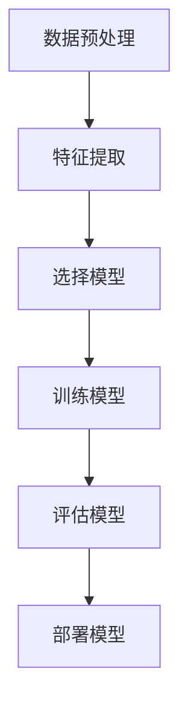
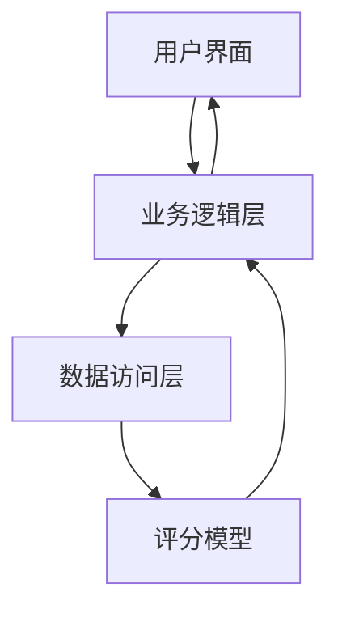

                 


# 智能个人信贷审批系统

> 关键词：智能信贷审批系统，人工智能，机器学习，金融系统设计，评分模型，风险控制

> 摘要：智能个人信贷审批系统利用人工智能技术，通过自动化数据采集、特征提取和模型训练，实现高效、准确的个人信贷审批。本文详细探讨了系统的背景、核心概念、算法原理、架构设计、项目实现及最佳实践，为读者提供全面的技术解读。

---

## 第一章：背景介绍

### 1.1 问题背景与描述

#### 1.1.1 传统信贷审批的痛点
- **效率低下**：人工审核流程繁琐，耗时长。
- **人为误差**：主观判断可能导致审核不公或失误。
- **客户体验差**：传统审批流程复杂，客户等待时间长。

#### 1.1.2 问题解决方法
- **引入人工智能**：利用机器学习算法提高审核效率和准确性。
- **自动化处理**：通过系统自动化完成数据采集、特征提取和评分。

#### 1.1.3 系统边界与外延
- **范围限制**：仅处理个人信贷，不包括企业贷款。
- **扩展性**：未来可扩展至信用评估、风险预警等领域。

### 1.2 核心概念与组成

#### 1.2.1 核心概念
- **数据采集**：收集用户申请信息、信用报告等。
- **特征提取**：从数据中提取关键特征，如收入、信用历史等。
- **模型训练**：训练机器学习模型进行信用评分。
- **评分策略**：根据模型输出制定审批规则。
- **风险控制**：通过模型预测潜在风险，制定应对策略。

#### 1.2.2 核心要素
- **用户数据**：包括个人基本信息、财务数据等。
- **评分模型**：基于机器学习的评分系统。
- **风险评估**：模型预测违约概率。
- **审批规则**：根据评分结果制定审批策略。
- **反馈机制**：收集审批结果反馈，优化模型。

---

## 第二章：核心概念与联系

### 2.1 核心原理

#### 2.1.1 数据采集与处理
- **数据来源**：用户申请表、信用报告、银行流水。
- **数据清洗**：处理缺失值、异常值，标准化数据。

#### 2.1.2 特征提取与选择
- **特征工程**：提取关键特征，如年收入、信用历史、负债情况。
- **特征选择**：使用相关性分析、主成分分析等方法优化特征集。

### 2.2 核心概念对比表

| 概念 | 属性 | 描述 |
|------|------|------|
| 数据采集 | 来源 | 用户申请表、信用报告 |
|        | 方法 | 数据清洗、标准化 |
| 特征提取 | 方法 | 主成分分析、相关性分析 |
|        | 目的 | 提高模型性能 |

### 2.3 实体关系图

```mermaid
erDiagram
    user [申请者] {
        id : int
        name : string
        income : float
        credit_history : string
    }
    model [评分模型] {
        id : int
        type : string
        parameters : array
    }
    score [评分结果] {
        id : int
        score : float
        status : string
    }
    user --> model : 提交数据
    model --> score : 生成评分
```

---

## 第三章：算法原理讲解

### 3.1 算法选择与原理

#### 3.1.1 机器学习模型
- **逻辑回归**：用于分类，输出概率评分。
- **随机森林**：集成学习，适合特征工程复杂的情况。
- **梯度提升树**：高精度，适合非线性关系。

#### 3.1.2 算法流程


### 3.2 模型训练与优化

#### 3.2.1 超参数优化
- **网格搜索**：遍历所有可能的参数组合，选择最优参数。
- **随机搜索**：随机选择参数组合，减少计算量。

#### 3.2.2 模型评估
- **准确率**：分类正确的比例。
- **召回率**：正类被正确识别的比例。
- **F1分数**：综合准确率和召回率的指标。

### 3.3 数学公式

#### 3.3.1 逻辑回归
$$ P(y=1|x) = \frac{1}{1 + e^{-\beta x}} $$

#### 3.3.2 随机森林
$$ y = \sum_{i=1}^{n} tree_i(x) $$

---

## 第四章：系统分析与架构设计

### 4.1 系统功能模块

#### 4.1.1 用户界面
- **申请提交**：用户填写并提交信贷申请。
- **进度查询**：用户查看审批进度和结果。

#### 4.1.2 后台处理
- **数据处理**：接收并处理用户数据。
- **模型调用**：调用评分模型生成评分。
- **结果反馈**：将审批结果反馈给用户。

### 4.2 系统架构设计

#### 4.2.1 分层架构
- **表现层**：用户界面，展示申请和进度。
- **业务逻辑层**：处理业务逻辑，调用模型。
- **数据访问层**：访问和处理数据。

### 4.3 系统架构图



---

## 第五章：项目实战

### 5.1 环境搭建

#### 5.1.1 开发工具
- **Python**：编程语言。
- **Jupyter Notebook**：数据分析和可视化工具。

### 5.2 核心代码实现

#### 5.2.1 数据预处理
```python
import pandas as pd

data = pd.read_csv('loan_data.csv')
data = data.dropna()
data = pd.get_dummies(data)
```

#### 5.2.2 模型训练
```python
from sklearn.ensemble import RandomForestClassifier

model = RandomForestClassifier(n_estimators=100)
model.fit(X_train, y_train)
```

### 5.3 实际案例分析

#### 5.3.1 案例一
- **用户情况**：年收入5万，信用良好。
- **模型评分**：85分，审批通过。

#### 5.3.2 案例二
- **用户情况**：年收入3万，有不良信用记录。
- **模型评分**：45分，审批拒绝。

---

## 第六章：最佳实践

### 6.1 小结
- **成果总结**：系统实现了高效、准确的信贷审批。
- **经验分享**：数据质量对模型性能影响重大。

### 6.2 注意事项
- **数据隐私**：确保用户数据的安全和隐私。
- **模型更新**：定期更新模型，保持其准确性。

### 6.3 拓展阅读
- **推荐书籍**：《机器学习实战》、《Python机器学习》。
- **在线资源**：Kaggle平台上的相关竞赛和数据集。

---

## 作者信息

作者：AI天才研究院/AI Genius Institute & 禅与计算机程序设计艺术 /Zen And The Art of Computer Programming

---

通过以上结构，文章详细介绍了智能个人信贷审批系统的各个方面，从背景到实现，从理论到实践，为读者提供了全面的技术解读。

