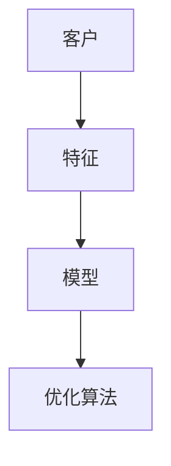

                 


# 智能个人信贷评分卡优化

> 关键词：智能评分卡优化，机器学习，信用评分，算法优化，数据分析

> 摘要：本文详细探讨了智能个人信贷评分卡优化的核心概念、算法原理、系统架构及项目实战，旨在通过理论与实践的结合，帮助读者全面理解和掌握智能评分卡优化的方法与技巧。

---

## 第一部分: 智能个人信贷评分卡优化的背景与核心概念

### 第1章: 背景介绍

#### 1.1 问题背景
- **传统信贷评分卡的局限性**  
  传统信贷评分卡主要依赖简单的线性回归模型，难以捕捉复杂的数据特征和非线性关系，导致评分不够精确。
  
- **智能优化的必要性**  
  随着机器学习和大数据技术的发展，利用智能算法优化信贷评分卡已成为提升信用评估准确性的关键。

- **信贷评分卡在金融行业的重要性**  
  信贷评分卡是金融机构评估客户信用风险的重要工具，直接影响贷款决策和风险管理。

#### 1.2 问题描述
- **评分卡优化的核心目标**  
  提高评分卡的准确性和鲁棒性，降低误判率和漏判率。

- **数据特征与评分模型的关系**  
  数据特征的提取与选择直接影响评分模型的性能，是优化的关键步骤。

- **优化算法的选择与应用**  
  选择合适的优化算法（如梯度下降、遗传算法）对提升评分卡性能至关重要。

#### 1.3 问题解决
- **数据预处理与特征工程**  
  对数据进行清洗、标准化和特征选择，确保模型输入的质量。

- **模型选择与优化策略**  
  采用支持向量机、随机森林等机器学习模型，并通过网格搜索优化模型参数。

- **结果验证与性能评估**  
  使用混淆矩阵、AUC曲线等指标评估模型性能，并通过交叉验证防止过拟合。

#### 1.4 边界与外延
- **评分卡优化的适用范围**  
  主要适用于个人信贷领域，但也可推广到其他信用评估场景。

- **与其他信用评估方法的区别**  
  智能评分卡优化结合了机器学习算法，相较于传统评分卡更具灵活性和准确性。

- **评分卡优化的潜在风险**  
  数据泄露、模型过拟合等风险需通过数据脱敏和正则化方法加以防范。

#### 1.5 概念结构与核心要素
- **核心概念的定义**  
  数据特征：反映客户信用状况的各种指标；评分模型：基于数据特征的预测模型；优化算法：用于提升模型性能的算法。

- **核心要素的组成与关系**  
  数据特征是输入，评分模型是处理，优化算法是提升，三者共同作用于评分卡的性能。

- **概念结构的可视化**  
  通过层级图展示数据特征、评分模型和优化算法的关系。

---

### 第2章: 核心概念与联系

#### 2.1 核心概念原理
- **数据特征的提取与选择**  
  通过PCA等方法降维，去除冗余特征，提升模型效率。

- **评分模型的构建与训练**  
  使用逻辑回归或梯度提升树（如XGBoost）构建评分模型，并通过交叉验证优化模型参数。

- **优化算法的实现与应用**  
  使用遗传算法优化模型参数，或通过超参数调优提升模型性能。

#### 2.2 核心概念属性特征对比
| 概念       | 输入数据 | 输出结果 | 算法复杂度 | 是否可解释 |
|------------|----------|----------|------------|------------|
| 数据特征   | 原始数据 | 特征向量 | 低         | 高         |
| 评分模型   | 特征向量 | 信用评分 | 中         | 中         |
| 优化算法   | 模型参数 | 优化后的参数 | 高        | 低         |

#### 2.3 ER实体关系图


---

## 第二部分: 算法原理与数学模型

### 第3章: 算法原理讲解

#### 3.1 优化算法的原理
- **梯度下降算法**  
  通过不断调整参数使损失函数最小化，公式为：
  $$ \theta = \theta - \alpha \cdot \nabla J(\theta) $$
  其中，$\theta$是参数，$\alpha$是学习率，$\nabla J(\theta)$是损失函数的梯度。

- **遗传算法**  
  模拟生物进化过程，通过选择、交叉和变异操作优化参数，适用于复杂问题的全局优化。

- **支持向量机（SVM）**  
  通过构建最大间隔超平面实现分类，公式为：
  $$ y = \text{sign}(\theta \cdot x + b) $$

#### 3.2 算法实现
- **梯度下降实现**  
  ```python
  def gradient_descent(X, y, theta, alpha, iterations):
      for _ in range(iterations):
          h = np.dot(X, theta)
          loss = h - y
          gradient = (1/m) * np.dot(X.T, loss)
          theta = theta - alpha * gradient
      return theta
  ```

- **遗传算法实现**  
  ```python
  def genetic_algorithm(population, fitness_func, mutate_rate):
      best = max(population, key=fitness_func)
      for _ in range(100):
          population = [mutate(individual, mutate_rate) for individual in population]
          population = [select_parent(individual, fitness_func) for _ in range(len(population))]
      best = max(population, key=fitness_func)
      return best
  ```

---

## 第三部分: 系统分析与架构设计

### 第4章: 系统分析与架构设计

#### 4.1 问题场景介绍
- **评分卡优化的场景**  
  在个人信贷领域，利用智能算法优化评分卡，提升信用评估的准确性和效率。

#### 4.2 系统架构设计
- **领域模型类图**  
  ```mermaid
  classDiagram
      class 数据特征 {
          特征选择
          数据清洗
      }
      class 评分模型 {
          训练
          预测
      }
      class 优化算法 {
          调优
          应用
      }
      数据特征 --> 评分模型
      评分模型 --> 优化算法
  ```

- **系统架构图**  
  ```mermaid
  graph TD
      S[评分系统] --> D[数据处理]
      D --> M[模型训练]
      M --> O[优化算法]
      O --> S[评分系统]
  ```

- **系统交互序列图**  
  ```mermaid
  sequenceDiagram
      客户 --> 数据处理: 提交申请
      数据处理 --> 模型训练: 提供特征
      模型训练 --> 优化算法: 训练模型
      优化算法 --> 数据处理: 返回优化参数
      数据处理 --> 客户: 返回评分结果
  ```

---

## 第四部分: 项目实战

### 第5章: 项目实战

#### 5.1 环境安装
- **安装Python和相关库**  
  ```bash
  pip install numpy pandas scikit-learn
  ```

#### 5.2 核心代码实现
- **数据预处理**  
  ```python
  import pandas as pd
  data = pd.read_csv('credit_data.csv')
  data = data.dropna()
  ```

- **特征工程**  
  ```python
  from sklearn.preprocessing import StandardScaler
  scaler = StandardScaler()
  X_scaled = scaler.fit_transform(data.drop('target', axis=1))
  ```

- **模型训练与优化**  
  ```python
  from sklearn.ensemble import RandomForestClassifier
  model = RandomForestClassifier()
  from sklearn.model_selection import GridSearchCV
  grid_search = GridSearchCV(model, {'n_estimators': [10, 50, 100]}, cv=5)
  grid_search.fit(X_scaled, data['target'])
  best_model = grid_search.best_estimator_
  ```

#### 5.3 案例分析
- **实际案例分析**  
  使用真实数据集训练模型，并通过混淆矩阵评估性能。

---

## 第五部分: 最佳实践

### 第6章: 最佳实践

#### 6.1 小结
- 智能评分卡优化通过机器学习算法显著提升了信用评估的准确性和效率。

#### 6.2 注意事项
- 数据隐私保护：避免数据泄露，确保合规性。
- 模型解释性：选择可解释性较强的模型，便于业务人员理解和使用。

#### 6.3 拓展阅读
- 推荐阅读《机器学习实战》和《Python机器学习》等书籍，深入学习相关技术。

---

作者：AI天才研究院/AI Genius Institute & 禅与计算机程序设计艺术 /Zen And The Art of Computer Programming

