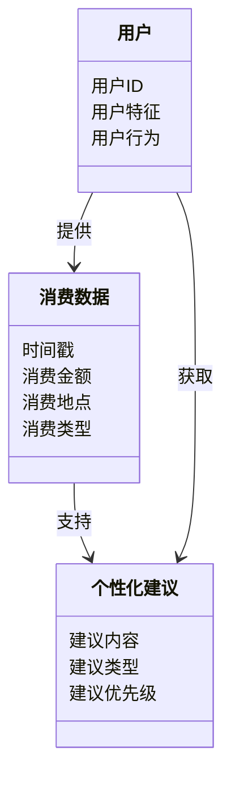
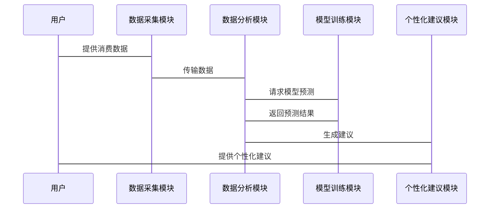

                 


# 智能个人消费模式分析与建议系统

> 关键词：智能消费分析、人工智能、数据挖掘、个性化建议、系统架构设计、算法实现

> 摘要：本文详细探讨了智能个人消费模式分析与建议系统的构建与实现。通过分析个人消费数据，利用机器学习算法和数据挖掘技术，提出个性化的消费建议，帮助用户优化消费行为。文章从背景介绍、核心概念、算法原理、系统架构设计、项目实战到最佳实践，全面解析了该系统的实现过程，并通过实际案例展示了系统的应用场景和效果。

---

## 目录

### 第一部分: 背景介绍

#### 第1章: 智能个人消费模式分析与建议系统概述

##### 1.1 问题背景
- 1.1.1 个人消费行为的复杂性  
- 1.1.2 当前消费模式的痛点  
- 1.1.3 智能分析的必要性  

##### 1.2 问题描述
- 1.2.1 消费数据的多维度特征  
- 1.2.2 消费行为的动态变化  
- 1.2.3 系统目标与边界  

##### 1.3 问题解决
- 1.3.1 智能分析的核心思路  
- 1.3.2 数据驱动的决策支持  
- 1.3.3 个性化建议的实现路径  

##### 1.4 系统的边界与外延
- 1.4.1 系统功能的边界  
- 1.4.2 系统应用的场景  
- 1.4.3 系统扩展的可能性  

##### 1.5 核心概念结构与组成
- 1.5.1 核心概念的层次结构  
- 1.5.2 核心要素的组成关系  
- 1.5.3 系统架构的初步设想  

---

### 第二部分: 核心概念与联系

#### 第2章: 智能个人消费模式分析系统的核心概念

##### 2.1 核心概念原理
- 2.1.1 数据采集与处理  
- 2.1.2 模型训练与优化  
- 2.1.3 个性化建议生成  

##### 2.2 核心概念属性特征对比
- 2.2.1 数据特征对比表  
- 2.2.2 模型性能对比表  
- 2.2.3 建议效果对比表  

##### 2.3 ER实体关系图
```mermaid
er
  actor: 用户
  class: 消费行为
  class: 消费数据
  class: 个性化建议
  user ->消费行为: 提供
 消费行为 -> 消费数据: 包含
 消费数据 -> 个性化建议: 支持
```

---

### 第三部分: 算法原理

#### 第3章: 算法实现与优化

##### 3.1 数据预处理
- 数据清洗与特征提取
- 数据标准化与归一化
- 数据分割（训练集、验证集、测试集）

##### 3.2 特征提取
- 基于机器学习的特征选择
- 基于深度学习的特征提取
- 基于规则的特征工程

##### 3.3 模型训练
- 机器学习模型（决策树、随机森林、SVM等）
- 深度学习模型（神经网络、LSTM等）
- 模型调优与优化

##### 3.4 个性化建议生成
- 基于模型的预测结果生成建议
- 基于用户行为的动态调整
- 多目标优化与推荐策略

##### 3.5 算法实现代码
```python
# 示例代码：基于决策树的消费模式分析
from sklearn.tree import DecisionTreeClassifier
import pandas as pd
import numpy as np

# 数据加载与预处理
data = pd.read_csv('consumption_data.csv')
X = data.drop('label', axis=1)
y = data['label']

# 模型训练
model = DecisionTreeClassifier()
model.fit(X, y)

# 模型预测
new_data = pd.DataFrame({
    'feature1': [0.5],
    'feature2': [0.3],
    # 其他特征...
})
y_pred = model.predict(new_data)
```

##### 3.6 数学模型与公式
- 损失函数：$$L = \frac{1}{n}\sum_{i=1}^{n}(y_i - \hat{y_i})^2$$
- 决策树构建：$$\text{信息增益} = \sum p \log \frac{1}{p}$$

---

### 第四部分: 系统分析与架构设计

#### 第4章: 系统架构设计

##### 4.1 系统功能模块
- 数据采集模块
- 数据分析模块
- 个性化建议生成模块
- 用户界面模块

##### 4.2 系统架构图


##### 4.3 接口设计与交互


---

### 第五部分: 项目实战

#### 第5章: 实战项目实现

##### 5.1 环境安装
- 安装Python与相关库（scikit-learn、TensorFlow、Pandas等）
- 安装Jupyter Notebook或其他开发工具

##### 5.2 核心代码实现
```python
# 示例代码：个性化消费建议生成
import numpy as np
import pandas as pd
from sklearn.ensemble import RandomForestClassifier
from sklearn.metrics import accuracy_score

# 数据加载与预处理
data = pd.read_csv('consumption_data.csv')
X = data.drop('label', axis=1)
y = data['label']

# 模型训练
model = RandomForestClassifier(n_estimators=100)
model.fit(X, y)

# 模型预测
new_data = pd.DataFrame({
    'feature1': [0.6],
    'feature2': [0.2],
    # 其他特征...
})
y_pred = model.predict(new_data)

# 模型评估
print("Accuracy:", accuracy_score(y_true=y, y_pred=y_pred))
```

##### 5.3 实际案例分析
- 案例1：基于消费数据的购物行为预测
- 案例2：个性化消费建议的实际应用效果
- 案例3：系统在不同场景下的表现对比

##### 5.4 项目小结
- 项目实现的关键点
- 项目中的经验与教训
- 项目改进的方向

---

### 第六部分: 最佳实践

#### 第6章: 总结与展望

##### 6.1 小结
- 本文的核心内容总结
- 系统设计的关键点回顾
- 项目实现的经验分享

##### 6.2 注意事项
- 数据隐私与安全问题
- 模型的可解释性与鲁棒性
- 系统的实时性和响应速度

##### 6.3 拓展阅读
- 推荐书籍与论文
- 相关技术社区与资源
- 进一步研究的方向

---

## 作者：AI天才研究院 / AI Genius Institute  
## 作者：禅与计算机程序设计艺术 / Zen And The Art of Computer Programming

