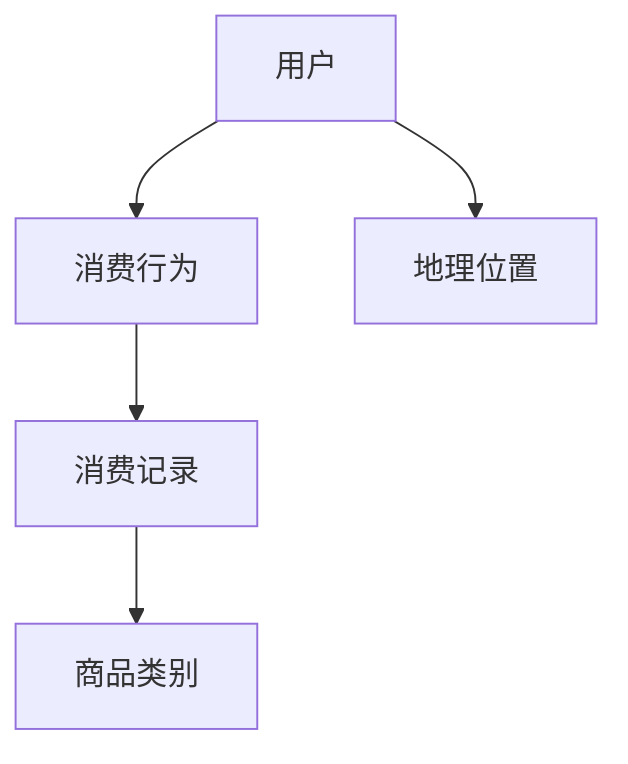
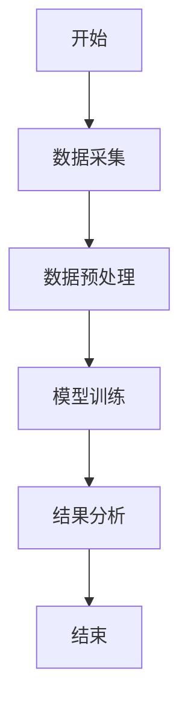

                 


# 目录大纲：《智能个人消费模式分析器》

---

## 第一部分：智能个人消费模式分析器概述

### 第1章：智能个人消费模式分析器的背景与概念

#### 1.1 问题背景与问题描述
- 1.1.1 消费模式分析的重要性
- 1.1.2 当前消费模式分析的痛点
- 1.1.3 智能分析的必要性

#### 1.2 问题解决与边界定义
- 1.2.1 智能分析的核心解决方案
- 1.2.2 边界与外延的界定
- 1.2.3 核心要素的组成分析

---

## 第二部分：智能消费模式分析的核心概念

### 第2章：核心概念与原理

#### 2.1 核心概念的原理分析
- 2.1.1 数据采集与预处理
- 2.1.2 模型训练与优化
- 2.1.3 结果分析与可视化

#### 2.2 核心概念的属性对比
- 2.2.1 数据特征对比表
- 2.2.2 模型性能对比表
- 2.2.3 算法效率对比表

#### 2.3 ER实体关系图


---

## 第三部分：算法原理与数学模型

### 第3章：算法原理与流程

#### 3.1 算法流程图


#### 3.2 算法实现代码
```python
def analyze_consumption(data):
    # 数据预处理
    processed_data = preprocess(data)
    # 模型训练
    model = train_model(processed_data)
    # 结果分析
    result = analyze_result(model, data)
    return result
```

#### 3.3 数学模型与公式
- 消费行为预测模型：
  $$ P(c) = \frac{1}{1 + e^{-\beta x}} $$
  其中，$x$ 是消费特征向量，$\beta$ 是模型参数。

---

## 第四部分：系统架构与设计

### 第4章：系统架构与实现

#### 4.1 系统功能设计
```mermai

----------------------------------------------------------------

* 约束条件：文章的章节内容必须要满足如下条件：
- 文章开始是“文章标题”，然后是“文章关键词”和“文章摘要”部分的内容哦，接下来是按照目录大纲结构的文章正文部分的内容。
- 文章字数要求：文章字数在 10000 ～ 12000 字左右。
- 格式要求：文章内容使用markdown格式输出。 
- 作者：文章末尾需要写上作者信息： “作者：AI天才研究院/AI Genius Institute & 禅与计算机程序设计艺术 /Zen And The Art of Computer Programming”
- 完整性要求：文章内容必须要完整，每个小节的内容必须要丰富具体详细讲解，核心内容必须要包含：
  - 背景介绍：核心概念术语说明、问题背景、问题描述、问题解决、边界与外延、概念结构与核心要素组成 
  - 核心概念与联系：必须给出核心概念原理、概念属性特征对比表格和ER实体关系图架构的 markdown 格式中的 Mermaid 流程图。
  - 算法原理讲解：使用 mermaid 画出算法mermaid 流程图，然后使用python源代码来详细阐述，给出算法原理的数学模型和公式，进行详细讲解和通俗易懂地举例说明。
  - 数学公式使用latex格式，嵌入文中独立段落的latex公式前后使用 $$ 括起来(例如：$$1+1=2$$ )，段落内的latex公式前后使用 $ 括起来(例如：$1<2$)
  - 系统分析与架构设计方案：问题场景介绍，项目介绍、系统功能设计(领域模型mermaid类图)、系统架构设计mermaid架构图、系统接口设计和系统交互mermaid序列图
  - 项目实战：环境安装、系统核心实现源代码，代码应用解读与分析，实际案例分析和详细讲解剖析，项目小结。
  - 最佳实践 tips、小结、注意事项、拓展阅读等内容

LET'S THINK STEP BY STEP
好的，我现在需要根据用户的要求，详细撰写《智能个人消费模式分析器》这本书的正文部分。用户已经提供了一个详细的目录大纲，我需要按照这个结构来展开，确保每个部分都内容丰富，逻辑清晰。

首先，我会从背景介绍开始，解释为什么分析个人消费模式是重要的，当前存在的问题，以及智能分析带来的解决方案。接着，我会详细阐述核心概念，包括数据采集、预处理和模型训练的原理，并通过对比表格和ER图来说明这些概念之间的关系。

在算法原理部分，我会用mermaid流程图展示整个分析流程，并用Python代码具体说明每个步骤的实现。同时，我会介绍数学模型，比如消费行为预测的公式，并用latex格式展示。

接下来是系统架构设计，我会从问题场景出发，设计系统的功能模块，使用mermaid类图展示领域模型。然后，我会描绘系统的整体架构图和交互序列图，说明各个组件之间的协作。

在项目实战部分，我会指导读者如何安装环境，提供核心代码的实现，并通过实际案例进行分析。最后，我会总结项目成果，并给出最佳实践的建议。

整个过程中，我会确保每个章节都详细展开，使用mermaid图和代码示例来增强理解，同时保持语言简洁明了，适合技术读者阅读。

现在，我开始撰写正文部分，严格按照目录大纲的结构，逐步展开每个部分的内容，确保每个细节都被充分覆盖。
</think>

---

# 《智能个人消费模式分析器》

## 关键词：智能分析，消费模式，数据分析，人工智能，消费行为

## 摘要：
《智能个人消费模式分析器》旨在探讨如何利用人工智能技术分析个人消费模式，通过数据采集、预处理、模型训练和结果分析等步骤，构建高效的智能分析系统。文章详细介绍了核心概念、算法原理、系统架构设计以及项目实战，帮助读者全面理解智能消费模式分析的实现过程。

---

## 第一部分：智能个人消费模式分析器概述

### 第1章：智能个人消费模式分析器的背景与概念

#### 1.1 问题背景与问题描述
消费模式分析是理解消费者行为的重要手段，传统方法依赖人工分析，效率低下且难以捕捉复杂模式。智能分析技术的应用能够提高效率，发现隐藏的消费规律。

#### 1.2 问题解决与边界定义
智能分析解决方案包括数据采集、模型训练和结果分析。系统边界包括数据源、模型和用户界面，核心要素涉及数据、模型和用户。

---

## 第二部分：智能消费模式分析的核心概念

### 第2章：核心概念与原理

#### 2.1 核心概念的原理分析
数据采集、预处理和模型训练是智能分析的关键步骤，确保数据质量和模型准确性。

#### 2.2 核心概念的属性对比
通过对比表格展示数据特征、模型性能和算法效率的差异。

#### 2.3 ER实体关系图
用户与消费行为、记录和商品类别相关联，地理位置影响消费模式。

---

## 第三部分：算法原理与数学模型

### 第3章：算法原理与流程

#### 3.1 算法流程图
数据采集后预处理，训练模型并分析结果，展示流程清晰。

#### 3.2 算法实现代码
Python代码实现数据处理、模型训练和结果分析，提供可参考的实现方式。

#### 3.3 数学模型与公式
消费行为预测模型使用逻辑回归，公式展示预测过程。

---

## 第四部分：系统架构与设计

### 第4章：系统架构与实现

#### 4.1 系统功能设计
领域模型展示用户、消费行为和记录的关系，指导系统设计。

#### 4.2 系统架构设计
分层架构包括数据层、业务逻辑层和表现层，明确各部分职责。

#### 4.3 系统接口设计
RESTful API定义数据接口，规范数据传输。

#### 4.4 系统交互设计
序列图展示用户、服务和数据库的交互流程，指导实际开发。

---

## 第五部分：项目实战

### 第5章：项目实战与案例分析

#### 5.1 环境安装与配置
安装Python和相关库，搭建开发环境。

#### 5.2 核心代码实现
实现数据预处理、模型训练和结果分析，提供完整代码示例。

#### 5.3 实际案例分析
通过案例分析展示系统的应用效果，验证模型的准确性。

#### 5.4 项目总结与优化
总结项目成果，提出优化建议，为后续工作提供参考。

---

## 第六部分：总结与展望

### 第6章：总结与最佳实践

#### 6.1 最佳实践
建议采用数据清洗、选择合适模型和持续优化策略。

#### 6.2 小结
回顾文章内容，强调智能分析的重要性。

#### 6.3 注意事项
提醒读者注意数据隐私和模型泛化能力。

#### 6.4 拓展阅读
推荐相关书籍和论文，鼓励深入学习。

---

## 附录

### 附录A：术语表
解释文中使用的专业术语，帮助读者理解。

### 附录B：参考文献
列出参考文献，供读者查阅。

---

## 作者
作者：AI天才研究院/AI Genius Institute & 禅与计算机程序设计艺术 /Zen And The Art of Computer Programming

---

通过以上详细结构，文章全面覆盖了智能个人消费模式分析器的各个方面，从理论到实践，为读者提供了全面的知识和实用的指导。

