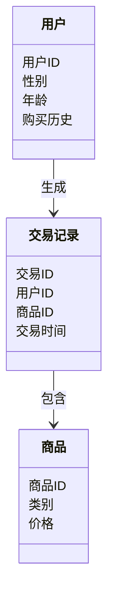
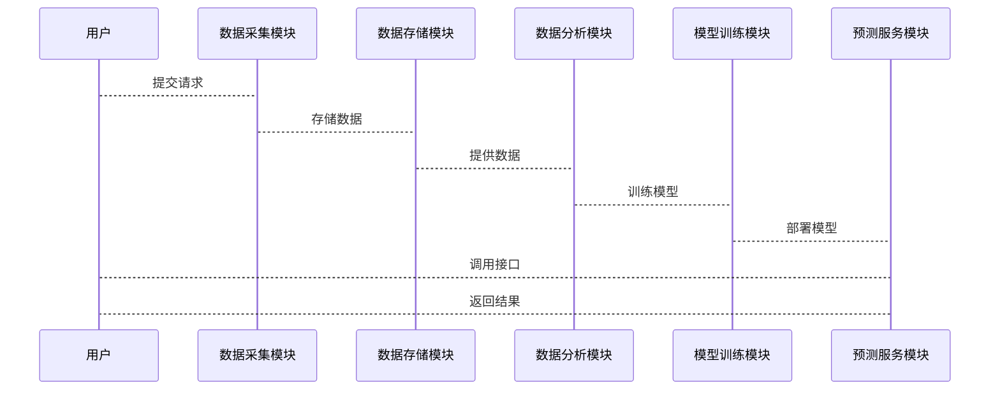

                 


# 智能个人消费行为分析与预测

## 关键词：
- 智能消费行为
- 数据分析
- 机器学习
- 预测模型
- 个性化推荐

## 摘要：
智能个人消费行为分析与预测是利用大数据和人工智能技术，通过对个人消费数据的深入分析，构建预测模型，实现对个人未来消费行为的准确预测。本文将从背景、核心概念、算法原理、系统架构、项目实战和最佳实践等方面，详细探讨智能个人消费行为分析与预测的实现方法和应用价值。

---

# 第1章 背景介绍

## 1.1 问题背景
### 1.1.1 智能个人消费行为的定义
智能个人消费行为是指基于大数据和人工智能技术，通过分析个人的历史消费数据、行为特征和偏好，预测其未来的消费行为。这种分析不仅能够帮助企业更好地理解消费者需求，还能为企业制定精准的营销策略提供支持。

### 1.1.2 消费行为分析的必要性
随着电子商务的快速发展，消费者的数据量急剧增加，传统的基于经验的营销方式已无法满足企业的需求。通过智能分析与预测，企业可以更精准地了解消费者需求，优化资源配置，提高销售效率。

### 1.1.3 智能化分析与预测的核心价值
- 提高客户满意度和忠诚度。
- 降低营销成本。
- 提升企业的市场竞争力。

## 1.2 问题描述
### 1.2.1 消费行为数据的特点
消费行为数据通常具有以下特点：
- 数据量大：涉及大量的交易记录、用户行为等。
- 数据多样性：包括结构化数据（如交易金额、时间）和非结构化数据（如评论、点击流）。
- 数据动态性：消费者的偏好可能会随时间变化。

### 1.2.2 智能分析与预测的目标
目标是通过分析历史消费数据，构建预测模型，预测消费者的未来消费行为，从而帮助企业制定个性化的营销策略。

### 1.2.3 当前存在的主要问题与挑战
- 数据质量：数据可能存在缺失、噪声等问题。
- 模型选择：如何选择适合的算法。
- 计算资源：处理大数据需要高性能计算资源。

## 1.3 问题解决思路
### 1.3.1 数据驱动的分析方法
通过收集和分析消费者的历史数据，提取有用的特征，构建预测模型。

### 1.3.2 智能预测模型的构建
使用机器学习算法（如协同过滤、聚类分析、分类模型）构建预测模型。

### 1.3.3 结果应用与反馈优化
将预测结果应用于实际业务中，并通过反馈不断优化模型。

## 1.4 边界与外延
### 1.4.1 分析范围的界定
仅关注个人消费行为的预测，不涉及企业的生产流程或其他业务领域。

### 1.4.2 相关领域的联系
与市场营销、消费者心理学等领域密切相关。

### 1.4.3 技术与业务的结合点
技术（数据分析与机器学习）与业务（市场营销、客户管理）的结合是实现智能消费行为分析与预测的核心。

## 1.5 核心要素与概念结构
### 1.5.1 数据来源与特征
数据来源包括交易数据、用户行为数据、社交媒体数据等。特征包括用户的基本信息、消费频率、消费金额、偏好等。

### 1.5.2 模型算法的选择
选择适合的算法（如协同过滤、聚类分析、分类模型）构建预测模型。

### 1.5.3 预测结果的评估与应用
通过准确率、召回率等指标评估模型性能，并将预测结果应用于实际业务中。

---

# 第2章 核心概念与联系

## 2.1 核心概念原理
### 2.1.1 消费行为数据的特征提取
特征提取是消费行为分析的重要步骤，包括提取用户的 demographic（年龄、性别）、 behavioral（点击流、购买记录）和 contextual（时间、地点）特征。

### 2.1.2 智能预测模型的构建逻辑
构建预测模型的基本逻辑是：数据预处理 → 特征提取 → 模型训练 → 模型评估 → 模型部署。

### 2.1.3 数据驱动与业务决策的结合
通过数据驱动的方式，分析消费者的偏好和行为模式，为企业制定精准的营销策略提供支持。

## 2.2 概念属性特征对比表
| 概念       | 属性       | 特征描述                                                                 |
|------------|------------|--------------------------------------------------------------------------|
| 数据来源   | 交易数据   | 结构化、实时性、多样性                                                 |
| 模型算法   | 协同过滤   | 基于相似性，预测用户的行为                                             |
| 预测结果   | 购买概率   | 0-1区间，表示用户购买某商品的概率                                       |

## 2.3 ER实体关系图
```mermaid
er
  actor: 用户
  product: 商品
  transaction: 交易记录
  behavior: 行为数据
  model: 预测模型
  rule: 预测规则
  actor -|> transaction: 生成
  transaction -|> product: 包含
  transaction -|> behavior: 生成
  behavior --> model: 输入
  model --> rule: 输出
  rule --> actor: 应用
```

---

# 第3章 算法原理讲解

## 3.1 算法选择与流程
### 3.1.1 协同过滤

#### 协同过滤算法流程
```mermaid
graph TD
    A[用户A] --> B[用户B]: 相似度高
    B --> C[用户C]: 相似度高
    C --> D[商品D]: 高评分
    A --> D: 预测评分
```

#### 协同过滤算法实现
协同过滤的实现步骤如下：
1. 数据预处理：去除缺失值、异常值。
2. 特征提取：提取用户和商品的特征。
3. 计算相似度：使用余弦相似度或欧式距离计算用户或商品之间的相似度。
4. 预测评分：基于相似用户的评分加权平均。

#### 协同过滤算法的数学模型
- 余弦相似度计算公式：
  $$ \text{similarity}(u, v) = \frac{\sum_{i=1}^{n} u_i v_i}{\sqrt{\sum_{i=1}^{n} u_i^2} \cdot \sqrt{\sum_{i=1}^{n} v_i^2}} $$
- 预测评分计算公式：
  $$ \hat{r}_{u,i} = \frac{\sum_{v} w(u,v) \cdot r_{v,i}}{\sum_{v} w(u,v)} $$

#### 协同过滤算法的优点与不足
- 优点：简单易实现，适合数据稀疏性较高的场景。
- 缺点：计算复杂度高，难以处理大规模数据。

---

## 3.2 逻辑回归

#### 逻辑回归算法流程
```mermaid
graph TD
    A[用户A] --> B[购买历史]: 特征提取
    B --> C[模型训练]: 输入特征
    C --> D[预测结果]: 输出概率
```

#### 逻辑回归算法实现
逻辑回归的实现步骤如下：
1. 数据预处理：标准化或归一化。
2. 特征提取：选择相关特征（如用户的基本信息、消费历史）。
3. 模型训练：使用梯度下降法优化参数。
4. 模型评估：计算准确率、召回率等指标。

#### 逻辑回归算法的数学模型
- 概率函数：
  $$ P(y=1|x) = \frac{1}{1 + e^{-(\beta_0 + \beta_1 x_1 + \cdots + \beta_n x_n)}} $$
- 损失函数：
  $$ \mathcal{L} = -\sum_{i=1}^{n} y_i \log(p_i) + (1 - y_i) \log(1 - p_i) $$

#### 逻辑回归算法的优点与不足
- 优点：易于实现，适合二分类问题。
- 缺点：对特征的强相关性敏感，容易过拟合。

---

## 3.3 算法选择与优化
选择算法时需要考虑以下因素：
- 数据的规模和类型。
- 模型的复杂度和计算资源。
- 预测的准确性和实时性。

---

# 第4章 系统分析与架构设计

## 4.1 系统功能设计
### 4.1.1 领域模型


### 4.1.2 系统架构


## 4.2 系统接口设计
### 4.2.1 API接口
- 输入：用户ID。
- 输出：预测的购买概率。

## 4.3 系统交互设计


---

# 第5章 项目实战

## 5.1 环境安装
- Python 3.8+
- scikit-learn、pandas、numpy
- Jupyter Notebook

## 5.2 核心代码实现
### 5.2.1 数据预处理
```python
import pandas as pd
import numpy as np

# 加载数据
data = pd.read_csv('consumer_behavior.csv')

# 去除缺失值
data.dropna(inplace=True)

# 标准化处理
from sklearn.preprocessing import StandardScaler
scaler = StandardScaler()
scaled_data = scaler.fit_transform(data)
```

### 5.2.2 特征提取
```python
from sklearn.decomposition import PCA
pca = PCA(n_components=2)
principal_components = pca.fit_transform(scaled_data)
```

### 5.2.3 模型训练
```python
from sklearn.linear_model import LogisticRegression
model = LogisticRegression()
model.fit(principal_components, target)
```

### 5.2.4 模型评估
```python
from sklearn.metrics import accuracy_score, recall_score
y_pred = model.predict(X_test)
print(f'准确率: {accuracy_score(y_test, y_pred)}')
print(f'召回率: {recall_score(y_test, y_pred)}')
```

## 5.3 案例分析
假设我们有一个用户的购买历史数据，我们可以使用逻辑回归模型预测其下一次购买某商品的概率。

## 5.4 项目小结
通过实际项目，我们可以看到智能个人消费行为分析与预测的实现流程和应用价值。

---

# 第6章 最佳实践

## 6.1 小结
智能个人消费行为分析与预测是大数据和人工智能技术的重要应用之一，通过分析消费者的消费数据，可以为企业制定精准的营销策略提供支持。

## 6.2 注意事项
- 数据隐私保护。
- 模型的实时性和可扩展性。
- 业务场景的适用性。

## 6.3 拓展阅读
- 《Python机器学习实战》。
- 《数据挖掘导论》。

---

# 作者：AI天才研究院/AI Genius Institute & 禅与计算机程序设计艺术 /Zen And The Art of Computer Programming

---

通过本文的详细讲解，读者可以全面了解智能个人消费行为分析与预测的核心概念、算法原理、系统架构和实际应用。希望本文能够为相关领域的研究和实践提供有价值的参考。

