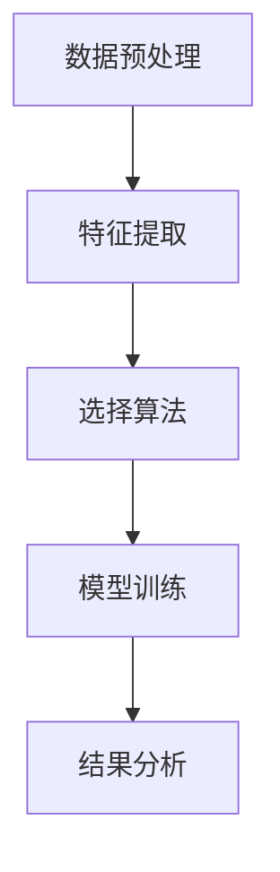
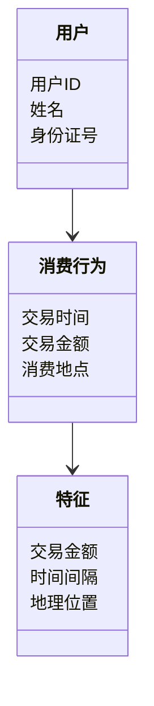
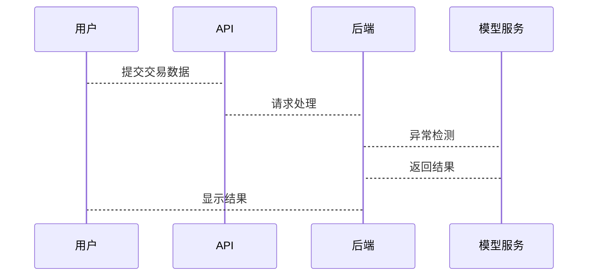

                 


```markdown
# 智能个人消费行为异常检测

> 关键词：智能消费行为、异常检测、机器学习、数据挖掘、行为分析

> 摘要：本文系统地探讨了智能个人消费行为异常检测的核心概念、算法原理、系统设计和实际应用。通过分析消费行为的特征，结合统计方法、机器学习和深度学习等技术，提出了一种高效的异常检测方案，并通过实际案例展示了其在金融领域的应用。

---

## 第1章: 背景介绍

### 1.1 问题背景
#### 1.1.1 智能个人消费行为的定义
智能个人消费行为是指个体在消费过程中，通过智能设备、大数据分析和人工智能技术辅助做出的决策。这些行为通常基于实时数据和个性化推荐。

#### 1.1.2 异常消费行为的定义与分类
异常消费行为是指偏离正常消费模式的行为，可能包括欺诈、过度消费或突然改变消费习惯等。常见的分类包括欺诈性异常、非欺诈性异常和突发性异常。

#### 1.1.3 异常消费行为检测的必要性
异常消费行为检测有助于预防金融诈骗、优化消费体验和提升企业风险管理能力。

### 1.2 问题描述
#### 1.2.1 消费行为异常的特征分析
异常行为可能表现为交易金额突变、交易频率异常或消费地点变化等。

#### 1.2.2 异常消费行为的典型案例
例如，信用卡欺诈、虚假交易和异常购物行为。

#### 1.2.3 异常消费行为检测的目标与意义
目标是通过技术手段识别异常行为，意义在于保护消费者和企业的利益。

### 1.3 问题解决方法
#### 1.3.1 数据驱动的异常检测方法
通过分析历史数据，识别正常和异常行为模式。

#### 1.3.2 智能算法的应用
利用机器学习和深度学习算法，构建异常检测模型。

#### 1.3.3 多模态数据的融合分析
结合交易数据、用户行为数据和地理位置数据，提高检测精度。

### 1.4 边界与外延
#### 1.4.1 异常消费行为的边界条件
例如，区分正常波动和异常行为的阈值。

#### 1.4.2 相关概念的外延与区别
如异常行为与正常行为的区分，以及与其他类型行为（如社交行为）的对比。

#### 1.4.3 异常检测的适用范围与限制
适用于金融、零售等领域，但受限于数据质量和模型泛化能力。

### 1.5 概念结构与核心要素
#### 1.5.1 核心概念的层次结构
从数据、特征、算法到模型的层次结构。

#### 1.5.2 核心要素的特征分析
如数据的时序性、行为的关联性等。

#### 1.5.3 概念结构的可视化
通过图表展示概念间的层次关系。

---

## 第2章: 核心概念与联系

### 2.1 核心概念原理
#### 2.1.1 异常消费行为的特征提取
提取交易金额、时间间隔、地理位置等特征。

#### 2.1.2 数据的多模态分析
结合文本、图像和交易数据进行分析。

#### 2.1.3 智能算法的核心原理
如孤立森林算法、神经网络等。

### 2.2 核心概念属性特征对比
#### 2.2.1 异常检测方法对比表
| 方法         | 优点               | 缺点               |
|--------------|--------------------|--------------------|
| 统计方法     | 易解释             | 易受分布影响       |
| 机器学习     | 高精度             | 需大量数据         |
| 深度学习     | 强大学习能力       | 计算资源消耗大     |

#### 2.2.2 数据特征的维度分析
如时间、空间、金额等维度。

#### 2.2.3 算法性能的对比
通过准确率、召回率等指标进行对比。

### 2.3 ER实体关系图
```mermaid
er
  actor: 用户
  behavior: 消费行为
  feature: 特征
  model: 检测模型
  result: 检测结果
  actor --> behavior
  behavior --> feature
  feature --> model
  model --> result
```

---

## 第3章: 算法原理讲解

### 3.1 算法原理
#### 3.1.1 统计方法
如Z-score、箱线图等，用于检测离群点。

#### 3.1.2 机器学习
如随机森林、支持向量机（SVM）等，用于分类任务。

#### 3.1.3 深度学习
如自动编码器（AE）、长短期记忆网络（LSTM）等，用于复杂模式识别。

#### 3.1.4 时间序列分析
如ARIMA、GARCH模型，用于分析时序数据。

### 3.2 算法流程图


### 3.3 数学模型与公式
#### 3.3.1 隔离森林算法
孤立森林是一种无监督的异常检测算法，通过构建多个孤立树来识别异常点。

$$ \text{异常概率} = \frac{1}{\text{树的深度}} $$

#### 3.3.2 马尔可夫链模型
用于时间序列分析，状态转移概率矩阵表示为：

$$ P = \begin{bmatrix}
p_{11} & p_{12} & \cdots & p_{1n} \\
p_{21} & p_{22} & \cdots & p_{2n} \\
\vdots & \vdots & \ddots & \vdots \\
p_{n1} & p_{n2} & \cdots & p_{nn}
\end{bmatrix} $$

---

## 第4章: 系统分析与架构设计

### 4.1 系统功能设计
#### 4.1.1 领域模型


#### 4.1.2 系统架构


### 4.2 系统接口设计
#### 4.2.1 API接口
如RESTful API：
```http
POST /api/detect
{
  "transactions": [100, 200, 300, ...]
}
```

#### 4.2.2 接口交互流程图


---

## 第5章: 项目实战

### 5.1 环境安装
#### 5.1.1 Python环境配置
安装Python、Pandas、Scikit-learn、Keras等库。

### 5.2 系统核心实现
#### 5.2.1 异常检测模型实现
代码示例：
```python
from sklearn.ensemble import IsolationForest

# 数据预处理
import numpy as np
import pandas as pd

data = pd.read_csv('transactions.csv')
features = data[['amount', 'time_interval', 'location']]

# 模型训练
model = IsolationForest(n_estimators=100, random_state=42)
model.fit(features)

# 预测结果
predictions = model.predict(features)
```

#### 5.2.2 代码应用解读
解释代码的功能和实现逻辑。

### 5.3 实际案例分析
分析一个信用卡欺诈案例，展示模型如何识别异常交易。

### 5.4 项目小结
总结项目实现的关键点和经验教训。

---

## 第6章: 总结与展望

### 6.1 总结
智能个人消费行为异常检测是一个复杂但重要的任务，结合多种技术可以有效提升检测精度。

### 6.2 注意事项
如数据隐私保护、模型调优等问题。

### 6.3 拓展阅读
推荐相关书籍和论文，如《异常检测：算法与应用》。

---

## 附录

### 附录A: 数据集说明
提供数据集的描述和获取方式。

### 附录B: 工具包说明
介绍使用工具的安装和配置方法。

---

## 参考文献

1. 程序设计艺术系列书籍
2. 相关学术论文

---

## 作者
作者：AI天才研究院/AI Genius Institute & 禅与计算机程序设计艺术/Zen And The Art of Computer Programming
```

