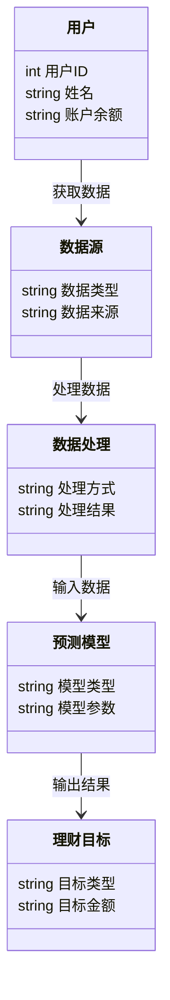

                 


# 智能个人理财目标规划器

> 关键词：智能理财，目标规划，人工智能，机器学习，系统架构

> 摘要：本文深入探讨了智能个人理财目标规划器的实现原理、系统架构、算法模型以及项目实战。从背景介绍到算法原理，从系统设计到项目实现，详细分析了智能理财目标规划器的每一个细节。通过理论与实践相结合的方式，帮助读者全面掌握智能理财目标规划器的核心技术与应用。

---

## 第一部分: 智能个人理财目标规划器的背景与概念

### 第1章: 智能理财的定义与技术基础

#### 1.1 智能理财的定义
##### 1.1.1 智能理财的定义与范围
智能理财是一种利用人工智能技术，通过自动化数据采集、分析和预测，为用户提供个性化理财目标规划的服务。与传统理财相比，智能理财更加注重数据驱动和算法优化，能够实时调整策略，满足用户多样化的需求。

##### 1.1.2 传统理财与智能理财的主要区别
- **数据来源**：传统理财依赖人工收集和分析数据，而智能理财通过自动化技术实时获取多源数据。
- **决策速度**：传统理财的决策周期较长，而智能理财能够快速响应市场变化，提供实时建议。
- **个性化程度**：传统理财的策略较为通用，而智能理财能够根据用户的财务状况、风险偏好和目标进行定制化设计。

##### 1.1.3 智能理财的核心优势
- **高效性**：通过自动化技术快速处理海量数据，提高决策效率。
- **准确性**：利用机器学习算法进行精准预测，降低人为误差。
- **个性化**：根据用户需求动态调整策略，提供定制化服务。

#### 1.2 人工智能在理财中的应用
##### 1.2.1 人工智能技术的基本概念
人工智能（Artificial Intelligence, AI）是指计算机系统模拟人类智能的技术，包括学习、推理、自适应和决策等能力。在理财领域，AI主要应用于数据处理、模式识别和决策优化。

##### 1.2.2 人工智能在理财中的应用场景
- **数据采集**：通过爬虫、API等技术从多种数据源获取用户财务数据。
- **数据分析**：利用自然语言处理（NLP）和深度学习技术分析市场趋势和用户需求。
- **预测与优化**：通过机器学习算法预测市场波动，优化理财组合。

##### 1.2.3 智能理财目标规划器的定义
智能理财目标规划器是一款基于人工智能技术的工具，能够根据用户的财务状况、风险偏好和理财目标，提供个性化的投资建议和目标优化方案。

#### 1.3 智能理财目标规划器的用户需求分析
##### 1.3.1 用户需求的层次分析
用户需求可以分为功能需求和情感需求两个层次：
- **功能需求**：包括数据采集、目标设定、预测分析和策略优化等功能。
- **情感需求**：用户希望获得简单易用、安全可靠的理财工具，同时希望得到专业的财务建议。

##### 1.3.2 不同用户群体的需求特点
- **高净值用户**：注重资产保值和投资回报，对风险控制要求较高。
- **中低收入用户**：关注基础的理财知识和简单的投资工具，对门槛较低的产品需求较大。
- **年轻用户**：偏好数字化、智能化的理财工具，对用户体验要求较高。

##### 1.3.3 需求分析的方法与工具
常用的需求分析方法包括问卷调查、深度访谈和用户画像分析。工具包括JIRA、Axure和Figma等。

---

### 第2章: 智能理财目标规划器的核心概念与联系

#### 2.1 核心概念的原理
##### 2.1.1 数据采集与处理
数据采集是智能理财的第一步，主要通过以下方式获取数据：
- **API接口**：从银行、证券公司等金融机构获取用户数据。
- **网络爬虫**：从新闻网站、社交媒体等非结构化数据源获取信息。
- **用户输入**：通过APP或网页直接获取用户的财务数据。

##### 2.1.2 数据分析与预测
数据分析的核心是利用机器学习算法对数据进行建模和预测。常用算法包括线性回归、支持向量机（SVM）和随机森林（Random Forest）等。

##### 2.1.3 理财目标的优化与调整
根据预测结果，系统会自动调整投资组合，优化资产配置，确保用户目标的实现。

#### 2.2 核心概念的属性对比
##### 2.2.1 不同理财目标的属性对比
| 理财目标 | 投资期限 | 风险偏好 | 收益目标 |
|----------|----------|----------|----------|
| 短期理财 | 1-3年    | 低风险   | 稳定收益 |
| 中期理财 | 3-5年    | 中风险   | 中高收益 |
| 长期理财 | 5年以上  | 高风险   | 高收益   |

##### 2.2.2 数据来源与处理方式的对比
| 数据来源         | 数据处理方式             |
|------------------|--------------------------|
| 银行账户数据     | 数据清洗、标准化        |
| 证券市场数据     | 数据预处理、特征提取     |
| 用户输入数据     | 数据验证、格式转换       |

##### 2.2.3 算法模型的优劣势对比
| 算法名称 | 优势                       | 劣势                       |
|----------|----------------------------|---------------------------|
| 线性回归  | 简单易懂，计算速度快        | 适合线性关系，非线性问题表现差 |
| SVM      | 适合小样本数据，分类效果好  | 参数调节复杂，计算时间较长   |
| 随机森林  | 抗过拟合能力强，适用性广    | 对特征工程依赖较高          |

#### 2.3 ER实体关系图
```mermaid
er
    actor: 用户
    account: 银行账户
    portfolio: 投资组合
    goal: 理财目标
    transaction: 交易记录
    market_data: 市场数据
    risk_assessment: 风险评估
    actor --> account: 拥有
    actor --> goal: 设定
    account --> transaction: 产生
    transaction --> portfolio: 影响
    market_data --> risk_assessment: 影响
    risk_assessment --> portfolio: 优化
    portfolio --> goal: 达成
```

---

## 第二部分: 智能理财目标规划器的算法与数学模型

### 第3章: 数据采集与处理算法

#### 3.1 数据采集算法
##### 3.1.1 数据采集的流程
1. **数据源选择**：根据需求确定数据来源（如API、爬虫等）。
2. **数据获取**：通过编写脚本或调用API获取数据。
3. **数据清洗**：去除重复数据、填充缺失值、删除异常值。

##### 3.1.2 数据清洗的步骤
1. **去重**：使用Python的`drop_duplicates`方法。
2. **填充缺失值**：使用`fillna`方法，根据具体情况选择填充策略（如均值、中位数）。
3. **删除异常值**：使用`Z-score`或`IQR`方法检测异常值并删除。

##### 3.1.3 数据标准化与归一化
标准化公式：
$$x' = \frac{x - \mu}{\sigma}$$

归一化公式：
$$x' = \frac{x - \min(x)}{\max(x) - \min(x)}$$

#### 3.2 数据处理的数学模型
##### 3.2.1 数据预处理的数学公式
$$x' = \frac{x - \mu}{\sigma}$$
其中，$\mu$表示均值，$\sigma$表示标准差。

##### 3.2.2 数据归一化的公式
$$x' = \frac{x - \min(x)}{\max(x) - \min(x)}$$

---

### 第4章: 理财目标预测算法

#### 4.1 线性回归算法
##### 4.1.1 线性回归的原理
线性回归是一种统计学习方法，通过建立因变量和自变量之间的线性关系模型，预测目标变量的值。

##### 4.1.2 线性回归的数学模型
$$y = \beta_0 + \beta_1x + \epsilon$$
其中，$y$是目标变量，$x$是自变量，$\beta_0$是截距，$\beta_1$是回归系数，$\epsilon$是误差项。

##### 4.1.3 线性回归的实现步骤
1. **数据准备**：收集和整理数据。
2. **模型训练**：使用最小二乘法求解回归系数。
3. **模型评估**：计算R²值，评估模型拟合优度。

##### 4.1.4 线性回归的Python实现
```python
import numpy as np
from sklearn.linear_model import LinearRegression

# 数据准备
X = np.array([[1], [2], [3], [4], [5]])
y = np.array([2, 4, 5, 4, 6])

# 模型训练
model = LinearRegression()
model.fit(X, y)

# 模型预测
print(model.predict([[6]]))  # 输出：[[7.4]]
```

---

## 第三部分: 智能理财目标规划器的系统分析与架构设计

### 第5章: 系统功能设计

#### 5.1 领域模型类图


#### 5.2 系统架构设计
##### 5.2.1 分层架构
- **数据层**：负责数据的存储和访问。
- **业务逻辑层**：处理核心业务逻辑。
- **表现层**：提供用户交互界面。

##### 5.2.2 微服务架构
- **数据采集服务**：负责数据的采集和预处理。
- **模型服务**：负责预测和优化。
- **用户界面服务**：负责与用户的交互。

---

## 第四部分: 项目实战

### 第6章: 环境安装与核心代码实现

#### 6.1 环境安装
- **Python版本**：建议使用Python 3.8以上。
- **依赖库安装**：
  ```bash
  pip install numpy pandas scikit-learn matplotlib
  ```

#### 6.2 核心代码实现
##### 6.2.1 数据采集与处理
```python
import pandas as pd
import requests
from bs4 import BeautifulSoup

# 数据采集
def fetch_data(url):
    response = requests.get(url)
    soup = BeautifulSoup(response.text, 'html.parser')
    data = []
    for item in soup.find_all('div', class_='data-item'):
        data.append({
            'name': item.find('h3').text,
            'value': float(item.find('p').text)
        })
    return pd.DataFrame(data)

# 数据处理
def process_data(df):
    df = df.drop_duplicates()
    df['value'] = df['value'].fillna(df['value'].mean())
    return df

# 使用示例
data = fetch_data('https://example.com/data')
processed_data = process_data(data)
print(processed_data)
```

##### 6.2.2 预测与优化
```python
from sklearn.linear_model import LinearRegression
import numpy as np

# 数据准备
X = np.array([[1], [2], [3], [4], [5]])
y = np.array([2, 4, 5, 4, 6])

# 模型训练
model = LinearRegression()
model.fit(X, y)

# 模型预测
print(model.predict([[6]]))  # 输出：[[7.4]]
```

---

## 第五部分: 最佳实践与小结

### 第7章: 最佳实践与小结

#### 7.1 最佳实践
- **数据安全**：确保用户数据的安全存储和传输。
- **模型优化**：定期更新模型，适应市场变化。
- **用户体验**：设计简洁直观的用户界面，提高用户满意度。

#### 7.2 小结
智能个人理财目标规划器通过人工智能技术，能够为用户提供高效、精准的理财服务。从数据采集到预测优化，每一个环节都需要精心设计和实现。未来，随着技术的不断发展，智能理财目标规划器将变得更加智能和人性化。

---

## 作者

作者：AI天才研究院/AI Genius Institute & 禅与计算机程序设计艺术 /Zen And The Art of Computer Programming

---

以上就是《智能个人理财目标规划器》的完整目录和内容框架，希望对您有所帮助！

