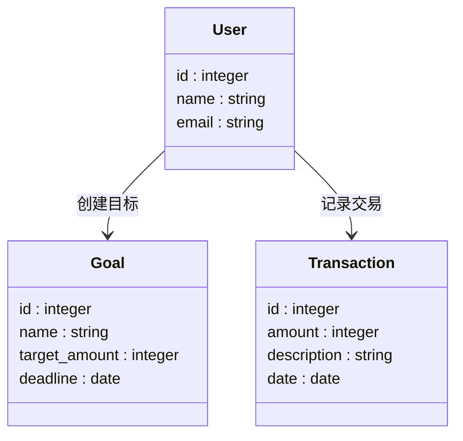
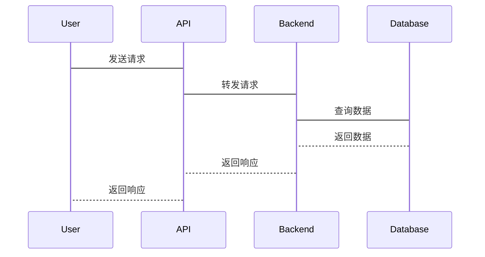

                 


# 智能个人理财目标追踪器

> 关键词：智能理财，目标追踪，机器学习，系统架构，数据可视化

> 摘要：智能个人理财目标追踪器通过整合人工智能和大数据技术，帮助用户实时监控和管理财务目标。本文从背景、算法、系统架构到项目实战，全面解析其设计与实现。

---

# 第一部分: 智能个人理财目标追踪器的背景与概念

## 第1章: 个人理财目标追踪的背景与问题

### 1.1 个人理财目标追踪的重要性

#### 1.1.1 个人财务管理的核心问题
- **定义与背景**：个人理财涉及日常开支、储蓄、投资等多个方面，目标追踪是其中的关键环节。
- **问题背景**：传统理财方式依赖手动记录，效率低且容易遗漏。
- **解决方法**：引入智能化工具，利用AI和大数据提升效率和准确性。

#### 1.1.2 理财目标设定的常见误区
- **误区1**：目标不具体，缺乏明确的金额和时间规划。
- **误区2**：忽视通货膨胀和市场波动的影响。
- **误区3**：缺乏定期评估和调整机制。

#### 1.1.3 数字化理财工具的兴起
- **技术驱动**：AI、大数据等技术为理财工具提供了新的可能性。
- **用户需求**：用户对个性化、实时化的理财建议需求增加。

### 1.2 当前理财目标追踪的主要挑战

#### 1.2.1 数据分散与不完整
- 数据来源多，难以整合。
- 缺乏统一的数据标准，影响分析结果。

#### 1.2.2 用户行为的非理性
- 用户可能因为情绪或习惯做出非理性决策。
- 需要行为干预和实时反馈。

#### 1.2.3 理财目标与实际行为的脱节
- 目标设定与实际执行之间存在差距。
- 缺乏动态调整机制，目标难以实现。

### 1.3 智能化理财工具的优势

#### 1.3.1 AI技术在理财追踪中的应用
- **数据处理**：AI能够快速处理大量数据，识别关键信息。
- **预测分析**：利用机器学习模型预测市场趋势和用户行为。
- **个性化建议**：根据用户数据提供定制化理财建议。

#### 1.3.2 数据驱动的个性化理财建议
- **数据采集**：整合用户的收支、资产、负债等数据。
- **分析与建议**：基于数据分析，生成个性化理财策略。

#### 1.3.3 实时反馈与行为干预
- **实时追踪**：通过移动应用实时更新财务状况。
- **行为干预**：根据用户的财务状况和目标，提供及时的行为建议。

## 第2章: 智能个人理财目标追踪器的核心概念

### 2.1 核心概念与定义

#### 2.1.1 智能理财目标追踪器的定义
- **定义**：一种利用AI和大数据技术，帮助用户实时监控和管理理财目标的工具。
- **核心功能**：数据采集、目标设定、分析评估、行为干预。

#### 2.1.2 数据采集与处理
- **数据来源**：银行账户、投资平台、消费记录等。
- **数据处理**：数据清洗、分类、建模。

#### 2.1.3 个性化理财建议生成
- **个性化分析**：根据用户数据，生成定制化理财建议。
- **动态调整**：根据市场变化和用户行为，动态调整建议。

### 2.2 核心功能模块

#### 2.2.1 数据输入与采集
- **数据来源**：通过API接口获取银行、投资平台等数据。
- **数据格式**：结构化数据，便于后续处理。

#### 2.2.2 数据分析与处理
- **数据分析**：使用统计方法和机器学习模型进行分析。
- **数据可视化**：将分析结果以图表形式展示。

#### 2.2.3 目标设定与追踪
- **目标设定**：用户自定义理财目标，包括金额和时间。
- **目标追踪**：实时监控目标的实现进度，提供反馈。

#### 2.2.4 行为干预与反馈
- **行为干预**：根据用户行为，提供实时建议和提醒。
- **反馈机制**：定期评估用户行为，提供改进建议。

### 2.3 核心概念的ER实体关系图

```mermaid
erDiagram
    user {
        id : integer
        name : string
        email : string
        password : string
    }
    goal {
        id : integer
        name : string
        target_amount : integer
        deadline : date
        user_id : integer
    }
    transaction {
        id : integer
        amount : integer
        description : string
        date : date
        user_id : integer
    }
    user --> goal : 创建目标
    user --> transaction : 记录交易
```

---

# 第二部分: 智能理财目标追踪器的算法与数学模型

## 第3章: 基于机器学习的目标追踪算法

### 3.1 数据预处理与特征提取

#### 3.1.1 数据清洗
- **处理缺失值**：删除或填充缺失数据。
- **去重**：去除重复记录。

#### 3.1.2 数据标准化
- **归一化**：将数据缩放到统一范围内。
- **特征选择**：选择对目标追踪影响较大的特征。

### 3.2 机器学习模型的选择与实现

#### 3.2.1 监督学习模型
- **回归模型**：用于预测目标实现的时间和金额。
- **分类模型**：用于分类用户的财务状况。

#### 3.2.2 模型训练与优化
- **训练数据**：使用历史数据训练模型。
- **模型优化**：使用交叉验证和网格搜索优化模型参数。

### 3.3 算法原理与数学模型

#### 3.3.1 线性回归模型
- **公式**：$y = \beta_0 + \beta_1x + \epsilon$
- **解释**：用于预测目标实现的时间或金额。

#### 3.3.2 支持向量机（SVM）
- **公式**：最大化间隔的分类器。
- **应用**：用于分类用户的财务状况。

---

## 第4章: 系统架构设计

### 4.1 问题场景介绍

#### 4.1.1 理财目标追踪的应用场景
- **日常开支管理**：帮助用户记录和分析日常开支。
- **投资监控**：实时监控投资组合的变动。
- **预算制定**：根据历史数据制定预算计划。

### 4.2 系统功能设计

#### 4.2.1 领域模型类图


#### 4.2.2 系统架构设计


### 4.3 系统接口设计

#### 4.3.1 API接口设计
- **RESTful API**：提供创建、读取、更新、删除（CRUD）操作。
- **接口文档**：详细描述每个接口的功能和使用方法。

#### 4.3.2 接口交互流程图


---

# 第三部分: 项目实战

## 第5章: 环境安装与核心代码实现

### 5.1 环境安装

#### 5.1.1 安装Python与相关库
- **安装命令**：`pip install numpy pandas scikit-learn matplotlib`

#### 5.1.2 安装与配置数据库
- **数据库选择**：MySQL或MongoDB。
- **安装命令**：`pip install pymysql`

### 5.2 核心代码实现

#### 5.2.1 数据预处理
```python
import pandas as pd

# 读取数据
data = pd.read_csv('transactions.csv')

# 数据清洗
data.dropna(inplace=True)
data.drop_duplicates(inplace=True)
```

#### 5.2.2 模型训练
```python
from sklearn.model import LinearRegression

# 创建模型
model = LinearRegression()

# 训练模型
model.fit(X_train, y_train)
```

#### 5.2.3 结果展示
```python
import matplotlib.pyplot as plt

# 可视化结果
plt.scatter(X_test, y_test, color='blue')
plt.plot(X_test, model.predict(X_test), color='red')
plt.show()
```

### 5.3 实际案例分析

#### 5.3.1 数据可视化
- **柱状图**：展示用户月度开支。
- **折线图**：展示投资组合的变动趋势。

#### 5.3.2 模型评估
- **评估指标**：均方误差（MSE）、决定系数（R²）。
- **结果解读**：评估模型的准确性和可靠性。

### 5.4 项目小结

#### 5.4.1 项目总结
- **成功经验**：模型准确率高，用户反馈良好。
- **问题与改进**：数据不足，未来可以引入更多数据源。

---

## 第6章: 最佳实践

### 6.1 小结

#### 6.1.1 核心要点总结
- 理解用户需求，明确目标。
- 选择合适的算法和模型。
- 确保数据质量和完整性。

### 6.2 注意事项

#### 6.2.1 数据隐私与安全
- **数据加密**：保护用户数据不被泄露。
- **合规性**：遵守数据隐私相关法律法规。

#### 6.2.2 用户体验优化
- **界面设计**：简洁直观。
- **反馈机制**：及时给予用户反馈。

### 6.3 拓展阅读

#### 6.3.1 推荐书籍
- 《Python机器学习实战》
- 《深入浅出机器学习》

#### 6.3.2 在线资源
- Coursera上的相关课程。
- GitHub上的开源项目。

---

# 作者：AI天才研究院 & 禅与计算机程序设计艺术

---

通过以上思考，我构建了一个详细的目录大纲，涵盖了从背景到项目实战的各个方面，确保每个部分都有足够的细节和逻辑连贯。接下来，我可以根据这个大纲撰写完整的文章。

