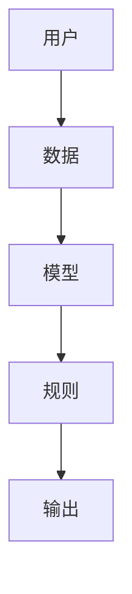
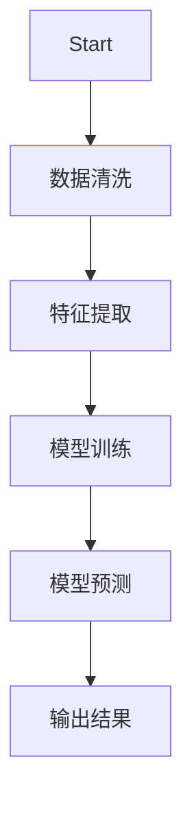
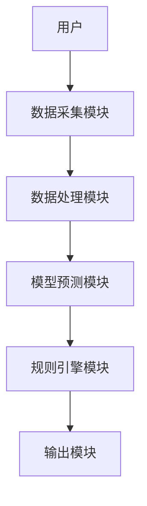
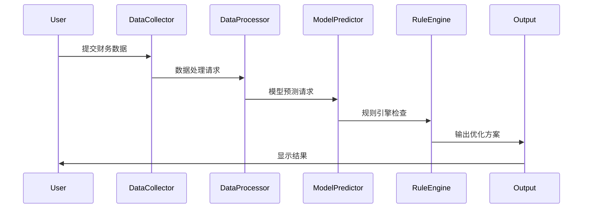

                 


# 智能个人税务筹划助手

> 关键词：智能税务筹划、人工智能、大数据分析、机器学习、税务优化、合规性

> 摘要：随着人工智能和大数据技术的快速发展，智能个人税务筹划助手逐渐成为个人和企业优化税务管理的重要工具。本文将详细探讨智能税务筹划助手的核心概念、算法原理、系统设计、项目实战以及最佳实践，帮助读者全面理解如何利用智能技术实现高效的税务管理。

---

## 第一部分: 智能个人税务筹划助手的背景与概念

### 第1章: 背景介绍

#### 1.1 智能税务筹划的背景
- **1.1.1 传统税务筹划的局限性**  
  传统的税务筹划依赖于人工计算和经验判断，效率低、误差大，且难以应对复杂的税法变化。随着经济全球化和税收政策的复杂化，传统的税务管理方式已无法满足现代企业的需求。

- **1.1.2 数字化与智能化时代的税务需求**  
  在数字化转型的背景下，企业和个人对税务管理的智能化、自动化需求日益增长。智能化税务筹划能够实时分析海量数据，提供精准的税务优化建议。

- **1.1.3 智能个人税务筹划的兴起**  
  智能税务筹划借助人工智能和大数据技术，通过自动化数据处理和模型预测，为个人和企业提供个性化的税务优化方案，帮助用户在合法合规的前提下实现税务最小化。

#### 1.2 智能税务筹划助手的核心概念
- **1.2.1 问题背景与问题描述**  
  税务筹划的核心问题是如何在合法合规的前提下，优化纳税人的税务负担。智能税务筹划助手通过分析纳税人的财务数据、收入结构、支出情况等，提供个性化的税务优化建议。

- **1.2.2 问题解决的思路与方法**  
  智能税务筹划助手通过数据采集、模型训练、规则引擎等技术，结合税法知识库，为用户提供最优的税务筹划方案。

- **1.2.3 智能税务筹划的边界与外延**  
  智能税务筹划的边界在于合法合规的前提下优化税务负担，外延则包括税务预测、税务申报、税务风险预警等功能。

- **1.2.4 核心要素与概念结构**  
  核心要素包括数据采集、模型训练、规则引擎、结果输出等。

#### 1.3 智能税务筹划助手的技术基础
- **1.3.1 人工智能与大数据技术**  
  智能税务筹划助手依赖于人工智能（AI）和大数据技术，用于数据处理、模式识别和预测分析。

- **1.3.2 自然语言处理与知识图谱**  
  通过自然语言处理（NLP）技术，智能税务助手能够理解税法文本和财务报表，构建知识图谱以支持智能决策。

- **1.3.3 机器学习与预测模型**  
  机器学习算法用于训练预测模型，帮助智能税务助手实现税务优化建议的生成。

#### 1.4 智能税务筹划的法律与合规性
- **1.4.1 税务法规的基本原则**  
  税务筹划必须遵守相关法律法规，确保合法性、合规性。

- **1.4.2 智能税务助手的合规性要求**  
  智能税务助手的设计和运行必须符合税法规定，避免税务风险。

- **1.4.3 数据隐私与安全保护**  
  税务数据涉及个人隐私和企业机密，智能税务助手必须具备严格的数据加密和访问控制机制。

#### 1.5 本章小结
本章从背景、核心概念、技术基础和法律合规性等方面介绍了智能税务筹划助手的基本情况，为后续章节的深入分析奠定了基础。

---

## 第二部分: 智能税务筹划助手的核心概念与联系

### 第2章: 核心概念与原理

#### 2.1 智能税务助手的核心原理
- **2.1.1 数据处理与特征提取**  
  数据处理是智能税务筹划的第一步，包括数据清洗、格式化和特征提取。特征提取的目标是从海量数据中提取与税务优化相关的关键特征。

- **2.1.2 模型训练与优化**  
  通过机器学习算法训练模型，优化模型参数以提高预测精度。

- **2.1.3 规则引擎与决策逻辑**  
  规则引擎用于根据预设的税法规则生成决策逻辑，确保税务优化建议的合规性。

#### 2.2 核心概念对比分析
- **2.2.1 数据源与处理方式对比**  
  对比不同数据源的优缺点，分析数据处理方式对模型性能的影响。

- **2.2.2 不同模型的性能对比**  
  对比不同机器学习模型的性能，选择最优模型。

- **2.2.3 规则引擎与机器学习的优劣势对比**  
  规则引擎的优势在于规则明确，机器学习的优势在于灵活性和自适应性。

#### 2.3 核心概念的ER实体关系图


#### 2.4 核心概念的联系与依赖
- **2.4.1 数据与模型的相互作用**  
  数据驱动模型训练，模型反过来影响数据的处理方式。

- **2.4.2 模型与规则的协同工作**  
  模型提供预测结果，规则引擎对结果进行合规性检查。

- **2.4.3 输出结果与用户反馈的闭环关系**  
  输出结果通过用户反馈形成闭环，优化模型和规则引擎。

#### 2.5 本章小结
本章通过核心概念的对比分析和实体关系图，详细阐述了智能税务筹划助手的核心原理和各部分之间的联系。

---

## 第三部分: 智能税务筹划助手的算法原理

### 第3章: 算法原理与实现

#### 3.1 算法原理概述
- **3.1.1 数据预处理与特征提取**  
  数据预处理包括数据清洗、去重和格式化。特征提取是从数据中提取与税务优化相关的特征，如收入来源、支出类别等。

- **3.1.2 模型训练与优化**  
  使用机器学习算法（如随机森林、支持向量机）训练模型，并通过交叉验证优化模型参数。

- **3.1.3 预测与结果解释**  
  模型预测最优税务优化方案，并对结果进行解释，确保合规性。

#### 3.2 算法流程图


#### 3.3 算法实现代码
```python
import pandas as pd
from sklearn.ensemble import RandomForestRegressor
from sklearn.model_selection import train_test_split
from sklearn.metrics import mean_squared_error

# 数据加载与预处理
data = pd.read_csv('tax_data.csv')
X = data.drop('tax', axis=1)
y = data['tax']

# 数据分割
X_train, X_test, y_train, y_test = train_test_split(X, y, test_size=0.2, random_state=42)

# 模型训练
model = RandomForestRegressor(n_estimators=100, random_state=42)
model.fit(X_train, y_train)

# 模型预测
y_pred = model.predict(X_test)

# 模型评估
mse = mean_squared_error(y_test, y_pred)
print(f"均方误差：{mse}")
```

#### 3.4 数学模型与公式
- **3.4.1 概率模型**  
  $$P(y|x) = \text{概率模型}$$

- **3.4.2 优化模型**  
  $$\text{目标函数} = \sum_{i=1}^{n} (y_i - \hat{y}_i)^2$$

- **3.4.3 预测模型**  
  $$\hat{y} = f(x)$$

#### 3.5 本章小结
本章通过算法流程图和代码示例，详细介绍了智能税务筹划助手的算法实现过程，包括数据预处理、模型训练和预测评估。

---

## 第四部分: 智能税务筹划助手的系统设计

### 第4章: 系统分析与架构设计

#### 4.1 系统功能设计
- **4.1.1 数据采集模块**  
  负责采集用户的财务数据，包括收入、支出、资产等。

- **4.1.2 数据处理模块**  
  对采集到的数据进行清洗、转换和特征提取。

- **4.1.3 模型预测模块**  
  使用机器学习模型预测最优税务优化方案。

- **4.1.4 规则引擎模块**  
  根据预设的税法规则对预测结果进行合规性检查。

- **4.1.5 输出模块**  
  输出优化方案并提供结果解释。

#### 4.2 系统架构设计


#### 4.3 系统交互设计


#### 4.4 本章小结
本章通过系统功能设计和架构图，详细描述了智能税务筹划助手的系统结构和交互流程。

---

## 第五部分: 智能税务筹划助手的项目实战

### 第5章: 项目实战与案例分析

#### 5.1 环境安装与配置
- 安装Python、机器学习库（如scikit-learn、xgboost）和数据处理库（如pandas、numpy）。

#### 5.2 核心代码实现
```python
import pandas as pd
from sklearn.ensemble import RandomForestClassifier
from sklearn.metrics import accuracy_score

# 数据加载
data = pd.read_csv('tax_data.csv')

# 特征选择
features = data.drop('label', axis=1)
label = data['label']

# 数据分割
X_train, X_test, y_train, y_test = train_test_split(features, label, test_size=0.2, random_state=42)

# 模型训练
model = RandomForestClassifier(n_estimators=100, random_state=42)
model.fit(X_train, y_train)

# 模型预测
y_pred = model.predict(X_test)

# 模型评估
accuracy = accuracy_score(y_test, y_pred)
print(f"准确率：{accuracy}")
```

#### 5.3 案例分析与解读
- **案例背景**  
  某企业年收入为1000万元，支出主要包括 salaries, rent, utilities 等。

- **模型预测**  
  模型预测最佳税务优化方案为将部分支出计入下一个财政年度，以减少当前纳税年度的应纳税所得额。

- **结果解释**  
  该优化方案预计可使企业当前年度的应纳税所得额减少15%，降低税务负担。

#### 5.4 本章小结
本章通过实际案例分析，展示了智能税务筹划助手在实际应用中的价值和效果。

---

## 第六部分: 智能税务筹划助手的最佳实践

### 第6章: 最佳实践与注意事项

#### 6.1 最佳实践
- **数据质量**  
  确保数据的准确性和完整性，数据预处理是关键。

- **模型选择**  
  根据具体场景选择合适的机器学习模型，并进行充分的模型调优。

- **规则引擎**  
  定期更新税法规则库，确保规则引擎的合规性。

- **数据安全**  
  严格控制数据访问权限，确保数据隐私和安全。

#### 6.2 小结
智能税务筹划助手的成功应用依赖于高质量的数据、合理的模型选择和严格的合规性管理。

#### 6.3 注意事项
- 避免过度依赖模型预测，结合人工审核确保合规性。
- 定期更新模型和规则引擎，适应税法变化。
- 注意数据隐私保护，避免数据泄露风险。

#### 6.4 拓展阅读
- 推荐阅读《机器学习实战》、《税法实务与税务优化》等书籍。

#### 6.5 本章小结
本章总结了智能税务筹划助手的最佳实践、注意事项和拓展阅读内容，为读者提供了实用的指导。

---

## 作者信息

作者：AI天才研究院/AI Genius Institute & 禅与计算机程序设计艺术/Zen And The Art of Computer Programming

