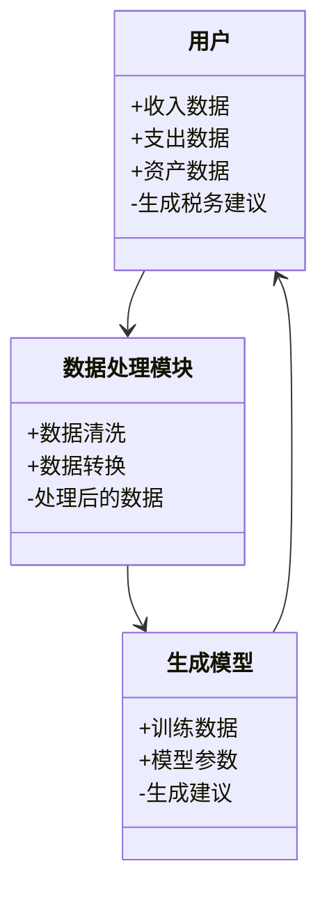

                 


# 《智能个人税务筹划建议生成器》

## 关键词：智能税务筹划、生成器、AI技术、税务优化、个人财务规划

## 摘要：  
随着人工智能技术的快速发展，智能个人税务筹划建议生成器成为了一种新兴的解决方案，旨在通过AI技术帮助个人优化税务规划，降低税务负担。本文将从背景、核心概念、算法原理、系统架构、项目实战等方面，详细分析智能个人税务筹划建议生成器的构建过程，并结合实际案例，探讨其在个人财务管理中的应用前景。

---

# 第1章 智能个人税务筹划建议生成器的背景与核心概念

## 1.1 智能税务筹划的背景

### 1.1.1 税务筹划的基本概念  
税务筹划是指通过合理规划个人或企业的财务行为，以最小化税务负担的过程。在个人财务管理中，税务筹划尤为重要，因为个税、社保、投资收益等都与个人的税务负担直接相关。  

### 1.1.2 传统税务筹划的痛点  
传统的税务筹划依赖于人工计算和经验判断，存在以下问题：  
1. **效率低**：手动计算复杂，耗时且容易出错。  
2. **信息不全**：难以全面考虑所有可能的税务影响因素。  
3. **缺乏个性化**：每个人的收入结构、资产配置不同，需要个性化的筹划方案。  

### 1.1.3 AI技术在税务领域的应用趋势  
人工智能技术的快速发展为税务筹划带来了新的可能性。通过AI技术，可以实现自动化、智能化的税务优化，帮助个人更高效地制定税务筹划方案。

---

## 1.2 个人税务筹划的核心问题

### 1.2.1 个人税务筹划的关键要素  
个人税务筹划的核心要素包括：  
1. **收入来源**：工资、奖金、投资收益等。  
2. **支出结构**：房贷、车贷、教育支出等。  
3. **资产配置**：房产、股票、基金等。  
4. **税务政策**：个税税率、社保缴纳比例等。  

### 1.2.2 税务筹划的法律与合规性挑战  
税务筹划必须在法律框架内进行，避免触犯逃税、避税等违法行为。合规性是税务筹划的核心要求，AI生成器需要确保建议的合法性。

### 1.2.3 个性化需求与效率的平衡  
每个人的财务状况和需求不同，税务筹划需要兼顾个性化和效率。AI技术可以通过数据驱动的方式，快速生成个性化的税务优化方案。

---

## 1.3 智能生成器的解决方案

### 1.3.1 问题背景与目标  
智能生成器的目标是通过AI技术，快速生成个性化的税务筹划建议，帮助个人优化税务负担。  

### 1.3.2 智能生成器的核心功能  
1. 数据采集与分析：收集用户的收入、支出、资产等数据，进行分析。  
2. 模型训练：基于历史数据和税务政策，训练生成模型。  
3. 建议生成：根据用户数据和模型，生成税务优化建议。  

### 1.3.3 边界与外延  
智能生成器仅提供税务优化建议，不涉及具体的法律咨询。用户需结合实际情况和专业税务顾问的意见，最终决策。

---

## 1.4 核心概念与联系

### 1.4.1 核心概念的原理  
智能生成器的核心原理是基于机器学习的生成模型，通过数据训练生成个性化的税务优化方案。  

### 1.4.2 核心概念的属性特征对比表  
| 概念 | 属性 | 描述 |
|------|------|------|
| 数据来源 | 多样性 | 包括收入、支出、资产等 |
| 模型类型 | 复杂性 | 基于深度学习的生成模型 |
| 生成结果 | 个性化 | 针对个人具体情况生成建议 |

### 1.4.3 实体关系图  


---

## 1.5 本章小结  
本章介绍了智能个人税务筹划建议生成器的背景、核心概念和解决方案，为后续章节的深入分析奠定了基础。

---

# 第2章 智能生成器的核心算法与数学模型

## 2.1 生成模型的算法原理

### 2.1.1 基于概率论的生成模型  
生成模型的核心是通过概率分布来模拟税务优化方案的生成过程。  

### 2.1.2 基于优化的生成算法  
优化算法通过最大化目标函数，找到最优的税务筹划方案。  

### 2.1.3 深度学习中的生成对抗网络（GAN）  
生成对抗网络通过生成器和判别器的对抗训练，生成逼真的税务优化方案。  

---

## 2.2 数学模型与公式

### 2.2.1 概率分布模型  
$$P(x) = \frac{1}{Z} \cdot e^{-x}$$  
其中，$Z$ 是归一化常数。

### 2.2.2 损失函数  
$$L = -\log(P(x))$$  
通过最小化损失函数，优化生成模型的参数。  

---

## 2.3 生成模型的实现流程  


---

## 2.4 本章小结  
本章详细介绍了智能生成器的核心算法和数学模型，为后续的系统设计和项目实现提供了理论基础。

---

# 第3章 智能生成器的系统分析与架构设计

## 3.1 问题场景介绍  
智能生成器的目标是为用户提供个性化的税务优化建议。系统需要处理大量的财务数据，并结合税务政策，生成最优方案。

## 3.2 系统功能设计

### 3.2.1 领域模型  


### 3.2.2 系统架构  


---

## 3.3 接口设计与交互流程图  

```mermaid
sequenceDiagram
用户->+> 前端界面: 提交数据
前端界面->+> 后端服务: 请求生成建议
后端服务->+> 生成模型: 训练模型
生成模型->+> 数据库: 存储结果
生成模型->+> 后端服务: 返回建议
后端服务->+> 前端界面: 显示结果
前端界面->+> 用户: 展示税务建议
```

---

## 3.4 本章小结  
本章通过系统分析与架构设计，明确了智能生成器的实现路径。

---

# 第4章 智能生成器的项目实战

## 4.1 环境安装与配置

### 4.1.1 安装Python环境  
```bash
pip install python3
pip install numpy
pip install tensorflow
pip install scikit-learn
```

### 4.1.2 安装其他依赖  
```bash
pip install jupyter
pip install pandas
pip install matplotlib
```

---

## 4.2 核心代码实现

### 4.2.1 数据预处理  
```python
import pandas as pd

# 读取数据
data = pd.read_csv('tax_data.csv')

# 数据清洗
data.dropna(inplace=True)
data['收入'] = data['收入'].astype(int)
```

### 4.2.2 模型训练  
```python
import tensorflow as tf
from tensorflow.keras import layers

# 定义生成模型
def build_generator():
    model = tf.keras.Sequential()
    model.add(layers.Dense(64, activation='relu', input_shape=(10,)))
    model.add(layers.Dense(1, activation='sigmoid'))
    return model

# 编译模型
generator = build_generator()
generator.compile(optimizer='adam', loss='binary_crossentropy')
```

---

## 4.3 实际案例分析  
以一个年收入50万元的用户为例，生成器可以根据其收入、支出、资产等情况，生成个性化的税务优化建议，例如：  
1. 合理分配社保缴纳比例。  
2. 优化投资收益的税务负担。  

---

## 4.4 本章小结  
本章通过实际案例和代码实现，展示了智能生成器的具体应用过程。

---

# 第5章 总结与展望

## 5.1 最佳实践tips  
1. 数据质量是生成器性能的关键，确保输入数据的准确性和完整性。  
2. 定期更新模型，以适应税务政策的变化。  

## 5.2 小结  
智能生成器通过AI技术，为个人税务筹划提供了高效、个性化的解决方案。  

## 5.3 注意事项  
1. 税务政策具有地域性，建议结合当地政策使用。  
2. 系统需遵守相关法律法规，确保建议的合规性。  

## 5.4 拓展阅读  
1. 《机器学习实战》  
2. 《深度学习导论》  
3. 《税务筹划实务》  

---

# 作者：AI天才研究院/AI Genius Institute & 禅与计算机程序设计艺术/Zen And The Art of Computer Programming

