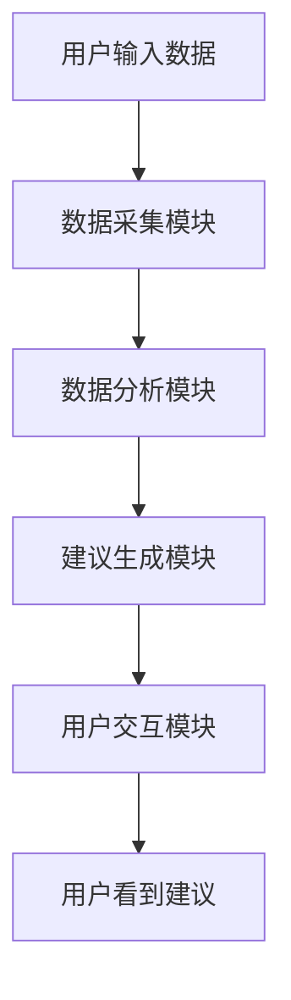

                 


# 智能个人税务筹划模拟器

> 关键词：智能税务，AI算法，数据驱动，系统架构，项目实战

> 摘要：本文系统地介绍了智能个人税务筹划模拟器的设计与实现，从背景需求分析到系统架构设计，再到项目实战，详细阐述了如何利用人工智能技术解决个人税务筹划问题。通过数据驱动的方法，结合机器学习算法，构建高效的税务模拟器，帮助用户优化税务策略，降低税务负担。

---

# 第一部分: 背景介绍与核心概念

# 第1章: 问题背景与需求分析

## 1.1 个人税务筹划的重要性

### 1.1.1 税务筹划的基本概念

税务筹划是通过合法手段优化税务负担，提高个人或企业的净收益。它包括收入优化、支出合理化、税务优惠利用等方面。

### 1.1.2 传统税务筹划的局限性

传统税务筹划依赖人工计算和经验判断，存在效率低、覆盖面窄、难以应对复杂税务政策等问题。

### 1.1.3 智能化税务筹划的需求

随着税务政策的复杂化和个人财务需求的多样化，智能化税务筹划成为迫切需求。

## 1.2 智能税务模拟器的目标

### 1.2.1 自动化数据处理

通过AI技术自动收集和处理税务相关数据，减少人工操作。

### 1.2.2 个性化建议

基于用户数据和税务政策，提供个性化税务优化建议。

### 1.2.3 实时更新

根据最新的税务政策和用户数据变化，实时更新建议。

---

# 第2章: 核心概念与系统架构

## 2.1 核心概念解析

### 2.1.1 数据驱动的税务分析

数据驱动的税务分析是基于大量历史数据和实时数据，利用AI算法进行预测和优化。

### 2.1.2 AI算法在税务模拟中的作用

AI算法（如机器学习、自然语言处理）用于分析税务政策、预测税务负担、优化税务策略。

### 2.1.3 模拟器的功能边界

智能税务模拟器仅提供优化建议，不直接处理税务申报，避免法律风险。

## 2.2 实体关系图

以下是税务模拟器的核心实体关系图：

```mermaid
erDiagram
    user {
        id INT AUTO
        username VARCHAR
        password VARCHAR
    }
    tax_data {
        id INT AUTO
        income DECIMAL
        expenses DECIMAL
        deductions DECIMAL
        tax_due DECIMAL
    }
    tax_policy {
        id INT AUTO
        policy_name VARCHAR
        policy_description TEXT
        effective_date DATE
    }
    recommendation {
        id INT AUTO
        user_id INT
        tax_policy_id INT
        suggestion TEXT
        timestamp DATETIME
    }
    user "1..n" recommendation
    tax_data "1..n" recommendation
    tax_policy "1..n" recommendation
```

---

# 第3章: 算法原理与实现

## 3.1 选择合适的AI算法

### 3.1.1 分类算法

用于判断税务优惠政策的适用性。

### 3.1.2 回归算法

用于预测税务负担。

### 3.1.3 聚类算法

用于识别税务风险。

## 3.2 算法实现步骤

### 3.2.1 数据预处理

- 数据清洗
- 特征提取

### 3.2.2 模型训练

- 选择算法
- 调参优化

### 3.2.3 模型部署

- API接口设计
- 接口调用

## 3.3 算法实现代码示例

以下是基于随机森林回归算法的Python代码：

```python
import pandas as pd
from sklearn.ensemble import RandomForestRegressor
from sklearn.model_selection import train_test_split
from sklearn.metrics import mean_absolute_error

# 加载数据
data = pd.read_csv('tax_data.csv')

# 数据预处理
X = data.drop('tax_due', axis=1)
y = data['tax_due']

# 划分训练集和测试集
X_train, X_test, y_train, y_test = train_test_split(X, y, test_size=0.2, random_state=42)

# 初始化模型
model = RandomForestRegressor(n_estimators=100, random_state=42)

# 训练模型
model.fit(X_train, y_train)

# 预测
y_pred = model.predict(X_test)

# 评估
mae = mean_absolute_error(y_test, y_pred)
print(f"均绝对误差：{mae}")
```

## 3.4 数学模型

### 3.4.1 线性回归模型

$$ y = \beta_0 + \beta_1x_1 + \beta_2x_2 + \cdots + \beta_nx_n $$

### 3.4.2 随机森林模型

随机森林是一种基于决策树的集成算法，通过组合多个决策树的结果来提高预测精度。

---

# 第4章: 系统分析与架构设计

## 4.1 问题场景描述

### 4.1.1 用户需求

用户需要一个能够实时分析税务数据、提供优化建议的工具。

### 4.1.2 系统需求

系统需要具备数据采集、分析、建议生成和用户交互功能。

## 4.2 系统功能设计

### 4.2.1 功能模块

- 数据采集模块
- 数据分析模块
- 建议生成模块
- 用户交互模块

### 4.2.2 功能流程图



## 4.3 系统架构设计

### 4.3.1 分层架构

- 数据层：存储税务数据和政策
- 业务逻辑层：处理数据和生成建议
- 用户界面层：展示结果和交互

### 4.3.2 系统架构图


---

# 第5章: 项目实战与实现

## 5.1 开发环境安装

### 5.1.1 安装Python

安装Python 3.8以上版本。

### 5.1.2 安装依赖库

安装`pandas`, `scikit-learn`, `matplotlib`等库。

## 5.2 核心代码实现

### 5.2.1 数据采集模块

```python
import pandas as pd

def load_tax_data():
    data = pd.read_csv('tax_data.csv')
    return data
```

### 5.2.2 数据分析模块

```python
from sklearn.ensemble import RandomForestRegressor

def train_model(X, y):
    model = RandomForestRegressor(n_estimators=100)
    model.fit(X, y)
    return model
```

### 5.2.3 建议生成模块

```python
def generate_recommendation(model, new_data):
    prediction = model.predict(new_data)
    return prediction
```

## 5.3 实际案例分析

### 5.3.1 案例背景

某用户年收入10万元，基本扣除96000元，专项扣除20000元。

### 5.3.2 税务计算

年应纳税所得额 = 收入 - 基本扣除 - 专项扣除 = 100000 - 96000 - 20000 = -16000（免征税）

### 5.3.3 系统建议

根据政策，建议增加专项扣除或投资税收优惠产品。

---

# 第6章: 最佳实践与总结

## 6.1 小结

智能个人税务筹划模拟器通过AI技术，显著提高了税务筹划的效率和准确性。

## 6.2 注意事项

- 数据隐私保护
- 税务政策变化
- 算法模型的局限性

## 6.3 拓展阅读

推荐阅读《机器学习实战》和《税务筹划实务》。

---

# 结束语

智能个人税务筹划模拟器的应用前景广阔，随着AI技术的不断发展，税务筹划将更加智能化和个性化。

---

# 作者：AI天才研究院/AI Genius Institute & 禅与计算机程序设计艺术 /Zen And The Art of Computer Programming

