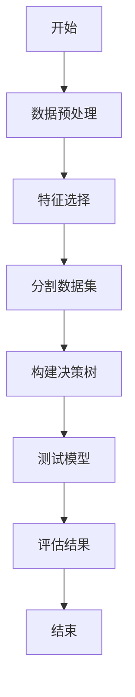
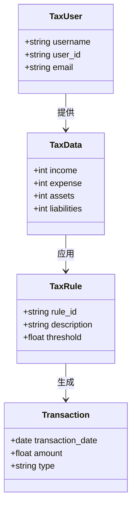
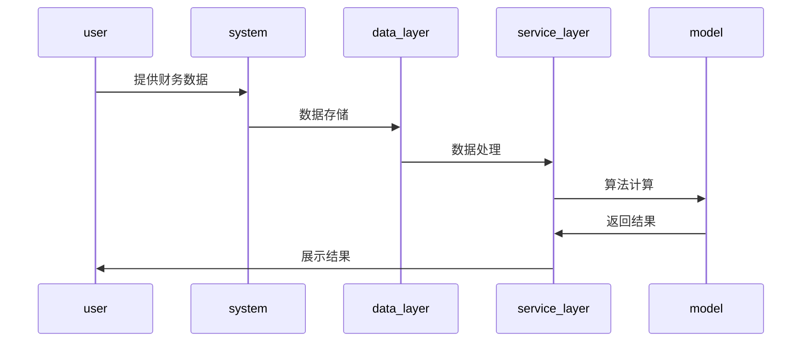

                 


# 智能个人税务筹划模拟平台

## 关键词：智能税务、人工智能、大数据分析、算法优化、税务规划、数据可视化、机器学习

## 摘要：  
本文探讨了智能个人税务筹划模拟平台的设计与实现，利用人工智能和大数据分析技术，构建了一个能够为个人提供智能化、个性化的税务规划工具。文章详细介绍了平台的核心概念、算法原理、系统架构设计以及项目实战，展示了如何通过技术手段优化个人税务筹划流程，帮助用户实现税务优化目标。

---

# 第1章：背景与概述

## 1.1 问题背景与重要性

### 1.1.1 税务筹划的背景与挑战
在现代社会，税务筹划对于个人财务管理至关重要。随着税收政策的复杂化和个人收入来源的多样化，传统的人工税务筹划方式效率低下，难以应对复杂的变化。此外，个人对税务优化的需求日益增长，但缺乏专业的知识和工具，导致许多人无法有效进行税务规划。

### 1.1.2 智能税务筹划的必要性
人工智能（AI）和大数据分析的快速发展为税务筹划带来了新的可能性。通过智能化的算法和数据驱动的决策，可以显著提高税务规划的效率和准确性。智能税务筹划平台能够帮助用户快速分析财务数据，提供个性化的优化建议，从而降低税务负担。

### 1.1.3 平台的目标与意义
智能个人税务筹划模拟平台的目标是为用户提供一个高效、准确的税务规划工具。通过整合AI算法和大数据分析，平台能够实时分析用户的财务数据，预测税务影响，并提出最优的税务规划方案。这不仅提高了用户的财务管理效率，还帮助用户实现税务优化目标。

## 1.2 平台的核心功能与边界

### 1.2.1 核心功能模块
智能个人税务筹划模拟平台的核心功能模块包括：
1. **税收计算器**：根据用户的收入、支出和资产信息，计算应缴税款。
2. **税务优化建议**：基于数据分析，提供个性化的税务优化策略。
3. **数据分析与可视化**：通过图表和报告，直观展示用户的财务状况和税务影响。
4. **个性化报告生成**：生成定制化的税务规划报告，帮助用户更好地理解和实施优化方案。

### 1.2.2 边界与外延
该平台的边界限定于个人税务筹划，不涉及企业税务。数据范围包括用户的收入、支出、资产和负债信息，但不涵盖企业的财务数据。平台还注重数据隐私保护，确保用户信息的安全性和 confidentiality.

---

# 第2章：核心概念与技术

## 2.1 AI与大数据在税务筹划中的应用

### 2.1.1 AI算法在税务分析中的应用
人工智能在税务筹划中的应用主要体现在以下几个方面：
1. **机器学习模型**：用于预测税务影响和识别潜在的税务风险。
2. **自然语言处理（NLP）**：用于解读税收政策和法律法规，提取关键信息。

### 2.1.2 大数据分析与处理
大数据分析在税务筹划中的应用包括：
1. **数据收集与预处理**：从多种数据源收集用户的财务数据，并进行清洗和转换。
2. **数据挖掘与模式识别**：通过数据挖掘技术发现隐藏的模式和趋势，为税务优化提供依据。

### 2.1.3 核心概念与联系
以下是一个对比表格，展示了传统税务筹划与智能税务筹划的核心概念对比：

| **传统税务筹划**       | **智能税务筹划**              |
|-------------------------|-------------------------------|
| 手动分析财务数据       | 利用AI和大数据自动分析数据     |
| 需要专业税务知识       | 算法自动生成优化建议           |
| 低效且容易出错         | 高效且准确性高                 |

### 2.1.4 实体关系图（ER图）
以下是平台的核心实体关系图（使用Mermaid）：

```mermaid
erDiagram
    user[Tax User] {
        +string username
        +string user_id
        +string email
    }
    tax_data[Tax Data] {
        +int income
        +int expense
        +int assets
        +int liabilities
    }
    tax_rule[Tax Rule] {
        +string rule_id
        +string description
        +float threshold
    }
    transaction[Tax Transaction] {
        +date transaction_date
        +float amount
        +string type
    }
    user --> tax_data: 提供
    tax_data --> tax_rule: 应用
    tax_rule --> transaction: 生成
```

---

# 第3章：算法原理

## 3.1 算法选择与流程

### 3.1.1 算法选择
我们选择了决策树（Decision Tree）作为核心算法，因为它能够有效地处理分类和回归问题，适合用于预测税务影响。

### 3.1.2 算法流程
以下是决策树算法的流程图（使用Mermaid）：



### 3.1.3 数学模型与公式
决策树算法的核心是信息熵（Entropy）和信息增益（Information Gain）。信息熵的计算公式为：

$$ H(S) = -\sum_{i=1}^{n} p_i \log_2 p_i $$

其中，\( p_i \) 是第 \( i \) 个特征出现的概率。

信息增益的计算公式为：

$$ IG(S, A) = H(S) - H(S|A) $$

其中，\( H(S|A) \) 是在特征 \( A \) 下的数据集 \( S \) 的熵。

---

## 3.2 算法实现与优化

### 3.2.1 Python代码实现
以下是决策树算法的Python实现示例：

```python
import numpy as np
from sklearn.tree import DecisionTreeClassifier
from sklearn.model_selection import train_test_split

# 示例数据
X = np.array([[1, 1], [1, 0], [0, 1], [0, 0]])
y = np.array([1, 1, 0, 0])

# 数据分割
X_train, X_test, y_train, y_test = train_test_split(X, y, test_size=0.2)

# 构建决策树模型
clf = DecisionTreeClassifier()
clf.fit(X_train, y_train)

# 预测结果
y_pred = clf.predict(X_test)

# 输出准确率
print("准确率:", np.mean(y_pred == y_test))
```

### 3.2.2 算法优化
为了提高算法的性能，我们可以采用以下优化措施：
1. **特征选择**：通过信息增益或其他特征选择方法，减少冗余特征。
2. **剪枝技术**：在决策树构建过程中，采用剪枝技术防止过拟合。
3. **集成学习**：将多个决策树集成，如随机森林（Random Forest），提高模型的准确性和鲁棒性。

---

# 第4章：系统架构设计

## 4.1 系统功能设计

### 4.1.1 领域模型（类图）
以下是系统的领域模型类图（使用Mermaid）：



### 4.1.2 系统架构设计
以下是系统的架构设计图（使用Mermaid）：

```mermaid
container 系统架构 {
    layer1 应用层
    layer2 业务逻辑层
    layer3 数据库层
    应用层 --> 业务逻辑层: 调用服务
    业务逻辑层 --> 数据库层: 访问数据
}
```

## 4.2 接口与交互设计

### 4.2.1 系统交互流程
以下是系统的交互流程图（使用Mermaid）：



---

# 第5章：项目实战

## 5.1 环境安装

### 5.1.1 安装Python
安装Python 3.x版本，并确保安装了 pip 包管理工具。

### 5.1.2 安装依赖库
使用以下命令安装所需的依赖库：

```bash
pip install numpy scikit-learn matplotlib
```

## 5.2 核心代码实现

### 5.2.1 数据预处理
以下是数据预处理的Python代码：

```python
import pandas as pd
import numpy as np

# 读取数据
data = pd.read_csv('tax_data.csv')

# 数据清洗
data.dropna(inplace=True)

# 标准化处理
from sklearn.preprocessing import StandardScaler
scaler = StandardScaler()
data_scaled = scaler.fit_transform(data)
```

### 5.2.2 算法实现
以下是决策树算法的实现代码：

```python
from sklearn.tree import DecisionTreeClassifier
from sklearn.model_selection import train_test_split

# 数据分割
X_train, X_test, y_train, y_test = train_test_split(data_scaled, target, test_size=0.2)

# 构建模型
clf = DecisionTreeClassifier()
clf.fit(X_train, y_train)

# 预测结果
y_pred = clf.predict(X_test)

# 输出准确率
print("准确率:", clf.score(X_test, y_test))
```

## 5.3 案例分析

### 5.3.1 数据分析与结果解读
通过分析用户提供的财务数据，平台能够快速生成税务优化建议，并通过数据可视化工具展示结果。例如，以下是一个用户的财务数据分析结果：

| **收入来源** | **金额（美元）** |
|--------------|-------------------|
| 工资收入      | 80,000            |
| 投资收益      | 15,000            |
| 租金收入      | 10,000            |

平台建议该用户通过调整投资收益的税务结构，优化整体税务负担。

---

# 第6章：最佳实践与总结

## 6.1 小结

智能个人税务筹划模拟平台通过结合AI和大数据分析技术，为用户提供了一个高效、准确的税务规划工具。通过本文的详细讲解，我们展示了平台的核心概念、算法原理、系统架构设计以及项目实战，帮助读者更好地理解和应用这一技术。

## 6.2 注意事项

在使用智能税务筹划模拟平台时，需要注意以下几点：
1. **数据隐私**：确保用户数据的安全性和隐私性。
2. **算法优化**：根据实际需求不断优化算法，提高模型的准确性和效率。
3. **法律法规遵守**：确保平台符合相关法律法规，特别是在税务和数据保护方面。

## 6.3 拓展阅读

对于感兴趣的技术，读者可以进一步学习以下内容：
1. **机器学习算法**：深入学习决策树、随机森林等算法。
2. **大数据分析工具**：掌握Hadoop、Spark等大数据处理框架。
3. **数据可视化技术**：学习使用Tableau、Power BI等工具进行数据可视化。

---

# 作者：AI天才研究院 & 禅与计算机程序设计艺术

