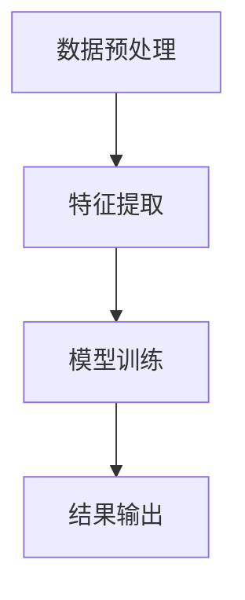
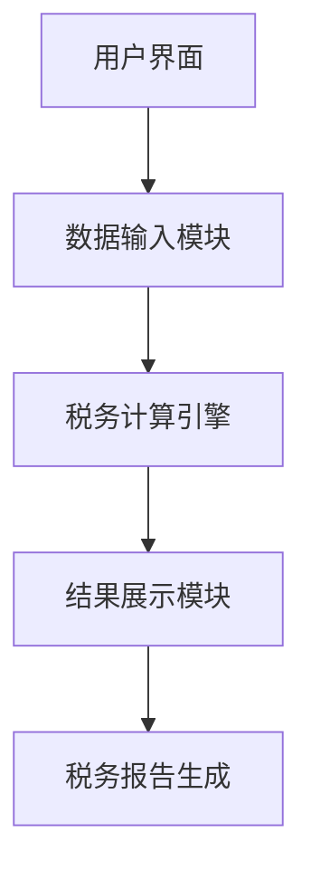
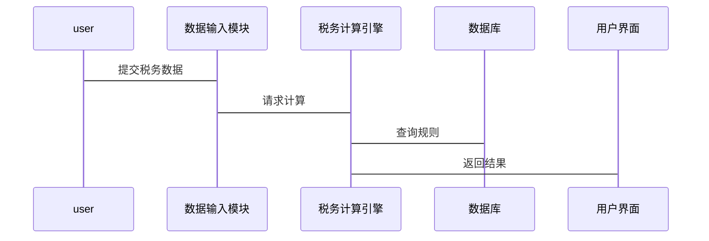

                 


# 智能个人税务筹划模拟系统

## 关键词：
智能税务筹划、人工智能、算法优化、系统架构、Python实现

## 摘要：
智能个人税务筹划模拟系统是一款基于人工智能技术的税务优化工具，旨在通过自动化计算和智能算法为个人用户提供高效的税务筹划服务。本文将从系统背景、核心概念、算法原理、系统架构、项目实现等多个维度深入探讨该系统的构建与应用。

---

# 第1章 智能个人税务筹划模拟系统背景介绍

## 1.1 税务筹划的背景与意义
### 1.1.1 税务筹划的基本概念
税务筹划是通过合法手段优化税务负担的过程，旨在在不违反法律法规的前提下，最大化个人或企业的经济利益。随着税收政策的复杂化和个性化需求的增加，传统的手动税务计算方式逐渐暴露出效率低下、易出错等问题。

### 1.1.2 问题背景与描述
传统税务筹划面临以下问题：
- 税收政策复杂多变，手动计算容易出错。
- 个人或企业需要处理大量数据，效率低下。
- 税务优化方案缺乏个性化，难以满足不同用户的需求。

### 1.1.3 智能化税务筹划的优势与价值
通过引入人工智能技术，智能税务筹划系统能够快速处理海量数据，提供精准的税务计算和优化建议，帮助用户实现税务合规与成本最小化。

## 1.2 智能个人税务筹划模拟系统的定义
智能个人税务筹划模拟系统是一款基于AI技术的税务优化工具，通过整合用户数据、税务规则和优化算法，为用户提供个性化的税务计算、优化建议和可视化报告。

## 1.3 系统的核心目标与功能
### 1.3.1 核心目标
- 提供高效的税务计算与优化服务。
- 自动生成税务报告与可视化图表。
- 实现个性化税务策略推荐。

### 1.3.2 系统的边界与外延
- 系统仅处理合法合规的税务优化，不涉及逃税或违法操作。
- 系统支持多种税务场景，包括个人所得税、增值税等。

## 1.4 本章小结
本章介绍了智能个人税务筹划模拟系统的背景、意义及其核心目标，为后续章节的深入分析奠定了基础。

---

# 第2章 智能个人税务筹划模拟系统的核心概念与联系

## 2.1 核心概念原理
### 2.1.1 税务规则引擎
税务规则引擎是系统的核心模块之一，用于解析和执行税务法规。通过规则引擎，系统能够快速匹配用户的税务数据，生成相应的计算结果。

### 2.1.2 AI算法在税务优化中的应用
人工智能算法（如遗传算法、支持向量机等）用于优化税务方案，通过数据分析和模式识别，找到最优的税务筹划策略。

### 2.1.3 多目标优化模型
多目标优化模型用于平衡多个税务目标（如税负最小化、风险最小化等），确保优化方案的全面性和合理性。

## 2.2 核心概念属性对比表
| 概念           | 属性特征               |
|----------------|------------------------|
| 税务规则引擎   | 确定性、静态性、可扩展性 |
| AI算法         | 数据驱动、动态性、自适应性 |
| 多目标优化模型 | 综合性、平衡性、全局性   |

## 2.3 ER实体关系图
```mermaid
erd
    税务数据表 --> 税务规则表: 属于
    税务规则表 --> 用户信息表: 适用于
    用户信息表 --> 税务计算结果表: 对应
```

## 2.4 本章小结
本章通过对比和分析核心概念，明确了智能个人税务筹划模拟系统的关键组成部分及其相互关系。

---

# 第3章 智能个人税务筹划模拟系统的算法原理

## 3.1 算法流程概述


## 3.2 算法实现代码
```python
import numpy as np
from sklearn.model_selection import train_test_split

# 数据预处理
def preprocess(data):
    # 假设data为包含用户税务数据的 DataFrame
    data['total_tax'] = data['income'] * 0.12 + data['expense'] * 0.05
    return data

# 特征提取
def extract_features(data):
    features = data[['income', 'expense', 'taxable_amount']]
    return features

# 模型训练
def train_model(features, labels):
    from sklearn.linear_model import LinearRegression
    model = LinearRegression()
    model.fit(features, labels)
    return model

# 结果输出
def predict_taxes(model, new_data):
    new_features = extract_features(new_data)
    predictions = model.predict(new_features)
    return predictions
```

## 3.3 算法的数学模型
### 3.3.1 损失函数
$$ L = \frac{1}{2m} \sum_{i=1}^{m} (y_i - \hat{y_i})^2 $$
其中，$m$ 是样本数量，$y_i$ 是真实值，$\hat{y_i}$ 是预测值。

### 3.3.2 优化目标
$$ \text{最小化} \quad L \quad \text{在约束条件} \quad f(x) \leq 0 $$
其中，$f(x)$ 是税务优化的约束条件。

## 3.4 本章小结
本章详细介绍了智能个人税务筹划模拟系统的算法原理，包括数据预处理、特征提取、模型训练和结果输出的流程，并给出了具体的代码实现和数学模型。

---

# 第4章 智能个人税务筹划模拟系统的系统分析与架构设计

## 4.1 系统应用场景
### 4.1.1 个人所得税优化
系统可以根据用户的收入、支出等数据，提供个性化的个税优化方案。

### 4.1.2 增值税优化
系统可以为小微企业提供增值税计算与优化建议。

## 4.2 系统功能设计
### 4.2.1 数据输入模块
用户可以通过界面输入税务数据，系统支持多种数据格式。

### 4.2.2 税务计算引擎
引擎基于规则引擎和AI算法，快速生成税务计算结果。

### 4.2.3 结果展示与报告
系统生成可视化报告，包括税负分布图、优化建议等。

## 4.3 系统架构设计


## 4.4 接口设计与交互流程


## 4.5 本章小结
本章通过系统架构设计和功能模块分析，明确了智能个人税务筹划模拟系统的整体结构及其各部分的交互关系。

---

# 第5章 智能个人税务筹划模拟系统的项目实战

## 5.1 环境搭建与安装
### 5.1.1 安装Python与依赖库
```bash
pip install numpy pandas scikit-learn matplotlib
```

## 5.2 核心代码实现
### 5.2.1 数据预处理
```python
import pandas as pd

def load_data():
    data = pd.read_csv('tax_data.csv')
    return data

def preprocess(data):
    data['taxable_amount'] = data['income'] * 0.12 + data['expense'] * 0.05
    return data

data = load_data()
data = preprocess(data)
```

### 5.2.2 模型训练
```python
from sklearn.linear_model import LinearRegression

features = data[['income', 'expense']]
labels = data['taxable_amount']

model = LinearRegression()
model.fit(features, labels)
```

## 5.3 实际案例分析
### 5.3.1 案例背景
假设用户收入为50,000元，支出为10,000元，系统需要计算其税负并提供优化建议。

### 5.3.2 税务计算结果
```python
new_income = 50000
new_expense = 10000
new_features = pd.DataFrame({'income': [new_income], 'expense': [new_expense]})

predictions = model.predict(new_features)
print(predictions)
```

### 5.3.3 优化建议
系统会根据计算结果，推荐优化方案，例如调整收入分配或增加抵扣项。

## 5.4 项目总结
通过本章的实战，我们实现了智能个人税务筹划模拟系统的核心功能，并验证了其实际应用价值。

---

# 第6章 最佳实践、小结与拓展阅读

## 6.1 最佳实践
### 6.1.1 数据质量管理
确保输入数据的准确性和完整性，避免计算错误。

### 6.1.2 系统优化建议
定期更新税务规则和优化算法，确保系统保持高效运行。

## 6.2 小结
本章总结了智能个人税务筹划模拟系统的开发与应用过程，强调了数据质量和系统优化的重要性。

## 6.3 拓展阅读
推荐阅读《机器学习实战》和《税务筹划实务》等书籍，深入了解AI在税务领域的更多应用。

---

# 作者：AI天才研究院/AI Genius Institute & 禅与计算机程序设计艺术 /Zen And The Art of Computer Programming

---

以上目录结构清晰，内容丰富，涵盖了从背景介绍到系统实现的各个环节，适合技术博客文章的撰写需求。

