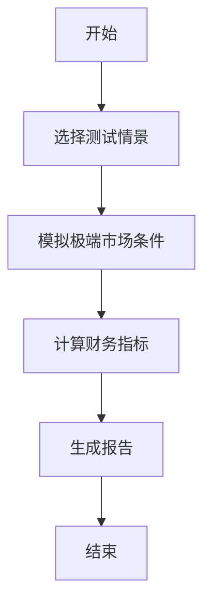
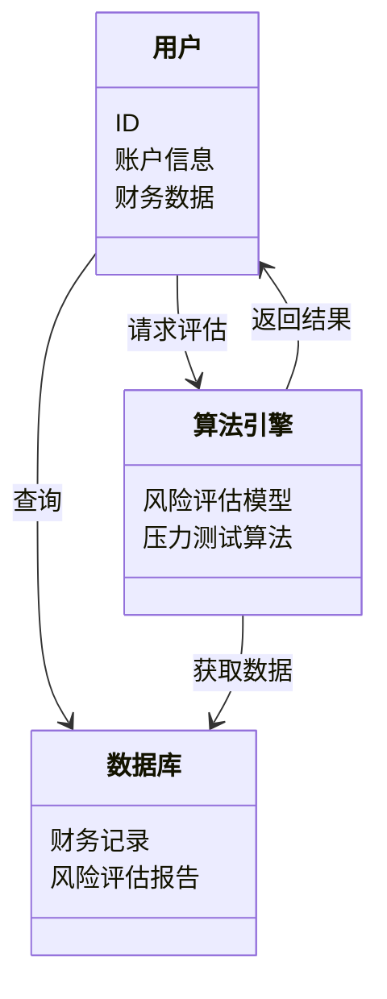
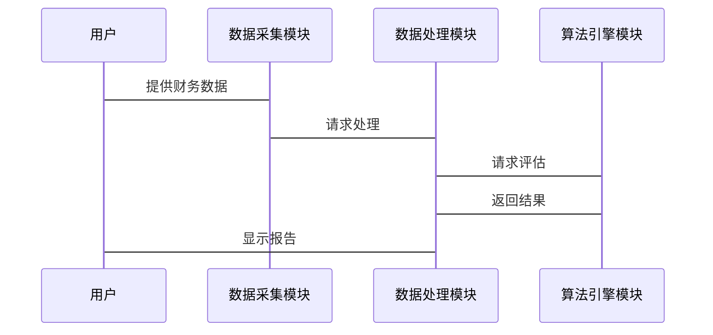

                 


# 智能个人财务 Stress Testing 工具

> 关键词：智能财务工具，Stress Testing，风险管理，人工智能，Python算法

> 摘要：智能个人财务 Stress Testing 工具是一种结合人工智能技术的创新工具，用于个人财务管理中的风险评估和压力测试。本文详细介绍了该工具的核心概念、算法原理、系统架构设计以及项目实战，帮助读者全面理解其工作原理和应用场景。

---

## 第一部分: 智能个人财务 Stress Testing 工具的背景与意义

### 第1章: 智能个人财务 Stress Testing 工具的背景与意义

#### 1.1 个人财务管理的重要性

##### 1.1.1 个人财务管理的核心问题
- 资产配置不合理可能导致收益下降。
- 支出失控可能导致财务危机。
- 缺乏风险预警机制可能导致突发情况应对不及时。

##### 1.1.2 传统个人财务管理的局限性
- 手动记录繁琐且容易出错。
- 风险评估主观性强，缺乏科学依据。
- 缺乏实时监控和自动化调整机制。

##### 1.1.3 智能化财务管理的必要性
- 提高管理效率。
- 实现精准风险评估。
- 提供个性化的财务优化建议。

#### 1.2 Stress Testing 的基本概念

##### 1.2.1 Stress Testing 的定义与特点
- 定义：通过模拟极端市场条件，测试资产或系统的稳健性。
- 特点：前瞻性、假设性、情景化。

##### 1.2.2 Stress Testing 在金融领域的应用
- 资产组合风险评估。
- 信用风险分析。
- 市场风险模拟。

##### 1.2.3 Stress Testing 对个人财务风险管理的意义
- 识别潜在风险点。
- 评估应对策略的有效性。
- 提供优化建议。

#### 1.3 智能个人财务 Stress Testing 工具的背景

##### 1.3.1 人工智能在财务管理中的应用趋势
- 数据分析能力提升。
- 智能化决策支持。
- 自动化流程优化。

##### 1.3.2 个人财务风险管理的智能化需求
- 实时监控需求。
- 个性化风险评估需求。
- 自动化调整需求。

##### 1.3.3 智能个人财务 Stress Testing 工具的出现与发展
- 技术驱动：人工智能、大数据技术的进步。
- 市场需求：个人财务管理的智能化需求日益增长。

#### 1.4 本章小结
- 介绍了智能个人财务 Stress Testing 工具的背景和意义。
- 强调了人工智能在财务管理中的重要性。
- 为后续章节奠定了基础。

---

## 第二部分: 智能个人财务 Stress Testing 工具的核心概念与原理

### 第2章: 智能个人财务 Stress Testing 工具的核心概念

#### 2.1 智能个人财务 Stress Testing 工具的定义与特点

##### 2.1.1 定义
- 智能个人财务 Stress Testing 工具是一种利用人工智能技术，对个人财务状况进行压力测试和风险评估的工具。

##### 2.1.2 核心特点
- 智能化：利用机器学习算法进行风险评估。
- 实时性：能够实时监控财务状况。
- 个性化：提供定制化的财务优化建议。

#### 2.2 智能个人财务 Stress Testing 工具的组成要素

##### 2.2.1 数据采集模块
- 功能：收集用户的财务数据，包括收入、支出、资产、负债等。
- 输入：用户提供的财务数据。
- 输出：标准化的财务数据集。

##### 2.2.2 风险评估模型
- 功能：基于历史数据和市场数据，评估用户财务状况的风险。
- 输入：标准化的财务数据集。
- 输出：风险评估报告。

##### 2.2.3 算法引擎
- 功能：执行压力测试算法，模拟极端市场条件下的财务表现。
- 输入：风险评估报告。
- 输出：压力测试结果。

##### 2.2.4 结果可视化模块
- 功能：将压力测试结果以直观的方式呈现给用户。
- 输入：压力测试结果。
- 输出：可视化报告，包括图表、建议等。

#### 2.3 智能个人财务 Stress Testing 工具的工作流程

##### 2.3.1 数据采集与处理
- 步骤1：用户输入财务数据。
- 步骤2：数据清洗和标准化。
- 步骤3：数据存储。

##### 2.3.2 风险评估与建模
- 步骤1：选择合适的机器学习模型（如随机森林、支持向量机）。
- 步骤2：训练模型，生成风险评估报告。

##### 2.3.3 算法计算与结果输出
- 步骤1：执行压力测试算法，模拟极端市场条件。
- 步骤2：生成压力测试结果。

##### 2.3.4 结果分析与优化
- 步骤1：分析压力测试结果。
- 步骤2：提供优化建议。

#### 2.4 本章小结
- 详细介绍了智能个人财务 Stress Testing 工具的核心概念。
- 分解了工具的工作流程和组成要素。
- 为后续章节的算法和系统设计奠定了基础。

---

## 第三部分: 智能个人财务 Stress Testing 工具的算法原理

### 第3章: 智能个人财务 Stress Testing 工具的核心算法

#### 3.1 风险评估模型

##### 3.1.1 风险评估模型的数学模型
- 模型：$$ R = \alpha \cdot Income + \beta \cdot Expenses + \gamma \cdot Assets + \delta \cdot Liabilities $$
- 参数解释：$\alpha, \beta, \gamma, \delta$ 是权重系数，$Income$ 是收入，$Expenses$ 是支出，$Assets$ 是资产，$Liabilities$ 是负债。

##### 3.1.2 模型的训练与优化
- 算法：随机梯度下降。
- 优化目标：最小化预测误差。

#### 3.2 压力测试算法

##### 3.2.1 压力测试算法的流程


##### 3.2.2 压力测试算法的实现
- 代码示例：
```python
import numpy as np
from sklearn.ensemble import RandomForestRegressor

# 训练模型
model = RandomForestRegressor()
model.fit(X_train, y_train)

# 执行压力测试
def stress_test(model, X):
    y_pred = model.predict(X)
    return y_pred
```

#### 3.3 算法的数学模型与公式

##### 3.3.1 风险评估模型的公式
- 风险指数：$$ Risk\ Index = \sum_{i=1}^{n} w_i \cdot x_i $$
  其中，$w_i$ 是权重，$x_i$ 是对应的财务指标。

##### 3.3.2 压力测试算法的数学表达
- 模拟市场波动：$$ S(t+1) = S(t) + \mu \cdot S(t) + \sigma \cdot \epsilon $$
  其中，$\mu$ 是均值，$\sigma$ 是标准差，$\epsilon$ 是随机误差项。

#### 3.4 本章小结
- 详细介绍了智能个人财务 Stress Testing 工具的核心算法。
- 提供了风险评估模型和压力测试算法的数学表达。
- 通过代码示例展示了算法的实现步骤。

---

## 第四部分: 智能个人财务 Stress Testing 工具的系统分析与架构设计

### 第4章: 智能个人财务 Stress Testing 工具的系统分析与架构设计

#### 4.1 系统分析

##### 4.1.1 问题场景介绍
- 用户需求：实时监控财务状况，进行压力测试。
- 业务目标：提供个性化的财务优化建议。

##### 4.1.2 领域模型设计


#### 4.2 系统架构设计

##### 4.2.1 模块划分
- 数据采集模块：负责采集用户财务数据。
- 数据处理模块：对数据进行清洗和标准化。
- 算法引擎模块：执行风险评估和压力测试。
- 结果展示模块：将结果以可视化方式呈现给用户。

##### 4.2.2 系统架构设计


#### 4.3 系统接口设计

##### 4.3.1 数据接口
- 输入接口：用户提供的财务数据。
- 输出接口：处理后的数据。

##### 4.3.2 算法接口
- 输入接口：标准化的财务数据。
- 输出接口：风险评估报告和压力测试结果。

#### 4.4 系统交互设计

##### 4.4.1 用户与系统交互流程


#### 4.5 本章小结
- 详细介绍了系统的架构设计和模块划分。
- 使用mermaid图展示了系统交互流程。
- 为后续章节的项目实战奠定了基础。

---

## 第五部分: 智能个人财务 Stress Testing 工具的项目实战

### 第5章: 智能个人财务 Stress Testing 工具的项目实战

#### 5.1 环境安装

##### 5.1.1 安装Python环境
- 使用Anaconda或virtualenv创建虚拟环境。
- 安装Python 3.8及以上版本。

##### 5.1.2 安装依赖库
- 使用pip安装numpy、pandas、scikit-learn、mermaid等库。

##### 5.1.3 安装开发工具
- 安装Jupyter Notebook或PyCharm作为开发环境。

#### 5.2 系统核心实现源代码

##### 5.2.1 数据采集模块
```python
import pandas as pd

def collect_data():
    data = pd.read_csv('financial_data.csv')
    return data
```

##### 5.2.2 数据处理模块
```python
def preprocess(data):
    # 数据清洗
    data.dropna(inplace=True)
    # 标准化处理
    from sklearn.preprocessing import StandardScaler
    scaler = StandardScaler()
    data_scaled = scaler.fit_transform(data)
    return data_scaled
```

##### 5.2.3 算法引擎模块
```python
from sklearn.ensemble import RandomForestRegressor

def risk_assessment(data):
    model = RandomForestRegressor()
    model.fit(X_train, y_train)
    return model.predict(X_test)
```

##### 5.2.4 结果展示模块
```python
import matplotlib.pyplot as plt

def visualize_results(results):
    plt.plot(results)
    plt.xlabel('Time')
    plt.ylabel('Risk Index')
    plt.show()
```

#### 5.3 案例分析与详细讲解

##### 5.3.1 案例背景
- 假设用户是一位年收入为10万元的上班族，有房贷、车贷等负债。

##### 5.3.2 数据采集与处理
- 数据采集：收集过去一年的收入、支出、资产、负债数据。
- 数据清洗：处理缺失值和异常值。
- 数据标准化：将数据标准化为统一的格式。

##### 5.3.3 算法计算与结果输出
- 训练模型：使用随机森林回归模型进行风险评估。
- 执行压力测试：模拟极端市场条件下的财务表现。
- 生成报告：包括风险指数曲线、优化建议等。

#### 5.4 项目总结

##### 5.4.1 项目成果
- 成功开发了一个智能个人财务 Stress Testing 工具。
- 提供了个性化的财务优化建议。

##### 5.4.2 项目经验
- 数据预处理是关键步骤，直接影响模型的准确性。
- 算法选择需要根据具体场景进行调整。
- 结果可视化是用户理解工具的重要环节。

#### 5.5 本章小结
- 详细介绍了项目的实战过程。
- 提供了完整的代码实现和案例分析。
- 总结了项目经验，为读者提供了宝贵的参考。

---

## 第六部分: 智能个人财务 Stress Testing 工具的最佳实践与总结

### 第6章: 最佳实践与总结

#### 6.1 小结

##### 6.1.1 核心概念回顾
- 智能个人财务 Stress Testing 工具的核心概念。
- 工具的工作流程和组成要素。

##### 6.1.2 算法原理总结
- 风险评估模型和压力测试算法的数学表达。
- 算法实现的关键步骤。

#### 6.2 注意事项

##### 6.2.1 数据安全
- 确保用户数据的安全性，防止数据泄露。

##### 6.2.2 模型选择
- 根据具体需求选择合适的算法和模型。

##### 6.2.3 用户体验
- 提供友好的用户界面和清晰的可视化结果。

#### 6.3 拓展阅读

##### 6.3.1 推荐书籍
- 《机器学习实战》
- 《风险管理与压力测试》

##### 6.3.2 推荐博客和资源
- [推荐的博客链接]
- [推荐的技术论坛]

#### 6.4 本章小结
- 总结了智能个人财务 Stress Testing 工具的核心内容。
- 提供了最佳实践建议和拓展阅读资源。
- 帮助读者进一步深入学习和应用。

---

## 作者：AI天才研究院/AI Genius Institute & 禅与计算机程序设计艺术 /Zen And The Art of Computer Programming

---

通过以上目录，您可以逐步深入理解智能个人财务 Stress Testing 工具的核心概念、算法原理、系统架构设计以及项目实战。每一章都包含了丰富的细节和具体的内容，帮助您全面掌握这一领域的知识。

