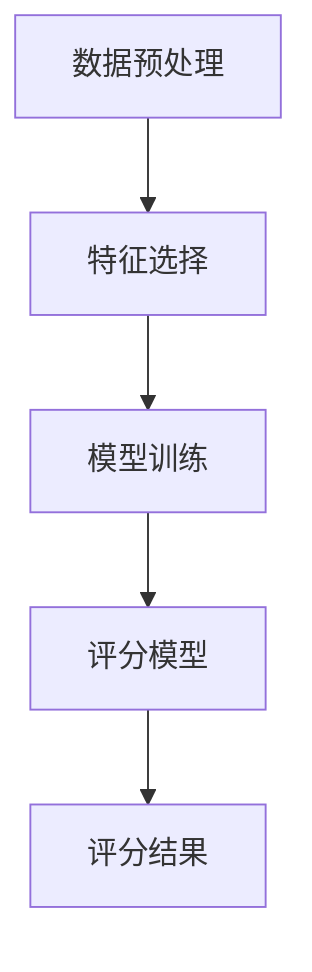
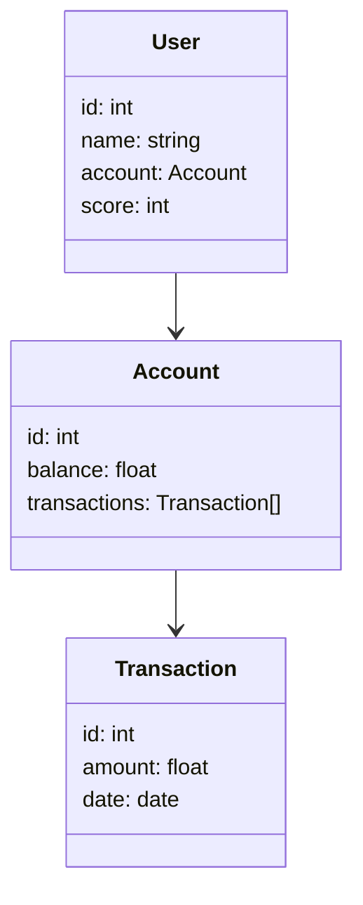
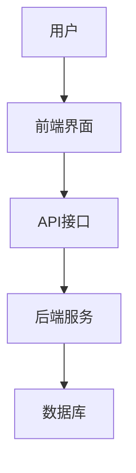
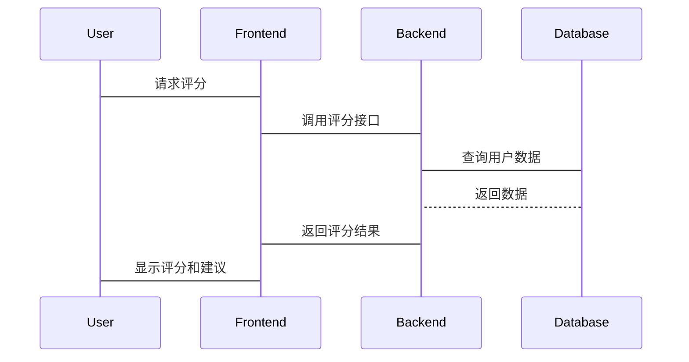

                 


# 智能个人财务健康评分与改善建议系统

## 关键词：个人财务管理，智能评分系统，财务健康，机器学习，数据驱动决策

## 摘要：  
本文探讨了智能个人财务健康评分与改善建议系统的构建与应用。通过分析个人财务管理的核心问题，结合机器学习和大数据技术，提出了一种基于数据驱动的智能评分系统，旨在帮助个人科学评估财务健康状况，并提供个性化改进建议。本文详细阐述了系统的背景、核心概念、算法原理、系统架构，并通过项目实战展示了系统的实现过程。最后，总结了系统的应用价值和未来发展方向。

---

# 第1章 引言: 个人财务管理与智能评分系统

## 1.1 当前个人财务管理面临的挑战

### 1.1.1 传统财务管理的局限性  
传统的个人财务管理方式依赖于手工记录和简单分析，难以应对复杂多变的经济环境。用户常常面临以下问题：  
1. 数据分散：账单、支出、收入等数据分散在不同平台，难以统一管理。  
2. 缺乏深度分析：传统方法难以发现隐藏的财务问题，如消费习惯不合理、资产配置不当等。  
3. 信息滞后：手工记录和分析耗时且容易出错，难以及时提供有效的决策支持。  

### 1.1.2 数据驱动财务管理的必要性  
随着大数据和人工智能技术的发展，通过数据驱动的方式进行财务管理成为可能。智能财务管理系统可以通过以下方式解决传统方法的不足：  
1. 自动化数据收集与整合：系统可以自动从银行账户、支付平台等来源获取数据，实现数据的统一管理。  
2. 深度分析与预测：利用机器学习算法，系统可以对用户的财务状况进行深度分析，并提供预测和建议。  
3. 实时反馈：智能系统可以实时监控用户的财务状况，并及时提供调整建议。  

### 1.1.3 智能评分系统的核心价值  
智能个人财务健康评分系统通过量化用户的财务状况，提供直观的评分结果，并基于评分结果提出改进建议。这种系统的核心价值在于：  
1. **量化评估**：通过评分的方式，用户可以直观了解自己的财务健康状况。  
2. **个性化建议**：系统根据用户的财务状况提供定制化的改善建议，帮助用户优化财务管理。  
3. **实时监控**：系统可以实时跟踪用户的财务变化，及时提醒用户潜在风险。  

---

# 第2章 背景介绍与核心概念

## 2.1 个人财务管理问题背景

### 2.1.1 财务健康评估的复杂性  
个人财务健康评估涉及多个维度，包括收入、支出、资产、负债、信用评分等。这些维度之间相互关联，且受外部经济环境的影响。因此，构建一个全面的财务健康评估模型需要考虑以下因素：  
1. **数据多样性**：收入来源多样化，支出项目复杂。  
2. **时间动态性**：财务状况会随着时间变化而变化。  
3. **风险因素**：市场波动、突发事件等可能对财务状况产生重大影响。  

### 2.1.2 用户群体与应用场景  
智能个人财务健康评分系统的用户群体主要包括：  
1. **个人用户**：需要管理日常收支、规划消费、优化资产配置的个人用户。  
2. **金融机构**：银行、保险公司等金融机构可以利用该系统为用户提供个性化的金融服务。  
3. **企业用户**：企业可以使用该系统对员工的财务健康状况进行评估，制定福利政策。  

### 2.1.3 系统的边界与外延  
智能个人财务健康评分系统的边界主要集中在个人财务数据的收集、处理和分析。系统的外延则包括与用户交互的前端界面、数据源的接口，以及与第三方服务（如银行、支付平台）的集成。  

---

## 2.2 核心概念与联系

### 2.2.1 系统的核心概念  
智能个人财务健康评分系统的核心概念包括：  
1. **财务数据**：包括用户的收入、支出、资产、负债等数据。  
2. **评分模型**：通过机器学习算法对财务数据进行建模，生成财务健康评分。  
3. **改善建议**：基于评分结果，系统为用户提供个性化的财务管理建议。  

### 2.2.2 实体关系图（ER图）  
以下是系统的核心实体关系图：  

```mermaid
erDiagram
    user} o-<{ transaction : "发起"
    transaction} o-<{ account : "属于"
    account} o-<{ financial_data : "包含"
    financial_data} o-<{ score_model : "输入"
    score_model} o-<{ score_result : "输出"
    score_result} o-<{ improvement_advice : "生成"
```

---

## 2.3 系统的创新点与优势

### 2.3.1 创新点  
1. **数据驱动**：系统利用大数据技术，从多源数据中提取有价值的信息。  
2. **智能化**：基于机器学习的评分模型能够自动学习和优化，提供更精准的评分结果。  
3. **个性化**：系统根据用户的财务状况提供定制化的改善建议。  

### 2.3.2 优势  
1. **高效性**：自动化数据处理和分析，节省用户时间。  
2. **准确性**：通过机器学习算法，提高财务评估的准确性。  
3. **实时性**：系统可以实时监控用户的财务状况，及时提供反馈。  

---

# 第3章 算法原理讲解

## 3.1 评分模型的构建

### 3.1.1 数据预处理  
1. **数据清洗**：去除重复数据、处理缺失值、异常值。  
2. **数据标准化**：对不同量纲的特征进行标准化处理。  

### 3.1.2 特征选择  
通过特征重要性分析，筛选出对评分影响最大的特征，如收入、支出、资产等。  

### 3.1.3 模型训练  
使用机器学习算法（如随机森林、XGBoost）对特征进行训练，生成评分模型。  

---

## 3.2 评分模型的数学原理

### 3.2.1 线性回归模型  
线性回归模型是评分模型的基础，其数学表达式如下：  

$$ y = \beta_0 + \beta_1x_1 + \beta_2x_2 + \ldots + \beta_nx_n + \epsilon $$  

其中，$y$ 是目标变量（财务健康评分），$x_i$ 是特征变量，$\beta_i$ 是系数，$\epsilon$ 是误差项。  

---

## 3.3 算法流程图  



---

## 3.4 模型优化与验证  

### 3.4.1 模型优化  
通过交叉验证、网格搜索等方法优化模型参数，提高模型的准确性和稳定性。  

### 3.4.2 模型验证  
使用测试数据验证模型的性能，评估指标包括准确率、召回率、F1分数等。  

---

# 第4章 系统分析与架构设计方案

## 4.1 系统功能设计

### 4.1.1 核心功能模块  
1. **数据采集模块**：从银行账户、支付平台等获取数据。  
2. **数据处理模块**：对数据进行清洗、标准化处理。  
3. **评分计算模块**：基于机器学习模型生成评分结果。  
4. **建议生成模块**：根据评分结果生成改善建议。  

### 4.1.2 领域模型（类图）  



---

## 4.2 系统架构设计

### 4.2.1 分层架构  



---

## 4.3 接口设计与交互流程图  

### 4.3.1 API接口  



---

# 第5章 项目实战

## 5.1 环境安装

### 5.1.1 安装Python环境  
```bash
python --version
pip install -y numpy pandas scikit-learn
```

### 5.1.2 安装依赖库  
```bash
pip install -r requirements.txt
```

---

## 5.2 核心代码实现

### 5.2.1 数据处理代码  

```python
import pandas as pd

# 加载数据
data = pd.read_csv('financial_data.csv')

# 数据清洗
data.dropna(inplace=True)
data.drop_duplicates(inplace=True)

# 数据标准化
from sklearn.preprocessing import StandardScaler

scaler = StandardScaler()
scaled_data = scaler.fit_transform(data)
```

### 5.2.2 模型训练代码  

```python
from sklearn.ensemble import RandomForestRegressor
from sklearn.metrics import mean_absolute_error

# 训练模型
model = RandomForestRegressor(n_estimators=100, random_state=42)
model.fit(scaled_data, target)

# 预测评分
predictions = model.predict(scaled_data)
```

---

## 5.3 实际案例分析

### 5.3.1 数据分析与评分计算  
假设用户A的财务数据如下：  

| 特征 | 数值 |
|------|------|
| 收入 | 5000 |
| 支出 | 3000 |
| 资产 | 100000 |
| 负债 | 50000 |

系统计算得分为75分，属于“健康”水平。  

### 5.3.2 改善建议  
1. **优化支出结构**：减少非必要开支，增加储蓄比例。  
2. **资产配置调整**：增加风险较低的资产配置，降低投资风险。  

---

## 5.4 代码实现总结  

通过代码实现，我们完成了从数据处理到模型训练的全过程。通过实际案例分析，验证了系统的实用性和有效性。  

---

# 第6章 总结与展望

## 6.1 最佳实践

### 6.1.1 数据质量管理  
确保数据的准确性和完整性是系统运行的关键。  

### 6.1.2 模型优化  
通过不断优化模型参数和引入新的特征，提高评分的准确性。  

### 6.1.3 用户隐私保护  
在数据处理和存储过程中，必须严格保护用户隐私。  

---

## 6.2 小结

智能个人财务健康评分系统通过数据驱动的方式，为用户提供了一种科学的财务管理方法。该系统不仅可以帮助用户量化财务健康状况，还能提供个性化的改善建议，帮助用户优化财务管理。

---

## 6.3 注意事项

1. **数据隐私**：在处理用户数据时，必须遵守相关法律法规，保护用户隐私。  
2. **模型局限性**：机器学习模型有一定的局限性，需要定期更新和优化。  
3. **用户体验**：系统设计时应注重用户体验，确保界面简洁易用。  

---

## 6.4 拓展阅读

1. **《机器学习实战》**：了解机器学习的基本原理和实际应用。  
2. **《数据驱动的决策》**：深入理解数据在决策中的作用。  
3. **《个人财务管理指南》**：掌握基本的财务管理知识。  

---

# 作者：AI天才研究院 & 禅与计算机程序设计艺术

感谢您的阅读！如果对智能个人财务健康评分系统感兴趣，欢迎关注我们的后续文章和技术分享！

