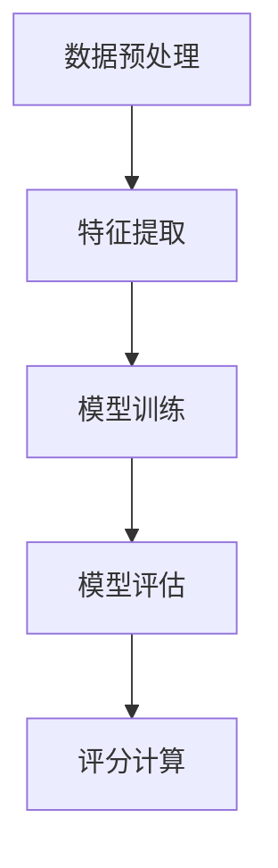
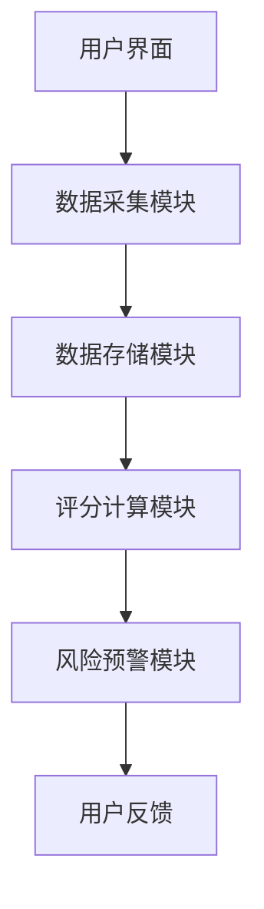

                 


# 智能个人财务健康评分系统

> 关键词：智能评分系统，个人财务管理，人工智能，财务健康指数，机器学习

> 摘要：本文将详细介绍智能个人财务健康评分系统的构建与应用。通过分析个人财务数据，结合人工智能和机器学习技术，我们能够为个人提供精准的财务健康评分，帮助其优化财务管理策略。本文从背景、概念、算法、系统架构、项目实战到最佳实践，全面解析智能个人财务健康评分系统的实现过程。

---

## 第一章：智能个人财务健康评分系统背景与概念

### 1.1 个人财务健康评分的背景与问题背景

#### 1.1.1 个人财务管理的重要性
在当今社会，个人财务管理已成为每个人生活中不可忽视的一部分。合理的财务管理不仅能帮助个人实现财务自由，还能规避潜在的财务风险。然而，随着经济环境的复杂化，个人财务管理的难度也在不断增加。

#### 1.1.2 当前个人财务管理的痛点
- 数据分散：个人的财务数据可能分布在多个平台（如银行账户、支付宝、微信支付等），难以集中管理。
- 知识不足：许多人在财务管理方面缺乏专业知识，难以制定科学的财务计划。
- 风险预警：传统财务管理方式难以实时监测潜在的财务风险，如过度借贷或消费超支。

#### 1.1.3 智能化财务管理的需求
随着人工智能和大数据技术的发展，智能化财务管理成为可能。通过智能系统，个人可以实时监控财务状况，获取个性化建议，从而实现更高效的财务管理。

---

### 1.2 个人财务健康评分的定义与问题描述

#### 1.2.1 财务健康评分的定义
财务健康评分是对个人或家庭财务状况的综合评估，通过量化指标反映个人的财务健康程度。评分范围通常在0到100之间，评分越高表示财务状况越健康。

#### 1.2.2 财务健康评分的核心问题
- 如何采集和整合多源异构的财务数据？
- 如何建立科学的评分模型？
- 如何实时更新和反馈评分结果？

#### 1.2.3 财务健康评分的边界与外延
- 边界：仅关注个人或家庭的财务状况，不涉及企业或机构的财务。
- 外延：可能延伸至投资、税务规划、遗产管理等领域。

---

### 1.3 财务健康评分系统的解决方案

#### 1.3.1 系统目标与功能
- 数据采集与整合
- 财务数据分析与建模
- 财务健康评分计算
- 风险预警与建议生成

#### 1.3.2 系统的核心要素与组成
- 数据层：多源异构数据的采集与整合。
- 模型层：基于规则或机器学习的评分模型。
- 界面层：用户友好的交互界面。
- 预警层：实时风险预警与个性化建议。

#### 1.3.3 系统的预期效果与价值
- 提高财务管理效率
- 实时风险预警
- 个性化财务建议
- 促进健康消费习惯

---

## 第二章：智能个人财务健康评分系统的概念与联系

### 2.1 财务健康评分模型的核心概念

#### 2.1.1 财务健康评分模型的定义
财务健康评分模型是对个人或家庭的财务状况进行量化评估的数学模型，通常基于多维度的财务指标。

#### 2.1.2 财务健康评分模型的特征
- 多维度：涵盖收入、支出、资产、负债等多个维度。
- 实时性：能够实时更新评分结果。
- 个性化：针对不同用户的财务状况提供定制化建议。

#### 2.1.3 财务健康评分模型的分类
- 基于规则的模型：通过预设的规则和权重计算评分。
- 基于机器学习的模型：利用历史数据训练模型，预测评分。
- 混合模型：结合规则和机器学习的优势。

---

### 2.2 财务健康评分模型与相关概念的对比

#### 2.2.1 财务健康评分模型与其他评分模型的对比
| 指标 | 财务健康评分模型 | 信用评分模型 |
|------|------------------|--------------|
| 数据来源 | 个人财务数据 | 信用历史、收入等 |
| 目标 | 综合评估财务健康 | 评估信用风险 |
| 方法 | 多维度分析 | 主要基于信用历史 |

#### 2.2.2 财务健康评分模型与传统财务管理的对比
- 传统财务管理：依赖人工记录与分析。
- 智能化财务管理：借助AI和大数据实现自动化、智能化。

#### 2.2.3 财务健康评分模型与人工智能的关系
人工智能为财务健康评分模型提供了技术支持，模型则通过数据反馈反哺人工智能算法优化。

---

### 2.3 财务健康评分系统的ER实体关系图

```mermaid
erDiagram
    user {
        code INT
        name VARCHAR
        email VARCHAR
        phone VARCHAR
    }
    account {
        id INT
        balance DECIMAL
        type VARCHAR
        user_code INT
    }
    transaction {
        id INT
        amount DECIMAL
        date DATE
        account_id INT
    }
    score {
        id INT
        value INT
        date DATE
        user_code INT
    }
    user -- account
    account -- transaction
    user -- score
```

---

## 第三章：智能个人财务健康评分系统的算法原理

### 3.1 财务健康评分模型的算法概述

#### 3.1.1 基于规则的评分模型
- 通过预设的规则和权重计算评分。
- 例如：收入 > 支出 × 2 → 得分 +20。

#### 3.1.2 基于机器学习的评分模型
- 使用历史数据训练模型，预测评分。
- 常见算法：随机森林、支持向量机（SVM）。

#### 3.1.3 基于深度学习的评分模型
- 利用神经网络处理复杂数据。
- 例如：LSTM 网络处理时间序列数据。

---

### 3.2 财务健康评分模型的算法流程



---

### 3.3 财务健康评分模型的数学模型与公式

#### 3.3.1 财务健康评分的加权计算公式
$$ \text{评分} = \sum_{i=1}^{n} w_i \cdot f_i $$
其中，\( w_i \) 为第 \( i \) 个特征的权重，\( f_i \) 为第 \( i \) 个特征的值。

---

## 第四章：智能个人财务健康评分系统的系统分析与架构设计

### 4.1 系统需求分析

#### 4.1.1 功能需求
- 数据采集与存储
- 财务分析与评分计算
- 风险预警与建议生成

#### 4.1.2 性能需求
- 实时响应
- 高可用性

---

### 4.2 系统架构设计



---

## 第五章：智能个人财务健康评分系统的项目实战

### 5.1 环境安装与配置

```bash
pip install pandas numpy scikit-learn
```

---

### 5.2 系统核心功能实现

```python
import pandas as pd
from sklearn.ensemble import RandomForestClassifier

# 数据预处理
data = pd.read_csv('financial_data.csv')
X = data.drop('score', axis=1)
y = data['score']

# 模型训练
model = RandomForestClassifier()
model.fit(X, y)

# 预测评分
new_data = pd.DataFrame({'income': [50000], 'expenses': [30000]})
predicted_score = model.predict(new_data)
print(predicted_score)
```

---

## 第六章：智能个人财务健康评分系统的最佳实践

### 6.1 设计与实现中的注意事项
- 数据隐私保护
- 模型的可解释性
- 系统的可扩展性

### 6.2 系统优化与性能调优
- 使用分布式架构提高性能
- 定期更新模型参数

### 6.3 拓展阅读
- 推荐书籍：《机器学习实战》
- 推荐博客：Towards Data Science

---

## 第七章：智能个人财务健康评分系统的总结与展望

### 7.1 全文总结
本文详细介绍了智能个人财务健康评分系统的构建与应用，从背景、概念、算法到系统架构和项目实战，为读者提供了全面的技术解析。

### 7.2 未来展望
随着人工智能技术的不断发展，智能个人财务健康评分系统将更加智能化和个性化，为用户提供更精准的财务管理和风险预警。

---

## 作者：AI天才研究院 & 禅与计算机程序设计艺术

---

通过本文的详细解析，读者可以深入了解智能个人财务健康评分系统的实现过程，并在实际应用中加以改进与创新。

