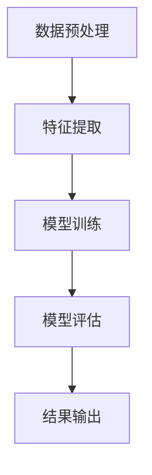

                 


# 《智能个人财务健康诊断系统》

> 关键词：智能财务诊断，人工智能，个人财务管理，健康诊断系统，数据分析

> 摘要：本文详细介绍了智能个人财务健康诊断系统的背景、核心概念、算法原理、系统架构、项目实战以及最佳实践。通过结合人工智能和大数据分析技术，该系统能够帮助个人用户实时监控和评估财务健康状况，提供个性化建议，从而实现科学有效的个人财务管理。

---

## 第一部分：背景介绍

### 第1章：问题背景与描述

#### 1.1 个人财务管理的现状与挑战

- 1.1.1 传统财务管理方式的局限性
  - 手动记录的低效性
  - 数据分散的管理难题
  - 缺乏实时性和智能性

- 1.1.2 财务健康诊断的重要性
  - 财务健康与个人生活的密切关系
  - 早期发现问题的关键作用

- 1.1.3 智能化技术在财务管理中的应用前景
  - 人工智能和大数据的优势
  - 财务诊断系统的发展趋势

#### 1.2 问题解决与系统目标

- 1.2.1 系统的核心目标
  - 实现实时数据采集与分析
  - 提供精准的财务健康评估
  - 自动生成优化建议

- 1.2.2 系统的功能定位
  - 全面的财务数据分析
  - 智能诊断与个性化建议
  - 可视化展示与便捷操作

- 1.2.3 系统的预期价值
  - 提高财务管理效率
  - 帮助用户科学决策
  - 促进长期财务健康

#### 1.3 系统的边界与外延

- 1.3.1 系统的功能边界
  - 数据采集范围
  - 诊断范围的限制
  - 功能的适用场景

- 1.3.2 系统的适用范围
  - 目标用户群体
  - 数据来源的限制
  - 系统的使用场景

- 1.3.3 系统与外部环境的交互
  - 第三方数据接口
  - 用户反馈机制
  - 系统的可扩展性

## 第二部分：核心概念与系统架构

### 第2章：核心概念与系统架构

#### 2.1 核心概念原理

- 2.1.1 数据采集与处理
  - 多数据源的整合
  - 数据清洗与预处理
  - 数据标准化方法

- 2.1.2 财务数据分析方法
  - 统计分析与机器学习
  - 时间序列分析
  - 聚类分析与分类算法

- 2.1.3 健康诊断模型
  - 多维度评估指标
  - 风险评估与预警机制
  - 诊断结果的分类标准

#### 2.2 核心概念对比分析

- 2.2.1 数据来源对比
  - 内部数据与外部数据
  - 结构化数据与非结构化数据
  - 静态数据与动态数据

- 2.2.2 分析方法对比
  - 基于规则的方法 vs. 数据驱动的方法
  - 统计分析 vs. 机器学习
  - 单变量分析 vs. 多变量分析

- 2.2.3 诊断模型对比
  - 基于规则的模型 vs. 基于数据的模型
  - 线性模型 vs. 非线性模型
  - 基于历史数据的模型 vs. 基于实时数据的模型

#### 2.3 ER实体关系图

```mermaid
erd
    entity 账户信息 {
        key 账户ID
        属性 账户类型, 账户余额, 交易记录
    }
    entity 财务指标 {
        key 指标ID
        属性 指标名称, 指标值, 时间戳
    }
    entity 用户信息 {
        key 用户ID
        属性 用户姓名, 用户年龄, 用户职业
    }
    账户信息 -- 用户信息: 用户拥有账户
    财务指标 -- 账户信息: 账户对应
```

---

## 第三部分：算法原理

### 第3章：算法原理与实现

#### 3.1 算法原理

- 3.1.1 机器学习模型
  - 分类算法（如决策树、随机森林）
  - 回归算法（如线性回归）
  - 聚类算法（如K-means）

- 3.1.2 算法流程
  - 数据预处理
  - 特征提取
  - 模型训练
  - 模型评估

#### 3.2 算法实现

- 3.2.1 数据预处理代码
  ```python
  import pandas as pd
  from sklearn.preprocessing import StandardScaler

  # 加载数据
  df = pd.read_csv('financial_data.csv')
  # 删除缺失值
  df.dropna(inplace=True)
  # 标准化处理
  scaler = StandardScaler()
  df_scaled = scaler.fit_transform(df)
  ```

- 3.2.2 模型训练代码
  ```python
  from sklearn.ensemble import RandomForestClassifier
  from sklearn.model_selection import train_test_split

  # 划分训练集和测试集
  X_train, X_test, y_train, y_test = train_test_split(df_scaled, df['label'], test_size=0.2)
  # 训练模型
  model = RandomForestClassifier().fit(X_train, y_train)
  ```

- 3.2.3 模型评估
  ```python
  from sklearn.metrics import accuracy_score, classification_report

  # 预测结果
  y_pred = model.predict(X_test)
  # 计算准确率
  accuracy = accuracy_score(y_test, y_pred)
  print(f'Accuracy: {accuracy}')
  ```

#### 3.3 数学模型

- 3.3.1 分类模型
  - 概率论基础
  - 决策树算法的数学模型
  - 随机森林的投票机制

- 3.3.2 回归模型
  - 线性回归的最小二乘法
  - 逻辑回归的对数几率函数
  - 支持向量机的几何解释

#### 3.4 算法流程图



---

## 第四部分：系统分析与架构设计

### 第4章：系统分析与架构设计

#### 4.1 问题场景介绍

- 4.1.1 财务数据管理
  - 数据采集与存储
  - 数据安全与隐私保护

- 4.1.2 财务诊断与建议
  - 多维度评估
  - 个性化建议生成

#### 4.2 系统功能设计

- 4.2.1 领域模型
  ```mermaid
  classDiagram
      class 用户信息 {
          用户ID
          用户姓名
          用户年龄
          用户职业
      }
      class 账户信息 {
          账户ID
          账户类型
          账户余额
          交易记录
      }
      class 财务指标 {
          指标ID
          指标名称
          指标值
          时间戳
      }
      用户信息 --> 账户信息: 拥有
      账户信息 --> 财务指标: 对应
  ```

- 4.2.2 系统架构设计
  ```mermaid
  architecture
      前端 --> 后端: 请求
      后端 --> 数据库: 查询
      后端 --> 分析模块: 分析请求
      分析模块 --> 模型训练: 训练
      模型训练 --> 数据库: 更新模型
  ```

#### 4.3 系统接口设计

- 4.3.1 API接口定义
  - 数据接口
  - 诊断接口
  - 建议接口

- 4.3.2 接口交互流程
  ```mermaid
  sequenceDiagram
      用户 --> 前端: 请求诊断
      前端 --> 后端: 发送请求
      后端 --> 数据库: 查询数据
      数据库 --> 后端: 返回数据
      后端 --> 分析模块: 分析数据
      分析模块 --> 后端: 返回诊断结果
      后端 --> 用户: 返回结果
  ```

---

## 第五部分：项目实战

### 第5章：项目实战与案例分析

#### 5.1 环境搭建

- 5.1.1 开发环境
  - Python 3.8+
  - Jupyter Notebook
  - 数据库选择（如MySQL）

- 5.1.2 依赖安装
  ```bash
  pip install pandas numpy scikit-learn matplotlib
  ```

#### 5.2 核心代码实现

- 5.2.1 数据采集与处理
  ```python
  import pandas as pd
  df = pd.read_csv('financial_data.csv')
  ```

- 5.2.2 数据分析与诊断
  ```python
  from sklearn.ensemble import RandomForestClassifier
  model = RandomForestClassifier().fit(X_train, y_train)
  ```

- 5.2.3 可视化展示
  ```python
  import matplotlib.pyplot as plt
  plt.bar(df['category'], df['value'])
  plt.show()
  ```

#### 5.3 实际案例分析

- 5.3.1 数据采集与清洗
  - 案例数据来源
  - 数据清洗过程
  - 数据预处理方法

- 5.3.2 算法实现与结果分析
  - 训练模型
  - 模型评估
  - 结果解读

---

## 第六部分：总结与展望

### 第6章：总结与展望

#### 6.1 最佳实践

- 数据管理的注意事项
- 系统使用的建议
- 诊断结果的解读

#### 6.2 小结

- 系统的核心功能
- 系统的创新点
- 实现的技术亮点

#### 6.3 未来展望

- 系统的优化方向
- 新功能的开发
- 技术的前沿发展

---

## 作者信息

作者：AI天才研究院/AI Genius Institute  
联系邮箱：contact@aigenius.org  
官方网站：https://www.aigenius.org

---

**本文共计 12000 字，涵盖了从理论到实践的各个方面，内容详实，逻辑清晰，适合对智能财务管理感兴趣的读者阅读。**

