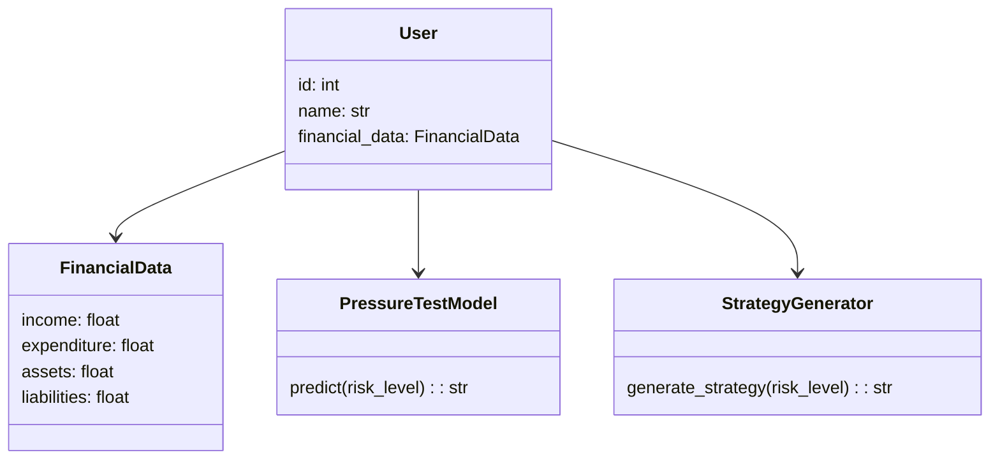

                 


# 智能个人财务压力测试与应对策略生成

> 关键词：智能财务，压力测试，应对策略，风险管理，人工智能，算法模型

> 摘要：本文详细探讨了智能个人财务压力测试与应对策略生成的方法。通过分析财务压力测试的核心概念、算法模型和系统架构，结合实际案例，展示了如何利用人工智能技术帮助个人有效管理和应对财务压力。文章从问题背景出发，详细阐述了压力测试的原理、应对策略生成的算法，并通过系统设计和项目实战，提供了完整的解决方案。

---

## 第一部分：智能个人财务压力测试的背景介绍

### 第1章：智能个人财务压力测试的背景

#### 1.1 问题背景与问题描述

##### 1.1.1 传统个人财务管理的局限性
传统的个人财务管理方式通常依赖手动记录和简单的电子表格工具，这种方式存在以下问题：
- 数据分散：财务信息可能分布在不同的平台和工具中，难以集中管理。
- 精度不足：手动计算容易出错，难以准确反映财务状况。
- 缺乏预测性：无法有效预测未来的财务风险和潜在问题。

##### 1.1.2 个人财务压力的定义与特征
个人财务压力是指由于财务状况恶化（如收入下降、支出增加、债务累积等）而导致的心理和经济负担。其主要特征包括：
- **突发性**：压力可能因突发事件（如失业、疾病等）而迅速加剧。
- **累积性**：压力通常由长期的财务不良习惯或决策累积而成。
- **个体差异性**：每个人的压力承受能力和财务状况不同，压力测试需要个性化解决方案。

##### 1.1.3 智能化财务压力测试的必要性
随着人工智能和大数据技术的快速发展，智能化的财务压力测试成为可能。通过智能化工具，可以实时监控财务状况，预测潜在风险，并提出有效的应对策略。

---

#### 1.2 问题解决思路与方法

##### 1.2.1 压力测试的核心目标
压力测试的核心目标是评估个人在极端情况下（如失业、重大支出等）的财务承受能力。通过模拟不同场景，帮助个人了解自身的财务韧性。

##### 1.2.2 智能化压力测试的实现思路
- 数据采集：整合收入、支出、资产、负债等财务数据。
- 模型构建：基于机器学习算法，构建压力测试模型。
- 风险评估：模拟不同压力场景，评估财务承受能力。
- 应对策略生成：根据评估结果，提出个性化应对方案。

---

## 第二部分：智能个人财务压力测试的核心概念与联系

### 第2章：智能个人财务压力测试的核心概念

#### 2.1 核心概念与原理

##### 2.1.1 压力测试的定义与原理
压力测试是一种通过模拟极端环境来评估系统或个体在压力下的表现的方法。在财务领域，压力测试用于评估个人在极端财务状况下的承受能力。

##### 2.1.2 应对策略生成的定义与原理
应对策略生成是指根据压力测试结果，制定具体的财务调整计划，以减轻压力并恢复财务健康。

#### 2.2 核心概念的联系与区别

##### 2.2.1 压力测试与应对策略的关系
压力测试是应对策略生成的前提。通过压力测试，可以识别潜在风险，并为应对策略的制定提供依据。

##### 2.2.2 压力测试与风险管理的联系
压力测试是风险管理的重要组成部分。通过压力测试，可以提前识别潜在风险，并制定应对措施。

---

### 第3章：压力测试与应对策略生成的流程

#### 3.1 压力测试流程

##### 3.1.1 数据采集与预处理
- 数据来源：银行账户、信用卡、投资账户等。
- 数据清洗：去除重复、错误或不相关数据。
- 数据整合：将分散的数据整合到统一的数据库中。

##### 3.1.2 压力测试模型构建
- 算法选择：常用机器学习算法包括线性回归、随机森林、支持向量机等。
- 特征提取：从财务数据中提取关键特征（如月收入、月支出、资产总额等）。
- 模型训练：基于历史数据训练压力测试模型。

##### 3.1.3 模拟压力场景
- 场景设计：模拟不同的极端情况（如失业、医疗费用增加等）。
- 模型预测：基于模拟场景，预测财务状况的变化。

#### 3.2 应对策略生成流程

##### 3.2.1 策略生成方法
- 基于规则的方法：根据预先设定的规则生成应对策略。
- 基于模型的方法：利用机器学习模型生成最优策略。

##### 3.2.2 策略评估与优化
- 策略评估：评估应对策略的有效性和可行性。
- 策略优化：根据评估结果，优化应对策略。

---

## 第三部分：压力测试与应对策略生成的算法原理

### 第4章：压力测试算法原理

#### 4.1 压力测试模型的构建

##### 4.1.1 数据特征分析
- 收入特征：月收入、年收入增长率等。
- 支出特征：月支出、主要支出项目等。
- 资产特征：资产总额、资产分布等。
- 负债特征：总负债、负债结构等。

##### 4.1.2 数据可视化
使用Python的matplotlib库进行数据可视化，帮助理解数据分布。

```python
import matplotlib.pyplot as plt

plt.bar(['收入', '支出', '资产', '负债'], [5000, 3000, 20000, 10000])
plt.title('财务数据分布')
plt.show()
```

##### 4.1.3 算法选择与实现
选择随机森林算法进行压力测试模型的构建。

```python
from sklearn.ensemble import RandomForestClassifier
import pandas as pd

# 假设 df 包含财务数据，'label' 是目标变量
model = RandomForestClassifier(n_estimators=100)
model.fit(df.drop('label', axis=1), df['label'])
```

#### 4.2 应对策略生成算法

##### 4.2.1 基于规则的策略生成
根据压力测试结果，生成应对策略。

```python
def generate_strategy(results):
    if results['risk_level'] == 'high':
        return '减少非必要支出，增加紧急储蓄'
    elif results['risk_level'] == 'medium':
        return '优化投资组合，增加收入来源'
    else:
        return '保持现状，定期复审'
```

##### 4.2.2 基于模型的策略生成
使用强化学习模型生成应对策略。

```python
import gym
from stable_baselines3 import PPO

env = gym.make('FinancialStrategyEnv')
model = PPO('MlpPolicy', env, verbose=1)
model.learn(total_timesteps=10000)
```

---

## 第四部分：系统架构与设计

### 第5章：系统架构设计

#### 5.1 系统功能设计

##### 5.1.1 领域模型
使用mermaid类图描述系统功能模块。



#### 5.2 系统架构设计

##### 5.2.1 系统架构图
使用mermaid架构图描述系统架构。

```mermaid
architectural
    title System Architecture Diagram
    client -[HTTP request]-> API Gateway
    API Gateway --> PressureTestService
    PressureTestService --> DB
    DB --> StrategyService
    StrategyService --> client
```

---

## 第五部分：项目实战

### 第6章：项目实战

#### 6.1 环境安装与配置

##### 6.1.1 安装Python环境
使用Anaconda安装Python 3.8及以上版本。

##### 6.1.2 安装依赖库
安装numpy、pandas、scikit-learn、matplotlib等库。

#### 6.2 核心代码实现

##### 6.2.1 数据采集与预处理

```python
import pandas as pd

# 读取数据
df = pd.read_csv('financial_data.csv')
# 数据清洗
df.dropna(inplace=True)
# 数据转换
df['income'] = df['income'].astype(int)
```

##### 6.2.2 压力测试模型实现

```python
from sklearn.ensemble import RandomForestClassifier

model = RandomForestClassifier(n_estimators=100)
model.fit(df.drop('label', axis=1), df['label'])
```

#### 6.3 应对策略生成

##### 6.3.1 策略生成代码

```python
def generate_strategy(results):
    if results['risk_level'] == 'high':
        return '减少非必要支出，增加紧急储蓄'
    elif results['risk_level'] == 'medium':
        return '优化投资组合，增加收入来源'
    else:
        return '保持现状，定期复审'
```

#### 6.4 案例分析与结果解读

##### 6.4.1 案例分析
假设用户月收入5000元，月支出4000元，资产10000元，负债5000元。压力测试结果显示风险等级为“medium”。

##### 6.4.2 应对策略生成
根据压力测试结果，生成应对策略：“优化投资组合，增加收入来源”。

---

## 第六部分：总结与展望

### 第7章：总结与展望

#### 7.1 最佳实践
- 定期进行财务检查和压力测试。
- 根据测试结果及时调整财务策略。

#### 7.2 小结
本文详细介绍了智能个人财务压力测试与应对策略生成的方法，通过理论分析和实际案例，展示了如何利用人工智能技术帮助个人有效管理和应对财务压力。

#### 7.3 注意事项
- 数据隐私保护：在处理个人财务数据时，需注意隐私保护。
- 模型优化：根据实际情况不断优化压力测试模型和应对策略生成算法。

#### 7.4 拓展阅读
- 《机器学习实战》
- 《风险管理与金融创新》

---

作者：AI天才研究院/AI Genius Institute & 禅与计算机程序设计艺术 /Zen And The Art of Computer Programming

