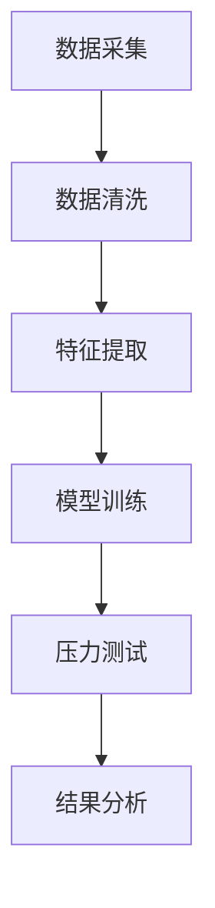
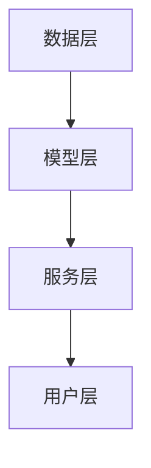

                 


# 智能个人财务压力测试工具

## 关键词：个人财务压力测试、人工智能、风险管理、机器学习、财务健康评估、智能工具

## 摘要：本文介绍了一种基于人工智能技术的智能个人财务压力测试工具，该工具通过分析用户的财务数据，利用机器学习算法预测潜在的财务风险，并提供相应的优化建议，帮助个人更好地管理财务健康。文章详细阐述了工具的核心算法原理、系统架构设计、项目实现过程及实际应用案例。

---

# 第一部分：智能个人财务压力测试工具的背景与概念

## 第1章：个人财务压力测试的背景与问题描述

### 1.1 个人财务压力测试的背景

#### 1.1.1 个人财务压力的定义与重要性
个人财务压力是指由于收入、支出、资产和负债等财务状况的变化，可能对个人生活质量或财务健康造成的负面影响。在现代社会，财务管理越来越复杂，个人可能面临多种财务风险，例如突发的医疗费用、失业风险、投资亏损等。及时识别和评估这些风险，对于维护个人财务健康至关重要。

#### 1.1.2 当前个人财务管理的痛点
传统的个人财务管理方式存在以下问题：
- 数据分散：个人的财务数据可能分布在多个平台（如银行账户、投资账户、信用卡等），难以整合和分析。
- 计算复杂：手动计算财务压力需要复杂的公式和步骤，容易出错。
- 缺乏预测性：传统的财务分析方法难以预测未来可能出现的财务风险。

#### 1.1.3 压力测试在个人财务中的应用
压力测试是一种通过模拟极端情况来评估系统或个体承受能力的方法。在个人财务中，压力测试可以帮助用户评估在特定情况下（如收入下降、支出增加）的财务健康状况，并制定应对策略。

---

### 1.2 问题背景与目标

#### 1.2.1 个人财务压力测试的核心目标
- 评估个人在不同情景下的财务承受能力。
- 发现潜在的财务风险点。
- 提供优化财务结构的建议。

#### 1.2.2 传统财务压力测试的局限性
- 传统方法依赖人工计算，效率低且容易出错。
- 缺乏对动态数据的实时分析能力。
- 无法根据个人行为习惯提供个性化建议。

#### 1.2.3 智能化工具的必要性
随着人工智能技术的发展，通过智能化工具可以实现以下目标：
- 实时分析个人的财务数据。
- 自动生成压力测试报告。
- 提供个性化的财务优化建议。

---

### 1.3 智能个人财务压力测试工具的定义

#### 1.3.1 核心概念与边界
智能个人财务压力测试工具是一种基于人工智能技术，能够自动分析个人财务数据、评估财务风险，并提供优化建议的工具。其边界包括：
- 数据输入：个人的收入、支出、资产、负债等数据。
- 数据处理：数据清洗、特征提取。
- 模型训练：基于历史数据训练机器学习模型。
- 输出：压力测试报告、优化建议。

#### 1.3.2 工具的功能定位
- 数据整合与分析：将分散的财务数据整合到一个平台，并进行清洗和分析。
- 风险评估：利用机器学习算法预测潜在的财务风险。
- 优化建议：根据压力测试结果，提供个性化的财务优化方案。

#### 1.3.3 工具的适用场景
- 个人财务管理：帮助用户了解当前财务状况。
- 风险预警：在潜在风险发生前发出预警。
- 投资决策：为投资决策提供数据支持。

---

### 1.4 核心概念与联系

#### 1.4.1 压力测试的基本概念
压力测试是一种通过模拟极端情况来评估系统或个体承受能力的方法。在个人财务中，压力测试可以帮助用户评估在特定情景下的财务健康状况。

#### 1.4.2 智能工具的核心原理
智能个人财务压力测试工具通过以下步骤实现压力测试：
1. 数据采集：收集个人的收入、支出、资产、负债等数据。
2. 数据处理：清洗数据并提取特征。
3. 模型训练：利用机器学习算法训练压力测试模型。
4. 压力测试：模拟极端情景，评估财务承受能力。
5. 优化建议：根据测试结果提供优化方案。

#### 1.4.3 核心概念对比表
```markdown
| 概念          | 描述                                                                 |
|---------------|----------------------------------------------------------------------|
| 压力测试      | 评估系统在极端条件下的表现                                             |
| 智能工具      | 利用AI技术辅助测试                                                     |
| 个人财务      | 包括收入、支出、资产、负债等                                          |
```

#### 1.4.4 实体关系图


---

## 第2章：智能个人财务压力测试工具的核心原理

### 2.1 工具的核心算法原理

#### 2.1.1 基于机器学习的压力测试算法
压力测试的核心算法是基于机器学习的分类模型，例如随机森林或梯度提升树（如XGBoost）。这些模型可以用于预测个人在特定情景下的财务风险等级。

#### 2.1.2 算法流程图


#### 2.1.3 算法实现代码
以下是一个基于XGBoost的简单实现示例：
```python
import xgboost as xgb
from sklearn.model_selection import train_test_split

# 数据准备
X_train, X_test, y_train, y_test = train_test_split(X, y, test_size=0.2)

# 模型训练
model = xgb.XGBClassifier()
model.fit(X_train, y_train)

# 预测
y_pred = model.predict(X_test)

# 评估
print("Accuracy:", accuracy_score(y_test, y_pred))
```

#### 2.1.4 数学模型与公式
压力测试模型的损失函数可以表示为：
$$
L(y, \hat{y}) = \sum_{i=1}^{n}(y_i - \hat{y}_i)^2
$$
其中，$y$ 是真实值，$\hat{y}$ 是预测值，$n$ 是样本数量。

---

### 2.2 工具的核心功能模块

#### 2.2.1 数据采集模块
数据采集模块负责从多个数据源（如银行账户、投资账户等）获取个人的财务数据。

#### 2.2.2 数据处理模块
数据处理模块对采集到的数据进行清洗、特征提取和标准化处理。

#### 2.2.3 模型训练模块
模型训练模块基于处理后的数据训练机器学习模型，并保存模型参数。

#### 2.2.4 压力测试模块
压力测试模块利用训练好的模型对特定情景进行模拟，并生成压力测试报告。

---

## 第3章：智能个人财务压力测试工具的系统架构设计

### 3.1 系统功能设计

#### 3.1.1 数据层
数据层包括数据采集、数据清洗和数据存储功能。

#### 3.1.2 模型层
模型层包括特征提取、模型训练和模型预测功能。

#### 3.1.3 服务层
服务层负责接收用户的请求，调用模型进行压力测试，并返回结果。

#### 3.1.4 用户层
用户层是工具的前端界面，用户可以通过界面输入数据、查看测试结果和优化建议。

---

### 3.2 系统架构图


---

## 第4章：智能个人财务压力测试工具的项目实战

### 4.1 环境安装与配置
需要安装以下工具和库：
- Python
- Pandas、NumPy、Scikit-learn、XGBoost
- Mermaid图表工具

### 4.2 核心功能实现
以下是一个简单的压力测试实现示例：
```python
import pandas as pd
from sklearn.ensemble import RandomForestClassifier

# 数据加载
data = pd.read_csv('financial_data.csv')

# 特征选择
features = ['income', 'expenses', 'assets', 'liabilities']
target = 'risk_level'

X = data[features]
y = data[target]

# 数据分割
X_train, X_test, y_train, y_test = train_test_split(X, y, test_size=0.2)

# 模型训练
model = RandomForestClassifier()
model.fit(X_train, y_train)

# 模型预测
y_pred = model.predict(X_test)

# 模型评估
print(classification_report(y_test, y_pred))
```

### 4.3 代码解读与分析
- 数据加载：使用Pandas读取CSV格式的财务数据。
- 特征选择：选择与财务压力相关的特征。
- 数据分割：将数据分为训练集和测试集。
- 模型训练：使用随机森林算法训练分类模型。
- 模型预测：对测试集进行预测，并输出结果报告。

---

## 第5章：总结与展望

### 5.1 项目总结
本文详细介绍了智能个人财务压力测试工具的背景、核心原理、系统架构和实现过程。通过机器学习算法，工具能够帮助个人更好地管理财务健康。

### 5.2 未来展望
未来，可以进一步优化模型，增加更多的数据源，开发移动端应用，提升用户体验。

---

## 注意事项
- 数据隐私：在实际应用中，需要确保用户的财务数据安全。
- 模型局限性：机器学习模型的预测能力依赖于数据质量和模型训练情况。

---

## 拓展阅读
- 《机器学习实战》
- 《深入浅出机器学习》
- 《风险管理与压力测试》

---

作者：AI天才研究院 & 禅与计算机程序设计艺术

