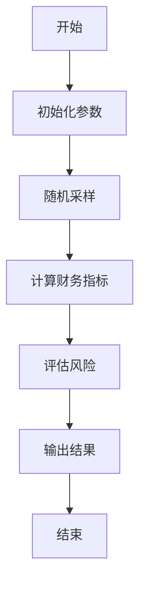
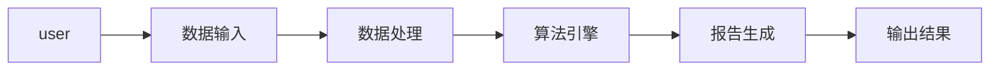
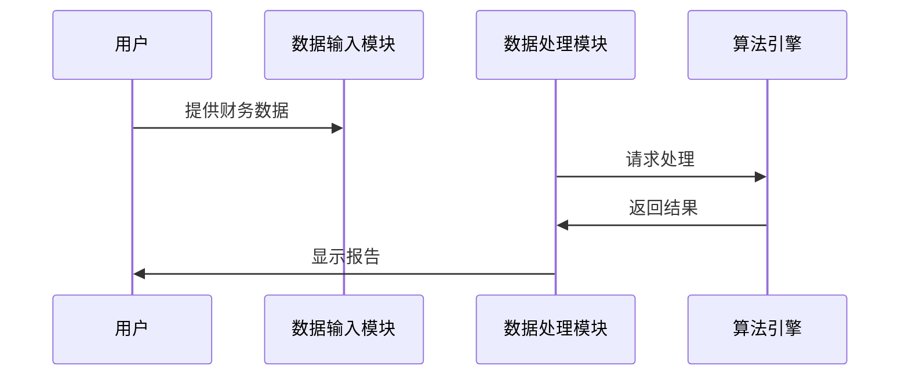

                 


# 智能个人财务压力测试工具

## 关键词：个人财务，压力测试，智能工具，算法，系统架构

## 摘要：本文介绍了一款智能个人财务压力测试工具，结合背景分析、核心概念、算法原理、系统架构和项目实战，详细讲解了如何利用人工智能和数据分析技术帮助个人进行财务压力测试，评估财务健康状况，制定应对策略。

---

## 第1章：背景介绍

### 1.1 问题背景

随着经济波动加剧和个人理财需求的增长，个人面临的财务压力问题日益突出。传统财务压力测试方法依赖人工计算，耗时且缺乏智能化。智能工具的引入，能够高效、精准地帮助用户评估财务风险，优化财务结构。

### 1.2 问题描述

个人财务压力测试涉及收支平衡、债务管理、应急储备等方面，传统方法难以全面分析复杂场景。智能工具通过数据驱动和自动化算法，提供个性化解决方案。

### 1.3 问题解决与边界

智能工具采用机器学习和大数据分析，解决传统方法效率低、覆盖不全的问题。工具适用于个人用户，边界包括收入、支出、资产、负债等核心数据，功能涵盖测试、分析、建议。

---

## 第2章：核心概念与联系

### 2.1 核心概念

- **压力测试模型**：分析用户在特定压力下的财务状况。
- **智能算法**：利用机器学习优化测试结果。
- **数据处理模块**：清洗和预处理财务数据。
- **用户交互界面**：提供友好的操作体验。

### 2.2 概念对比与实体关系

| 概念 | 属性 | 描述 |
|------|------|------|
| 收入 | 来源 | 工资、投资收益 |
| 支出 | 类别 | 生活支出、债务还款 |

```mermaid
erd
    entity 收入 {
        收入来源
    }
    entity 支出 {
        支出类别
    }
    entity 用户 {
        用户ID
    }
    收入 - 用户：属于
    支出 - 用户：属于
```

---

## 第3章：算法原理

### 3.1 算法概述

采用蒙特卡洛模拟，通过多次随机采样评估财务健康状况。该方法适合处理财务数据的不确定性。

### 3.2 算法流程



### 3.3 算法实现

```python
import numpy as np

def financial_stress_test(income, expenses, debt):
    scenarios = 1000
    results = []
    for _ in range(scenarios):
        # 随机模拟收入减少和支出增加
        adjusted_income = income * (1 - np.random.uniform(0.1, 0.2))
        adjusted_expenses = expenses * (1 + np.random.uniform(0.05, 0.1))
        net_cash_flow = adjusted_income - adjusted_expenses - debt
        results.append(net_cash_flow)
    return results

# 示例数据
income = 5000
expenses = 3000
debt = 2000

results = financial_stress_test(income, expenses, debt)
print("模拟结果：", results)
```

### 3.4 数学模型

$$
\text{净现金流} = \text{调整收入} - \text{调整支出} - \text{债务}
$$

其中，调整收入和支出是通过蒙特卡洛模拟得到的。

---

## 第4章：系统架构

### 4.1 系统分析

系统需处理用户输入的财务数据，运行算法，生成报告。核心模块包括数据处理、算法引擎和用户界面。

### 4.2 系统架构图



### 4.3 接口与交互设计



---

## 第5章：项目实战

### 5.1 环境安装

安装Python和必要的库：numpy、pandas、matplotlib。

### 5.2 核心代码实现

```python
import numpy as np
import pandas as pd
import matplotlib.pyplot as plt

def generate_report(income, expenses, debt):
    results = financial_stress_test(income, expenses, debt)
    df = pd.DataFrame(results, columns=['净现金流'])
    df.describe()
    plt.hist(results, bins=50)
    plt.show()

generate_report(income, expenses, debt)
```

### 5.3 案例分析

模拟失业情况，测试净现金流。分析结果，优化支出和增加收入。

### 5.4 总结与经验

工具帮助用户识别潜在风险，制定应对策略。建议定期更新数据，保持模型准确性。

---

## 第6章：最佳实践与注意事项

- 定期更新财务数据，保持模型准确性。
- 理解算法的局限性，避免过度依赖结果。
- 结合实际情况调整参数，确保测试结果的有效性。

---

## 小结

智能个人财务压力测试工具通过先进的算法和系统架构，帮助用户高效评估财务风险，制定应对策略。结合实际案例和代码实现，用户可以轻松掌握工具的使用，优化个人财务状况。

---

## 作者

作者：AI天才研究院/AI Genius Institute & 禅与计算机程序设计艺术 /Zen And The Art of Computer Programming

