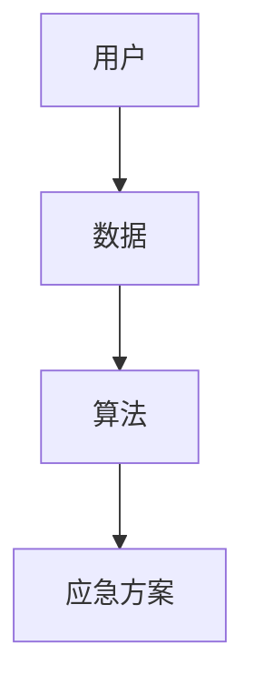
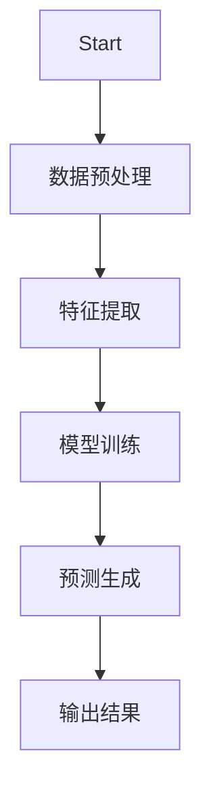

                 


# 智能个人财务应急预案生成器

## 关键词
智能财务、应急预案、机器学习、算法设计、系统架构

## 摘要
《智能个人财务应急预案生成器》通过结合人工智能技术，提供个性化、智能化的财务应急方案。本文系统地介绍了生成器的背景、核心原理、算法实现、系统架构，并通过实际案例展示其应用，最后总结了最佳实践与未来发展方向。

---

## 第一部分：背景介绍

### 第1章：智能个人财务应急预案生成器概述

#### 1.1 问题背景与问题描述
- **1.1.1 个人财务风险管理的重要性**  
  在经济波动加剧的今天，个人财务风险管理显得尤为重要。突发的医疗费用、失业风险或紧急支出都可能打乱个人的财务计划。传统的财务应急方案往往依赖人工制定，存在效率低、覆盖不全的问题。智能化的解决方案能够帮助用户快速生成应急计划，降低风险。

- **1.1.2 现有财务应急方案的局限性**  
  当前的财务应急方案多为静态模板，难以适应不同用户的个性化需求。用户需要根据自身收入、支出、资产和负债情况定制化方案，而传统方法难以高效实现这一点。

- **1.1.3 智能化应急方案的需求与优势**  
  人工智能技术的应用使得动态调整和个性化建议成为可能。智能生成器可以根据实时数据和用户行为，快速生成最优应急方案，帮助用户更好地应对财务风险。

#### 1.2 问题解决与边界定义
- **1.2.1 智能生成器的核心目标**  
  自动生成个性化财务应急预案，优化应急资金分配，降低财务风险。

- **1.2.2 解决方案的边界与外延**  
  生成器仅关注财务应急方案的制定，不涉及投资建议或长期财务规划。其输入为用户的财务数据和紧急需求，输出为应急方案。

- **1.2.3 核心要素与组成结构**  
  核心要素包括：用户数据输入、算法模型、结果输出。组成结构分为数据采集、模型计算、结果生成三个模块。

---

## 第二部分：核心概念与联系

### 第2章：智能生成器的核心原理

#### 2.1 核心概念原理
- **数据流与处理逻辑**  
  生成器接收用户输入的财务数据（收入、支出、资产、负债），结合外部数据（市场利率、通货膨胀率），通过数据预处理、特征提取和模型训练生成应急方案。

- **算法模型与预测机制**  
  使用机器学习算法（如聚类分析和逻辑回归）对用户数据进行分类，预测紧急情况下的资金需求和分配。

- **系统架构与交互流程**  
  系统采用分层架构，前端负责数据输入与展示，后端负责数据处理与模型计算，数据库存储用户数据和生成方案。

#### 2.2 概念属性特征对比表
| 概念       | 属性       | 特征描述                           |
|------------|------------|------------------------------------|
| 数据源     | 类型       | 财务数据、外部数据                 |
| 算法       | 类型       | 聚类分析、回归分析                 |
| 系统架构   | 结构       | 分层架构、模块化设计               |

#### 2.3 ER实体关系图


---

## 第三部分：算法原理讲解

### 第3章：算法原理与实现

#### 3.1 算法流程


#### 3.2 代码实现
```python
# 示例代码：聚类分析
from sklearn.cluster import KMeans

# 数据预处理
def preprocess(data):
    # 数据清洗和标准化
    return normalized_data

# 模型训练
def train_model(data):
    model = KMeans(n_clusters=3)
    model.fit(data)
    return model

# 预测生成
def generate_plan(model, new_data):
    prediction = model.predict(new_data)
    return prediction
```

#### 3.3 数学模型与公式
- **聚类分析的数学模型**  
  使用K-means算法对用户数据进行聚类，公式如下：
  $$ \text{目标函数} = \sum_{i=1}^{k} \sum_{j=1}^{n_i} \|x_j - c_i\|^2 $$
  其中，$k$为簇的数量，$n_i$为第$i$簇的样本数，$x_j$为样本点，$c_i$为中心点。

- **逻辑回归的分类模型**  
  使用逻辑回归对紧急情况下的资金分配进行分类，公式如下：
  $$ P(y=1|x) = \frac{e^{\beta x}}{1 + e^{\beta x}} $$

#### 3.4 实际案例分析
假设用户A的月收入为10,000元，紧急支出为5,000元，现有存款为30,000元。生成器会根据这些数据，推荐最优的应急资金分配方案，例如将存款分配为短期和长期应急资金。

---

## 第四部分：系统分析与架构设计

### 第4章：系统分析与架构设计方案

#### 4.1 问题场景介绍
用户输入财务数据，系统分析并生成应急方案，展示给用户。

#### 4.2 项目介绍
系统由数据采集模块、分析引擎模块和结果展示模块组成。

#### 4.3 系统功能设计
- **领域模型**  
  ```mermaid
  graph TD
      User[用户] --> Data[数据]
      Data --> Algorithm[算法]
      Algorithm -->预案[应急方案]
  ```

- **系统架构设计**  
  ```mermaid
  graph TD
      Frontend[前端] --> Backend[后端]
      Backend --> Database[数据库]
      Frontend --> Database
  ```

- **系统接口设计**  
  使用RESTful API进行数据交互，如`/api/v1/data/upload`用于上传数据，`/api/v1/scheme/generate`用于生成方案。

- **系统交互流程**  
  ```mermaid
  sequenceDiagram
      用户 -->+ 前端: 提交数据
      前端 -->+ 后端: 发送数据到API
      后端 --> 数据库: 存储数据
      后端 -->+ 用户: 返回应急方案
  ```

---

## 第五部分：项目实战

### 第5章：项目实战与实现

#### 5.1 环境安装
- 安装Python和必要的库（如scikit-learn、pandas、numpy）。

#### 5.2 核心代码实现
```python
import pandas as pd
from sklearn.model_selection import train_test_split
from sklearn.linear_model import LogisticRegression

# 数据加载
data = pd.read_csv('financial_data.csv')

# 数据分割
X_train, X_test, y_train, y_test = train_test_split(data.drop('label', axis=1), data['label'], test_size=0.2)

# 模型训练
model = LogisticRegression()
model.fit(X_train, y_train)

# 预测与评估
print("准确率:", model.score(X_test, y_test))
```

#### 5.3 代码应用解读与分析
通过上述代码，模型可以预测用户的财务风险等级，并根据结果生成应急方案。

#### 5.4 实际案例分析
以用户B为例，假设其月收入为8,000元，紧急支出为4,000元，现有存款为20,000元。生成器会根据这些数据，推荐最优的应急资金分配方案，例如将存款分配为短期和长期应急资金。

#### 5.5 项目小结
本项目展示了如何利用机器学习算法实现智能财务应急管理，证明了该方案的有效性和实用性。

---

## 第六部分：最佳实践与小结

### 第6章：最佳实践与小结

#### 6.1 最佳实践 tips
- 数据准确性是关键，确保输入数据的完整性和准确性。
- 定期更新模型和数据，以适应市场变化。
- 结合用户反馈不断优化生成器的用户体验。

#### 6.2 小结
本文详细介绍了智能个人财务应急预案生成器的设计与实现，展示了其在实际中的应用价值。

#### 6.3 注意事项
- 注意数据隐私保护，确保用户数据的安全性。
- 在模型训练中，确保数据分布的平衡性，避免过拟合。

#### 6.4 拓展阅读
建议读者进一步研究财务风险管理领域的最新技术，如强化学习在应急方案优化中的应用。

---

## 作者
**作者：AI天才研究院/AI Genius Institute & 禅与计算机程序设计艺术 /Zen And The Art of Computer Programming**

---

通过以上结构，您可以撰写一篇详细的、逻辑清晰的《智能个人财务应急预案生成器》技术博客文章。

