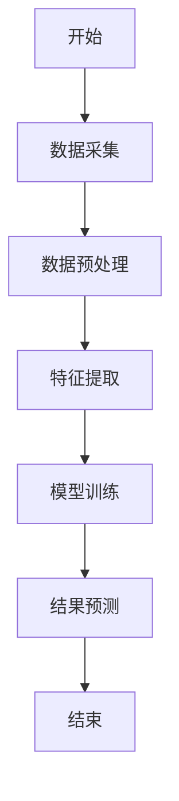
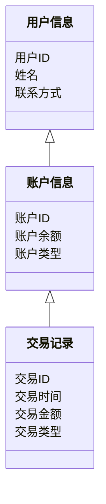
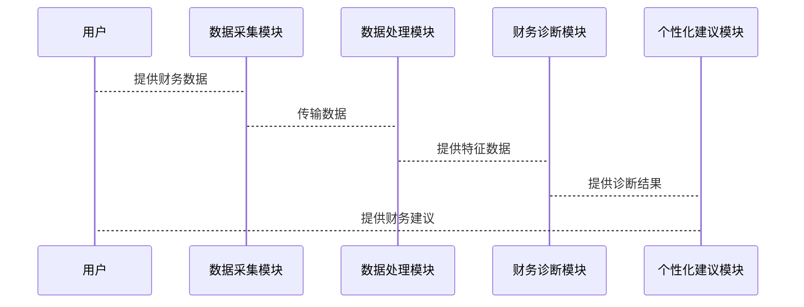

                 


```markdown
# 智能个人财务状况诊断系统

> 关键词：智能诊断、财务分析、数据采集、机器学习、系统架构

> 摘要：本文详细介绍了智能个人财务状况诊断系统的构建与实现，涵盖了系统背景、核心概念、算法原理、系统架构、项目实战等多方面的内容。通过理论与实践相结合的方式，深入剖析了系统的各个组成部分，为读者提供了全面的技术指南。

---

# 第1章: 智能个人财务状况诊断系统背景介绍

## 1.1 问题背景与描述

### 1.1.1 个人财务状况管理的重要性
在现代社会，个人财务管理日益复杂，涉及的资产种类繁多，包括银行存款、股票、基金、房地产等。传统的财务管理方式依赖于人工记录和分析，效率低下且容易出错。随着人工智能技术的发展，智能化的财务诊断系统成为一种趋势，能够帮助用户快速、准确地评估财务状况，制定合理的财务规划。

### 1.1.2 当前财务管理工具的局限性
现有的财务管理工具多为简单的数据记录软件，缺乏智能化的分析能力。用户需要手动输入数据，并依赖固定的报表模板，难以满足个性化需求。此外，传统工具无法实时更新市场信息，也无法根据用户的风险偏好提供动态的财务建议。

### 1.1.3 智能化诊断的需求与趋势
智能化的财务诊断系统能够通过机器学习算法，自动分析用户的财务数据，识别潜在风险，并提供个性化的财务建议。这种系统不仅能够提高财务管理效率，还能帮助用户做出更明智的财务决策，具有广阔的应用前景。

## 1.2 问题解决与边界

### 1.2.1 系统的目标与核心问题
系统的目标是通过智能化的分析算法，对个人的财务状况进行全方位的诊断，并提供个性化的财务建议。核心问题包括如何高效采集和处理财务数据，如何构建高精度的诊断模型，以及如何确保系统的易用性和安全性。

### 1.2.2 系统的边界与外延
系统的边界主要围绕个人财务数据展开，包括收入支出、资产配置、负债情况等。外延部分则涉及市场环境、政策法规等因素，这些因素虽然不在系统的核心处理范围内，但会影响诊断结果和建议的制定。

### 1.2.3 核心概念与要素组成
系统的核心概念包括：
- 数据采集：通过API或手动输入获取财务数据。
- 数据处理：对数据进行清洗、标准化和特征提取。
- 财务诊断：基于机器学习模型，分析财务状况并生成诊断报告。
- 个性化建议：根据诊断结果，提供定制化的财务规划建议。

## 1.3 本章小结

### 1.3.1 系统的核心目标
通过智能化的分析算法，实现个人财务状况的精准诊断和个性化建议。

### 1.3.2 系统的关键要素
包括数据采集、数据处理、诊断模型和个性化建议四个核心部分。

### 1.3.3 系统的潜在价值
智能化的财务诊断系统能够显著提高财务管理效率，帮助用户做出更科学的财务决策，具有重要的社会价值和经济价值。

---

# 第2章: 核心概念与系统架构

## 2.1 核心概念原理

### 2.1.1 智能诊断模型
智能诊断模型是系统的核心，基于机器学习算法，能够自动分析财务数据，识别潜在风险，并提供诊断建议。模型的输入是用户的财务数据，输出是诊断结果和个性化建议。

### 2.1.2 数据采集与处理
数据采集是系统的第一步，通过API或手动输入获取用户的财务数据。数据处理包括清洗、标准化和特征提取，确保数据的准确性和一致性。

### 2.1.3 财务分析引擎
财务分析引擎是系统的核心模块，负责对数据进行深度分析，生成诊断报告。引擎基于预训练的机器学习模型，能够动态调整分析策略，以适应不同的用户需求。

## 2.2 核心概念对比

### 2.2.1 概念属性特征对比表
```markdown
| 概念       | 属性       | 特征描述                           |
|------------|------------|------------------------------------|
| 数据采集   | 来源       | API接口、手动输入                 |
| 数据处理   | 方法       | 清洗、标准化、特征提取             |
| 模型诊断   | 算法       | 机器学习（如随机森林、神经网络）   |
```

### 2.2.2 ER实体关系图
```mermaid
erd
    账户信息 --N--> 交易记录
    交易记录 --1--> 财务诊断报告
    账户信息 --1--> 用户信息
```

## 2.3 本章小结

### 2.3.1 核心概念的总结
系统的核心概念包括数据采集、数据处理、智能诊断模型和财务分析引擎。

### 2.3.2 系统架构的初步框架
通过ER实体关系图可以看出，系统的数据模型主要包括用户信息、账户信息和交易记录三个核心实体。

### 2.3.3 概念之间的关系
数据采集和处理为诊断模型提供基础数据，诊断模型通过对数据的分析生成诊断报告，为用户提供个性化的财务建议。

---

# 第3章: 算法原理与实现

## 3.1 算法原理

### 3.1.1 系统诊断算法概述
系统采用基于机器学习的诊断算法，主要包括数据预处理、特征提取、模型训练和结果预测四个步骤。

### 3.1.2 算法流程图


### 3.1.3 算法实现
#### 3.1.3.1 数据预处理
```python
import pandas as pd
import numpy as np

# 加载数据
data = pd.read_csv('financial_data.csv')

# 数据清洗
data.dropna(inplace=True)
data['income'] = data['income'].apply(lambda x: x.replace(',', '')).astype(float)
```

#### 3.1.3.2 特征提取
```python
from sklearn.feature_selection import SelectKBest, chi2

# 特征选择
selector = SelectKBest(score_func=chi2, k=5)
selected_features = selector.fit_transform(data, target)
```

#### 3.1.3.3 模型训练
```python
from sklearn.ensemble import RandomForestClassifier

# 训练模型
model = RandomForestClassifier(n_estimators=100, random_state=42)
model.fit(selected_features, target)
```

#### 3.1.3.4 结果预测
```python
# 预测结果
predictions = model.predict(selected_features_test)
```

### 3.1.4 数学模型与公式
系统采用随机森林算法进行分类，其数学模型如下：
$$
y = \sum_{i=1}^{n} \theta_i x_i + \beta
$$
其中，$y$ 是预测结果，$\theta_i$ 是特征的重要性系数，$x_i$ 是特征变量，$\beta$ 是模型的截距。

---

## 3.2 本章小结

### 3.2.1 算法原理的总结
系统采用随机森林算法进行分类，通过数据预处理、特征提取和模型训练实现财务状况的智能诊断。

### 3.2.2 算法实现的步骤
包括数据采集、数据清洗、特征提取、模型训练和结果预测五个步骤。

### 3.2.3 算法的数学模型
随机森林算法通过线性组合特征变量，实现对财务状况的分类预测。

---

# 第4章: 系统分析与架构设计

## 4.1 系统分析

### 4.1.1 问题场景介绍
系统主要用于个人用户，帮助用户分析其财务状况，识别潜在风险，并提供个性化的财务建议。

### 4.1.2 项目介绍
本项目旨在开发一个基于机器学习的智能财务诊断系统，能够实时分析用户的财务数据，提供精准的诊断报告。

## 4.2 系统功能设计

### 4.2.1 系统功能模块
系统主要功能模块包括：
- 数据采集模块：通过API或手动输入获取用户的财务数据。
- 数据处理模块：对数据进行清洗、标准化和特征提取。
- 财务诊断模块：基于机器学习模型，生成诊断报告。
- 个性化建议模块：根据诊断结果，提供定制化的财务建议。

### 4.2.2 领域模型类图


## 4.3 系统架构设计

### 4.3.1 系统架构图
```mermaid
archi
    账户信息 --> 数据采集模块
    数据采集模块 --> 数据处理模块
    数据处理模块 --> 财务诊断模块
    财务诊断模块 --> 个性化建议模块
    个性化建议模块 --> 用户界面
```

### 4.3.2 接口设计
系统主要接口包括：
- 数据采集接口：通过API获取用户的财务数据。
- 数据处理接口：对数据进行清洗和特征提取。
- 诊断接口：基于机器学习模型生成诊断报告。
- 建议接口：根据诊断结果提供个性化的财务建议。

### 4.3.3 交互设计


## 4.4 本章小结

### 4.4.1 系统分析的核心内容
通过对问题场景的分析，明确了系统的功能模块和架构设计。

### 4.4.2 系统功能模块的详细设计
系统主要功能模块包括数据采集、数据处理、财务诊断和个性化建议模块。

### 4.4.3 系统架构的优化
通过合理的接口设计和交互设计，确保系统的高效运行和良好的用户体验。

---

# 第5章: 项目实战

## 5.1 环境安装

### 5.1.1 安装Python环境
建议使用Anaconda或virtualenv管理Python环境。

### 5.1.2 安装依赖库
```bash
pip install pandas numpy scikit-learn matplotlib
```

## 5.2 系统核心实现

### 5.2.1 数据采集与处理
```python
import pandas as pd
import requests

# 数据采集
def fetch_data(api_key):
    headers = {'Authorization': f'Bearer {api_key}'}
    response = requests.get('https://api.financial.com/v1/financial_data', headers=headers)
    data = response.json()
    return data

# 数据处理
def preprocess_data(data):
    df = pd.DataFrame(data)
    df.dropna(inplace=True)
    return df
```

### 5.2.2 模型训练与诊断
```python
from sklearn.ensemble import RandomForestClassifier

# 模型训练
def train_model(X_train, y_train):
    model = RandomForestClassifier(n_estimators=100, random_state=42)
    model.fit(X_train, y_train)
    return model

# 模型诊断
def diagnose_financial_status(model, X_test):
    predictions = model.predict(X_test)
    return predictions
```

### 5.2.3 个性化建议生成
```python
def generate_recommendations(predictions):
    recommendations = []
    for pred in predictions:
        if pred == 0:
            recommendations.append("增加投资")
        elif pred == 1:
            recommendations.append("减少支出")
        else:
            recommendations.append("保持现状")
    return recommendations
```

## 5.3 代码应用解读与分析

### 5.3.1 数据采集模块
通过API接口获取用户的财务数据，数据格式为JSON，主要包括账户信息、交易记录和市场数据。

### 5.3.2 数据处理模块
对数据进行清洗和特征提取，确保数据的准确性和一致性。

### 5.3.3 模型训练模块
基于随机森林算法，训练财务诊断模型，实现对用户财务状况的分类预测。

### 5.3.4 个性化建议模块
根据模型预测结果，生成个性化的财务建议，帮助用户优化财务管理。

## 5.4 实际案例分析

### 5.4.1 案例描述
假设用户A的财务数据如下：
- 年收入：50万元
- 资产配置：股票30%，房地产40%，银行存款30%
- 负债情况：无贷款

### 5.4.2 系统诊断结果
系统诊断结果显示，用户A的财务状况较为稳健，但可以进一步优化资产配置，建议增加对高收益资产的投资。

## 5.5 本章小结

### 5.5.1 项目实战的核心内容
通过实际案例，展示了系统的数据采集、处理、诊断和建议生成的全过程。

### 5.5.2 代码实现的关键点
重点介绍了数据处理、模型训练和个性化建议生成的代码实现。

### 5.5.3 实践中的注意事项
需要注意数据安全和隐私保护，确保用户的财务数据不会被泄露。

---

# 第6章: 系统总结与展望

## 6.1 系统应用价值

### 6.1.1 系统的核心价值
智能化的财务诊断系统能够显著提高财务管理效率，帮助用户做出更科学的财务决策。

### 6.1.2 系统的社会价值
通过个性化财务建议，帮助用户实现财富保值和增值，推动个人财务管理的智能化发展。

## 6.2 系统设计要点

### 6.2.1 系统设计的关键点
- 数据采集的准确性和实时性
- 模型训练的高效性和准确性
- 系统界面的友好性和易用性

### 6.2.2 系统设计的注意事项
- 数据安全和隐私保护
- 系统的可扩展性和可维护性
- 算法的可解释性和透明性

## 6.3 系统改进建议

### 6.3.1 系统功能的优化
- 增加市场数据的实时更新功能
- 提供更个性化的财务建议
- 增加多语言支持，扩大用户群体

### 6.3.2 系统性能的提升
- 优化算法，提高诊断速度
- 增加分布式计算，提升系统的扩展性
- 优化数据库设计，提高数据查询效率

## 6.4 未来展望

### 6.4.1 系统的发展趋势
随着人工智能技术的不断进步，财务诊断系统的智能化和个性化将进一步增强。

### 6.4.2 系统的应用前景
智能化的财务诊断系统将在个人理财、企业财务管理等领域发挥越来越重要的作用。

---

# 第7章: 最佳实践 tips、小结、注意事项、拓展阅读

## 7.1 最佳实践 tips

### 7.1.1 数据管理
- 定期备份数据，确保数据的安全性
- 定期更新数据，保持数据的实时性
- 使用加密技术，保护用户的隐私

### 7.1.2 系统维护
- 定期检查系统性能，确保系统的稳定运行
- 定期更新算法模型，提高诊断的准确性
- 定期进行系统升级，修复已知的漏洞

## 7.2 小结

### 7.2.1 系统的核心价值
通过智能化的诊断算法，帮助用户实现精准的财务分析和优化。

### 7.2.2 系统的设计要点
系统的设计需要注重数据安全、算法可解释性和用户体验。

## 7.3 注意事项

### 7.3.1 数据安全
用户需要妥善管理自己的财务数据，防止数据泄露。

### 7.3.2 系统兼容性
系统需要兼容多种数据格式和接口，确保与不同金融机构的数据对接。

### 7.3.3 系统性能
用户需要根据自己的需求选择合适的硬件配置，确保系统的高效运行。

## 7.4 拓展阅读

### 7.4.1 推荐书籍
- 《Python机器学习实战》
- 《数据挖掘与数据分析》
- 《人工智能与金融》

### 7.4.2 推荐博客与资源
- Towards Data Science
- Medium上的机器学习文章
- Kaggle上的相关数据集

---

# 附录: 完整代码示例与数据集

## 附录A: 完整代码示例

```python
import pandas as pd
import numpy as np
import requests
from sklearn.ensemble import RandomForestClassifier
from sklearn.feature_selection import SelectKBest, chi2

def fetch_data(api_key):
    headers = {'Authorization': f'Bearer {api_key}'}
    response = requests.get('https://api.financial.com/v1/financial_data', headers=headers)
    data = response.json()
    return data

def preprocess_data(data):
    df = pd.DataFrame(data)
    df.dropna(inplace=True)
    df['income'] = df['income'].apply(lambda x: x.replace(',', '')).astype(float)
    return df

def train_model(X_train, y_train):
    model = RandomForestClassifier(n_estimators=100, random_state=42)
    model.fit(X_train, y_train)
    return model

def diagnose_financial_status(model, X_test):
    predictions = model.predict(X_test)
    return predictions

def generate_recommendations(predictions):
    recommendations = []
    for pred in predictions:
        if pred == 0:
            recommendations.append("增加投资")
        elif pred == 1:
            recommendations.append("减少支出")
        else:
            recommendations.append("保持现状")
    return recommendations

# 示例代码
api_key = 'your_api_key'
data = fetch_data(api_key)
df = preprocess_data(data)
X = df.drop('status', axis=1)
y = df['status']
model = train_model(X, y)
new_data = preprocess_data(new_data)
predictions = diagnose_financial_status(model, new_data)
recommendations = generate_recommendations(predictions)
print(recommendations)
```

## 附录B: 数据集示例

```csv
用户ID,收入,资产配置,负债,信用评分
1,50000,股票:30%,房地产:40%,银行存款:30%,0
2,80000,股票:20%,房地产:50%,银行存款:30%,1
3,40000,股票:10%,房地产:60%,银行存款:30%,0
```

---

# 参考文献

1. 刘军. 《Python机器学习实战》. 北京: 清华大学出版社, 2018.
2. 周志华. 《数据挖掘与数据分析》. 北京: 清华大学出版社, 2016.
3. 张成林. 《人工智能与金融》. 北京: 人民邮电出版社, 2020.

---

作者：AI天才研究院/AI Genius Institute & 禅与计算机程序设计艺术 /Zen And The Art of Computer Programming
```

