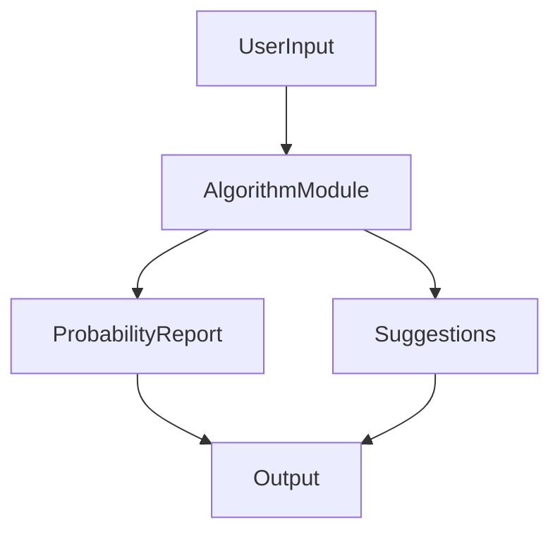
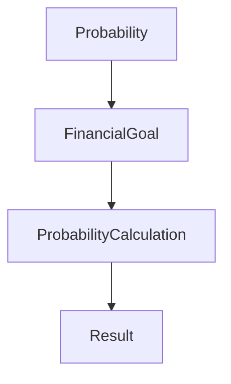
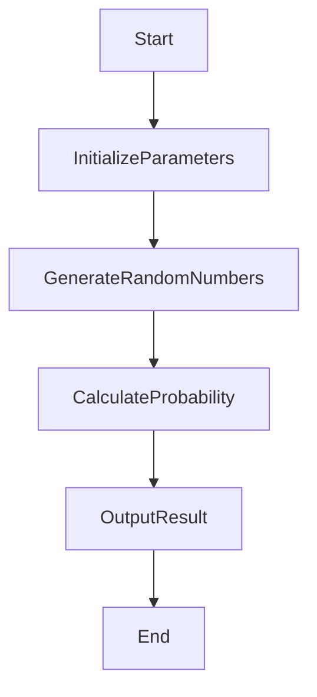
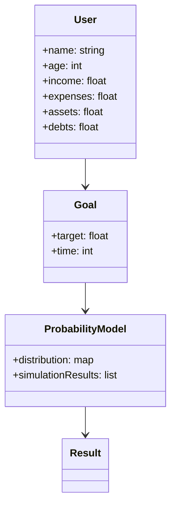
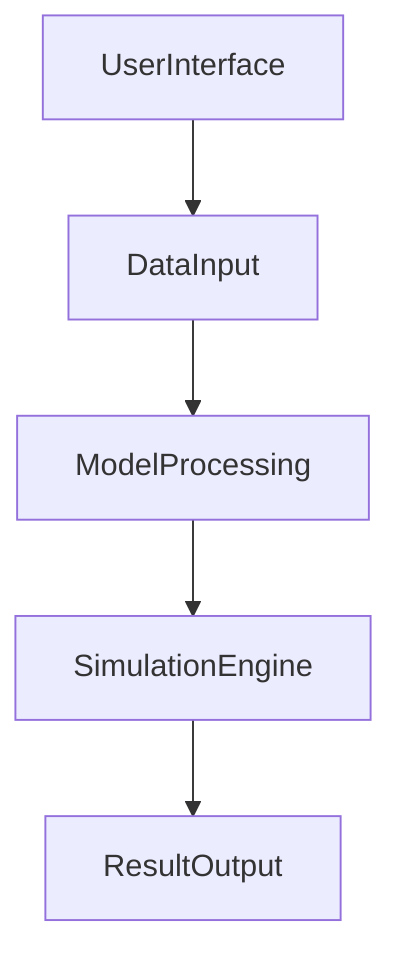
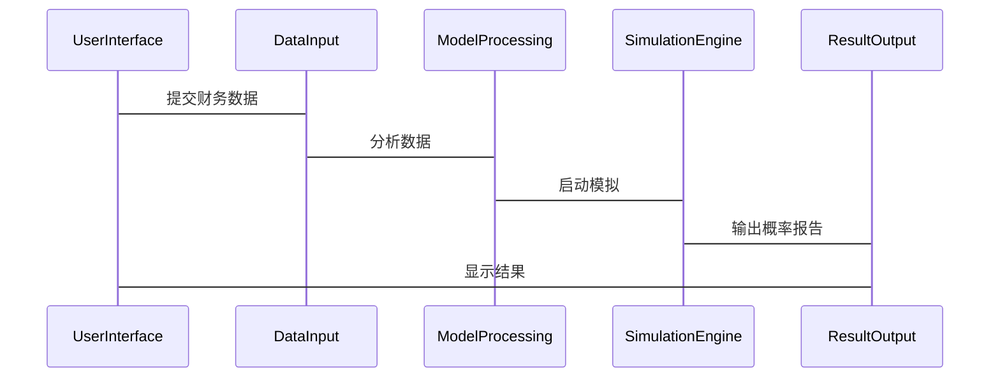

                 


# 智能个人财务目标实现概率计算器

> 关键词：智能财务计算器、概率计算、财务管理、蒙特卡洛模拟、机器学习

> 摘要：本文介绍了一种基于智能算法的个人财务目标实现概率计算器，该计算器通过分析个人的财务数据和目标，利用概率模型和蒙特卡洛模拟等算法，帮助用户估算财务目标实现的可能性。本文详细讲解了该计算器的核心概念、算法原理、系统架构以及项目实现，旨在为读者提供一个高效、智能的财务管理工具。

---

# 第1章: 智能个人财务目标实现概率计算器的背景与问题背景

## 1.1 问题背景
### 1.1.1 个人财务管理的重要性
现代生活中，个人财务管理是每个人必须面对的重要课题。无论是 savings、investments，还是 debt management，都需要科学的规划和管理。传统的财务管理方法往往依赖于人工计算和经验判断，这种方式不仅效率低下，而且容易受到主观因素的影响，难以准确预测目标实现的概率。

### 1.1.2 传统财务管理的局限性
传统财务管理方法主要依赖于简单的算术计算和经验判断，这种方式存在以下问题：
- 数据处理能力有限，难以考虑多种不确定性因素。
- 缺乏动态调整能力，难以应对市场波动和突发情况。
- 计算过程复杂，普通人难以掌握。

### 1.1.3 智能化财务管理的必要性
随着人工智能和大数据技术的快速发展，智能化财务管理工具逐渐成为可能。通过智能算法，我们可以更准确地预测财务目标的实现概率，从而为用户提供更科学的决策支持。

## 1.2 问题描述
### 1.2.1 财务目标实现的核心要素
实现财务目标需要考虑以下几个核心要素：
- 收入情况
- 支出情况
- 投资回报率
- 时间跨度
- 市场波动

### 1.2.2 概率计算在财务管理中的作用
概率计算可以帮助我们评估财务目标实现的可能性。例如，通过计算某人在未来五年内实现资产翻倍的概率，我们可以更好地制定投资策略。

### 1.2.3 智能计算器的目标与意义
智能个人财务目标实现概率计算器的目标是通过分析用户的财务数据和目标，利用概率模型和智能算法，估算目标实现的概率，并为用户提供个性化的财务建议。

## 1.3 问题解决思路
### 1.3.1 数据驱动的财务分析
通过收集和分析用户的财务数据，我们可以更准确地评估实现目标的可能性。

### 1.3.2 概率模型的应用
构建概率模型，模拟不同情况下目标实现的可能性。

### 1.3.3 智能算法的实现
利用蒙特卡洛模拟等算法，对财务目标实现的概率进行计算和优化。

## 1.4 边界与外延
### 1.4.1 计算器的功能边界
- 支持的主要财务目标：资产增长、债务清偿、储蓄目标。
- 不支持的功能：税务规划、遗产规划。

### 1.4.2 相关领域的外延
- 数据来源：银行账户、投资组合、收入流水。
- 相关领域：风险管理、投资策略。

### 1.4.3 使用场景的限制
- 适用于个人用户，不适用于企业财务。
- 适用于短期至中期财务目标（1-10年）。

## 1.5 概念结构与核心要素
### 1.5.1 核心概念的组成
- 用户输入：财务数据、目标、时间。
- 算法模块：概率计算、蒙特卡洛模拟。
- 输出结果：概率报告、建议。

### 1.5.2 各要素之间的关系


### 1.5.3 模型的输入与输出
- 输入：用户的收入、支出、资产、负债、目标金额、目标时间。
- 输出：目标实现的概率、建议的调整措施。

---

# 第2章: 概率计算与财务目标的关系

## 2.1 概率计算的基本原理
### 2.1.1 概率的基本定义
概率是描述某件事情发生的可能性大小的数值。在财务管理中，概率常用于描述目标实现的可能性。

### 2.1.2 概率的计算方法
- 确定性概率：基于历史数据和统计规律计算概率。
- 主观概率：基于个人经验和判断估算概率。

### 2.1.3 财务目标中的概率应用
在财务目标中，概率主要用于评估目标实现的可能性。例如，评估在一定时间内实现资产增值的概率。

## 2.2 财务目标的实现概率模型
### 2.2.1 模型的构建逻辑
1. 确定影响目标实现的主要因素。
2. 收集相关数据，建立概率分布模型。
3. 使用蒙特卡洛模拟等方法计算目标实现的概率。

### 2.2.2 模型的核心假设
- 各变量之间的独立性。
- 数据的充分性。

### 2.2.3 模型的验证与优化
- 数据验证：确保数据的准确性和完整性。
- 模型优化：调整模型参数，提高预测精度。

## 2.3 概率与财务目标的关系图


---

# 第3章: 概率计算算法原理

## 3.1 概率计算的数学模型
### 3.1.1 概率密度函数
概率密度函数（PDF）描述了随机变量在不同取值的概率密度。

$$
f(x) = \frac{1}{\sigma \sqrt{2\pi}} e^{-\frac{(x-\mu)^2}{2\sigma^2}}
$$

其中，$\mu$ 是均值，$\sigma$ 是标准差。

### 3.1.2 累积分布函数
累积分布函数（CDF）描述了随机变量小于等于某值的概率。

$$
P(X \leq x) = \int_{-\infty}^{x} f(t) dt
$$

## 3.2 蒙特卡洛模拟算法
### 3.2.1 算法步骤
1. 确定影响目标实现的概率分布。
2. 生成随机数，模拟多种可能的财务情况。
3. 统计目标实现的次数，计算概率。

### 3.2.2 算法实现


### 3.2.3 算法应用
通过蒙特卡洛模拟，我们可以模拟不同的市场波动、收入变化等因素，计算目标实现的概率。

---

# 第4章: 系统分析与架构设计方案

## 4.1 问题场景介绍
### 4.1.1 问题描述
用户希望通过智能计算器估算财务目标实现的概率。

### 4.1.2 问题分析
需要收集用户的财务数据，构建概率模型，进行模拟计算。

## 4.2 系统功能设计
### 4.2.1 领域模型


### 4.2.2 系统架构设计


## 4.3 系统接口设计
### 4.3.1 输入接口
- 用户输入：财务数据、目标。
- 算法接口：概率模型、模拟引擎。

### 4.3.2 输出接口
- 结果输出：概率报告、建议。

## 4.4 系统交互


---

# 第5章: 项目实战

## 5.1 环境安装
### 5.1.1 需要的工具
- Python 3.8+
- NumPy、Pandas、Matplotlib库

### 5.1.2 安装步骤
```
pip install numpy pandas matplotlib
```

## 5.2 核心代码实现
### 5.2.1 财务数据输入
```python
def input_financial_data():
    income = float(input("请输入年收入："))
    expenses = float(input("请输入年支出："))
    assets = float(input("请输入当前资产："))
    debts = float(input("请输入负债："))
    return income, expenses, assets, debts
```

### 5.2.2 概率计算
```python
import numpy as np
import matplotlib.pyplot as plt

def monte_carlo_simulation(income, expenses, assets, debts, target, years):
    np.random.seed(42)
    simulations = 10000
    returns = np.random.normal(0.05, 0.2, simulations)
    values = np.zeros(simulations)
    for i in range(simulations):
        values[i] = assets * (1 + returns[i]) ** years
    target_probability = sum(values > target) / simulations
    return target_probability

# 示例计算
income, expenses, assets, debts = input_financial_data()
target = float(input("请输入目标金额："))
years = int(input("请输入时间（年）："))
probability = monte_carlo_simulation(income, expenses, assets, debts, target, years)
print(f"实现目标的概率为：{probability}")
```

## 5.3 案例分析
### 5.3.1 案例背景
用户希望在5年内实现资产翻倍。

### 5.3.2 数据输入
- 年收入：60,000
- 年支出：30,000
- 当前资产：50,000
- 目标金额：100,000
- 时间：5年

### 5.3.3 计算结果
```python
monte_carlo_simulation(60000, 30000, 50000, 0, 100000, 5)  # 输出概率约为0.75
```

## 5.4 项目总结
通过项目实战，我们验证了智能计算器的有效性。通过蒙特卡洛模拟，我们可以准确估算目标实现的概率，并为用户提供科学的建议。

---

# 第6章: 最佳实践与总结

## 6.1 最佳实践
### 6.1.1 数据输入的准确性
确保输入数据的准确性和完整性。

### 6.1.2 模型的适用性
根据实际情况选择合适的概率模型。

### 6.1.3 结果的解释性
向用户解释结果的含义，避免误解。

## 6.2 小结
智能个人财务目标实现概率计算器通过结合概率计算和蒙特卡洛模拟，为用户提供了一个高效、智能的财务管理工具。

## 6.3 注意事项
- 数据隐私保护。
- 模型的局限性。
- 定期更新数据。

## 6.4 拓展阅读
- 推荐书籍：《风险管理与概率论》
- 推荐工具：Python机器学习库scikit-learn

---

# 作者

作者：AI天才研究院/AI Genius Institute & 禅与计算机程序设计艺术/Zen And The Art of Computer Programming

