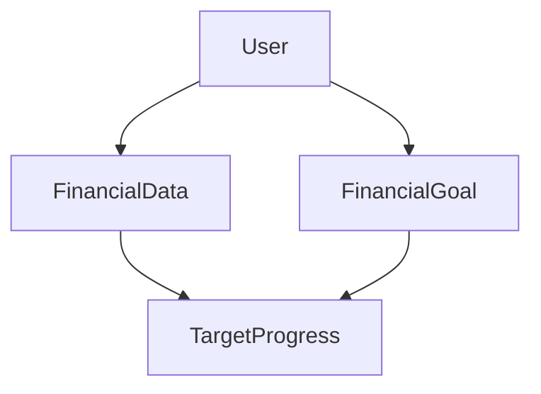
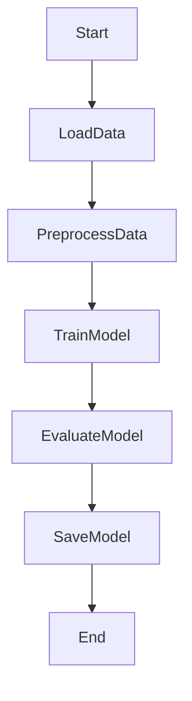
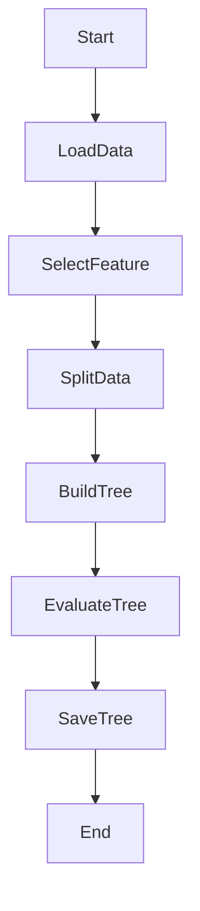
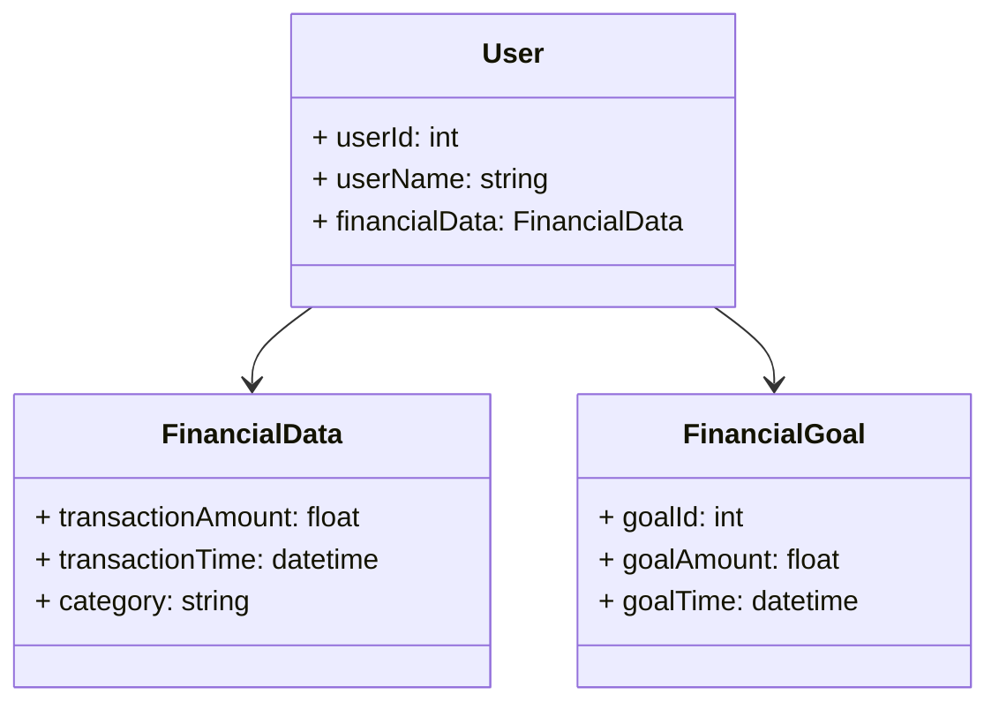
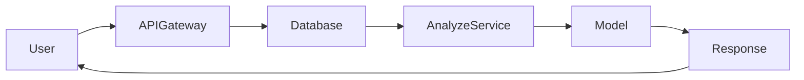
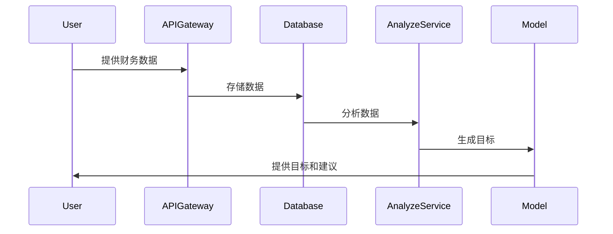

                 


# 智能个人财务目标设定助手

> 关键词：智能财务助手、人工智能、自然语言处理、机器学习、财务目标设定

> 摘要：本文将详细介绍如何利用人工智能技术设计一个智能个人财务目标设定助手，涵盖从背景需求分析、核心概念定义、算法实现、系统架构设计到实际项目开发的完整流程。通过本文的学习，读者将能够理解智能财务助手的核心技术原理，并掌握其实现方法。

---

# 第一部分: 智能个人财务目标设定助手的背景与需求

## 第1章: 问题背景与解决思路

### 1.1 问题背景
#### 1.1.1 财务目标设定的痛点
传统的财务目标设定依赖于人工记录和分析，存在以下问题：
- 数据分散：用户可能在多个平台（如银行、支付宝、股票账户）管理财务信息，难以统一汇总。
- 时间消耗：手动整理和分析财务数据需要大量时间，且容易出错。
- 缺乏智能化：用户无法根据市场变化或个人收支情况自动调整财务目标。

#### 1.1.2 智能化工具的需求
随着人工智能技术的发展，用户对智能化财务工具的需求日益增长：
- 实时数据分析：通过智能助手实时同步和分析财务数据。
- 自动化目标设定：基于历史数据和市场趋势，自动推荐合理的财务目标。
- 个性化建议：根据用户的消费习惯和财务状况提供个性化建议。

#### 1.1.3 解决思路与核心目标
智能个人财务目标设定助手的目标是通过整合用户的财务数据，利用机器学习和自然语言处理技术，帮助用户设定和管理财务目标。核心思路包括：
- 数据整合：从多个数据源获取用户的财务信息。
- 智能分析：利用算法对数据进行分析，生成个性化的财务目标。
- 人机交互：通过自然语言处理技术，让用户以自然的方式与系统交互。

---

## 第2章: 用户需求分析

### 2.1 核心用户群体
智能个人财务目标设定助手的主要用户群体包括：
- 个人用户：希望更好地管理个人财务目标的用户。
- 理财新手：缺乏财务知识，需要系统指导的用户。
- 中高收入人群：希望通过智能化工具优化资产配置的用户。

### 2.2 用户需求的边界与外延
- **核心需求**：用户希望系统能够自动分析财务数据，设定合理的财务目标，并提供个性化的建议。
- **边界**：不涉及复杂的金融交易（如股票投资）的执行，仅提供目标设定和建议。
- **外延**：未来可以扩展到企业财务管理和投资建议等领域。

### 2.3 用户需求的功能模块
- 数据采集模块：从多个数据源获取用户的财务数据。
- 数据分析模块：基于机器学习算法分析数据，生成财务目标。
- 交互模块：通过自然语言处理技术与用户交互，提供个性化建议。

---

# 第二部分: 智能个人财务目标设定助手的核心概念

## 第3章: 智能助手的核心概念与技术

### 3.1 核心概念
智能个人财务目标设定助手的核心概念包括：
- **数据整合**：从多个数据源获取用户的财务数据。
- **智能分析**：基于机器学习算法对数据进行分析，生成财务目标。
- **人机交互**：通过自然语言处理技术与用户交互，提供个性化建议。

### 3.2 技术实现
#### 3.2.1 数据整合技术
- 数据采集：通过API从银行、支付宝、股票账户等平台获取数据。
- 数据清洗：对获取的数据进行去重、格式统一等处理。

#### 3.2.2 机器学习算法
- **支持向量机（SVM）**：用于分类问题，如预测用户的消费习惯。
- **决策树（Decision Tree）**：用于回归问题，如预测用户的收入增长。

#### 3.2.3 自然语言处理技术
- **分词**：将用户输入的文本进行分词处理。
- **意图识别**：识别用户的意图（如“我要设定月度预算”）。
- **对话生成**：根据用户的意图生成相应的建议。

### 3.3 核心技术对比表
| 技术 | 优势 | 劣势 | 应用场景 |
|------|------|------|----------|
| 支持向量机 | 分类准确率高 | 不适合处理高维数据 | 财务数据分析 |
| 决策树 | �易解释 | 易过拟合 | 财务目标预测 |
| 自然语言处理 | 提高用户体验 | 实现复杂 | 用户交互 |

---

## 第4章: 核心概念的ER实体关系图



---

# 第三部分: 智能个人财务目标设定助手的核心算法与技术实现

## 第5章: 支持向量机算法原理

### 5.1 支持向量机的基本原理
支持向量机是一种监督学习算法，主要用于分类和回归问题。其核心思想是通过找到一个超平面，将数据分成两类。

### 5.2 支持向量机的数学模型
$$ \text{目标函数：} \min_{w,b,\xi} \frac{1}{2}\|w\|^2 + C\sum_{i=1}^n \xi_i $$
$$ \text{约束条件：} y_i(w \cdot x_i + b) \geq 1 - \xi_i $$
其中，\( w \) 是权重向量，\( b \) 是偏置项，\( \xi_i \) 是松弛变量，\( C \) 是惩罚系数。

### 5.3 支持向量机的实现流程


---

## 第6章: 决策树算法原理

### 6.1 决策树的基本原理
决策树是一种基于树状结构的回归或分类算法，通过特征选择构建树的结构。

### 6.2 决策树的实现流程


---

## 第7章: 自然语言处理技术实现

### 7.1 分词算法
- **jieba**：中文分词工具，支持多种分词模式。

### 7.2 意图识别
- **jieba.analyzer**：用于关键词提取和意图识别。

### 7.3 对话生成
- **seq2seq模型**：基于循环神经网络的对话生成模型。

---

# 第四部分: 智能个人财务目标设定助手的系统架构设计

## 第8章: 系统功能设计

### 8.1 功能模块
- 数据采集模块：从多个数据源获取财务数据。
- 数据分析模块：基于机器学习算法分析数据，生成财务目标。
- 交互模块：通过自然语言处理技术与用户交互，提供个性化建议。

### 8.2 系统功能的领域模型


---

## 第9章: 系统架构设计

### 9.1 系统架构图


---

## 第10章: 系统接口设计

### 10.1 数据接口
- **输入接口**：接收用户的财务数据。
- **输出接口**：返回用户的财务目标和建议。

### 10.2 交互接口
- **输入接口**：接收用户的自然语言输入。
- **输出接口**：返回系统的自然语言回复。

---

## 第11章: 系统交互设计

### 11.1 交互流程


---

# 第五部分: 智能个人财务目标设定助手的项目实战

## 第12章: 项目开发环境与工具

### 12.1 开发环境
- **Python**：编程语言。
- **TensorFlow**：机器学习框架。
- **Flask**：Web框架。

---

## 第13章: 核心代码实现

### 13.1 数据采集模块
```python
import requests

def get_financial_data(api_key):
    headers = {'Authorization': f'Bearer {api_key}'}
    response = requests.get('https://api.bank.com/transactions', headers=headers)
    return response.json()
```

### 13.2 数据分析模块
```python
from sklearn.svm import SVC

def train_svm_model(data, labels):
    model = SVC()
    model.fit(data, labels)
    return model
```

### 13.3 交互模块
```python
from jieba import anayizer

def extract_keywords(text):
    keywords = anayizer.extract_keywords(text)
    return keywords
```

---

## 第14章: 项目案例分析

### 14.1 案例背景
用户希望通过系统自动设定月度预算。

### 14.2 数据分析与目标生成
基于用户的消费数据，系统生成月度预算建议。

### 14.3 交互与反馈
用户与系统进行交互，系统提供个性化的财务建议。

---

## 第15章: 项目小结

### 15.1 项目总结
通过本项目，我们成功实现了智能个人财务目标设定助手的核心功能，包括数据采集、数据分析和人机交互。

### 15.2 项目经验
在项目开发过程中，我们需要注意数据安全和用户隐私保护。

---

# 第六部分: 智能个人财务目标设定助手的最佳实践

## 第16章: 小结与注意事项

### 16.1 小结
智能个人财务目标设定助手的实现依赖于多种技术的结合，包括数据采集、机器学习和自然语言处理。

### 16.2 注意事项
- 数据安全：用户数据的安全性必须放在首位。
- 算法选择：根据具体场景选择合适的算法。
- 交互体验：提供良好的交互体验可以提高用户满意度。

---

## 第17章: 拓展阅读

### 17.1 推荐书籍
- 《机器学习实战》
- 《自然语言处理入门》

### 17.2 推荐博客与资源
- TensorFlow官方文档
- Keras官方文档

---

# 作者
作者：AI天才研究院 & 禅与计算机程序设计艺术

