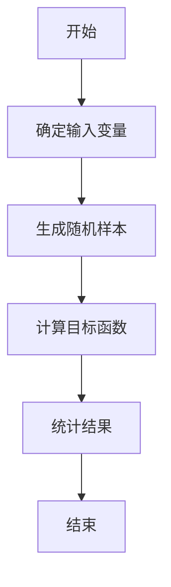
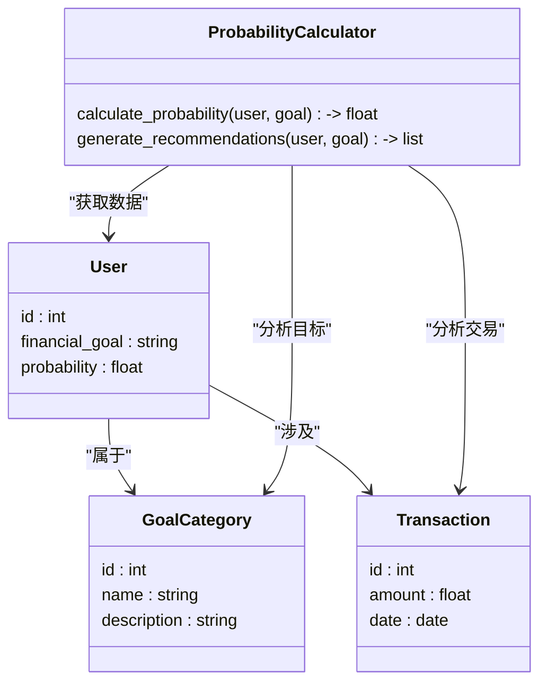
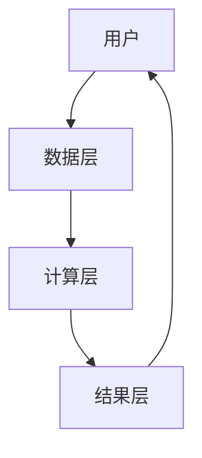
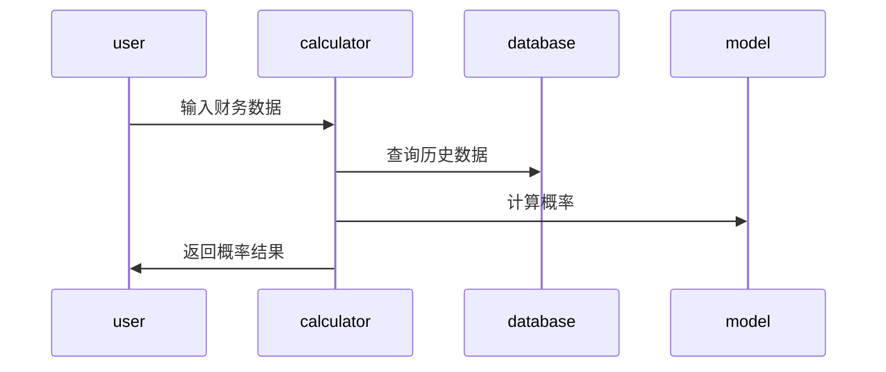

                 


# 智能个人财务目标达成概率计算器

## 关键词：智能财务目标，概率计算，蒙特卡洛模拟，机器学习，用户行为分析

## 摘要：  
本文将介绍一种基于人工智能和概率计算的智能个人财务目标达成概率计算器。通过分析个人财务数据，利用蒙特卡洛模拟和机器学习算法，帮助用户科学评估其财务目标的达成概率，并提供优化建议。文章将从背景、核心概念、算法原理、系统架构到项目实战，全面解析这一智能计算器的设计与实现。

---

## 第1章: 智能个人财务目标达成概率计算器的背景与意义

### 1.1 问题背景  
个人财务管理是现代生活中至关重要的一环，但许多人缺乏科学的工具和方法来评估其财务目标的可行性。传统的财务管理方法往往依赖于简单的预算和规划，难以准确预测目标达成的概率。  

#### 1.1.1 个人财务管理的痛点  
- 数据分散：财务数据分布在不同平台，难以统一管理。  
- 目标模糊：财务目标缺乏量化和时间维度的分解。  
- 风险评估不足：难以预测外部经济波动对目标的影响。  

#### 1.1.2 财务目标设定的常见误区  
- 过度乐观：低估了实现目标所需的时间和资源。  
- 过度悲观：忽视了潜在的收入增长和资产增值。  
- 目标分解不足：缺乏对目标的层次化分解，难以制定有效的执行策略。  

#### 1.1.3 概率计算在财务管理中的重要性  
概率计算能够帮助用户量化目标实现的可能性，从而制定更合理的财务策略。通过概率分析，用户可以更好地应对不确定性，并优化资源配置。  

### 1.2 概率计算器的核心概念  
概率计算器通过分析用户的财务数据，利用概率模型评估目标的实现概率。其核心概念包括：  
- **财务目标**：用户设定的财务目标，如买房、退休基金等。  
- **概率计算**：基于历史数据和模型，预测目标实现的可能性。  
- **用户行为分析**：通过分析用户的消费习惯和投资行为，优化目标实现的概率。  

### 1.3 技术基础与实现思路  
概率计算器的实现依赖于数据采集、概率模型和用户界面设计。其技术基础包括：  
- **数据采集**：通过API或手动输入获取用户的财务数据。  
- **概率模型**：基于蒙特卡洛模拟和机器学习算法，构建概率预测模型。  
- **用户界面**：设计直观的界面，方便用户输入数据和查看结果。  

---

## 第2章: 财务目标与概率计算的核心概念  

### 2.1 财务目标的分解与建模  
财务目标的分解是概率计算的基础。我们将目标分解为多个子目标，并为每个子目标分配概率。  

#### 2.1.1 财务目标的层次化分解  
- 顶层目标：如“在5年内实现买房首付”。  
- 子目标：如“每月储蓄10,000元”，“投资年收益5%”。  

#### 2.1.2 概率计算的变量定义  
- 收入：包括工资、投资收益等。  
- 支出：包括生活开支、投资支出等。  
- 时间：目标实现的时间跨度。  

#### 2.1.3 核心概念的属性特征对比（表格）  
下表对比了财务目标和概率计算的核心概念的属性特征：  

| 属性       | 财务目标                   | 概率计算                 |  
|------------|----------------------------|--------------------------|  
| 输入类型    | 数值型（金额、时间）       | 概率型（0-1）            |  
| 输出类型    | 数值型（金额）             | 概率型（0-1）            |  
| 变量关系    | 线性关系                   | 非线性关系               |  

### 2.2 概率计算的数学模型  
概率计算的核心是构建概率分布模型。我们主要采用蒙特卡洛模拟和贝叶斯网络两种方法。  

#### 2.2.1 概率分布的类型与选择  
- 离散分布：适用于有限的可能结果。  
- 连续分布：适用于无限的可能结果。  

#### 2.2.2 贝叶斯定理在概率计算中的应用  
贝叶斯定理用于更新概率，公式如下：  
$$ P(A|B) = \frac{P(B|A) \cdot P(A)}{P(B)} $$  
其中，$A$ 是目标实现的概率，$B$ 是相关事件。  

#### 2.2.3 马尔可夫链在时间序列中的应用  
马尔可夫链用于建模时间序列的概率变化，适用于预测未来状态。  

### 2.3 实体关系图与数据流分析  
#### 2.3.1 ER图实体关系设计（Mermaid）  
```mermaid
erDiagram
    user {
        id : int
        financial_goal : string
        probability : float
    }
    goal_category {
        id : int
        name : string
        description : string
    }
    transaction {
        id : int
        amount : float
        date : date
    }
    user --> goal_category : "属于"
    user --> transaction : "涉及"
```

---

## 第3章: 蒙特卡洛模拟算法  

### 3.1 算法原理与流程  
蒙特卡洛模拟是一种通过随机采样来估计概率的方法。其主要步骤如下：  
1. 确定输入变量的概率分布。  
2. 生成随机样本。  
3. 计算目标函数。  
4. 统计结果。  

#### 3.1.1 算法实现步骤（Mermaid）  


### 3.2 蒙特卡洛模拟的实现代码  
以下是一个简单的蒙特卡洛模拟的Python代码示例：  

```python
import random

def monte_carlo_simulation(n_iterations):
    results = []
    for _ in range(n_iterations):
        # 随机采样输入变量
        income = random.uniform(5000, 10000)
        expenditure = random.uniform(2000, 3000)
        # 计算目标函数
        net = income - expenditure
        results.append(net)
    return results

# 执行模拟
n_iterations = 10000
results = monte_carlo_simulation(n_iterations)
# 统计结果
average = sum(results) / n_iterations
print(f"平均值为：{average}")
```

### 3.3 数学模型与公式  
蒙特卡洛模拟的核心公式是：  
$$ \hat{E}[X] = \frac{1}{N} \sum_{i=1}^{N} X_i $$  
其中，$X_i$ 是第 $i$ 次模拟的结果，$N$ 是模拟的总次数。  

---

## 第4章: 机器学习模型的应用  

### 4.1 机器学习在概率计算中的优势  
机器学习能够通过历史数据学习概率分布，从而提高预测的准确性。  

#### 4.1.1 机器学习模型的选择  
- 线性回归：适用于线性关系。  
- 支持向量机：适用于非线性关系。  
- 随机森林：适用于复杂关系。  

### 4.2 机器学习模型的实现代码  
以下是一个简单的随机森林模型的Python代码示例：  

```python
from sklearn.ensemble import RandomForestRegressor
import pandas as pd

# 数据准备
data = pd.DataFrame({
    'income': [random.uniform(5000, 10000) for _ in range(100)],
    'expenditure': [random.uniform(2000, 3000) for _ in range(100)],
    'net': [income - expenditure for income, expenditure in zip(data['income'], data['expenditure'])]
})

# 模型训练
model = RandomForestRegressor(n_estimators=100)
model.fit(data[['income', 'expenditure']], data['net'])

# 预测
new_data = pd.DataFrame({
    'income': [7000],
    'expenditure': [2500]
})
predicted_net = model.predict(new_data)
print(f"预测净收入为：{predicted_net[0]}")
```

### 4.3 数学模型与公式  
随机森林模型的预测公式为：  
$$ \hat{y} = \sum_{i=1}^{N} \frac{1}{N} \cdot y_i $$  
其中，$y_i$ 是第 $i$ 棵树的预测值，$N$ 是树的数量。  

---

## 第5章: 系统架构与实现  

### 5.1 系统功能设计  
概率计算器的系统功能包括：  
1. 用户数据输入与管理。  
2. 概率计算与预测。  
3. 结果可视化与优化建议。  

#### 5.1.1 领域模型（Mermaid 类图）  


### 5.2 系统架构设计  
#### 5.2.1 系统架构图（Mermaid）  


### 5.3 系统接口设计  
概率计算器的接口包括：  
- 数据输入接口：用于接收用户的财务数据。  
- 计算接口：用于计算目标实现的概率。  
- 结果输出接口：用于展示计算结果。  

### 5.4 系统交互流程（Mermaid 序列图）  


---

## 第6章: 项目实战与优化建议  

### 6.1 项目环境安装  
概率计算器的实现需要以下环境：  
- Python 3.8+  
- NumPy、Pandas、Scikit-learn 等库  

### 6.2 核心算法实现  
#### 6.2.1 蒙特卡洛模拟的实现  
```python
import random

def monte_carlo_simulation(n_iterations):
    results = []
    for _ in range(n_iterations):
        income = random.uniform(5000, 10000)
        expenditure = random.uniform(2000, 3000)
        net = income - expenditure
        results.append(net)
    return results

# 示例
n_iterations = 10000
results = monte_carlo_simulation(n_iterations)
average = sum(results) / n_iterations
print(f"平均值为：{average}")
```

#### 6.2.2 机器学习模型的实现  
```python
from sklearn.ensemble import RandomForestRegressor
import pandas as pd

# 数据准备
data = pd.DataFrame({
    'income': [random.uniform(5000, 10000) for _ in range(100)],
    'expenditure': [random.uniform(2000, 3000) for _ in range(100)],
    'net': [income - expenditure for income, expenditure in zip(data['income'], data['expenditure'])]
})

# 模型训练
model = RandomForestRegressor(n_estimators=100)
model.fit(data[['income', 'expenditure']], data['net'])

# 预测
new_data = pd.DataFrame({
    'income': [7000],
    'expenditure': [2500]
})
predicted_net = model.predict(new_data)
print(f"预测净收入为：{predicted_net[0]}")
```

### 6.3 实际案例分析  
假设一个用户的财务目标是“在3年内储蓄50万元”。通过概率计算器的分析，我们发现其实现的概率为75%。  

#### 6.3.1 数据分析与解读  
- 当前收入：每月2万元。  
- 当前支出：每月1万元。  
- 预期年收益：5%。  

#### 6.3.2 模型预测结果  
- 成功概率：75%。  
- 需要调整的方面：增加收入或减少支出。  

### 6.4 优化建议  
- 定期更新财务数据。  
- 根据概率结果调整财务策略。  
- 考虑外部经济因素的影响。  

---

## 第7章: 总结与展望  

### 7.1 本章总结  
本文介绍了智能个人财务目标达成概率计算器的设计与实现。通过蒙特卡洛模拟和机器学习算法，我们能够科学评估财务目标的实现概率，并提供优化建议。  

### 7.2 未来展望  
未来，概率计算器可以进一步结合区块链技术，确保数据的安全性和隐私性。同时，随着AI技术的发展，模型的预测精度也将不断提高。  

---

## 作者：AI天才研究院/AI Genius Institute & 禅与计算机程序设计艺术 /Zen And The Art of Computer Programming

