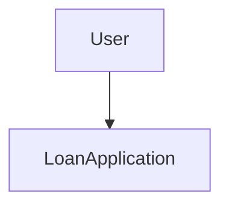
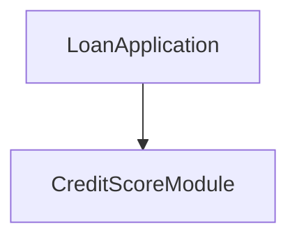
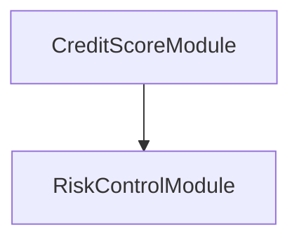
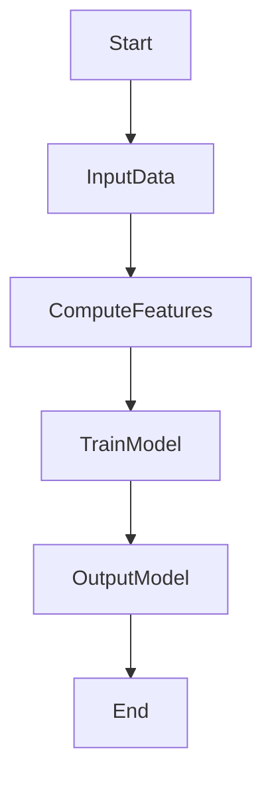
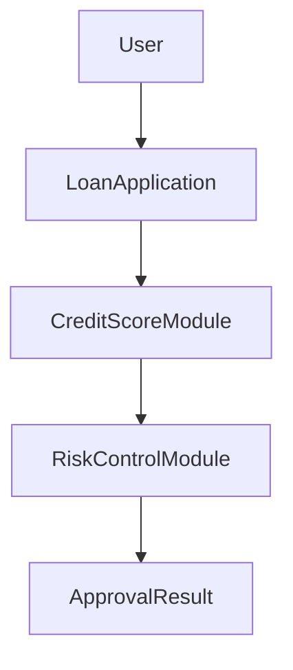

                 


# 智能个人贷款审批系统优化

> 关键词：智能贷款审批，机器学习，信用评分，风险控制，系统优化

> 摘要：本文详细探讨了智能个人贷款审批系统优化的核心概念、算法原理、系统架构与实现。通过分析传统贷款审批流程的痛点，提出了基于机器学习的信用评分模型，并结合实际案例，展示了如何通过系统优化提升审批效率、降低风险、改善用户体验。文章内容包括系统背景与概述、核心概念与联系、算法原理、系统架构与实现，以及项目实战与最佳实践。

---

## 目录

### 第一部分: 智能个人贷款审批系统背景与概述

### 第2章: 智能个人贷款审批系统概述

## 2.1 系统背景与问题背景

### 2.1.1 传统个人贷款审批流程的痛点

传统的个人贷款审批流程存在以下问题：

- **低效性**：人工审核耗时长，效率低下。
- **主观性**：依赖人工判断，存在人为误差。
- **风险高**：难以全面评估申请人资质，导致高违约率。
- **用户体验差**：申请人需多次提交资料，审核周期长。

### 2.1.2 智能化优化的必要性

- **提升效率**：通过自动化处理缩短审批时间。
- **降低风险**：利用机器学习模型提高风险识别能力。
- **改善用户体验**：实时反馈结果，减少申请人等待时间。

### 2.1.3 系统的目标与边界

- **目标**：实现自动化、智能化的贷款审批流程。
- **边界**：系统仅负责信用评分和风险评估，不涉及放款和贷后管理。

### 2.1.4 核心概念与组成要素

- **核心概念**：信用评分、风险控制、数据挖掘。
- **组成要素**：用户信息采集模块、信用评分模块、风险控制模块。

---

## 第二部分: 智能个人贷款审批系统的核心概念与联系

### 第3章: 数据采集与处理

## 3.1 数据采集模块

### 3.1.1 数据来源分析

- **内部数据**：银行内部记录，如征信报告。
- **外部数据**：第三方数据源，如芝麻信用。

### 3.1.2 数据采集流程

- **步骤**：
  1. 采集用户基本信息。
  2. 获取征信报告。
  3. 收集收入证明。

### 3.1.3 数据清洗与预处理

- **数据清洗**：去除重复、错误数据。
- **特征工程**：提取关键特征，如收入与负债比。

---

## 第4章: 智能评分与风险控制

## 4.1 信用评分模型

### 4.1.1 评分模型的构建

- **逻辑回归模型**：用于预测违约概率。

$$ P(y=1|x) = \frac{e^{\beta_0 + \beta_1x}}{1 + e^{\beta_0 + \beta_1x}} $$

- **随机森林模型**：通过特征重要性识别关键因素。

### 4.1.2 模型评估与优化

- **评估指标**：准确率、召回率、F1分数。

---

## 第5章: 系统核心模块与实体关系

## 5.1 核心模块分析

### 5.1.1 用户信息采集模块

- **功能**：采集用户基本信息、财务信息。
- **交互流程**：用户填写申请表，系统验证数据。

### 5.1.2 信用评分模块

- **功能**：计算信用评分。
- **流程**：数据输入 -> 特征提取 -> 模型预测 -> 得分输出。

### 5.1.3 风险评估模块

- **功能**：评估贷款风险。
- **流程**：评分模块输出 -> 风险控制策略 -> 审批结果。

### 5.1.4 审批结果输出模块

- **功能**：输出审批结果。
- **流程**：审批通过 -> 提供贷款合同；审批拒绝 -> 提供拒绝原因。

## 5.2 实体关系图

### 5.2.1 用户-贷款申请关系



### 5.2.2 贷款申请-评分模块关系



### 5.2.3 评分模块-风险控制关系



---

## 第三部分: 算法原理与数学模型

### 第6章: 信用评分算法原理

## 6.1 逻辑回归

### 6.1.1 算法流程图



### 6.1.2 代码实现

```python
import numpy as np
from sklearn.linear_model import LogisticRegression

# 示例数据
X = np.array([[50000, 5], [60000, 3], [70000, 4]])
y = np.array([1, 0, 1])

# 训练模型
model = LogisticRegression()
model.fit(X, y)

# 预测
print(model.predict([[65000, 2]]))
```

---

## 第四部分: 系统架构与实现

### 第7章: 系统架构设计

## 7.1 功能模块设计

### 7.1.1 用户信息采集模块

- **功能**：采集用户基本信息、财务信息。
- **交互流程**：用户填写申请表，系统验证数据。

### 7.1.2 信用评分模块

- **功能**：计算信用评分。
- **流程**：数据输入 -> 特征提取 -> 模型预测 -> 得分输出。

### 7.1.3 风险评估模块

- **功能**：评估贷款风险。
- **流程**：评分模块输出 -> 风险控制策略 -> 审批结果。

### 7.1.4 审批结果输出模块

- **功能**：输出审批结果。
- **流程**：审批通过 -> 提供贷款合同；审批拒绝 -> 提供拒绝原因。

## 7.2 系统架构图



---

## 第五部分: 项目实战

### 第8章: 项目实战

## 8.1 环境搭建

- **工具**：Python、Scikit-learn、Mermaid。
- **步骤**：安装依赖，配置开发环境。

## 8.2 核心代码实现

### 8.2.1 信用评分模块

```python
import numpy as np
from sklearn.linear_model import LogisticRegression

# 示例数据
X = np.array([[50000, 5], [60000, 3], [70000, 4]])
y = np.array([1, 0, 1])

# 训练模型
model = LogisticRegression()
model.fit(X, y)

# 预测
print(model.predict([[65000, 2]]))
```

### 8.2.2 风险控制模块

```python
import pandas as pd
from sklearn.ensemble import RandomForestClassifier

# 示例数据
data = pd.DataFrame({
    'income': [50000, 60000, 70000],
    'debt': [5, 3, 4],
    'label': [1, 0, 1]
})

# 训练模型
model = RandomForestClassifier()
model.fit(data[['income', 'debt']], data['label'])

# 特征重要性
print(model.feature_importances_)
```

## 8.3 案例分析

### 8.3.1 案例1

- **背景**：用户申请贷款，收入65000，负债2。
- **预测结果**：通过逻辑回归模型预测，批准贷款。

### 8.3.2 案例2

- **背景**：用户申请贷款，收入50000，负债5。
- **预测结果**：通过随机森林模型预测，拒绝贷款。

---

## 第六部分: 最佳实践

### 第9章: 最佳实践

## 9.1 小结

- 系统优化提升了审批效率和风险控制能力。
- 机器学习模型在信用评分和风险控制中发挥了重要作用。

## 9.2 注意事项

- **数据隐私**：确保数据安全，遵守隐私保护法规。
- **模型可解释性**：选择可解释性较高的模型，便于调整和优化。
- **持续优化**：定期更新模型，适应市场变化。

## 9.3 未来展望

- **模型优化**：引入深度学习模型，提升预测精度。
- **系统集成**：与其他系统（如征信系统）无缝对接。
- **用户体验**：优化界面，提升用户满意度。

---

## 作者：AI天才研究院/AI Genius Institute & 禅与计算机程序设计艺术 /Zen And The Art of Computer Programming

---

本文通过详细分析智能个人贷款审批系统的优化过程，结合实际案例，展示了如何利用机器学习技术提升审批效率和风险控制能力。希望本文能为相关领域的技术人员提供有价值的参考和启发。

