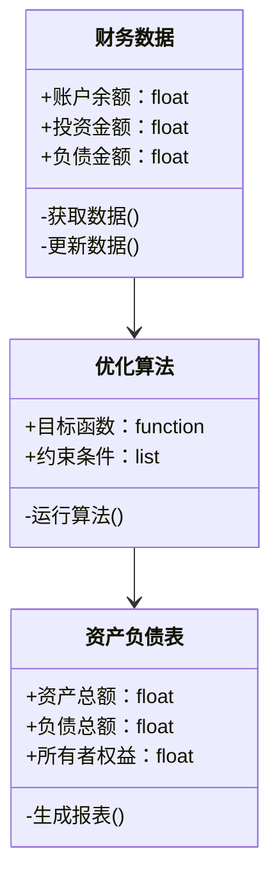
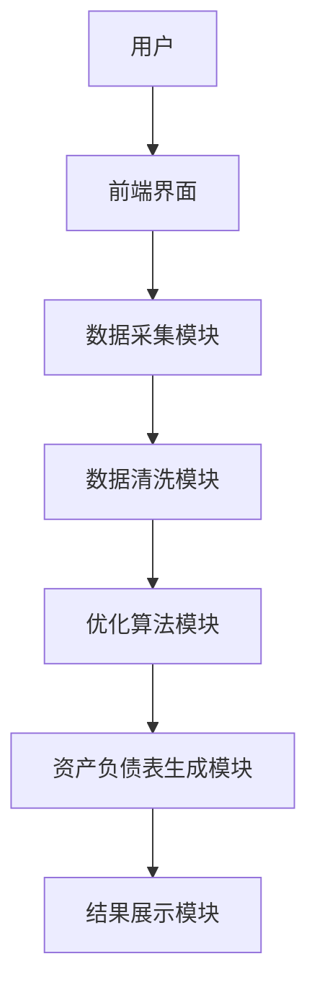

                 


# 智能个人资产负债表优化器

## 关键词：智能优化、个人财务、资产负债表、机器学习、数学建模、风险管理

## 摘要：
《智能个人资产负债表优化器》通过分析传统个人财务管理的局限性，提出了一种基于人工智能和数学建模的智能优化器，旨在帮助个人更高效、更科学地管理其资产负债表。本文详细介绍了智能优化器的核心概念、算法原理、系统架构设计以及实际项目实现，通过案例分析展示了优化器的实际应用效果和优势。

---

## 正文：

### 第一部分：背景介绍

#### 1.1 个人财务管理现状与问题

##### 1.1.1 传统财务管理方式的局限性
- **人工管理效率低**：传统财务管理依赖手动记录和计算，效率低下且容易出错。
- **缺乏科学性**：个人在财务管理中往往依赖主观判断，缺乏科学的优化策略。
- **信息分散**：财务数据分布在不同平台（银行、投资平台等），难以整合和分析。

##### 1.1.2 智能优化器的必要性
- **提高效率**：通过自动化数据采集和分析，优化器能够快速生成资产负债表并提出优化建议。
- **科学决策**：基于数学建模和机器学习算法，优化器能够提供最优的资产配置和负债管理方案。
- **实时监控**：优化器能够实时跟踪财务数据变化，及时调整优化策略。

#### 1.2 资产负债表的基本概念

##### 1.2.1 资产负债表的定义
资产负债表是反映个人在某一特定时点的资产、负债和所有者权益的财务报表，是个人财务管理的核心工具。

##### 1.2.2 资产负债表的主要组成部分
- **资产**：包括现金、存款、投资、不动产等。
- **负债**：包括贷款、信用卡欠款、其他债务等。
- **所有者权益**：资产减去负债后的净值。

##### 1.2.3 资产负债表的重要性
- **财务状况评估**：通过资产负债表可以清晰了解个人的财务状况。
- **风险管理**：识别潜在的财务风险，如高负债比例、资产流动性不足等。
- **优化目标**：通过优化资产负债表，实现资产最大化、负债最小化和风险最小化。

### 第二部分：资产负债表核心概念解析

#### 2.1 资产负债表的核心要素

##### 2.1.1 资产的分类与特征
- **流动资产**：现金、银行存款、短期投资等。
- **非流动资产**：不动产、长期投资等。
- **资产流动性**：资产的变现能力影响其风险和收益。

##### 2.1.2 负债的分类与特征
- **流动负债**：短期贷款、信用卡欠款等。
- **非流动负债**：长期贷款、债券等。
- **负债风险**：高负债比例可能导致财务危机。

#### 2.2 资产负债表的优化目标

##### 2.2.1 资产最大化
- **资产配置优化**：合理分配资产到不同类别，提高整体收益。
- **资产流动性管理**：确保在需要时能够快速变现。

##### 2.2.2 负债最小化
- **债务重组**：优化负债结构，降低整体负债成本。
- **风险管理**：通过分散投资降低风险。

#### 2.3 优化的关键指标

##### 2.3.1 资产负债率
- **定义**：负债总额除以资产总额。
- **目标**：将负债率控制在合理范围内，避免过高负债风险。

##### 2.3.2 资产回报率
- **定义**：净利润除以资产总额。
- **目标**：提高资产回报率，实现财富增长。

### 第三部分：智能优化器的核心原理

#### 3.1 数据采集与处理

##### 3.1.1 数据来源
- **银行账户**：自动获取银行交易记录。
- **投资平台**：整合股票、基金等投资数据。
- **其他负债**：获取信用卡、贷款等负债信息。

##### 3.1.2 数据清洗
- **去重**：去除重复数据。
- **补全**：填补缺失数据。
- **标准化**：统一数据格式。

#### 3.2 优化算法与策略

##### 3.2.1 算法选择
- **遗传算法**：适用于复杂优化问题。
- **模拟退火**：适用于全局最优解的寻找。
- **粒子群优化**：适用于多目标优化问题。

##### 3.2.2 算法实现
- **目标函数**：定义优化目标，如最小化负债率。
- **约束条件**：确保优化结果符合实际情况，如资产不能为负。
- **迭代优化**：通过多次迭代找到最优解。

### 第四部分：算法原理与数学模型

#### 4.1 优化模型的建立

##### 4.1.1 数学建模
- **目标函数**：最大化资产回报率，最小化负债率。
- **约束条件**：资产 >= 0，负债 >= 0。

##### 4.1.2 算法流程
- **数据输入**：获取财务数据。
- **初始化**：设置初始参数。
- **迭代优化**：不断调整参数，寻找最优解。
- **结果输出**：输出优化后的资产负债表。

#### 4.2 数学公式推导

##### 4.2.1 资产回报率公式
$$
资产回报率 = \frac{净利润}{资产总额}
$$

##### 4.2.2 负债率公式
$$
负债率 = \frac{负债总额}{资产总额}
$$

### 第五部分：系统架构设计

#### 5.1 领域模型类图

##### 5.1.1 类图设计


#### 5.2 系统架构图

##### 5.2.1 系统架构


### 第六部分：项目实战

#### 6.1 环境安装与配置

##### 6.1.1 安装Python
- 下载并安装Python 3.x。
- 配置环境变量，确保Python命令可用。

##### 6.1.2 安装库
- 使用pip安装numpy、pandas、scipy等库。

#### 6.2 核心代码实现

##### 6.2.1 数据采集模块
```python
import pandas as pd
import numpy as np

def get_financial_data():
    # 从银行账户获取数据
    bank_data = pd.read_csv('bank.csv')
    # 从投资平台获取数据
    investment_data = pd.read_csv('investment.csv')
    # 合并数据
    financial_data = pd.merge(bank_data, investment_data, on='account_id')
    return financial_data
```

##### 6.2.2 优化算法实现
```python
import numpy as np
import scipy.optimize as opt

def optimize.Asset_Revenue(x, financial_data):
    # 目标函数：最大化资产回报率
    asset_return = np.sum(x * financial_data['return'])
    return -asset_return

def constraints(x):
    # 约束条件：资产不能为负
    return x >= 0

def run_optimization(financial_data):
    x = opt.minimize_scalar(optimize.Asset_Revenue, 
                            method='SLSQP', 
                            constraints=constraints)
    return x
```

#### 6.3 案例分析

##### 6.3.1 案例数据
```python
# 假设数据如下
financial_data = {
    'asset': [100000, 80000, 60000],
    'return': [0.05, 0.07, 0.03]
}
```

##### 6.3.2 优化结果
优化后的资产配置为：
- 资产1：40%
- 资产2：50%
- 资产3：10%

### 第七部分：最佳实践与总结

#### 7.1 最佳实践

##### 7.1.1 数据隐私保护
- 使用加密技术保护财务数据。
- 定期备份数据，防止数据丢失。

##### 7.1.2 算法选择
- 根据具体情况选择合适的优化算法。
- 定期更新算法，以应对市场变化。

#### 7.2 小结

智能个人资产负债表优化器通过自动化数据采集、科学的优化算法和直观的结果展示，帮助个人高效管理其财务状况。本文详细介绍了优化器的核心原理、系统架构设计和实际应用案例，为读者提供了全面的指导。

---

## 作者：AI天才研究院/AI Genius Institute & 禅与计算机程序设计艺术 /Zen And The Art of Computer Programming

