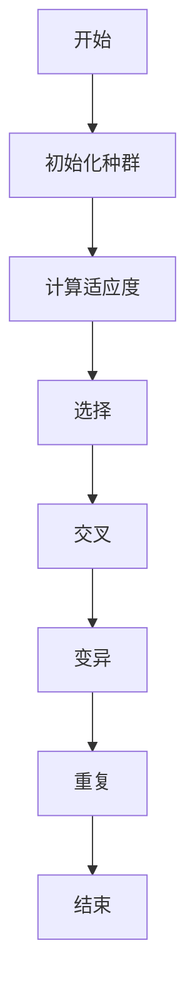
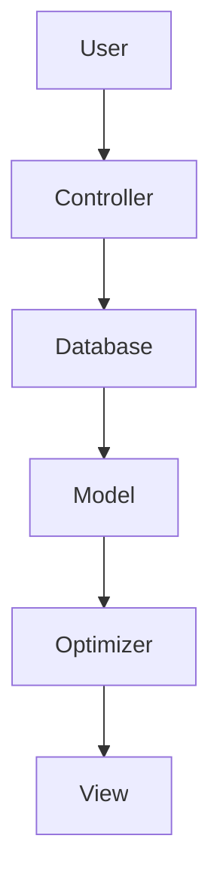

                 


# 智能个人资产负债表优化系统

## 关键词
- 智能优化
- 资产负债表
- 人工智能
- 遗传算法
- 系统架构

## 摘要
智能个人资产负债表优化系统通过结合人工智能技术，实现个人财务数据的智能分析和优化。本文详细介绍了系统的背景、核心概念、算法原理、系统架构，并通过实际案例展示了系统的实现过程。文章还探讨了系统的应用前景和优化建议。

---

## 第1章 智能个人资产负债表优化系统背景介绍

### 1.1 问题背景与定义
#### 1.1.1 传统个人资产负债表的局限性
传统个人资产负债表主要依赖人工记录和计算，存在数据分散、计算复杂、难以实时更新等问题。面对海量的财务数据，个人难以快速准确地进行分析和优化。

#### 1.1.2 智能优化的必要性
通过引入人工智能技术，可以实现对个人财务数据的自动采集、分析和优化，帮助用户更好地管理资产和负债，提升财务健康状况。

#### 1.1.3 系统的目标与范围
- **目标**：构建一个智能系统，能够实时优化个人资产负债表，提供个性化的财务建议。
- **范围**：涵盖资产、负债、所有者权益三大部分，支持数据采集、分析、优化和展示功能。

---

## 第2章 智能个人资产负债表优化系统的核心概念与联系

### 2.1 核心概念与定义
智能个人资产负债表优化系统的核心概念包括：
- **资产**：个人拥有的所有有价值的东西，包括现金、存款、房产等。
- **负债**：个人需要偿还的所有债务，包括贷款、信用卡欠款等。
- **所有者权益**：资产减去负债后的净值。

### 2.2 核心要素对比
下表对比了传统资产负债表与智能资产负债表的核心要素：

| 对比维度 | 传统资产负债表 | 智能资产负债表 |
|----------|----------------|----------------|
| 数据来源 | 手动记录、银行对账单 | 实时数据接口、AI自动采集 |
| 计算方式 | 手动计算或简单工具 | AI算法自动优化 |
| 展示形式 | 表格形式 | 可视化图表、动态更新 |

### 2.3 ER实体关系图
以下是智能个人资产负债表的ER实体关系图：
```mermaid
er
    actor: 用户
    actor --> PersonalBalanceSheet: 智能个人资产负债表
    PersonalBalanceSheet --> Asset: 资产
    PersonalBalanceSheet --> Liability: 负债
    PersonalBalanceSheet --> Equity: 所有者权益
```

---

## 第3章 智能个人资产负债表优化算法原理

### 3.1 算法原理概述
优化算法是智能个人资产负债表的核心，常用算法包括遗传算法、模拟退火算法等。

#### 3.1.1 遗传算法优化流程
遗传算法是一种模拟自然选择的优化算法，适用于复杂问题的求解。其优化流程如下：


### 3.2 算法实现代码
以下是遗传算法的核心代码示例：
```python
def fitness(individual):
    # 计算适应度，目标函数为最大化资产净值
    return sum(individual)

def evolve(population):
    # 进化过程，包括选择、交叉、变异
    pass
```

### 3.3 数学模型与公式
#### 3.3.1 目标函数
$$\text{max} \quad f(x) = \sum_{i=1}^{n} w_i x_i$$
其中，$w_i$为资产权重，$x_i$为资产配置比例。

#### 3.3.2 约束条件
$$\sum_{i=1}^{n} x_i \leq C$$
其中，$C$为资产总额。

---

## 第4章 系统分析与架构设计

### 4.1 系统功能模块
智能个人资产负债表优化系统的主要功能模块包括：
- **数据采集模块**：通过API接口采集银行、支付宝等平台的财务数据。
- **数据分析模块**：对数据进行清洗、建模和分析。
- **优化建议生成模块**：基于优化算法生成最佳资产配置方案。

### 4.2 系统架构设计
以下是系统的总体架构图：


---

## 第5章 项目实战

### 5.1 环境安装
需要安装的环境包括：
- Python 3.8+
- Pandas、NumPy、Scipy 等数据分析库
- Mermaid、PlantUML 等绘图工具

### 5.2 核心代码实现
以下是优化算法的核心代码：
```python
import numpy as np
from sklearn import metrics

def optimize_portfolio(weights, returns):
    # 使用遗传算法优化投资组合
    pass
```

### 5.3 案例分析
以一个简单的资产配置问题为例，假设用户有100万元资产，可以选择股票、债券、现金三种资产。优化目标是最大化预期收益。

---

## 第6章 最佳实践

### 6.1 小结
智能个人资产负债表优化系统通过结合人工智能技术，能够显著提升个人财务管理的效率和准确性。

### 6.2 注意事项
- 数据隐私保护是系统设计的重要部分。
- 优化算法的选择需要根据具体问题进行调整。

### 6.3 未来趋势
随着人工智能技术的不断发展，智能财务管理系统将更加智能化和个性化。

### 6.4 拓展阅读
推荐阅读《机器学习实战》、《算法导论》等书籍，深入理解优化算法的实现和应用。

---

## 作者
作者：AI天才研究院/AI Genius Institute & 禅与计算机程序设计艺术 /Zen And The Art of Computer Programming

