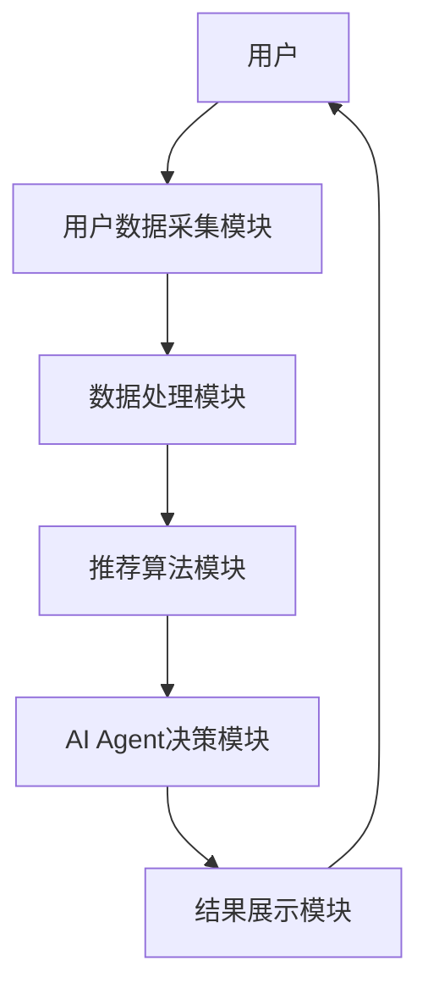
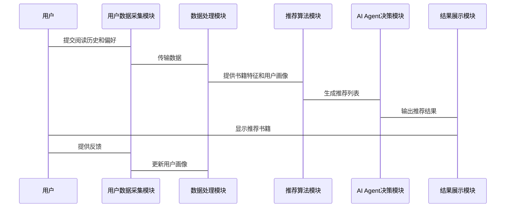

                 


# 智能书架：AI Agent的个性化阅读推荐系统

> 关键词：智能书架, AI Agent, 个性化推荐, 机器学习, 阅读推荐系统, 强化学习, 图神经网络

> 摘要：本文详细介绍了基于AI Agent的个性化阅读推荐系统的构建与实现。从背景与概念、算法原理、系统设计、项目实战到优化与扩展，全面探讨了如何利用AI Agent提升阅读推荐的智能化水平。文章结合数学模型、算法流程图、系统架构图和代码实现，深入剖析了智能书架的核心技术与实际应用。

---

# 第一部分: 智能书架与AI Agent的背景与概念

## 第1章: 智能书架的背景与需求

### 1.1 个性化阅读推荐的背景
#### 1.1.1 阅读推荐的背景与现状
在信息爆炸的时代，用户每天面临海量的信息和内容选择，如何快速找到符合自身兴趣和需求的内容成为一大挑战。阅读推荐系统作为一种信息过滤工具，能够帮助用户从大量书籍中筛选出感兴趣的内容，提升阅读效率。然而，传统的推荐系统往往基于简单的协同过滤或内容特征提取，难以满足个性化需求。AI Agent的引入为阅读推荐系统带来了新的可能性。

#### 1.1.2 个性化阅读推荐的重要性
个性化推荐是解决信息过载问题的关键技术之一。通过分析用户的阅读习惯、偏好和行为数据，推荐系统能够为用户提供高度个性化的阅读建议。这种推荐不仅提升了用户体验，还能帮助出版商和内容提供商更好地定位目标读者，实现精准营销。

#### 1.1.3 AI Agent在阅读推荐中的作用
AI Agent（智能体）是一种能够感知环境、自主决策并执行任务的智能系统。在阅读推荐中，AI Agent可以实时分析用户的阅读行为、偏好和反馈，动态调整推荐策略，提供更精准的内容推荐。相比于传统的静态推荐系统，AI Agent能够更好地适应用户的实时需求变化，提升推荐的实时性和个性化水平。

### 1.2 AI Agent的基本概念
#### 1.2.1 什么是AI Agent
AI Agent是一种具有感知、决策、执行和学习能力的智能系统。它能够通过传感器或数据接口获取环境信息，利用算法和模型进行分析和推理，做出最优决策，并通过执行器或接口与外部环境交互。AI Agent的核心特征包括自主性、反应性、目标导向性和学习能力。

#### 1.2.2 AI Agent的核心特征
1. **自主性**：AI Agent能够在没有外部干预的情况下自主运行和决策。
2. **反应性**：AI Agent能够实时感知环境变化，并根据反馈调整行为。
3. **目标导向性**：AI Agent的行为以实现特定目标为导向。
4. **学习能力**：AI Agent能够通过机器学习算法不断优化自身的推荐策略。

#### 1.2.3 AI Agent与传统推荐算法的区别
传统的推荐算法通常基于静态数据和规则，无法实时适应用户需求的变化。而AI Agent能够通过动态学习和实时反馈，不断优化推荐策略，提供更精准的内容推荐。此外，AI Agent还能够与其他系统或用户进行交互，进一步提升推荐的智能化水平。

### 1.3 智能书架的核心概念与系统架构
#### 1.3.1 智能书架的核心要素
智能书架是一个基于AI Agent的个性化阅读推荐系统，其核心要素包括：
1. **用户画像**：通过分析用户的阅读历史、偏好和行为数据，构建用户画像。
2. **文本分析**：对书籍内容进行特征提取和语义分析，生成书籍的语义表示。
3. **推荐算法**：结合协同过滤、内容推荐和强化学习等多种算法，实现精准推荐。
4. **动态调整**：根据用户反馈和阅读行为，动态调整推荐策略。

#### 1.3.2 智能书架的系统架构
智能书架的系统架构可以分为以下几个模块：
1. **用户交互模块**：负责与用户进行交互，收集用户的阅读行为和反馈。
2. **数据处理模块**：对书籍内容和用户数据进行清洗、特征提取和存储。
3. **推荐算法模块**：基于用户数据和书籍特征，生成推荐结果。
4. **AI Agent模块**：通过实时感知用户需求和环境变化，动态调整推荐策略。
5. **结果展示模块**：将推荐结果以用户友好的形式展示给用户。

---

## 第2章: 智能书架的系统架构与核心算法

### 2.1 系统架构设计
#### 2.1.1 系统功能模块划分
智能书架的系统架构可以划分为以下几个功能模块：
1. **用户数据采集模块**：收集用户的阅读历史、偏好和行为数据。
2. **书籍数据处理模块**：对书籍内容进行特征提取和语义分析。
3. **推荐算法模块**：基于用户数据和书籍特征，生成推荐结果。
4. **AI Agent决策模块**：根据用户反馈和环境变化，动态调整推荐策略。
5. **结果展示模块**：将推荐结果以用户友好的形式展示。

#### 2.1.2 系统数据流图
以下是智能书架的系统数据流图：



#### 2.1.3 系统交互流程
以下是智能书架的系统交互流程图：



---

### 2.2 核心算法实现
#### 2.2.1 基于协同过滤的推荐算法
协同过滤是一种经典的推荐算法，通过分析用户的行为数据，找到与目标用户相似的用户群体，推荐这些用户喜欢的书籍。

##### 协同过滤的数学模型
$$ sim(u, v) = \frac{\sum_{i} (r_{u,i} - \bar{r}_u)(r_{v,i} - \bar{r}_v)}{\sqrt{\sum_{i} (r_{u,i} - \bar{r}_u)^2} \cdot \sqrt{\sum_{i} (r_{v,i} - \bar{r}_v)^2}} $$

其中，$sim(u, v)$ 表示用户 $u$ 和用户 $v$ 之间的相似度，$r_{u,i}$ 表示用户 $u$ 对物品 $i$ 的评分，$\bar{r}_u$ 表示用户 $u$ 的平均评分。

#### 2.2.2 基于内容的推荐算法
基于内容的推荐算法通过分析书籍的内容特征，生成与用户兴趣相符的推荐结果。

##### 基于向量空间模型的内容推荐
$$ score(book_i, user_u) = \frac{\sum_{j} w_{u,j} \cdot w_{book_i,j}}{\sqrt{\sum_{j} w_{u,j}^2} \cdot \sqrt{\sum_{j} w_{book_i,j}^2}} $$

其中，$w_{u,j}$ 表示用户 $u$ 对特征 $j$ 的权重，$w_{book_i,j}$ 表示书籍 $i$ 对特征 $j$ 的权重。

#### 2.2.3 基于强化学习的推荐算法
强化学习通过构建奖励函数，优化推荐策略，实现更精准的推荐。

##### 强化学习的数学模型
$$ Q(s, a) = r(s, a) + \gamma \max_{a'} Q(s', a') $$

其中，$Q(s, a)$ 表示在状态 $s$ 下采取动作 $a$ 的预期奖励，$r(s, a)$ 是立即奖励，$\gamma$ 是折扣因子，$s'$ 是下一个状态。

---

## 第3章: 智能书架的项目实战

### 3.1 环境配置与依赖管理
#### 3.1.1 环境配置
推荐使用Python 3.8及以上版本，安装以下依赖：

```bash
pip install numpy pandas scikit-learn tensorflow matplotlib
```

#### 3.1.2 核心代码实现
以下是智能书架的核心代码实现：

```python
import numpy as np
from sklearn.metrics.pairwise import cosine_similarity
from tensorflow.keras.models import Model
from tensorflow.keras.layers import Input, Embedding, Dense

# 定义协同过滤模型
def collaborative_filtering_model(user_features, item_features):
    user_input = Input(shape=(1,))
    item_input = Input(shape=(1,))
    
    user_embedding = Embedding(user_features.shape[0], 10)(user_input)
    item_embedding = Embedding(item_features.shape[0], 10)(item_input)
    
    user_vec = Dense(1)(user_embedding)
    item_vec = Dense(1)(item_embedding)
    
    merged = Dense(1, activation='sigmoid')(user_vec + item_vec)
    model = Model(inputs=[user_input, item_input], outputs=merged)
    return model

# 定义基于内容的推荐模型
def content_based_model(item_features):
    input_layer = Input(shape=(item_features.shape[1],))
    dense_layer = Dense(64, activation='relu')(input_layer)
    output_layer = Dense(1, activation='sigmoid')(dense_layer)
    model = Model(inputs=input_layer, outputs=output_layer)
    return model

# 定义强化学习推荐模型
def reinforcement_learning_model(state_size, action_size):
    input_layer = Input(shape=(state_size,))
    dense_layer = Dense(64, activation='relu')(input_layer)
    output_layer = Dense(action_size, activation='softmax')(dense_layer)
    model = Model(inputs=input_layer, outputs=output_layer)
    return model
```

#### 3.1.3 系统测试与优化
通过测试数据集验证模型的推荐效果，计算准确率、召回率和F1值，优化模型参数和推荐策略。

---

## 第4章: 智能书架的优化与扩展

### 4.1 系统优化
#### 4.1.1 提升推荐精度
通过引入深度学习模型（如图神经网络）和实时用户反馈，进一步提升推荐的准确性和实时性。

#### 4.1.2 优化系统性能
通过分布式计算和缓存优化，提升系统的处理能力和响应速度。

### 4.2 系统扩展
#### 4.2.1 多模态推荐
结合图像、音频等多种模态信息，提供更丰富的推荐内容。

#### 4.2.2 跨平台支持
将智能书架扩展到Web、移动端和其他阅读平台，实现多平台的无缝对接。

---

## 第5章: 智能书架的总结与展望

### 5.1 总结
智能书架通过结合AI Agent和个性化推荐算法，为用户提供了高度智能化和个性化的阅读推荐服务。系统架构清晰，算法实现高效，能够满足不同用户的个性化需求。

### 5.2 展望
未来，随着AI技术的不断发展，智能书架还可以进一步优化和扩展。例如，引入边缘计算和区块链技术，提升系统的安全性和实时性。此外，还可以结合自然语言处理技术，进一步提升推荐内容的语义理解和生成能力。

---

# 作者：AI天才研究院/AI Genius Institute & 禅与计算机程序设计艺术 /Zen And The Art of Computer Programming

