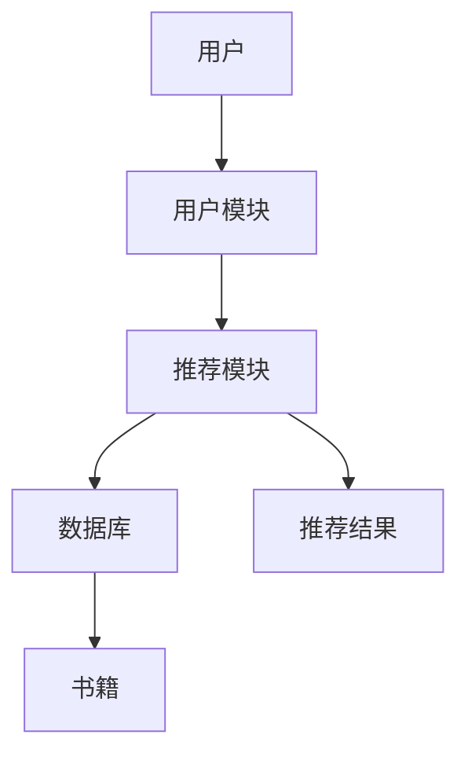

                 


# 智能书架：AI Agent的图书推荐系统

> 关键词：智能书架，AI Agent，图书推荐系统，协同过滤，知识图谱，推荐算法

> 摘要：本文将详细探讨智能书架与AI Agent结合的图书推荐系统，从背景、核心概念、算法原理、系统架构到项目实战，全面解析该系统的构建过程。

---

## 第一部分：智能书架与AI Agent的背景介绍

### 第1章：智能书架的背景与问题背景

#### 1.1 问题背景

传统图书推荐系统在面对海量书籍时，难以精准匹配用户的阅读偏好，且推荐结果往往缺乏个性化和深度分析。此外，用户的行为数据和阅读习惯未能被充分挖掘，导致推荐效果有限。

#### 1.2 智能书架的核心问题与目标

智能书架的核心问题是如何通过AI Agent实现精准的图书推荐，目标是基于用户行为、阅读偏好和书籍属性，提供个性化的推荐服务。

#### 1.3 智能书架的应用场景与边界

智能书架适用于在线图书馆、电子书平台和实体书店等场景，其边界包括用户行为数据、书籍元数据和推荐结果的评价指标。

---

## 第二部分：智能书架的核心概念与联系

### 第2章：AI Agent的基本概念与特点

#### 2.1 AI Agent的定义与核心要素

AI Agent是一种智能体，通过感知环境、执行任务和自适应优化，能够自主决策和学习。

#### 2.2 AI Agent的特点

- 智能性：能够理解用户需求和上下文。
- 自适应性：根据反馈动态调整推荐策略。
- 交互性：支持多轮对话和实时反馈。

### 第3章：智能书架与AI Agent的结合

#### 3.1 智能书架的核心概念

- 用户画像：基于阅读历史和偏好生成用户画像。
- 图书属性：包括书籍分类、主题标签和作者信息。
- 推荐结果：根据用户画像和图书属性生成推荐列表。

#### 3.2 AI Agent在智能书架中的作用

- 数据采集：收集用户行为和偏好。
- 推荐计算：基于算法生成推荐结果。
- 人机交互：与用户进行自然语言对话。

---

## 第三部分：智能书架的算法原理与数学模型

### 第4章：推荐算法原理

#### 4.1 协同过滤算法

协同过滤基于用户相似性或物品相似性进行推荐。例如，计算用户A和用户B的相似度，若相似度高，则推荐用户A喜欢的书籍给用户B。

#### 4.2 基于内容的推荐

基于书籍的元数据（如分类、标签）进行推荐。例如，用户喜欢科幻小说，则推荐其他科幻小说。

#### 4.3 基于知识图谱的推荐

利用知识图谱中的语义关系进行推荐。例如，推荐同一作者的其他书籍。

---

## 第四部分：智能书架的系统分析与架构设计

### 第5章：系统分析与架构设计方案

#### 5.1 系统功能设计

- 用户模块：管理用户信息和阅读历史。
- 图书模块：管理书籍元数据。
- 推荐模块：基于算法生成推荐结果。
- 交互模块：处理用户请求和反馈。

#### 5.2 系统架构设计



---

## 第五部分：项目实战

### 第6章：项目实战

#### 6.1 环境安装

安装Python和相关库（如pandas、scikit-learn）。

#### 6.2 核心代码实现

```python
import pandas as pd
from sklearn.metrics.pairwise import cosine_similarity

# 示例数据
books = pd.DataFrame({
    '书名': ['书1', '书2', '书3'],
    '分类': ['科幻', '科幻', '悬疑'],
    '作者': ['作者1', '作者2', '作者3']
})

# 协同过滤实现
def collaborative_filtering(user_data):
    # 计算用户相似度矩阵
    user_similarity = cosine_similarity(user_data)
    return user_similarity

# 调用函数
user_data = books[['分类', '作者']]
similarity_matrix = collaborative_filtering(user_data)
print(similarity_matrix)
```

#### 6.3 案例分析与代码解读

通过代码示例，详细解读协同过滤的实现过程和结果分析。

---

## 第六部分：总结与展望

### 第7章：总结与展望

智能书架通过AI Agent实现了精准的图书推荐，未来可以进一步优化算法和提升交互体验。

---

## 作者信息

作者：AI天才研究院/AI Genius Institute & 禅与计算机程序设计艺术 /Zen And The Art of Computer Programming

