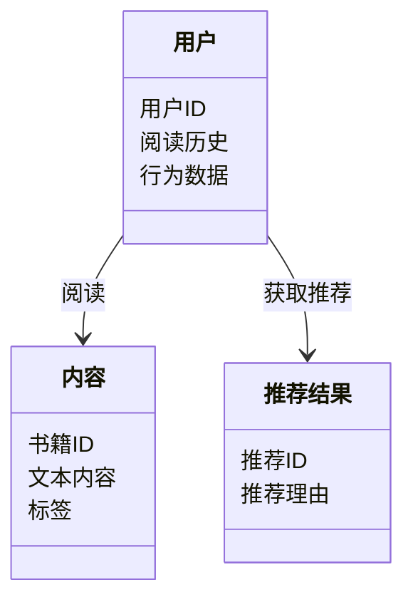
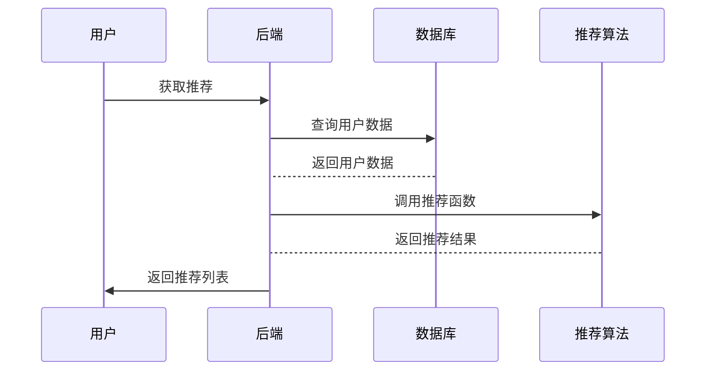

                 


# 《智能书架：AI Agent的阅读兴趣分析》

---

## 关键词：
- AI Agent, 智能书架, 阅读兴趣分析, 个性化推荐, 自然语言处理

---

## 摘要：
《智能书架：AI Agent的阅读兴趣分析》一文深入探讨了如何利用人工智能代理（AI Agent）进行用户的阅读兴趣分析，以实现个性化推荐。文章从问题背景出发，分析了传统阅读推荐系统的局限性，提出了基于AI Agent的解决方案。通过详细讲解AI Agent的核心概念、算法原理和系统架构，文章展示了如何构建一个高效且智能的书架系统。最后，通过项目实战和最佳实践，文章为读者提供了一个完整的实现方案和优化建议。

---

## 目录大纲：

---

# 第1章: 背景介绍

## 1.1 问题背景与描述

### 1.1.1 阅读兴趣分析的必要性
在当今信息爆炸的时代，用户每天面对海量的信息和内容，如何快速找到符合个人兴趣的阅读材料成为一个重要问题。传统的阅读推荐系统虽然在一定程度上解决了用户的信息筛选问题，但其推荐的精准度和个性化程度仍有较大的提升空间。阅读兴趣分析是解决这一问题的关键。

### 1.1.2 当前阅读推荐系统的局限性
- 数据稀疏性问题：传统协同过滤算法在面对数据稀疏性时表现不佳。
- 个性化不足：基于简单的用户行为统计的推荐系统难以捕捉用户的深层次兴趣。
- 冷启动问题：新用户或新内容的推荐效果较差。

### 1.1.3 AI Agent在阅读兴趣分析中的作用
AI Agent（人工智能代理）是一种能够感知环境、理解用户需求并主动提供服务的智能体。通过结合自然语言处理、机器学习和大数据分析，AI Agent能够更精准地分析用户的阅读兴趣，提供个性化的推荐服务。

---

## 1.2 问题解决与边界

### 1.2.1 AI Agent如何解决阅读兴趣分析问题
- 通过自然语言处理技术分析用户的阅读内容，提取文本特征。
- 结合用户的行为数据（如阅读时间、阅读频率、偏好等）构建用户画像。
- 利用机器学习模型预测用户的兴趣，生成个性化推荐。

### 1.2.2 阅读兴趣分析的边界与外延
- 边界：仅关注用户的阅读兴趣，不涉及其他类型的内容推荐。
- 外延：可能扩展到用户的兴趣偏好分析、行为预测等领域。

### 1.2.3 智能书架的核心要素与组成
- 用户数据：包括阅读历史、行为数据、偏好信息。
- 内容数据：书籍或文章的文本内容、标签、分类信息。
- AI Agent：负责数据处理、模型训练和推荐生成。
- 推荐系统：基于AI Agent分析结果提供个性化推荐。

---

## 1.3 本章小结
本章从问题背景出发，分析了传统阅读推荐系统的局限性，提出了AI Agent在阅读兴趣分析中的作用。通过明确问题解决的边界和核心要素，为后续章节奠定了基础。

---

# 第2章: AI Agent的核心概念与原理

## 2.1 AI Agent的定义与特点

### 2.1.1 AI Agent的定义
AI Agent是一种能够感知环境、理解用户需求并主动提供服务的智能体。它具有自主性、反应性、目标导向和社交能力等特点。

### 2.1.2 AI Agent的核心特点
- 自主性：能够独立决策和行动。
- 反应性：能够感知环境并实时响应。
- 目标导向：以特定目标为导向执行任务。
- 社交能力：能够与用户和其他系统进行交互。

### 2.1.3 AI Agent与传统推荐系统的区别
- 数据处理能力：AI Agent能够结合文本分析和用户行为数据，提供更精准的推荐。
- 主动性：AI Agent能够主动学习和优化推荐策略。
- 个性化：AI Agent能够根据用户实时行为动态调整推荐结果。

---

## 2.2 阅读兴趣分析的核心概念

### 2.2.1 阅读兴趣的定义与度量
阅读兴趣是指用户对某一类书籍或内容的偏好程度。可以通过用户的阅读行为、文本偏好和情感倾向等多维度进行度量。

### 2.2.2 用户行为分析与阅读兴趣的关系
用户行为数据（如阅读时间、阅读频率、停留时长等）能够反映用户的阅读兴趣。通过分析这些数据，可以更好地理解用户的兴趣偏好。

### 2.2.3 文本特征提取与阅读兴趣的关联
通过自然语言处理技术提取文本特征（如关键词、主题、情感倾向等），能够帮助AI Agent更好地理解内容的属性，从而更精准地匹配用户的兴趣。

---

## 2.3 AI Agent在阅读兴趣分析中的工作原理

### 2.3.1 数据采集与处理
- 数据来源：用户的阅读历史、行为数据、文本内容。
- 数据预处理：清洗、归一化和特征提取。

### 2.3.2 特征提取与用户画像构建
- 文本特征提取：使用TF-IDF、LDA等方法提取文本主题。
- 用户画像：基于行为数据和文本特征构建用户画像。

### 2.3.3 兴趣预测与推荐生成
- 兴趣预测：基于用户画像和内容特征，利用机器学习模型预测用户的兴趣。
- 推荐生成：根据预测结果生成个性化推荐列表。

---

## 2.4 本章小结
本章详细介绍了AI Agent的核心概念和工作原理，重点分析了阅读兴趣分析的关键步骤，包括数据采集、特征提取和兴趣预测。

---

# 第3章: 阅读兴趣分析的算法原理

## 3.1 基于协同过滤的推荐算法

### 3.1.1 协同过滤的基本原理
协同过滤是一种基于用户相似性或物品相似性的推荐方法。通过分析用户的行为数据，找到与目标用户相似的用户群体，推荐他们喜欢的内容。

### 3.1.2 基于用户的协同过滤
- 计算用户之间的相似度（如余弦相似度）。
- 找到与目标用户最相似的用户群体。
- 推荐这些用户喜欢的内容。

### 3.1.3 基于物品的协同过滤
- 计算物品之间的相似度（如书籍的相似度）。
- 根据目标用户的兴趣，推荐相似物品。

---

## 3.2 基于深度学习的阅读兴趣分析

### 3.2.1 神经网络在阅读兴趣分析中的应用
- 使用卷积神经网络（CNN）或循环神经网络（RNN）进行文本特征提取。
- 基于用户画像和文本特征，训练深度学习模型进行兴趣预测。

### 3.2.2 基于Transformer的文本表示方法
- Transformer模型通过自注意力机制捕捉文本中的语义信息。
- 使用预训练的Transformer模型（如BERT）进行文本特征提取。

### 3.2.3 预训练语言模型在阅读兴趣分析中的应用
- 使用GPT、BERT等预训练语言模型进行文本理解和生成。
- 结合用户行为数据，优化模型的推荐效果。

---

## 3.3 算法实现与优化

### 3.3.1 协同过滤的实现步骤
1. 数据预处理：清洗和归一化用户行为数据。
2. 计算相似度：使用余弦相似度计算用户或物品的相似度。
3. 推荐生成：基于相似度生成推荐列表。

### 3.3.2 深度学习模型的训练流程
1. 数据准备：收集和整理用户行为数据和文本内容。
2. 模型训练：基于深度学习模型进行训练，优化损失函数。
3. 模型部署：将训练好的模型部署到推荐系统中。

---

## 3.4 本章小结
本章详细讲解了阅读兴趣分析的两种主要算法：协同过滤和深度学习。通过对比分析，展示了深度学习在阅读兴趣分析中的优势。

---

# 第4章: 系统分析与架构设计

## 4.1 系统功能设计

### 4.1.1 领域模型设计
- 用户实体：用户ID、阅读历史、行为数据。
- 内容实体：书籍ID、文本内容、标签。
- 推荐实体：推荐结果、推荐理由。

### 4.1.2 领域模型 Mermaid 类图


### 4.1.3 系统架构设计
- 前端：用户界面，展示推荐结果。
- 后端：处理用户请求，调用推荐算法。
- 数据库：存储用户数据和内容数据。

### 4.1.4 系统架构 Mermaid 图


---

## 4.2 系统接口设计

### 4.2.1 API接口设计
- `GET /recommend?user_id=123`：获取推荐结果。
- `POST /analyze?content=..."`：分析文本内容。

### 4.2.2 接口交互流程图


---

## 4.3 本章小结
本章从系统设计的角度，详细分析了智能书架的架构和接口设计，为后续的实现奠定了基础。

---

# 第5章: 项目实战

## 5.1 环境安装与配置

### 5.1.1 Python环境安装
- 安装Python 3.8及以上版本。
- 安装必要的库（如pandas、numpy、scikit-learn、transformers）。

### 5.1.2 代码运行环境配置
- 安装Jupyter Notebook或PyCharm作为开发环境。
- 配置Python路径和环境变量。

---

## 5.2 核心代码实现

### 5.2.1 数据处理代码
```python
import pandas as pd
from sklearn.metrics.pairwise import cosine_similarity

# 加载数据
user_data = pd.read_csv('user.csv')
content_data = pd.read_csv('content.csv')

# 数据预处理
user_data.dropna(inplace=True)
content_data.dropna(inplace=True)
```

### 5.2.2 协同过滤算法实现
```python
def collaborative_filtering(user_id):
    # 计算用户相似度
    user_sim = cosine_similarity(user_data[user_data['user_id'] == user_id])
    # 获取推荐结果
    recommendations = []
    for i in range(len(user_sim)):
        if i != user_id:
            recommendations.append(content_data.iloc[i])
    return recommendations
```

### 5.2.3 深度学习模型训练
```python
from transformers import BertTokenizer, BertModel
import torch

# 加载预训练模型
tokenizer = BertTokenizer.from_pretrained('bert-base-uncased')
model = BertModel.from_pretrained('bert-base-uncased')

# 定义输入
inputs = tokenizer("This is a sample text.", return_tensors="pt")
with torch.no_grad():
    outputs = model(**inputs)
```

---

## 5.3 代码解读与优化

### 5.3.1 数据处理部分解读
- 数据清洗：删除缺失值。
- 数据归一化：统一数据格式，便于后续处理。

### 5.3.2 模型训练优化
- 调参优化：调整学习率、批次大小等参数。
- 模型评估：使用交叉验证评估模型性能。

---

## 5.4 实际案例分析

### 5.4.1 案例背景
假设用户A喜欢阅读科幻小说，系统需要推荐类似的书籍。

### 5.4.2 数据分析
- 用户A的阅读历史：科幻小说10本，科技类文章5篇。
- 文本特征：关键词提取结果为“科幻、未来、科技”。

### 5.4.3 推荐结果
- 推荐列表：科幻小说5本，科技类文章3篇。
- 推荐理由：基于文本特征和用户行为数据，系统认为用户对科幻和科技类内容感兴趣。

---

## 5.5 项目小结
本章通过实际案例展示了智能书架的实现过程，包括环境配置、代码实现和案例分析。通过优化模型参数和数据处理，提升了推荐的精准度。

---

# 第6章: 最佳实践与总结

## 6.1 最佳实践 tips

### 6.1.1 数据处理
- 数据清洗要彻底，避免噪声数据影响模型性能。
- 特征提取要精准，选择合适的文本处理方法。

### 6.1.2 模型优化
- 调整模型参数，找到最优配置。
- 使用交叉验证评估模型性能。

### 6.1.3 系统部署
- 优化系统架构，提升处理效率。
- 确保数据安全，保护用户隐私。

---

## 6.2 本章小结
本章总结了智能书架项目的最佳实践，为读者提供了优化建议和注意事项。

---

## 6.3 注意事项
- 数据隐私保护：确保用户数据的安全性。
- 模型可解释性：优化模型的可解释性，便于用户理解推荐结果。
- 系统维护：定期更新模型和数据，保持推荐的准确性。

---

## 6.4 拓展阅读
- 《Deep Learning for Natural Language Processing》
- 《Recommender Systems: Algorithms and Evaluation》
- 《Transformer-based Models for Text Analysis》

---

## 作者：AI天才研究院/AI Genius Institute & 禅与计算机程序设计艺术 /Zen And The Art of Computer Programming

---

**本文通过详细分析智能书架的构建过程，展示了AI Agent在阅读兴趣分析中的巨大潜力。从算法原理到系统设计，再到项目实战，本文为读者提供了一个完整的实现方案。希望本文能够为相关领域的研究和应用提供有价值的参考。**

