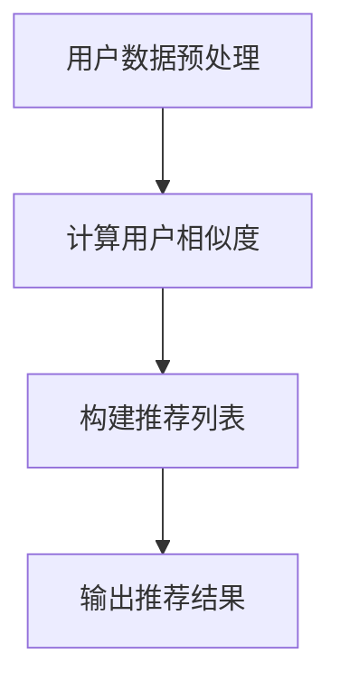
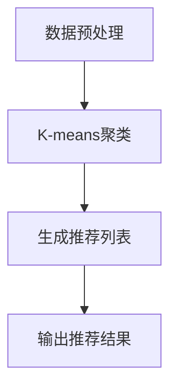
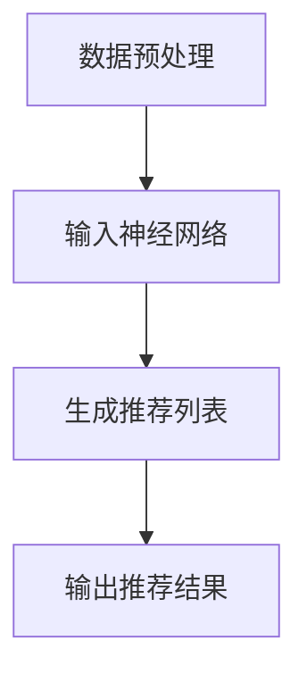

                 


# 智能书架：AI Agent的阅读兴趣拓展系统

> 关键词：AI Agent，阅读兴趣，推荐系统，协同过滤，深度学习，系统架构

> 摘要：本文旨在介绍如何利用AI Agent提升阅读推荐的智能化水平。通过分析用户的阅读行为和兴趣，结合机器学习算法，构建一个智能化的推荐系统，为用户提供个性化的阅读建议。文章详细探讨了AI Agent的核心原理、推荐系统的算法实现，以及系统的架构设计和实际应用案例，帮助读者深入了解如何利用AI技术优化阅读推荐体验。

---

## 第一部分：背景介绍

### 第1章：问题背景与需求分析

#### 1.1 问题背景
- **阅读兴趣拓展的现状与挑战**  
  随着数字化阅读的普及，用户每天接触到的信息量急剧增加。传统阅读推荐系统基于简单的协同过滤或内容推荐，难以满足用户日益增长的个性化需求。用户往往希望推荐系统能够主动理解他们的阅读偏好，并提供深度、多样化的推荐。

- **传统推荐系统的局限性**  
  传统推荐系统主要依赖于协同过滤或基于内容的推荐方法，这些方法在处理海量数据时效率较低，且难以捕捉用户阅读兴趣的动态变化。此外，传统系统难以结合用户的实时行为数据，推荐结果缺乏深度和个性化。

- **AI Agent在阅读推荐中的潜力**  
  AI Agent作为一种智能代理，能够实时分析用户的阅读行为和偏好，动态调整推荐策略。通过结合自然语言处理和机器学习技术，AI Agent能够为用户提供更加精准和个性化的阅读推荐。

#### 1.2 需求分析
- **用户需求层次**  
  用户不仅需要基本的书籍推荐功能，还希望推荐系统能够提供深度分析、阅读习惯追踪以及个性化阅读计划。此外，用户对推荐系统的实时性和响应速度也有较高要求。

- **系统功能需求**  
  系统需要实现以下核心功能：  
  - 用户阅读行为数据的采集与分析  
  - 基于机器学习的个性化推荐算法  
  - AI Agent的动态推荐策略调整  
  - 多维度的阅读兴趣分析与可视化  

- **性能与用户体验需求**  
  系统需要具备高效的计算能力，能够快速响应用户的请求，并提供流畅的用户体验。推荐结果需具备可解释性，用户能够理解推荐的原因和逻辑。

#### 1.3 问题解决思路
- **AI Agent的核心作用**  
  AI Agent能够实时分析用户的阅读行为，结合历史数据和实时反馈，动态优化推荐策略。通过深度学习算法，AI Agent能够捕捉用户的潜在阅读兴趣，提供更加精准的推荐。

- **数据驱动的个性化推荐**  
  系统通过收集用户的阅读数据（如阅读时间、阅读深度、偏好主题等），利用机器学习模型构建用户画像，实现个性化的推荐。

- **动态更新与自适应优化**  
  系统能够根据用户的反馈和行为变化，实时更新推荐模型，确保推荐结果始终符合用户的当前兴趣。

#### 1.4 系统边界与外延
- **系统功能边界**  
  智能书架的核心功能包括阅读数据采集、推荐算法实现、AI Agent交互界面以及推荐结果展示。系统不涉及书籍内容的生成或编辑，也不处理用户的支付或购买行为。

- **与外部系统的交互**  
  系统需要与用户设备（如手机、电脑）进行数据交互，同时可能与第三方书籍库（如亚马逊 Kindle、Google Play Books）进行数据对接。

- **系统的可扩展性**  
  系统设计需具备良好的扩展性，能够方便地接入新的数据源或推荐算法，适应未来技术的发展和用户需求的变化。

#### 1.5 概念结构与核心要素
- **系统核心要素**  
  智能书架系统主要包括以下核心要素：  
  1. 用户阅读数据：包括阅读记录、阅读时间、阅读深度、偏好主题等。  
  2. AI Agent：负责数据处理、推荐策略制定和推荐结果输出。  
  3. 推荐算法：基于机器学习的协同过滤、聚类分析和深度学习模型。  
  4. 用户界面：用于展示推荐结果和交互操作。  

- **要素之间的关系**  
  用户阅读数据是推荐系统的核心输入，AI Agent通过分析这些数据，利用推荐算法生成个性化推荐结果，并通过用户界面展示给用户。用户与系统交互的过程不断优化系统的推荐策略。

- **核心概念的结构化描述**  
  通过表格形式展示核心概念的属性特征对比：

| 属性 | AI Agent | 推荐系统 |
|------|-----------|----------|
| 核心功能 | 数据处理与决策 | 数据分析与推荐 |
| 输入 | 用户行为数据 | 用户偏好数据 |
| 输出 | 动态推荐策略 | 个性化推荐列表 |
| 优势 | 实时性与适应性 | 高效性与准确性 |
| 应用场景 | 个性化推荐、动态优化 | 跨平台推荐、多维度分析 |

---

## 第二部分：核心概念与联系

### 第2章：AI Agent与推荐系统的核心原理

#### 2.1 AI Agent的基本原理
- **定义与基本特征**  
  AI Agent是一种智能代理，能够感知环境、理解用户需求，并通过决策和行动来实现目标。在阅读推荐系统中，AI Agent负责分析用户的阅读行为，优化推荐策略，并与用户进行交互。

- **AI Agent的类型与应用场景**  
  AI Agent可以分为简单反射式代理和基于模型的反射式代理。在智能书架中，AI Agent主要用于数据处理、推荐策略优化和用户交互。

- **AI Agent在推荐系统中的角色**  
  AI Agent通过实时分析用户的阅读数据，动态调整推荐算法，确保推荐结果的准确性和实时性。AI Agent还负责与用户进行交互，根据用户的反馈进一步优化推荐策略。

#### 2.2 推荐系统的原理与方法
- **基于协同过滤的推荐**  
  协同过滤是一种经典的推荐方法，通过分析用户的行为数据，找到与目标用户兴趣相似的用户群体，推荐他们喜欢的书籍。

- **基于内容的推荐**  
  基于内容的推荐系统分析书籍的内容特征（如主题、关键词等），为用户推荐与他们已读书籍内容相似的作品。

- **基于深度学习的推荐**  
  深度学习模型（如神经网络）能够从海量数据中提取高维特征，捕捉用户兴趣的复杂模式，提供更加精准的推荐结果。

#### 2.3 AI Agent与推荐系统的结合
- **AI Agent在推荐中的作用**  
  AI Agent通过实时分析用户的阅读行为和反馈，动态调整推荐算法的参数，优化推荐结果。AI Agent还能够结合用户的上下文信息（如阅读时间、设备类型）进一步提升推荐的准确性。

- **推荐系统的动态优化**  
  通过AI Agent的动态调整，推荐系统能够根据用户的实时行为和环境变化，快速响应并优化推荐结果。例如，用户在早晨可能更倾向于轻松的阅读内容，而晚上则可能偏好深度阅读材料。

- **AI Agent与用户行为分析**  
  AI Agent通过分析用户的阅读习惯、点击行为和反馈，构建用户画像，为推荐系统提供数据支持。例如，AI Agent可以识别用户的阅读偏好变化，并触发推荐算法的更新。

#### 2.4 核心概念的对比分析
- **AI Agent与传统推荐算法的对比**  
  通过表格形式展示AI Agent与传统推荐算法的优缺点对比：

| 特性 | AI Agent推荐系统 | 传统推荐系统 |
|------|-------------------|--------------|
| 实时性 | 高 | 低 |
| 适应性 | 强 | 弱 |
| 数据需求 | 高 | 中 |
| 推荐精度 | 高 | 中 |
| 复杂度 | 高 | 中 |

- **ER实体关系图架构的 Mermaid 流程图**  
  以下是智能书架系统的ER实体关系图：

```mermaid
erDiagram
    user {
        用户ID : integer
        用户名 : string
        阅读记录 : integer
        偏好主题 : string
    }
    书籍 {
        书籍ID : integer
        书名 : string
        作者 : string
        主题 : string
        出版日期 : date
    }
    推荐结果 {
        推荐ID : integer
        用户ID : integer
        书籍ID : integer
        推荐时间 : timestamp
    }
    用户 -> [拥有] 阅读记录 : 用户阅读记录
    用户 -> [影响] 推荐结果 : 用户的阅读偏好影响推荐结果
    推荐结果 -> [关联] 书籍 : 推荐的书籍
```

---

## 第三部分：算法原理

### 第3章：协同过滤算法实现

#### 3.1 协同过滤的基本原理
- 协同过滤是一种基于用户相似性的推荐算法，通过找到与目标用户兴趣相似的用户群体，推荐这些用户喜欢的书籍。

#### 3.2 用户相似度计算
- 使用余弦相似度计算用户之间的相似度：

  $$ \text{相似度}(u, v) = \frac{\sum_{i=1}^{n} u_i v_i}{\sqrt{\sum_{i=1}^{n} u_i^2} \sqrt{\sum_{i=1}^{n} v_i^2}}} $$

#### 3.3 推荐结果生成
- 根据用户的相似度和书籍评分，计算目标用户的推荐评分：

  $$ \text{推荐评分}(i, u) = \frac{\sum_{v \in N(u)} \text{相似度}(u, v) \times \text{评分}(i, v)}{\sum_{v \in N(u)} \text{相似度}(u, v)} $$

#### 3.4 协同过滤算法的实现流程


#### 3.5 协同过滤算法的Python实现示例
```python
import numpy as np

def cosine_similarity(user_vector, item_vector):
    return np.dot(user_vector, item_vector) / (np.linalg.norm(user_vector) * np.linalg.norm(item_vector))

def collaborative_filtering(user_matrix, k=5):
    # 计算所有用户的相似度
    similarity_matrix = np.zeros((n_users, n_users))
    for i in range(n_users):
        for j in range(n_users):
            similarity_matrix[i][j] = cosine_similarity(user_matrix[i], user_matrix[j])
    
    # 为每个用户找到k个最相似的用户
    recommendations = {}
    for u in range(n_users):
        similar_users = np.argsort(similarity_matrix[u])[::-1][:k]
        recommendations[u] = similar_users
    return recommendations
```

---

### 第4章：基于聚类分析的推荐系统实现

#### 4.1 聚类分析的基本原理
- 聚类分析是通过将用户或书籍分成不同的簇，每个簇内的用户具有相似的阅读偏好。

#### 4.2 基于K-means的用户聚类
- 使用K-means算法对用户进行聚类：

  $$ \text{目标函数} = \sum_{i=1}^{k} \sum_{j=1}^{n_i} (x_{ij} - \mu_i)^2 $$

#### 4.3 聚类结果的应用
- 根据用户的聚类结果，推荐与用户所在簇相关的书籍。

#### 4.4 基于聚类分析的推荐系统实现流程


#### 4.5 基于聚类分析的Python实现示例
```python
from sklearn.cluster import KMeans

def kmeans_clustering(user_data, n_clusters=5):
    model = KMeans(n_clusters=n_clusters)
    model.fit(user_data)
    return model.predict(user_data)
```

---

### 第5章：基于深度学习的推荐系统实现

#### 5.1 深度学习的基本原理
- 深度学习通过构建多层神经网络，从数据中提取高层次特征，捕捉用户阅读兴趣的复杂模式。

#### 5.2 基于神经网络的推荐系统
- 使用神经网络模型（如DNN）进行推荐：

  $$ \text{输出} = \sigma(Wx + b) $$

#### 5.3 深度学习推荐系统的实现流程


#### 5.4 基于深度学习的Python实现示例
```python
import tensorflow as tf

def deep_learning_recommendation(input_layer, hidden_layer, output_layer):
    model = tf.keras.Sequential([
        tf.keras.layers.Dense(hidden_layer, activation='relu', input_dim=input_layer),
        tf.keras.layers.Dense(output_layer, activation='sigmoid')
    ])
    model.compile(optimizer='adam', loss='binary_crossentropy', metrics=['accuracy'])
    return model
```

---

## 第四部分：系统分析与架构设计

### 第6章：系统分析与架构设计

#### 6.1 项目场景介绍
- 智能书架的目标是通过AI Agent为用户提供个性化的阅读推荐，帮助用户发现新的阅读兴趣。

#### 6.2 系统功能设计
- **领域模型**  
  以下是系统的领域模型：

  ```mermaid
  classDiagram
      class 用户 {
          用户ID : integer
          用户名 : string
          阅读记录 : list
          偏好主题 : list
      }
      class 书籍 {
          书籍ID : integer
          书名 : string
          作者 : string
          主题 : list
      }
      class 推荐结果 {
          推荐ID : integer
          用户ID : integer
          书籍ID : integer
          推荐时间 : timestamp
      }
      用户 --> 阅读记录 : 包含
      用户 --> 偏好主题 : 包含
      推荐结果 --> 书籍 : 关联
  ```

- **系统架构设计**  
  以下是系统的整体架构图：

  ```mermaid
  architecture
      [用户界面] -- HTTP --> [API Gateway]
      API Gateway -- REST --> [推荐服务]
      推荐服务 -- RPC --> [AI Agent]
      AI Agent -- MySQL --> [用户数据库]
      推荐服务 -- Redis --> [推荐结果缓存]
  ```

- **接口设计**  
  - 用户界面通过HTTP请求调用API Gateway。  
  - API Gateway通过REST API调用推荐服务。  
  - 推荐服务通过RPC调用AI Agent进行推荐计算。  
  - AI Agent访问用户数据库和推荐结果缓存，返回推荐结果。

- **系统交互流程**  
  以下是系统的交互流程图：

  ```mermaid
  sequenceDiagram
      用户 ->> API Gateway: 发起推荐请求
      API Gateway ->> 推荐服务: 调用推荐接口
      推荐服务 ->> AI Agent: 获取推荐结果
      AI Agent ->> 用户数据库: 查询用户数据
      AI Agent ->> Redis: 获取推荐结果
      推荐服务 ->> 用户界面: 返回推荐结果
  ```

---

## 第五部分：项目实战

### 第7章：项目实战

#### 7.1 环境安装与配置
- **Python环境**：安装Python 3.8及以上版本。  
- **依赖库安装**：使用以下命令安装所需库：

  ```bash
  pip install numpy scikit-learn tensorflow
  ```

#### 7.2 系统核心实现
- **数据预处理**  
  - 收集用户的阅读数据，包括阅读记录、偏好主题等。  
  - 数据清洗和特征提取。

- **AI Agent实现**  
  - 实现用户行为分析模块，动态调整推荐策略。  
  - 集成协同过滤、聚类分析和深度学习推荐算法。

- **推荐系统实现**  
  - 根据用户的阅读数据，实时生成推荐结果。  
  - 推荐结果通过用户界面展示给用户。

#### 7.3 代码实现与解读
- **协同过滤实现**  
  ```python
  def collaborative_filtering(user_matrix, k=5):
      # 计算所有用户的相似度
      similarity_matrix = np.zeros((n_users, n_users))
      for i in range(n_users):
          for j in range(n_users):
              similarity_matrix[i][j] = cosine_similarity(user_matrix[i], user_matrix[j])
      
      # 为每个用户找到k个最相似的用户
      recommendations = {}
      for u in range(n_users):
          similar_users = np.argsort(similarity_matrix[u])[::-1][:k]
          recommendations[u] = similar_users
      return recommendations
  ```

- **深度学习实现**  
  ```python
  def deep_learning_recommendation(input_layer, hidden_layer, output_layer):
      model = tf.keras.Sequential([
          tf.keras.layers.Dense(hidden_layer, activation='relu', input_dim=input_layer),
          tf.keras.layers.Dense(output_layer, activation='sigmoid')
      ])
      model.compile(optimizer='adam', loss='binary_crossentropy', metrics=['accuracy'])
      return model
  ```

#### 7.4 实际案例分析
- **案例背景**  
  假设我们有一个包含1000用户的阅读数据集，每位用户有20本已读书籍的记录。

- **推荐系统应用**  
  使用协同过滤和深度学习模型分别生成推荐列表，并比较两者的推荐效果。

- **结果分析**  
  深度学习模型的推荐精度更高，能够捕捉用户的复杂阅读偏好，而协同过滤算法在计算效率上更具优势。

---

## 第六部分：最佳实践、小结、注意事项和拓展阅读

### 第8章：最佳实践

#### 8.1 小结
- 智能书架通过结合AI Agent和推荐系统，为用户提供个性化的阅读推荐，显著提升了用户的阅读体验。  
- 本文详细探讨了系统的实现方法，包括算法原理、系统架构设计和项目实战。

#### 8.2 注意事项
- 数据隐私保护：在处理用户阅读数据时，需严格遵守数据隐私法规，保护用户隐私。  
- 系统性能优化：在推荐系统的实现中，需注意计算效率和资源消耗，避免性能瓶颈。  
- 持续学习与优化：推荐系统需要根据用户反馈和行为数据，持续优化推荐算法，提升推荐精度。

#### 8.3 拓展阅读
- 《集体智慧编程》：深入探讨协同过滤和推荐系统的实现方法。  
- 《深度学习实战》：学习如何在推荐系统中应用深度学习技术。  
- 《机器学习实战》：通过实际案例学习机器学习算法的实现与应用。

---

## 作者：AI天才研究院/AI Genius Institute & 禅与计算机程序设计艺术/Zen And The Art of Computer Programming

