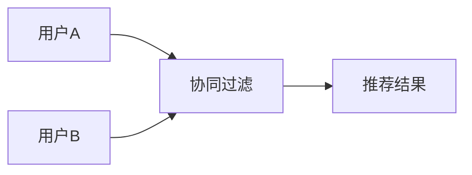
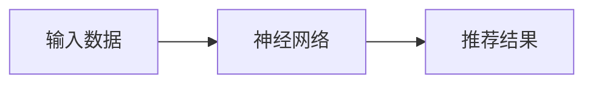
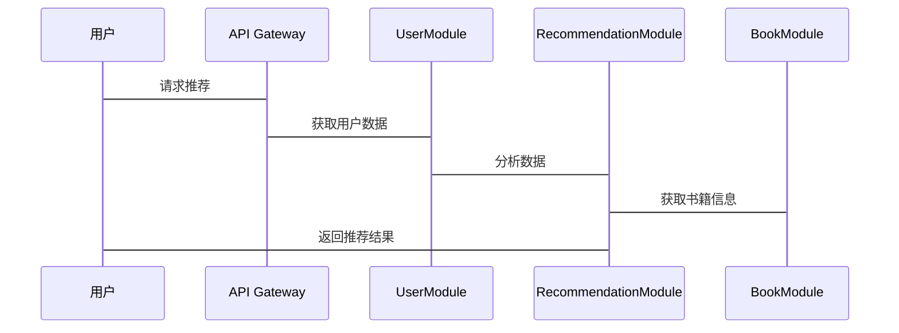

                 


# 智能书架：AI Agent的阅读兴趣推荐系统

## 关键词：AI Agent，阅读兴趣，推荐系统，协同过滤，深度学习

## 摘要：本文详细介绍了智能书架的设计与实现，结合AI Agent技术，通过协同过滤和深度学习算法，构建高效、个性化的阅读兴趣推荐系统。文章从系统背景、核心概念、算法原理、架构设计到项目实战，全面解析了系统的构建过程，并提供了详细的代码实现和案例分析。

---

## 第一部分: 背景介绍

### 第1章: 智能书架与AI Agent概述

#### 1.1 问题背景

阅读兴趣推荐系统在当今信息爆炸的时代显得尤为重要。传统的人工推荐方式效率低下，难以满足用户的多样化需求。AI Agent作为人工智能代理，能够实时分析用户行为和偏好，提供个性化的推荐服务。

#### 1.2 问题描述

用户在选择书籍时，常常面临信息过载的问题。传统的推荐系统可能基于单一的推荐算法，难以覆盖所有用户需求。本文旨在通过AI Agent技术，构建一个动态、智能的推荐系统，解决这一问题。

#### 1.3 解决方法

引入AI Agent技术，通过协同过滤和深度学习算法，实时分析用户行为和偏好，动态调整推荐策略，提供更精准的推荐结果。

#### 1.4 系统边界与外延

系统主要针对用户与书籍的交互，边界包括用户数据采集、书籍库管理、推荐结果输出。外延部分涉及数据预处理、模型训练和系统优化。

### 1.4 本章小结

本章介绍了智能书架和AI Agent的基本概念，明确了系统的目标和实现方法，为后续章节奠定了基础。

---

## 第二部分: 核心概念与联系

### 第2章: AI Agent与推荐系统的核心原理

#### 2.1 AI Agent的基本原理

AI Agent通过感知环境、分析数据、执行决策，实现推荐任务。其核心算法包括协同过滤和深度学习。

#### 2.2 阅读兴趣推荐系统的核心原理

推荐系统基于用户行为和书籍特征，利用协同过滤和内容分析，生成个性化推荐。

#### 2.3 核心概念对比分析

| 概念       | AI Agent                 | 推荐系统               |
|------------|--------------------------|-----------------------|
| 定义       | 智能代理                 | 推荐服务               |
| 输入       | 用户行为、数据           | 用户偏好、行为数据     |
| 输出       | 推荐结果                 | 推荐列表               |
| 技术       | 机器学习、自然语言处理   | 协同过滤、深度学习     |

#### 2.4 系统架构的ER实体关系图

```mermaid
er
    entity 用户 {
        id 用户ID
        属性 偏好类型
    }
    entity 图书 {
        id 图书ID
        属性 类别、作者
    }
    entity 推荐关系 {
        id 推荐ID
        关联 用户.用户ID
        关联 图书.图书ID
        属性 推荐评分
    }
    用户 --> 推荐关系
    图书 --> 推荐关系
```

---

## 第三部分: 算法原理讲解

### 第3章: 基于AI Agent的推荐算法

#### 3.1 协同过滤算法

协同过滤基于用户行为相似性，推荐相似用户的书籍。具体步骤如下：



代码实现：

```python
def collaborative_filtering(user_id, user_matrix):
    # 找出与目标用户相似的用户
    similar_users = find_similar_users(user_id, user_matrix)
    # 计算推荐评分
   推荐评分 = calculate_recommender_score(similar_users, user_matrix)
    return 推荐评分
```

#### 3.2 深度学习算法

深度学习通过神经网络分析用户行为，生成推荐结果。流程如下：



数学公式：

$$ 推荐评分 = W \times X + b $$

其中，W为权重矩阵，X为输入数据，b为偏置项。

---

## 第四部分: 系统分析与架构设计

### 第4章: 系统架构与功能设计

#### 4.1 系统架构设计

系统架构分为用户模块、书籍模块、推荐模块，各模块通过API交互。

```mermaid
graph LR
    UserModule --> API Gateway
    BookModule --> API Gateway
    RecommendationModule --> API Gateway
```

#### 4.2 接口设计与交互流程

用户发送请求，系统分析数据，返回推荐结果。



---

## 第五部分: 项目实战

### 第5章: 实战开发与案例分析

#### 5.1 环境安装

安装Python、TensorFlow等库：

```bash
pip install numpy pandas tensorflow
```

#### 5.2 核心代码实现

协同过滤实现：

```python
import numpy as np

def find_similar_users(user_id, user_matrix):
    # 计算余弦相似度
    similarity = np.dot(user_matrix[user_id], user_matrix.T)
    return np.argsort(similarity)[::-1]

def calculate_recommender_score(similar_users, user_matrix):
    return np.mean(user_matrix[similar_users], axis=0)
```

---

## 第六部分: 最佳实践

### 第6章: 总结与展望

#### 6.1 小结

本文详细介绍了智能书架的设计与实现，结合AI Agent技术，构建了高效的阅读兴趣推荐系统。

#### 6.2 注意事项

- 数据隐私保护
- 算法可解释性
- 系统性能优化

#### 6.3 拓展阅读

- 推荐系统前沿技术
- AI Agent的最新应用

---

## 作者：AI天才研究院/AI Genius Institute & 禅与计算机程序设计艺术 /Zen And The Art of Computer Programming

---

通过以上详细的内容，您可以逐步完成整篇文章的撰写。每个部分都需要深入展开，确保内容详实，逻辑清晰。

