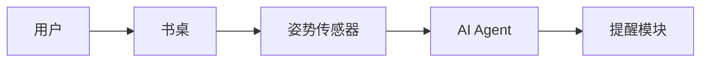
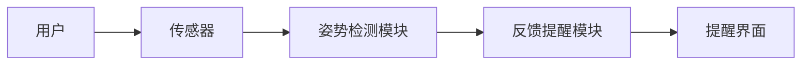

                 


```markdown
# 智能书桌：AI Agent的姿势提醒系统

## 关键词：AI Agent，姿势提醒，传感器技术，机器学习，人体工程学

## 摘要：  
随着现代工作和学习方式的改变，长时间保持不良姿势已成为普遍问题，导致各种健康隐患。本文提出了一种基于AI Agent的姿势提醒系统，通过传感器技术和机器学习算法，实时检测用户的姿势，并通过反馈机制提醒用户调整姿势，从而实现健康工作和学习的目标。文章详细介绍了系统的设计原理、实现方法以及实际应用案例。

---

## 第一部分：背景与概述

### 第1章：姿势提醒系统的背景与问题描述

#### 1.1 问题背景
现代人长时间使用电子设备，导致姿势问题日益严重，引发健康隐患。  
- 长期不良姿势可能导致颈椎病、肩周炎、腰椎病等职业病。  
- 非健康姿势会影响工作效率和生活质量。  

#### 1.2 问题描述
姿势提醒系统的目标是通过技术手段，实时监测用户的姿势，并在不良姿势出现时发出提醒。  
- 系统需要解决的核心问题：实时监测姿势、准确识别不良姿势、有效反馈提醒。  
- 系统的边界与外延：仅关注坐姿和站姿的检测，不涉及其他健康问题。  

#### 1.3 问题解决的思路
- 利用AI技术实现姿势检测：通过摄像头或传感器获取姿势数据，结合机器学习算法进行姿势识别。  
- 通过传感器获取人体姿势数据：使用惯性传感器（如加速度计、陀螺仪）或深度摄像头。  
- 结合反馈机制提醒用户调整姿势：通过震动、声音或屏幕提示等方式，引导用户调整姿势。  

### 第2章：智能书桌的核心概念与联系

#### 2.1 核心概念
- AI Agent：具有感知、决策和执行能力的智能体，能够根据环境信息做出响应。  
- 姿势提醒系统：通过传感器和AI算法，实时监测用户姿势并发出提醒的系统。  
- 人体工程学：研究人体与工作环境的交互，优化工作姿势以减少疲劳和伤害。  

#### 2.2 核心概念的联系
- AI Agent与姿势检测的结合：AI Agent通过传感器获取姿势数据，利用机器学习算法进行姿势识别。  
- 传感器技术在姿势提醒中的应用：传感器提供姿势数据，AI Agent处理数据并发出提醒。  
- 姿势优化与人体工程学的关联：人体工程学为姿势优化提供理论依据，AI Agent通过实时监测帮助用户实现最优姿势。  

#### 2.3 实体关系图


---

## 第二部分：AI Agent的姿势提醒系统原理

### 第3章：AI Agent的工作原理

#### 3.1 传感器数据采集
- 姿势传感器：通过加速度计、陀螺仪等传感器获取用户姿势数据。  
- 数据采集频率：高频采样（如50Hz）以确保实时监测。  

#### 3.2 姿势检测算法
- 基于机器学习的姿势识别：使用深度学习模型（如姿态估计网络）进行姿势分类。  
- 算法流程：  
  ```mermaid
  graph LR
      A[传感器数据] --> B[特征提取]
      B --> C[分类器]
      C --> D[姿势分类]
      D --> E[反馈模块]
  ```

#### 3.3 反馈机制
- 提醒方式：震动、声音提示、LED灯提醒等。  
- 提醒策略：根据姿势严重程度调整提醒频率和方式。  

---

### 第4章：系统架构设计

#### 4.1 系统功能设计
- 传感器数据采集模块：负责采集用户的姿势数据。  
- 姿势检测模块：对姿势数据进行分析，识别不良姿势。  
- 反馈提醒模块：根据检测结果发出提醒。  

#### 4.2 系统架构图


#### 4.3 接口设计
- 传感器接口：与姿势传感器通信，获取数据。  
- 用户界面接口：显示提醒信息，接收用户反馈。  

---

## 第三部分：项目实战与优化

### 第5章：项目实战

#### 5.1 环境配置
- Python环境：安装必要的库（如TensorFlow、OpenCV）。  
- 硬件设备：连接姿势传感器（如 MPU6050）。  

#### 5.2 核心代码实现
```python
import tensorflow as tf
import numpy as np

# 加载预训练模型
model = tf.keras.models.load_model('pose_classifier.h5')

# 传感器数据获取
def get_pose_data():
    # 获取传感器数据
    pass

# 姿势检测
def detect_pose(data):
    prediction = model.predict(data)
    return np.argmax(prediction, axis=1)

# 反馈提醒
def remind_user():
    # 发出震动或声音提醒
    pass
```

#### 5.3 实际案例分析
- 案例1：用户长时间低头看手机，系统发出震动提醒，用户调整姿势。  
- 案例2：用户保持良好姿势，系统给予正面反馈（如“继续保持”）。  

#### 5.4 系统优化
- 提高算法准确率：增加训练数据，优化模型结构。  
- 优化反馈机制：根据用户习惯调整提醒频率。  

---

## 第四部分：总结与展望

### 第6章：总结与展望

#### 6.1 总结
本文提出了一种基于AI Agent的姿势提醒系统，通过传感器技术和机器学习算法，实现了实时姿势监测和反馈提醒。系统设计合理，功能完善，能够有效改善用户的姿势问题。

#### 6.2 展望
未来，姿势提醒系统可以进一步优化算法，增加更多传感器类型，如温度、湿度等，提供更全面的健康监测。同时，可以结合智能家居系统，实现更智能化的健康管理。

---

## 最佳实践 Tips

- **小结**：姿势提醒系统的开发需要结合传感器技术、机器学习算法和用户反馈机制，确保系统的实用性和用户体验。  
- **注意事项**：在实际应用中，需要注意传感器的精度和稳定性，确保系统的准确性和可靠性。  
- **拓展阅读**：推荐学习人体工程学的相关知识，了解更复杂的姿势分析方法。

---

## 作者信息

作者：AI天才研究院 & 禅与计算机程序设计艺术
```

