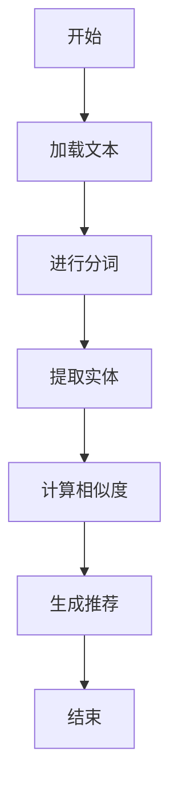
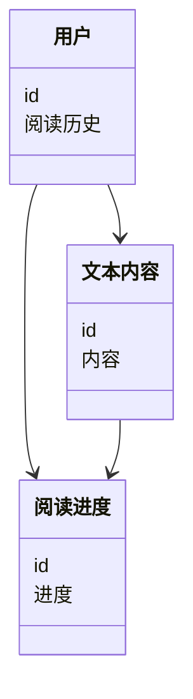
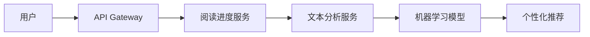

                 


# 智能书签：AI Agent的阅读进度追踪

> 关键词：智能书签，AI Agent，阅读进度，NLP，机器学习，文本挖掘

> 摘要：本文探讨了基于AI Agent的智能书签技术，详细介绍其核心原理、算法实现、系统架构设计及项目实战。通过分析阅读进度追踪的痛点，结合自然语言处理和机器学习技术，提出了一种创新的解决方案，展示了AI在提升阅读效率中的巨大潜力。

---

## 第1章: 背景介绍

### 1.1 问题背景

#### 1.1.1 阅读进度追踪的痛点
在数字化阅读时代，用户每天接触的信息量急剧增加，如何高效追踪阅读进度成为一大挑战。传统书签仅能记录位置，缺乏智能化功能，无法满足现代用户的需求。

#### 1.1.2 AI Agent在阅读中的应用潜力
AI Agent（智能体）具备自主决策和学习能力，能够实时分析文本内容，为用户提供个性化的阅读建议和进度追踪服务。

#### 1.1.3 智能书签的核心价值
智能书签通过AI技术，不仅能记录阅读位置，还能理解文本内容，帮助用户更好地理解和管理阅读进度。

### 1.2 问题描述

#### 1.2.1 阅读进度追踪的定义
阅读进度追踪是指通过技术手段记录用户阅读文本的状态，包括已读内容、阅读深度等。

#### 1.2.2 AI Agent在阅读中的角色定位
AI Agent作为智能书签的核心，负责处理文本信息、分析阅读行为，并提供相应的反馈和建议。

#### 1.2.3 智能书签的功能需求
- 实时记录阅读进度
- 自动标注重要知识点
- 提供阅读建议
- 支持多设备同步

### 1.3 解决方案

#### 1.3.1 基于AI的阅读进度追踪方法
通过自然语言处理和机器学习技术，智能书签能够实时分析文本内容，为用户提供深度的阅读分析。

#### 1.3.2 AI Agent实现智能书签的核心技术
- 文本分析
- 用户行为建模
- 个性化推荐

#### 1.3.3 智能书签的用户价值
- 提高阅读效率
- 深化知识理解
- 个性化学习体验

### 1.4 边界与外延

#### 1.4.1 智能书签的适用场景
- 电子书阅读
- 学术研究
- 专业培训

#### 1.4.2 与其他阅读工具的区分
智能书签的核心在于其智能化分析能力，区别于传统书签和简单的阅读工具。

#### 1.4.3 智能书签的未来发展
随着AI技术的进步，智能书签将更加个性化和智能化，成为用户知识管理的重要工具。

### 1.5 核心概念结构

#### 1.5.1 核心要素组成
- 用户阅读数据
- 文本分析模块
- AI Agent
- 个性化推荐系统

#### 1.5.2 概念属性特征对比表格

| 核心概念 | 特性描述 |
|----------|----------|
| AI Agent | 自主决策，实时分析 |
| 阅读进度 | 包括位置、深度、时间 |
| 文本分析 | 基于NLP技术 |

#### 1.5.3 ER实体关系图架构

```mermaid
erd
    entity 用户 {
        id
        阅读历史
    }
    entity 文本内容 {
        id
        文本段落
    }
    entity 阅读进度 {
        id
        进度位置
        阅读时间
    }
    用户 -[1..n]-> 阅读进度
    文本内容 -[1..n]-> 阅读进度
```

---

## 第2章: AI Agent的基本原理

### 2.1 核心概念原理

#### 2.1.1 AI Agent的定义与分类
AI Agent是一种能够感知环境并采取行动以实现目标的智能实体，分为简单反射型、基于模型的反应型、目标驱动型和实用驱动型。

#### 2.1.2 基于NLP的阅读理解
自然语言处理技术用于理解文本内容，提取关键信息，为AI Agent提供决策依据。

#### 2.1.3 基于机器学习的阅读进度预测
通过机器学习模型预测用户的阅读进度，优化阅读体验。

### 2.2 核心算法流程图



---

## 第3章: 基于NLP的阅读理解

### 3.1 分词与实体识别

#### 3.1.1 分词算法原理
分词是将文本分割成有意义的词汇，常用算法包括基于规则的分词和基于统计的分词。

#### 3.1.2 实体识别流程
通过NLP技术识别文本中的实体，如人名、地名、组织名等。

#### 3.1.3 示例代码实现

```python
import jieba

text = "禅与计算机程序设计艺术"
words = jieba.lcut(text)
print(words)  # 输出: ['禅', '与', '计算机', '程序', '设计', '艺术']
```

### 3.2 文本相似度计算

#### 3.2.1 余弦相似度公式
$$ \text{余弦相似度} = \frac{\vec{A} \cdot \vec{B}}{|\vec{A}||\vec{B}|} $$

---

## 第4章: 系统分析与架构设计

### 4.1 系统功能设计

#### 4.1.1 领域模型


#### 4.1.2 系统架构


---

## 第5章: 项目实战

### 5.1 环境安装

```bash
pip install jieba
pip install transformers
```

### 5.2 核心代码实现

#### 5.2.1 文本分词

```python
import jieba

def text_segmentation(text):
    return jieba.lcut(text)
```

#### 5.2.2 实体识别

```python
from transformers import pipeline

ner = pipeline("ner")
result = ner("禅与计算机程序设计艺术")
```

### 5.3 案例分析

#### 5.3.1 文本相似度计算

```python
from sklearn.metrics.pairwise import cosine_similarity

vectorizer = TfidfVectorizer()
vectors = vectorizer.fit_transform(["禅与计算机程序设计艺术", "人工智能入门"])
similarity = cosine_similarity(vectors[0], vectors[1])
print(similarity)
```

---

## 第6章: 最佳实践与小结

### 6.1 最佳实践 tips
- 定期更新模型
- 保护用户隐私
- 提供多语言支持

### 6.2 小结
智能书签通过AI Agent实现了高效的阅读进度追踪，结合NLP和机器学习技术，为用户提供了个性化的阅读体验。

### 6.3 注意事项
- 数据安全
- 模型更新
- 用户反馈

### 6.4 拓展阅读
- 《自然语言处理入门》
- 《机器学习实战》
- 《AI在阅读中的应用》

---

作者：AI天才研究院/AI Genius Institute & 禅与计算机程序设计艺术 /Zen And The Art of Computer Programming

