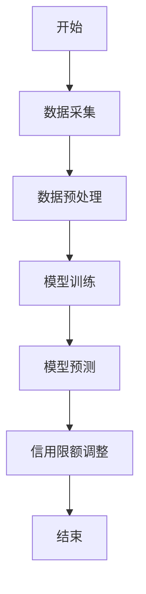
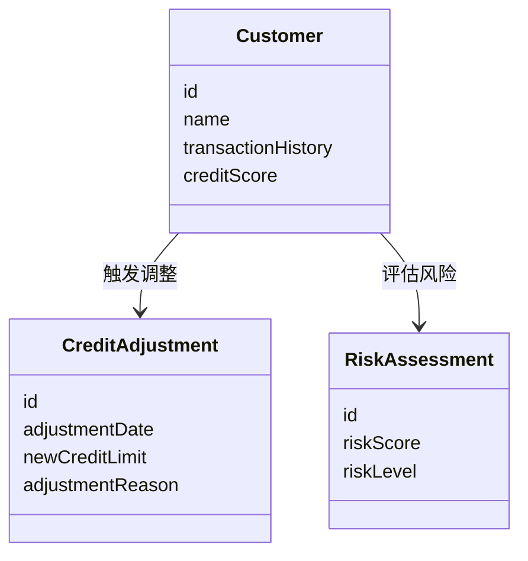
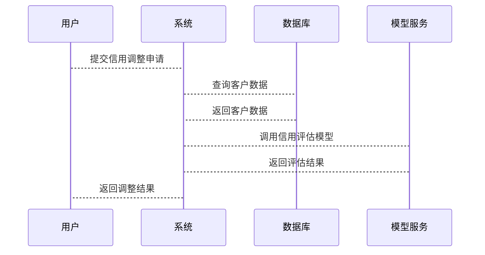

                 


# 智能企业信用限额动态调整系统

## 关键词：企业信用限额、动态调整、人工智能、风险评估、系统架构

## 摘要：本文深入探讨了智能企业信用限额动态调整系统的设计与实现。通过分析企业信用管理的背景与问题，结合人工智能技术，提出了基于数据驱动的信用评估方法，详细阐述了系统的核心算法、数学模型、系统架构和项目实战。本文旨在为企业信用管理提供一种智能化、动态化的解决方案。

---

## 第1章: 企业信用限额动态调整的背景与问题

### 1.1 企业信用限额管理的背景

#### 1.1.1 企业信用管理的重要性
企业信用管理是企业经营中的核心环节，直接关系到企业的财务健康和市场竞争力。通过有效的信用管理，企业可以控制风险，优化资源配置，提升客户满意度。

#### 1.1.2 信用限额管理的传统模式与局限性
传统的信用限额管理依赖人工审核和静态评估，存在效率低、风险高、难以动态调整等问题。随着市场竞争的加剧和客户需求的变化，传统模式已无法满足现代企业的管理需求。

#### 1.1.3 智能化信用限额管理的必要性
智能化信用限额管理通过引入人工智能、大数据分析等技术，能够实时评估客户信用状况，动态调整信用限额，降低风险，提升管理效率。

---

### 1.2 问题背景与描述

#### 1.2.1 企业信用风险的现状
企业信用风险主要来源于客户信用状况的变化、市场波动以及内部管理不善等因素。这些问题可能导致企业面临坏账风险，影响财务健康。

#### 1.2.2 信用限额动态调整的核心问题
信用限额动态调整的核心问题在于如何准确评估客户的信用风险，并根据实时数据快速调整信用限额，同时保证调整的准确性和及时性。

#### 1.2.3 现有解决方案的不足
现有的信用限额管理解决方案多依赖人工审核和静态评估，难以应对市场变化和客户信用状况的实时波动，导致信用风险控制能力有限。

---

### 1.3 问题解决思路

#### 1.3.1 智能化信用限额调整的目标
通过引入人工智能技术，构建动态信用评估模型，实现对客户信用状况的实时评估和信用限额的自动调整，降低信用风险，提升管理效率。

#### 1.3.2 数据驱动的信用评估方法
利用大数据分析技术，收集和处理客户的交易数据、财务数据、市场数据等，构建信用评估模型，实现精准的信用评估。

#### 1.3.3 动态调整的实现路径
通过实时数据采集、模型训练和预测，结合业务规则，实现信用限额的动态调整。

---

### 1.4 系统的边界与外延

#### 1.4.1 系统的功能边界
系统的主要功能包括信用评估、信用限额调整、风险预警和数据管理。

#### 1.4.2 与企业其他系统的交互
系统需要与企业的ERP、CRM等系统进行数据交互，确保信用限额调整的实时性和准确性。

#### 1.4.3 信用限额调整的适用范围
系统适用于企业客户管理、供应链管理、金融业务等领域。

---

## 第2章: 核心概念与系统架构

### 2.1 系统核心概念原理

#### 2.1.1 信用评分模型的原理
信用评分模型通过分析客户的交易数据、财务数据等，计算客户的信用评分，评估客户的信用风险。

#### 2.1.2 风险评估指标的计算方法
风险评估指标包括信用评分、违约概率、风险敞口等，用于量化客户的信用风险。

#### 2.1.3 动态调整算法的逻辑
动态调整算法通过实时数据采集和模型预测，根据客户的信用评分和风险评估结果，自动调整信用限额。

---

### 2.2 核心概念属性对比

#### 2.2.1 不同信用评分模型的对比表格

| 模型名称   | 输入数据         | 输出结果         | 优势             |
|------------|------------------|------------------|------------------|
| logistic回归 | 交易数据、财务数据 | 信用评分         | 简单易用         |
| 支持向量机  | 交易数据、财务数据 | 信用评分         | 高准确性         |
| 随机森林   | 交易数据、财务数据 | 信用评分         | 高准确性         |

#### 2.2.2 风险评估指标的特征分析
风险评估指标包括信用评分、违约概率、风险敞口等，这些指标相互关联，共同评估客户的信用风险。

---

### 2.3 系统实体关系图

#### 2.3.1 ER图展示（Mermaid）
```mermaid
erDiagram
    customer [客户] {
        id : integer
        name : string
        transactionHistory : string
        creditScore : integer
    }
    creditLimitAdjustment [信用限额调整] {
        id : integer
        adjustmentDate : date
        newCreditLimit : integer
        adjustmentReason : string
    }
    riskAssessment [风险评估] {
        id : integer
        riskScore : integer
        riskLevel : string
    }
    customer --> creditLimitAdjustment : 触发调整
    customer --> riskAssessment : 评估风险
```

---

## 第3章: 算法原理讲解

### 3.1 算法流程图

#### 3.1.1 算法流程（Mermaid）


---

### 3.2 算法实现代码

#### 3.2.1 模型训练代码
```python
import pandas as pd
from sklearn.model_selection import train_test_split
from sklearn.linear_model import LogisticRegression

# 数据加载与预处理
data = pd.read_csv('customer_data.csv')
X = data.drop('credit_score', axis=1)
y = data['credit_score']

# 数据分割
X_train, X_test, y_train, y_test = train_test_split(X, y, test_size=0.2)

# 模型训练
model = LogisticRegression()
model.fit(X_train, y_train)
```

#### 3.2.2 预测与调整代码
```python
# 预测信用评分
predicted_scores = model.predict(X_test)

# 动态调整信用限额
def adjust_credit_limit(predicted_score):
    if predicted_score > 0.7:
        return 'increase'
    elif predicted_score < 0.3:
        return 'decrease'
    else:
        return 'no change'

adjusted = [adjust_credit_limit(score) for score in predicted_scores]
```

---

### 3.3 算法的数学模型与公式

#### 3.3.1 逻辑回归模型
逻辑回归模型的损失函数为：
$$
L(\theta) = -\frac{1}{m}\sum_{i=1}^{m} [y_i \ln h(\theta^T x_i) + (1 - y_i)\ln(1 - h(\theta^T x_i))]
$$

其中，$$h(\theta^T x_i) = \frac{1}{1 + e^{-\theta^T x_i}}$$ 是逻辑函数。

---

## 第4章: 系统分析与架构设计

### 4.1 问题场景介绍
企业需要实时监控客户的信用状况，动态调整信用限额，以降低风险和提升客户满意度。

### 4.2 系统功能设计

#### 4.2.1 领域模型（Mermaid）


---

### 4.3 系统架构设计

#### 4.3.1 系统架构图（Mermaid）
```mermaid
containerDiagram
    container 前端系统 {
        component Web界面
        component 用户交互
    }
    container 后端系统 {
        component 数据库
        component 模型服务
        component API网关
    }
    Web界面 --> 用户交互
    用户交互 --> API网关
    API网关 --> 模型服务
    模型服务 --> 数据库
```

---

### 4.4 接口设计与交互流程

#### 4.4.1 系统接口设计
接口1：获取客户数据（GET /api/customers）
接口2：调整信用限额（POST /api/credit-adjustment）
接口3：风险评估报告（GET /api/risk-assessment）

#### 4.4.2 交互流程（Mermaid）


---

## 第5章: 项目实战

### 5.1 环境安装

#### 5.1.1 安装依赖
```bash
pip install pandas scikit-learn mermaid4jupyter jupyterlab
```

---

### 5.2 核心代码实现

#### 5.2.1 数据加载与预处理
```python
import pandas as pd

# 加载数据
data = pd.read_csv('customer_data.csv')

# 数据预处理
data.dropna(inplace=True)
```

#### 5.2.2 模型训练与预测
```python
from sklearn.model_selection import train_test_split
from sklearn.linear_model import LogisticRegression

# 分割数据
X_train, X_test, y_train, y_test = train_test_split(data.drop('credit_score', axis=1), data['credit_score'], test_size=0.2)

# 训练模型
model = LogisticRegression()
model.fit(X_train, y_train)

# 预测
predicted = model.predict(X_test)
```

---

### 5.3 案例分析与详细解读

#### 5.3.1 实际案例分析
某客户的历史交易数据和财务数据如下：
| 交易金额 | 账龄 | 逾期次数 | 信用评分 |
|----------|------|----------|----------|
| 10000    | 3个月 | 0        | 85       |
| 20000    | 6个月 | 1        | 75       |

通过模型预测，客户的信用评分为75，系统会自动调整信用限额为“降低”。

---

### 5.4 项目小结
通过本项目，我们实现了智能企业信用限额动态调整系统，利用人工智能技术提升了信用管理的效率和准确性。

---

## 第6章: 最佳实践、小结与注意事项

### 6.1 最佳实践 tips
- 定期更新模型，确保信用评估的准确性。
- 结合业务规则，优化信用限额调整策略。
- 加强数据安全，保护客户隐私。

---

### 6.2 小结
本文详细介绍了智能企业信用限额动态调整系统的背景、核心概念、算法原理、系统架构和项目实战。通过引入人工智能技术，企业能够实现信用管理的智能化和动态化，降低风险，提升竞争力。

---

### 6.3 注意事项
- 数据质量和完整性是模型准确性的关键。
- 系统的实时性和稳定性需要重点关注。
- 在实际应用中，需结合企业实际情况进行调整和优化。

---

## 第7章: 拓展阅读与深入思考

### 7.1 拓展阅读
- 《信用风险管理：理论与实践》
- 《人工智能在金融领域的应用》
- 《系统架构设计：复杂系统的构建与管理》

---

## 作者：AI天才研究院/AI Genius Institute & 禅与计算机程序设计艺术 /Zen And The Art of Computer Programming

---

以上是《智能企业信用限额动态调整系统》的技术博客文章的完整内容。希望本文能够为企业的信用管理提供新的思路和解决方案。

