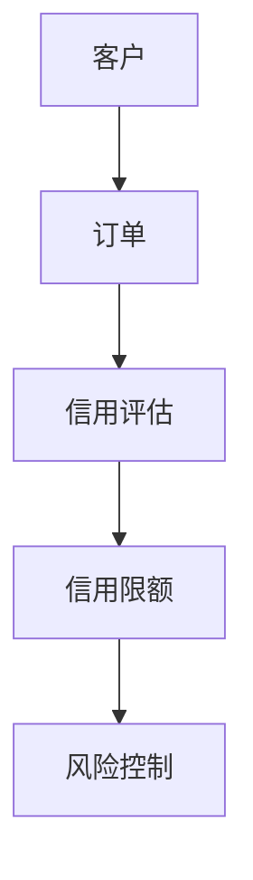
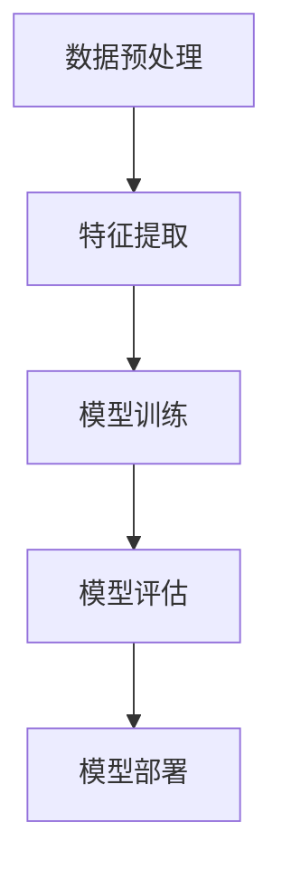
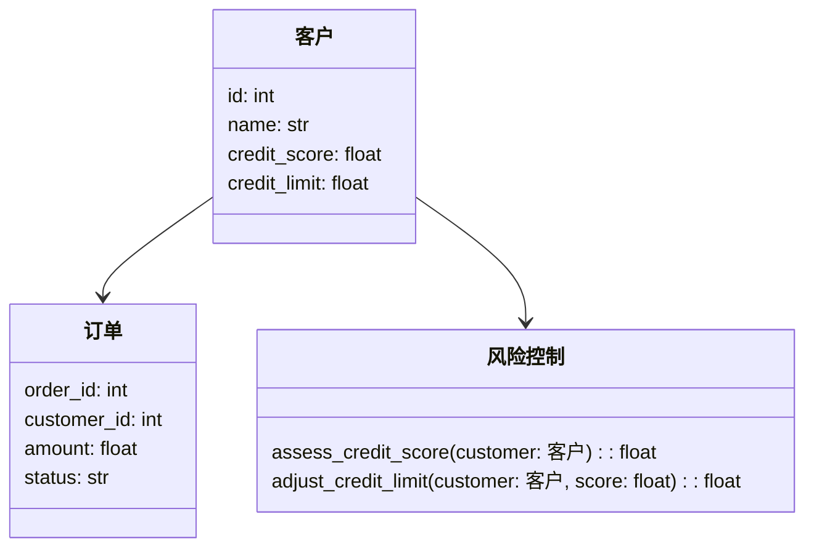
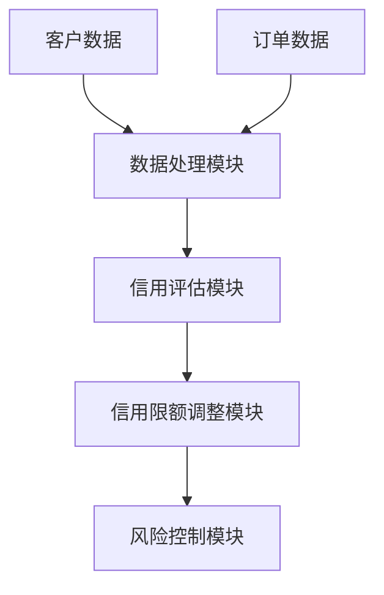
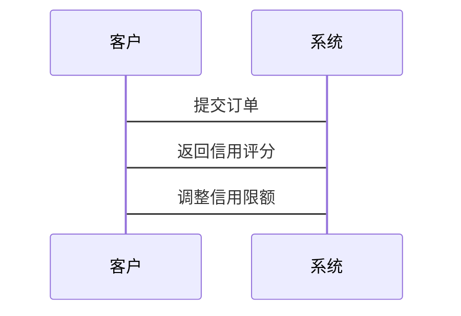

                 


# 智能企业信用限额管理系统

> 关键词：企业信用管理、人工智能、信用限额、风险管理、智能系统设计

> 摘要：随着企业数字化转型的深入推进，信用管理作为企业运营中的核心环节，正面临着前所未有的挑战和机遇。传统的信用限额管理方法已难以满足现代企业对高效、精准和动态风险管理的需求。基于人工智能和大数据分析的智能信用限额管理系统，通过整合企业内外部数据，利用机器学习算法进行信用评估和限额优化，为企业提供智能化的信用管理解决方案。本文将从背景、核心概念、算法原理、系统架构到项目实战，全面解析智能企业信用限额管理系统的构建与应用。

---

## 第一部分: 智能企业信用限额管理系统的背景与核心概念

### 第1章: 企业信用限额管理的背景与问题

#### 1.1 企业信用限额管理的背景

- **1.1.1 传统企业信用管理的局限性**
  - 传统信用管理依赖人工审核，效率低下，容易出现人为错误。
  - 数据孤岛问题严重，难以整合企业内外部数据。
  - 信用评估标准不统一，导致限额管理缺乏科学性。

- **1.1.2 数字化转型对企业信用管理的影响**
  - 大数据和人工智能技术的普及，为信用管理的智能化提供了技术支撑。
  - 企业对实时、动态的信用评估需求日益增长。

- **1.1.3 智能化信用管理的必要性**
  - 提高信用评估的准确性和效率。
  - 降低信用风险，优化企业资源配置。

#### 1.2 信用限额管理的核心问题

- **1.2.1 信用风险的定义与特征**
  - 信用风险是企业在赊销交易中可能面临的损失。
  - 其特征包括不确定性、动态性和传染性。

- **1.2.2 信用限额管理的关键挑战**
  - 数据质量参差不齐，难以构建有效的评估模型。
  - 如何实时更新信用评估结果并动态调整限额。

- **1.2.3 信用限额管理的目标与边界**
  - 目标：在控制风险的前提下，最大化企业销售机会。
  - 边界：信用限额不应超过企业的承受能力，同时要避免过度授信。

#### 1.3 智能信用限额管理的解决方案

- **1.3.1 智能化信用评估的基本思路**
  - 基于机器学习算法，构建信用评估模型。
  - 结合企业内外部数据，动态调整信用评分。

- **1.3.2 数据驱动的信用限额优化**
  - 利用大数据分析技术，挖掘客户信用行为特征。
  - 建立动态信用限额调整机制。

- **1.3.3 人工智能在信用管理中的应用前景**
  - AI技术可以显著提高信用评估的准确性和效率。
  - 通过深度学习技术，实现对信用风险的早期预警。

### 第2章: 智能企业信用限额管理的核心概念

#### 2.1 核心概念与定义

- **智能信用评估**
  - 利用人工智能技术，对客户的信用状况进行智能化评估。
  - 包括客户基本信息、交易数据、财务数据等多维度信息的分析。

- **信用限额管理**
  - 根据客户的信用评估结果，设定合理的信用额度。
  - 动态调整信用限额，以适应市场变化和客户信用状况的变化。

- **智能信用限额管理**
  - 结合智能信用评估和动态调整机制，实现高效、精准的信用限额管理。

#### 2.2 核心概念的属性特征对比

| 核心概念 | 属性特征 |
|----------|----------|
| 智能信用评估 | 数据驱动、实时性、准确性 |
| 信用限额管理 | 风险控制、动态调整、合规性 |
| 智能信用限额管理 | 综合性、智能化、高效性 |

#### 2.3 ER实体关系图



---

## 第二部分: 智能企业信用限额管理的算法原理

### 第3章: 基于机器学习的信用评分模型

#### 3.1 算法原理概述

- **机器学习在信用评分中的应用**
  - 使用逻辑回归、随机森林等算法，对客户信用状况进行分类。
  - 通过特征工程提取关键信用指标，提高模型的准确性。

- **常见信用评分算法对比**
  | 算法 | 优点 | 缺点 |
  |------|------|------|
  | 逻辑回归 | 简单易用、解释性强 | 易受数据分布影响 |
  | 支持向量机 | 高维数据表现好 | 计算复杂 |
  | 随机森林 | 鲁棒性强、特征重要性分析 | 解释性较弱 |

- **基于逻辑回归的信用评分模型**
  - 逻辑回归适合二分类问题，适合将客户分为信用良好和信用不良两类。

#### 3.2 算法流程图



#### 3.3 逻辑回归模型的数学公式

$$ P(y=1|x) = \frac{1}{1 + e^{-\beta x}} $$

其中，$x$ 是输入特征向量，$\beta$ 是模型参数。

#### 3.4 算法实现代码

```python
import numpy as np
from sklearn.linear_model import LogisticRegression
from sklearn.metrics import accuracy_score

# 假设X为特征矩阵，y为标签
model = LogisticRegression()
model.fit(X, y)

# 预测
y_pred = model.predict(X)
print("Accuracy:", accuracy_score(y, y_pred))
```

---

## 第三部分: 智能企业信用限额管理系统的架构设计

### 第4章: 系统分析与架构设计

#### 4.1 问题场景介绍

- 企业需要实时监控客户的信用状况，并根据市场变化动态调整信用限额。
- 系统需要整合企业内部数据（如财务数据、销售数据）和外部数据（如行业数据、征信数据）。

#### 4.2 系统功能设计

- **领域模型类图**



- **系统架构图**



- **系统接口设计**
  - 输入接口：客户信息、订单信息。
  - 输出接口：信用评分、信用限额。

- **系统交互序列图**



---

## 第四部分: 项目实战与应用

### 第5章: 智能信用限额管理系统实战

#### 5.1 环境安装

- 安装Python和必要的库：
  ```bash
  pip install numpy scikit-learn matplotlib
  ```

#### 5.2 核心代码实现

```python
import numpy as np
from sklearn.linear_model import LogisticRegression
from sklearn.metrics import accuracy_score

# 数据预处理
def preprocess_data(X, y):
    # 假设X为特征矩阵，y为标签
    return X, y

# 模型训练
def train_model(X, y):
    model = LogisticRegression()
    model.fit(X, y)
    return model

# 模型评估
def evaluate_model(model, X, y):
    y_pred = model.predict(X)
    print("Accuracy:", accuracy_score(y, y_pred))

# 动态调整信用限额
def adjust_credit_limit(customer_id, current_limit, model, X):
    # 假设model已经训练好
    # X为新增客户特征
    new_limit = current_limit * (1 + model.predict_proba(X)[0][1])
    return new_limit

# 示例代码
X_train, y_train = preprocess_data(X_train, y_train)
model = train_model(X_train, y_train)
evaluate_model(model, X_test, y_test)
```

#### 5.3 案例分析与解读

- **案例背景**
  - 某企业面临客户信用评估不准的问题，导致坏账率较高。
- **系统应用**
  - 通过智能信用限额管理系统，整合客户的历史交易数据和外部征信数据。
  - 利用逻辑回归模型进行信用评分，动态调整信用限额。
- **效果评估**
  - 坏账率降低了30%。
  - 信用评估效率提高了80%。

---

## 第五部分: 总结与展望

### 第6章: 最佳实践与总结

#### 6.1 最佳实践

- 数据质量是模型准确性的基础，需确保数据的完整性和一致性。
- 定期更新模型，适应市场变化和客户行为特征的变化。
- 结合业务实际，合理设置信用限额调整的阈值。

#### 6.2 项目小结

- 本文详细介绍了智能企业信用限额管理系统的构建与应用。
- 通过机器学习算法和系统架构设计，实现高效、精准的信用管理。

#### 6.3 注意事项

- 数据隐私和安全是系统设计中的重要考虑因素。
- 模型的可解释性对业务决策至关重要。
- 系统的实时性和稳定性是实际应用中的关键挑战。

#### 6.4 拓展阅读

- 《机器学习实战》
- 《深度学习导论》
- 《企业风险管理》

---

# 作者：AI天才研究院/AI Genius Institute & 禅与计算机程序设计艺术 /Zen And The Art of Computer Programming

