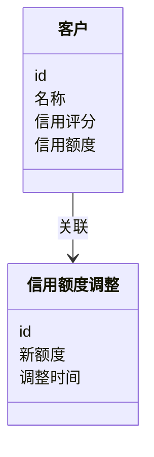
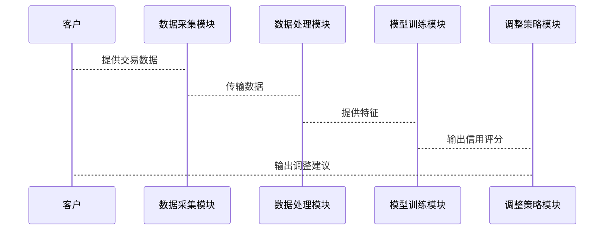

                 


# 智能企业信用额度动态调整与控制系统

> 关键词：智能信用额度，动态调整，风险管理，机器学习，企业信用管理

> 摘要：本文探讨了智能企业信用额度动态调整与控制系统的背景、核心概念、算法原理、系统架构设计及项目实战。通过详细分析，展示了如何利用人工智能和机器学习技术实现信用额度的实时监控和优化调整，降低企业风险，提高客户满意度。

---

# 第一部分: 智能企业信用额度动态调整与控制系统的背景与概念

## 第1章: 企业信用额度动态调整的背景与问题

### 1.1 信用额度动态调整的背景

#### 1.1.1 传统信用额度管理的局限性
传统的企业信用额度管理通常基于静态评估，存在以下问题：
- 无法实时反映客户的信用状况变化。
- 人工干预过多，效率低下。
- 风险控制能力有限，可能导致逾期欠款或过度授信。

#### 1.1.2 智能化管理的需求与趋势
随着企业数字化转型的推进，智能化信用管理成为必然趋势：
- 数据驱动的决策需要实时、动态的信用评估。
- AI技术的应用能够提高信用管理的精准性和效率。
- 动态调整信用额度有助于平衡客户满意度和企业风险。

#### 1.1.3 企业信用管理的数字化转型
企业信用管理正在从传统的规则驱动向数据驱动转变：
- 利用大数据和AI技术进行实时监控和预测。
- 通过动态调整信用额度，优化客户关系管理。
- 提高企业的整体运营效率和风险管理能力。

### 1.2 问题背景与描述

#### 1.2.1 企业信用额度管理的核心问题
企业在信用管理中面临以下核心问题：
- 如何实时评估客户的信用状况。
- 如何动态调整信用额度以平衡风险和客户满意度。
- 如何确保信用调整的公平性和透明性。

#### 1.2.2 动态调整的必要性与挑战
动态调整信用额度的必要性：
- 及时响应客户的信用变化。
- 减少坏账风险。
- 提高客户满意度。

动态调整的挑战：
- 数据实时性要求高。
- 算法需要高精度和稳定性。
- 系统需要具备快速响应能力。

#### 1.2.3 系统目标与边界
系统目标：
- 实现实时信用评估和动态调整。
- 提供智能化的信用管理工具。
- 最大化客户满意度和企业收益。

系统边界：
- 系统仅处理信用额度的调整，不涉及其他业务模块。
- 系统依赖于实时数据输入和可靠的算法模型。

---

## 第2章: 核心概念与系统框架

### 2.1 智能信用额度控制系统的定义

#### 2.1.1 系统的核心概念
智能信用额度控制系统是一个基于AI的实时监控和调整系统，核心概念包括：
- **实时数据采集**：从多种数据源实时获取客户信息。
- **动态评估模型**：基于机器学习算法评估客户的信用状况。
- **智能调整机制**：根据评估结果动态调整信用额度。

#### 2.1.2 系统的功能模块
系统主要功能模块包括：
- 数据采集模块：负责实时数据的获取和处理。
- 评估模块：利用机器学习模型进行信用评估。
- 调整模块：根据评估结果动态调整信用额度。

#### 2.1.3 系统的输入输出
- 输入：客户行为数据、交易记录、市场数据等。
- 输出：信用额度调整建议、风险预警信息。

### 2.2 核心概念对比与ER图

#### 2.2.1 核心概念对比表
| 概念         | 描述                                                                 |
|--------------|----------------------------------------------------------------------|
| 信用额度     | 企业给予客户的信用限额，用于赊销交易。                             |
| 动态调整     | 根据客户的实时信用状况，实时调整信用额度。                         |
| 风险管理     | 通过控制信用额度降低企业风险，确保资金安全。                       |
| 信用评分模型 | 基于机器学习算法，评估客户的信用风险。                             |

#### 2.2.2 ER图实体关系
```mermaid
er
    %% 实体关系图
    entity 客户 {
        id
        名称
        信用评分
    }
    entity 信用额度 {
        id
        金额
        调整时间
    }
    entity 风险评估 {
        id
        风险等级
        评估时间
    }
    客户 --> 信用额度: 拥有
    客户 --> 风险评估: 关联
    信用额度 --> 风险评估: 基于
```

---

## 第3章: 系统的关键技术与实现

### 3.1 动态调整算法的选择与优化

#### 3.1.1 常见算法对比
| 算法名称 | 描述                                                                 | 优点                                   | 缺点                                   |
|----------|----------------------------------------------------------------------|----------------------------------------|----------------------------------------|
| 线性回归  | 基于特征的线性关系预测信用评分。                                     | 简单易懂，计算效率高。                   | 易受异常值影响，不适合复杂非线性关系。 |
| 支持向量机| 基于特征空间的分割进行分类。                                         | 高精度，适合小数据集。                   | 计算复杂度高，不适合大数据。             |
| 随机森林  | 基于决策树的集成算法进行分类和回归。                                 | 高精度，适合大数据集。                   | 计算资源消耗大。                         |

#### 3.1.2 算法优化策略
- 数据预处理：特征选择、标准化、去重。
- 模型优化：参数调优、集成学习。
- 实时更新：动态调整模型权重，确保模型准确性。

#### 3.1.3 实现步骤与流程
1. 数据采集：从数据库中获取客户交易记录、行为数据等。
2. 数据处理：清洗、标准化、特征选择。
3. 模型训练：选择合适的算法，训练信用评分模型。
4. 动态调整：根据模型预测结果，实时调整信用额度。

---

# 第二部分: 算法原理与数学模型

## 第4章: 动态调整算法的数学模型

### 4.1 线性回归模型

#### 4.1.1 线性回归的基本原理
线性回归是一种简单而有效的回归算法，适用于线性关系的数据。其基本假设是目标变量与特征变量之间存在线性关系。

#### 4.1.2 模型的数学表达式
$$ y = \beta_0 + \beta_1x + \epsilon $$

其中：
- $y$：目标变量（信用评分）。
- $x$：特征变量（如交易金额、还款记录）。
- $\beta_0$：截距。
- $\beta_1$：回归系数。
- $\epsilon$：误差项。

### 4.2 支持向量机（SVM）模型

#### 4.2.1 SVM的基本原理
SVM是一种监督学习算法，适用于分类和回归问题。其核心思想是将数据映射到高维空间，并在高维空间中找到一个超平面，使得正负样本被最大化地分割。

#### 4.2.2 线性可分情况下的数学模型
$$ y = sign(w \cdot x + b) $$

其中：
- $w$：权重向量。
- $x$：输入样本。
- $b$：偏置项。
- $sign$：符号函数，返回+1或-1。

---

## 第5章: 随机森林模型

### 5.1 随机森林的基本原理
随机森林是一种基于决策树的集成算法，通过构建多棵决策树并集成预测结果来提高模型的准确性和鲁棒性。

### 5.2 随机森林的数学表达式
$$ y = \frac{1}{N} \sum_{i=1}^{N} y_i $$

其中：
- $N$：决策树的数量。
- $y_i$：第$i$棵决策树的预测结果。

---

# 第三部分: 系统分析与架构设计方案

## 第6章: 系统架构设计

### 6.1 问题场景介绍
企业信用额度动态调整系统需要实时处理大量数据，包括客户交易记录、行为数据等。系统需要具备高可用性和实时性。

### 6.2 项目介绍
项目目标：实现一个基于AI的信用额度动态调整系统。
项目范围：仅限于信用额度的实时调整，不涉及其他业务模块。
项目约束：确保数据安全和合规性。

### 6.3 系统功能设计

#### 6.3.1 领域模型


### 6.4 系统架构设计

#### 6.4.1 系统架构图


### 6.5 系统接口设计

#### 6.5.1 接口描述
- 数据采集接口：负责从数据库获取客户数据。
- 模型调用接口：负责调用机器学习模型进行信用评分。
- 调整策略接口：负责根据信用评分动态调整信用额度。

### 6.6 系统交互流程

#### 6.6.1 交互流程图


---

## 第7章: 项目实战

### 7.1 环境安装

#### 7.1.1 安装Python和相关库
- 安装Python：[Python官方文档](https://www.python.org/)
- 安装库：
  ```bash
  pip install numpy scikit-learn pandas matplotlib
  ```

### 7.2 核心代码实现

#### 7.2.1 数据预处理代码
```python
import pandas as pd
import numpy as np

# 数据加载
data = pd.read_csv('credit_data.csv')

# 数据清洗
data.dropna(inplace=True)

# 标准化处理
from sklearn.preprocessing import StandardScaler
scaler = StandardScaler()
scaled_data = scaler.fit_transform(data[['交易金额', '还款记录']])
```

#### 7.2.2 算法实现代码
```python
from sklearn.ensemble import RandomForestRegressor

# 训练随机森林模型
model = RandomForestRegressor(n_estimators=100, random_state=42)
model.fit(scaled_data, data['信用评分'])

# 预测信用评分
new_data = scaler.transform(new_customer_data[['交易金额', '还款记录']])
predicted_score = model.predict(new_data)
```

### 7.3 案例分析与解读

#### 7.3.1 案例分析
假设有一个客户，其交易金额和还款记录分别为：
- 交易金额：$5000
- 还款记录：$4500

根据模型预测，客户的信用评分为0.85，属于高风险客户。因此，系统将建议降低其信用额度。

#### 7.3.2 代码解读
- 数据预处理：对数据进行清洗和标准化处理，确保模型输入的格式一致。
- 模型训练：使用随机森林算法训练信用评分模型，提高预测精度。
- 动态调整：根据模型预测结果，动态调整客户的信用额度，确保风险可控。

### 7.4 项目小结

#### 7.4.1 成果总结
- 成功实现了一个基于AI的信用额度动态调整系统。
- 提高了企业的风险管理能力，降低了坏账风险。
- 提高了客户的满意度，优化了企业与客户的关系。

#### 7.4.2 经验总结
- 数据质量对模型性能影响重大，必须重视数据预处理。
- 模型的选择需要根据具体业务场景和数据特点进行调整。
- 系统的实时性和稳定性是确保动态调整效果的关键。

---

## 第8章: 最佳实践与注意事项

### 8.1 小结

#### 8.1.1 核心观点总结
- 智能企业信用额度动态调整系统是企业信用管理的重要工具。
- 通过AI技术实现信用额度的实时监控和调整，能够有效降低风险，提高客户满意度。

### 8.2 注意事项

#### 8.2.1 数据隐私与安全
- 确保客户数据的安全性，防止数据泄露。
- 遵守相关法律法规，保护客户隐私。

#### 8.2.2 模型更新与维护
- 定期更新模型，确保其准确性和适用性。
- 监控模型性能，及时发现和解决问题。

### 8.3 拓展阅读

#### 8.3.1 推荐书籍
- 《机器学习实战》
- 《信用评分模型：方法与应用》

#### 8.3.2 推荐博客
- 知乎专栏：AI与金融
- 博客园：机器学习算法

---

# 作者：AI天才研究院/AI Genius Institute & 禅与计算机程序设计艺术 /Zen And The Art of Computer Programming

---

以上是《智能企业信用额度动态调整与控制系统》的技术博客文章的完整目录结构和部分正文内容。

