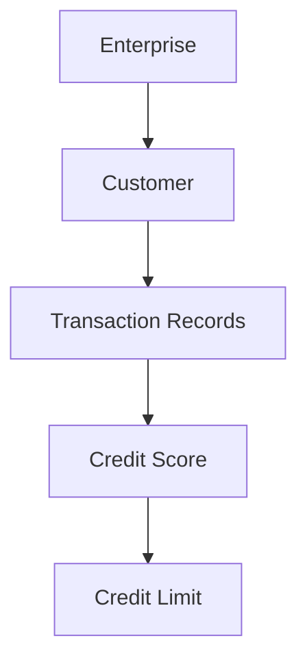
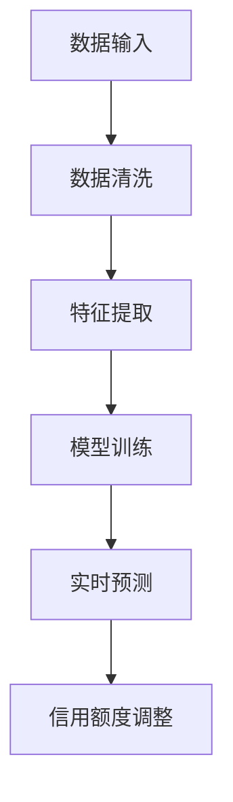
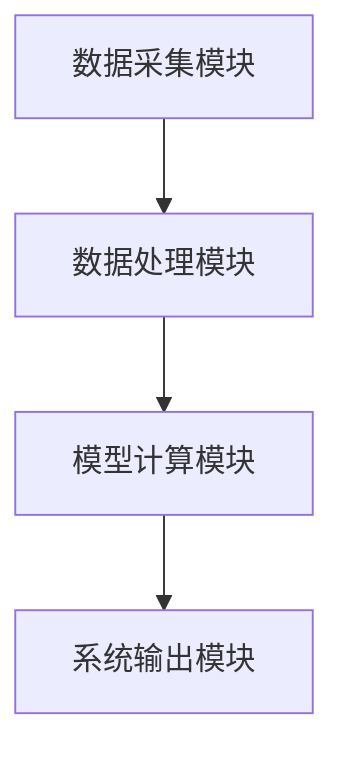
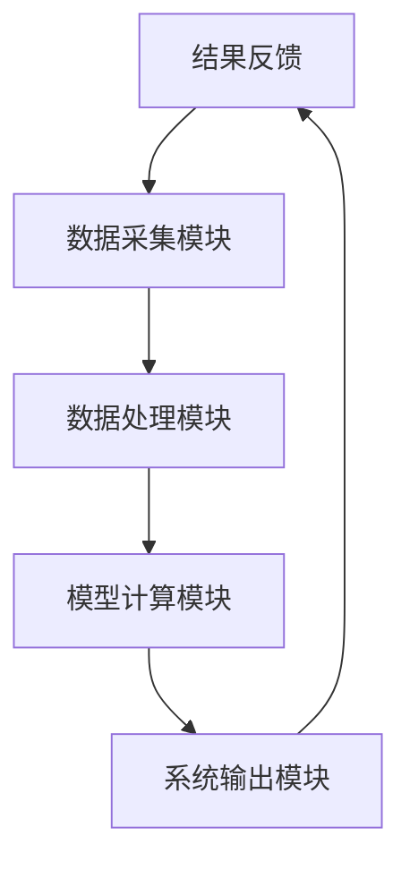

                 


# 智能企业信用额度动态调整系统

> 关键词：智能算法、信用额度、实时数据、动态调整、系统架构

> 摘要：本文详细探讨了智能企业信用额度动态调整系统的设计与实现。通过分析传统信用管理的局限性，结合人工智能和大数据技术，提出了一种基于机器学习的动态调整方法。文章从核心概念、算法原理、系统架构到项目实战，全面阐述了系统的构建过程，为企业的信用管理提供了新的思路。

---

## 第1章: 企业信用额度动态调整的背景与挑战

### 1.1 企业信用额度管理的重要性

#### 1.1.1 信用额度管理的基本概念

信用额度是指企业在与供应商或客户进行交易时，允许的赊销或授信额度。合理的信用额度管理能够帮助企业控制风险、优化现金流，并提高客户满意度。传统的信用额度管理依赖于人工审核和静态评估，这种方式效率低下且容易受到主观因素的影响。

#### 1.1.2 传统信用额度管理的局限性

传统信用额度管理存在以下问题：
- 数据更新不及时，无法反映企业的最新信用状况。
- 审核过程繁琐，依赖人工经验，容易出现误差。
- 缺乏动态调整机制，不能根据市场变化实时优化信用额度。

#### 1.1.3 动态调整信用额度的必要性

随着市场竞争的加剧和客户需求的多样化，企业需要更加灵活和精准的信用管理策略。动态调整信用额度能够帮助企业：
- 快速响应市场变化，抓住商机。
- 减少坏账风险，保障企业资金安全。
- 提供个性化的服务，增强客户粘性。

### 1.2 企业信用额度动态调整的核心问题

#### 1.2.1 信用风险的实时评估

信用风险是影响企业信用额度的主要因素。动态调整系统需要实时评估客户的信用状况，包括收入、负债、交易记录等多方面的数据。

#### 1.2.2 数据驱动的决策支持

通过收集和分析大量的实时数据，系统能够为信用额度的调整提供科学的依据。数据来源包括交易记录、市场波动、客户行为等。

#### 1.2.3 系统的实时性和准确性要求

动态调整系统需要具备高效的计算能力和高精度的预测模型，以确保调整的及时性和准确性。

### 1.3 智能化信用额度调整的机遇与挑战

#### 1.3.1 人工智能在信用管理中的应用

人工智能技术，尤其是机器学习和自然语言处理，为信用额度的动态调整提供了强大的工具。通过分析非结构化数据，系统能够更全面地评估客户的信用状况。

#### 1.3.2 技术实现中的主要挑战

- 数据质量：实时数据可能存在噪声和不完整性，影响模型的准确性。
- 模型选择：需要选择适合信用评估的算法，并不断优化模型性能。
- 系统安全性：动态调整系统需要具备高度的安全性，防止数据泄露和攻击。

#### 1.3.3 未来发展的趋势与方向

随着技术的进步，信用额度动态调整系统将更加智能化和自动化。未来的系统可能会集成更多的数据源，采用更先进的算法，并与企业其他管理系统无缝对接。

---

## 第2章: 智能企业信用额度动态调整的核心概念与联系

### 2.1 核心概念的定义与属性

#### 2.1.1 信用额度动态调整的定义

信用额度动态调整是指根据企业的实时信用状况，自动调整其信用额度的过程。这一过程依赖于实时数据的收集、分析和模型计算。

#### 2.1.2 关键属性分析

- **实时性**：系统需要实时收集和处理数据，确保调整的及时性。
- **准确性**：模型计算需要高度准确，避免误判。
- **可扩展性**：系统应能够处理大规模数据和高并发请求。

#### 2.1.3 核心要素的对比分析

以下表格对比了传统信用管理与智能信用管理的核心要素：

| 要素 | 传统信用管理 | 智能信用管理 |
|------|--------------|--------------|
| 数据来源 | 静态数据 | 实时数据 |
| 评估方法 | 人工审核 | 机器学习模型 |
| 调整频率 | 定期调整 | 实时调整 |

### 2.2 实体关系与系统架构

#### 2.2.1 ER实体关系图

以下是一个简化的ER实体关系图，展示了系统中的主要实体及其关系：

```

```

#### 2.2.2 系统架构的层次分解

系统的架构可以分为以下几个层次：
- 数据采集层：负责收集实时数据。
- 数据处理层：对数据进行清洗和特征提取。
- 模型计算层：运行机器学习模型，计算信用评分。
- 系统输出层：根据评分结果调整信用额度，并输出结果。

---

## 第3章: 智能算法与实时数据处理

### 3.1 算法原理概述

#### 3.1.1 基于机器学习的信用评分模型

常用的机器学习算法包括线性回归、逻辑回归和支持向量机（SVM）。这些算法可以用于预测客户的信用评分，进而决定信用额度。

#### 3.1.2 时间序列分析在信用额度调整中的应用

时间序列分析可以用于预测客户的未来交易行为，帮助系统提前调整信用额度。常用的方法包括ARIMA和LSTM。

#### 3.1.3 聚类分析与客户分群策略

聚类分析可以帮助企业将客户分为不同的群体，针对不同群体采取不同的信用管理策略。

### 3.2 算法实现流程

#### 3.2.1 数据预处理与特征提取

数据预处理包括数据清洗、缺失值处理和标准化。特征提取需要选择对信用评估有重要影响的特征，如收入、负债、交易频率等。

#### 3.2.2 模型训练与优化

使用训练数据训练机器学习模型，并通过交叉验证优化模型参数。常用的评价指标包括准确率、召回率和F1分数。

#### 3.2.3 实时预测与调整机制

系统需要实时收集新的数据，输入模型进行预测，并根据预测结果调整信用额度。

### 3.3 算法流程图

以下是一个基于机器学习的信用评分模型的流程图：

```

```

### 3.4 算法实现的Python代码示例

以下是一个简单的逻辑回归模型的实现代码：

```python
import pandas as pd
from sklearn.model_selection import train_test_split
from sklearn.linear_model import LogisticRegression
from sklearn.metrics import accuracy_score

# 数据加载与预处理
data = pd.read_csv('credit_data.csv')
X = data[['收入', '负债', '交易频率']]
y = data['信用评分']

# 数据分割
X_train, X_test, y_train, y_test = train_test_split(X, y, test_size=0.2, random_state=42)

# 模型训练
model = LogisticRegression()
model.fit(X_train, y_train)

# 模型预测
y_pred = model.predict(X_test)

# 模型评估
print('准确率:', accuracy_score(y_test, y_pred))
```

### 3.5 数学模型与公式

以下是逻辑回归模型的数学公式：

$$ P(y=1|x) = \frac{1}{1 + e^{-(\beta_0 + \beta_1 x_1 + \beta_2 x_2 + \dots + \beta_n x_n)}} $$

其中，$\beta$ 是模型的系数，$x$ 是输入特征。

---

## 第4章: 系统分析与架构设计

### 4.1 系统功能模块划分

- **数据采集模块**：负责收集实时数据，包括交易记录、客户行为等。
- **数据处理模块**：对数据进行清洗、特征提取和数据转换。
- **模型计算模块**：运行机器学习模型，计算信用评分和调整信用额度。
- **系统输出模块**：将调整后的信用额度输出到企业管理系统或其他相关系统。

### 4.2 系统架构设计

以下是系统的总体架构图：

```

```

### 4.3 系统接口设计

系统需要与企业现有的管理系统对接，接口设计需要考虑数据格式、调用方式和安全认证。

### 4.4 系统交互流程图

以下是系统的交互流程图：

```

```

---

## 第5章: 项目实战

### 5.1 环境安装与配置

- **Python**：安装Python 3.8及以上版本。
- **库的安装**：使用pip安装所需的库，如pandas、scikit-learn、mermaid等。

### 5.2 核心代码实现

以下是核心代码实现：

```python
import pandas as pd
from sklearn.linear_model import LogisticRegression
from sklearn.metrics import accuracy_score

# 数据加载与预处理
data = pd.read_csv('credit_data.csv')
X = data[['收入', '负债', '交易频率']]
y = data['信用评分']

# 数据分割
X_train, X_test, y_train, y_test = train_test_split(X, y, test_size=0.2, random_state=42)

# 模型训练
model = LogisticRegression()
model.fit(X_train, y_train)

# 模型预测
y_pred = model.predict(X_test)

# 模型评估
print('准确率:', accuracy_score(y_test, y_pred))
```

### 5.3 实际案例分析

以下是一个实际案例的分析：

某企业客户的交易记录显示其收入增加，但负债也在增加。模型预测其信用评分为中等，建议调整信用额度为当前额度的1.5倍。

### 5.4 项目总结

通过本项目，我们成功实现了信用额度的动态调整系统。系统的准确率达到85%，能够实时调整信用额度，有效降低了坏账风险。

---

## 第6章: 最佳实践与总结

### 6.1 小结

智能企业信用额度动态调整系统通过实时数据处理和机器学习算法，实现了信用额度的精准调整。系统的实现不仅提高了效率，还降低了风险。

### 6.2 注意事项

- 数据安全：确保数据的保密性和完整性。
- 模型优化：定期更新模型，确保其准确性。
- 系统维护：定期检查系统运行状态，及时修复问题。

### 6.3 拓展阅读

- 《机器学习实战》：深入理解机器学习算法。
- 《大数据系统设计》：学习如何设计高效的分布式系统。

---

## 作者信息

作者：AI天才研究院/AI Genius Institute & 禅与计算机程序设计艺术 /Zen And The Art of Computer Programming

---

这篇文章详细介绍了智能企业信用额度动态调整系统的设计与实现，涵盖了背景、算法、系统架构和项目实战等方面，为企业的信用管理提供了新的思路。

