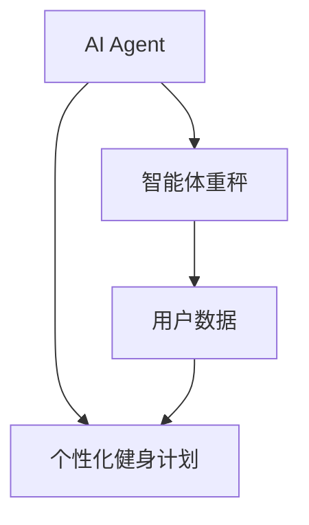
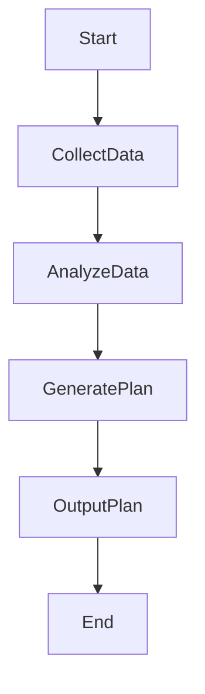
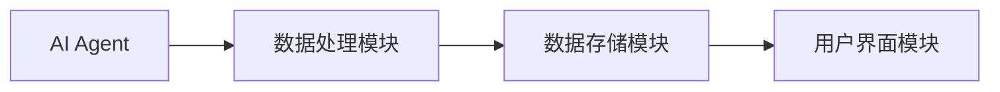

                 


# 智能体重秤：AI Agent的个性化健身计划生成

> 关键词：智能体重秤，AI Agent，个性化健身计划，数据驱动，机器学习，健康科技

> 摘要：本文深入探讨了智能体重秤与AI Agent的结合，详细分析了如何利用AI技术生成个性化的健身计划。通过数据采集、分析与算法设计，展示了AI在健康科技中的应用价值。

---

## 第一部分：背景介绍

### 第1章：智能体重秤与AI Agent概述

#### 1.1 智能体重秤的基本概念

- **传统体重秤的功能与局限性**
  - 传统体重秤仅能测量体重，无法提供其他健康数据。
  - 数据孤立，无法与其他健康设备联动。

- **智能体重秤的定义与特点**
  - 智能体重秤通过传感器技术，测量体重、体脂、肌肉量等多维度数据。
  - 具备无线连接功能，可与手机、智能手表等设备同步数据。

- **AI Agent在智能体重秤中的作用**
  - AI Agent（智能体）通过机器学习算法，分析用户数据，生成个性化建议。
  - 能够实时响应用户需求，提供健康指导。

#### 1.2 个性化健身计划的必要性

- **健身计划的核心要素**
  - 目标设定：减脂、增肌、健康维持。
  - 训练强度：有氧运动、力量训练。
  - 营养建议：饮食计划。

- **个性化健身计划的意义**
  - 根据用户身体数据，制定科学合理的计划。
  - 提高锻炼效果，减少运动损伤风险。

- **智能体重秤如何支持个性化健身**
  - 采集数据：体重、体脂、肌肉量等。
  - 分析数据：结合运动数据、饮食习惯。
  - 生成计划：AI Agent实时调整健身方案。

---

### 第2章：智能体重秤与AI Agent的结合

#### 2.1 AI Agent的基本原理

- **AI Agent的定义与分类**
  - AI Agent是一种智能实体，能够感知环境并执行任务。
  - 分为简单反射型、基于模型型、目标驱动型和效用驱动型。

- **AI Agent的核心功能**
  - 数据采集：通过传感器获取用户数据。
  - 数据分析：利用机器学习算法处理数据。
  - 决策制定：生成个性化建议。

- **AI Agent在智能设备中的应用**
  - 健康监测：实时分析用户健康数据。
  - 个性化推荐：根据数据提供定制化建议。

#### 2.2 智能体重秤的数据采集与分析

- **数据采集的多样性**
  - 体重、体脂、肌肉量、水分含量。
  - 运动数据：步数、心率、运动类型。

- **数据分析的关键技术**
  - 机器学习算法：用于数据分类和预测。
  - 自然语言处理：用于用户交互。

- **数据隐私与安全问题**
  - 数据加密传输。
  - 用户隐私保护措施。

#### 2.3 个性化健身计划的生成逻辑

- **数据驱动的个性化算法**
  - 基于用户数据，分析身体状况。
  - 结合运动目标，制定计划。

- **AI Agent的决策机制**
  - 多目标优化：在多个目标间找到平衡点。
  - 动态调整：根据反馈实时更新计划。

- **健身计划的动态调整**
  - 定期评估效果，调整训练和营养计划。
  - 提供阶段性的目标反馈。

---

## 第二部分：核心概念与联系

### 第3章：核心概念的原理与特征

#### 3.1 AI Agent的核心原理

- **机器学习算法在AI Agent中的应用**
  - 监督学习：分类健康数据。
  - 无监督学习：聚类用户行为。
  - 强化学习：动态调整建议。

- **自然语言处理技术的作用**
  - 用户交互：通过语音或文本进行对话。
  - 理解意图：分析用户需求。

- **知识图谱的构建与应用**
  - 健康知识库：存储运动、营养等信息。
  - 关联推理：提供相关建议。

#### 3.2 智能体重秤的数据特征

- **数据的多维度性**
  - 体重、体脂、肌肉量等多维度指标。
  - 运动数据：步数、心率等。

- **数据的实时性**
  - 实时采集：快速响应用户需求。
  - 动态调整：及时更新计划。

- **数据的隐私性**
  - 数据加密：保护用户隐私。
  - 访问权限：严格控制数据访问。

#### 3.3 AI Agent与智能体重秤的实体关系



---

## 第三部分：算法原理讲解

### 第4章：个性化健身计划生成算法

#### 4.1 算法概述

- **算法的目标与输入**
  - 目标：生成个性化健身计划。
  - 输入：用户数据、运动目标、偏好。

- **算法的输出与应用**
  - 输出：每日锻炼计划、营养建议。
  - 应用：帮助用户实现健康目标。

#### 4.2 算法流程



#### 4.3 代码实现

```python
import numpy as np
from sklearn.cluster import KMeans

# 示例数据：体重、体脂、肌肉量
data = np.array([[70, 25, 40], [65, 22, 45], [75, 30, 35]])

# 数据分析
clusters = 3
kmeans = KMeans(n_clusters=clusters)
kmeans.fit(data)
labels = kmeans.labels_

# 个性化建议
for label in np.unique(labels):
    print(f"群体 {label}: {data[labels == label].mean(axis=0)}")
```

#### 4.4 数学公式

- **距离计算公式**
  $$ distance = \sqrt{(x2 - x1)^2 + (y2 - y1)^2} $$

- **K均值聚类算法**
  $$ J = \sum_{i=1}^{k} \sum_{j=1}^{n} (y_{ij})d_{ij} $$

---

## 第四部分：系统分析与架构设计

### 第5章：系统架构设计

#### 5.1 问题场景介绍

- **用户需求**
  - 测量体重及相关数据。
  - 获取个性化健身建议。

- **系统功能**
  - 数据采集与传输。
  - 数据分析与处理。
  - 健身计划生成。

#### 5.2 系统架构设计



#### 5.3 系统接口设计

- **数据接口**
  - HTTP API：用于数据传输。
  - 数据格式：JSON格式。

- **用户交互**
  - 图形界面：显示计划。
  - 语音交互：用户指令输入。

---

## 第五部分：项目实战

### 第6章：项目实战与分析

#### 6.1 项目介绍

- **项目目标**
  - 开发智能体重秤AI Agent。
  - 实现个性化健身计划生成。

#### 6.2 核心代码实现

```python
import numpy as np
from sklearn.cluster import KMeans

# 数据预处理
data = np.array([[70, 25, 40], [65, 22, 45], [75, 30, 35]])

# 聚类分析
kmeans = KMeans(n_clusters=3)
labels = kmeans.fit_predict(data)

# 个性化建议
for label in range(3):
    print(f"群体 {label}: {data[labels == label].mean(axis=0)}")
```

#### 6.3 实际案例分析

- **案例分析**
  - 用户数据：体重65kg，体脂22%，肌肉量45%。
  - 群组分析：属于减脂阶段。
  - 建议计划：有氧运动+力量训练。

#### 6.4 项目小结

- **项目总结**
  - 成功实现个性化健身计划生成。
  - 证明了AI在健康科技中的应用价值。

---

## 第六部分：扩展与总结

### 第7章：总结与展望

#### 7.1 最佳实践

- **数据隐私保护**
  - 加强数据加密技术。
  - 提高用户隐私意识。

- **用户体验优化**
  - 提供多样化的交互方式。
  - 简化用户操作流程。

#### 7.2 未来展望

- **技术优化**
  - 提高算法准确性。
  - 引入更多健康数据维度。

- **应用场景扩展**
  - 结合其他健康设备。
  - 拓展国际市场。

---

## 作者信息

作者：AI天才研究院/AI Genius Institute & 禅与计算机程序设计艺术 /Zen And The Art of Computer Programming

---

**本文通过详细分析智能体重秤与AI Agent的结合，展示了AI技术在个性化健身计划生成中的应用。从数据采集到算法设计，再到系统实现，为健康科技的发展提供了新的思路。**

