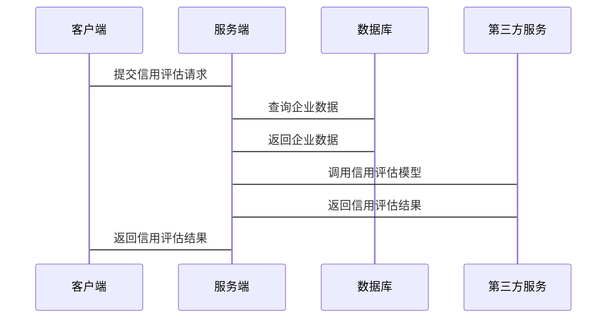

                 


# 智能供应链金融信用评估

> 关键词：供应链金融，信用评估，人工智能，机器学习，深度学习，区块链，风险管理

> 摘要：供应链金融是现代经济中的重要组成部分，而信用评估是供应链金融中的核心环节。传统的信用评估方法存在诸多局限性，难以适应现代供应链的复杂性和动态性。随着人工智能技术的快速发展，智能供应链金融信用评估逐渐成为研究热点。本文将从供应链金融的基本概念出发，详细探讨智能信用评估的核心概念、算法原理、系统架构以及实际应用，最后通过一个完整的项目实战案例，展示如何利用智能技术实现高效、精准的信用评估。

---

# 第一部分: 智能供应链金融信用评估概述

## 第1章: 供应链金融与信用评估概述

### 1.1 供应链金融的定义与特点
#### 1.1.1 供应链金融的定义
供应链金融是指通过整合供应链上下游企业，利用核心企业的信用和资源，为供应链中的中小微企业提供融资支持的一种金融模式。

#### 1.1.2 供应链金融的核心特点
- **资源整合性**：整合供应链上下游资源，优化资金流动。
- **信用传导性**：通过核心企业的信用，向上下游企业传导信用。
- **动态性**：供应链金融的信用评估需要动态调整，以适应市场变化。

#### 1.1.3 供应链金融与传统金融的区别
- **参与主体**：供应链金融涉及核心企业、上下游企业及金融机构，而传统金融主要涉及企业和银行。
- **融资方式**：供应链金融基于供应链的整体信用，而传统金融基于单个企业的信用。
- **风险控制**：供应链金融通过整合供应链信息，实现更精准的风险控制。

### 1.2 信用评估的基本概念
#### 1.2.1 信用评估的定义
信用评估是指通过对企业的财务状况、经营能力、市场环境等因素的分析，评估企业信用状况的过程。

#### 1.2.2 信用评估的核心要素
- **财务状况**：包括资产负债表、利润表、现金流等。
- **经营能力**：包括企业的产品竞争力、市场占有率等。
- **信用历史**：包括企业过去的还款记录和违约情况。

#### 1.2.3 信用评估的流程与方法
1. **数据收集**：收集企业的财务数据、经营数据和市场数据。
2. **数据清洗**：对数据进行预处理，去除噪声数据。
3. **模型构建**：选择合适的信用评估模型，如逻辑回归、决策树等。
4. **模型评估**：通过测试数据对模型进行评估，调整参数以提高准确性。

### 1.3 供应链金融中的信用评估问题
#### 1.3.1 供应链金融中的信用风险
- **核心企业信用风险**：核心企业可能因经营不善或市场变化导致信用风险。
- **上下游企业信用风险**：供应链中的中小微企业可能因自身经营问题导致信用风险。

#### 1.3.2 传统信用评估的局限性
- **数据孤岛**：传统信用评估依赖单个企业的数据，难以全面反映供应链的整体信用状况。
- **静态评估**：传统信用评估通常基于静态数据，难以适应供应链的动态变化。
- **人工干预**：传统信用评估过程繁琐，依赖人工判断，效率低下。

#### 1.3.3 智能信用评估的必要性
- **提高效率**：通过智能技术实现自动化、智能化的信用评估。
- **降低风险**：通过整合供应链数据，实现更精准的风险控制。
- **优化融资**：通过智能信用评估，优化供应链中的融资安排，提高资金使用效率。

### 1.4 本章小结
本章从供应链金融的基本概念出发，介绍了信用评估的核心要素和传统信用评估的局限性，提出了智能信用评估的必要性，为后续章节的展开奠定了基础。

---

## 第2章: 智能供应链金融信用评估的核心概念

### 2.1 供应链金融中的数据来源
#### 2.1.1 供应链交易数据
- **订单数据**：包括订单金额、交货时间等。
- **物流数据**：包括物流成本、运输时间等。
- **库存数据**：包括库存量、库存周转率等。

#### 2.1.2 企业信用数据
- **企业财务数据**：包括资产负债表、利润表等。
- **企业经营数据**：包括市场占有率、产品竞争力等。
- **企业信用历史**：包括过去的还款记录和违约情况。

#### 2.1.3 市场环境数据
- **宏观经济数据**：包括GDP增长率、通货膨胀率等。
- **行业数据**：包括行业市场规模、行业竞争状况等。
- **政策数据**：包括政府政策、法律法规等。

### 2.2 信用评估的关键指标
#### 2.2.1 财务指标
- **流动性比率**：包括速动比率、流动比率等。
- **偿债能力比率**：包括资产负债率、利息保障倍数等。
- **盈利能力比率**：包括净利率、ROE等。

#### 2.2.2 运营指标
- **库存周转率**：包括库存周转天数、库存周转率等。
- **应收账款周转率**：包括应收账款周转天数、应收账款周转率等。
- **应付账款周转率**：包括应付账款周转天数、应付账款周转率等。

#### 2.2.3 风险指标
- **信用风险**：包括企业违约概率、违约损失率等。
- **市场风险**：包括市场波动对企业信用的影响。
- **操作风险**：包括企业在经营过程中可能面临的风险。

### 2.3 智能信用评估的核心要素
#### 2.3.1 数据驱动
- **数据整合**：通过整合供应链上下游数据，实现对企业的全面信用评估。
- **数据挖掘**：通过数据挖掘技术，发现数据中的潜在规律。
- **数据可视化**：通过数据可视化技术，直观展示信用评估结果。

#### 2.3.2 智能算法
- **机器学习**：包括逻辑回归、随机森林、支持向量机等算法。
- **深度学习**：包括神经网络、卷积神经网络、循环神经网络等算法。
- **集成学习**：通过集成多种算法，提高信用评估的准确性。

#### 2.3.3 供应链网络效应
- **网络结构**：包括供应链中的节点关系、信息流动等。
- **信用传播**：通过供应链网络，实现信用信息的传播和共享。
- **风险分担**：通过供应链网络，实现风险的分担和转移。

### 2.4 本章小结
本章从智能信用评估的核心要素出发，详细探讨了数据驱动、智能算法和供应链网络效应在信用评估中的作用，为后续章节的算法实现奠定了理论基础。

---

## 第3章: 智能供应链金融信用评估的原理与方法

### 3.1 信用评估的基本原理
#### 3.1.1 信用评分模型
- **逻辑回归模型**：通过线性回归模型，预测企业的信用评分。
- **决策树模型**：通过决策树算法，对企业信用进行分类。
- **随机森林模型**：通过随机森林算法，实现对企业的信用评估。

#### 3.1.2 信用评级方法
- **KMV模型**：通过对企业资产价值的估计，预测企业的违约概率。
- **Merton模型**：通过对企业资产价值和市场波动的分析，预测企业的违约概率。
- **信用等级法**：通过对企业信用状况的定性分析，进行信用评级。

#### 3.1.3 信用风险分析
- **VaR方法**：通过VaR模型，估计企业的信用风险。
- **CVaR方法**：通过CVaR模型，估计企业的信用风险。
- **信用组合模型**：通过信用组合模型，分析供应链中多个企业的信用风险。

### 3.2 智能信用评估的核心算法
#### 3.2.1 机器学习算法
- **支持向量机（SVM）**：通过SVM算法，实现对企业的信用分类。
- **随机森林（Random Forest）**：通过随机森林算法，实现对企业的信用评估。
- **梯度提升树（GBDT）**：通过GBDT算法，实现对企业的信用预测。

#### 3.2.2 深度学习算法
- **神经网络（NN）**：通过神经网络算法，实现对企业的信用评估。
- **卷积神经网络（CNN）**：通过CNN算法，处理企业的图像数据。
- **循环神经网络（RNN）**：通过RNN算法，处理企业的序列数据。

#### 3.2.3 集成学习算法
- **投票法**：通过投票法，集成多个模型的结果。
- **加权平均法**：通过加权平均法，集成多个模型的结果。
- **堆叠法**：通过堆叠法，实现模型的优化和集成。

### 3.3 供应链网络中的信用传播机制
#### 3.3.1 供应链网络结构
- **节点关系**：包括核心企业、上下游企业的关系。
- **信息流动**：包括供应链中的信息流动方向和路径。
- **资金流动**：包括供应链中的资金流动方向和路径。

#### 3.3.2 信用传播模型
- **影响力传播模型**：通过影响力传播模型，分析供应链中的信用传播。
- **阈值模型**：通过阈值模型，分析供应链中的信用传播。
- **意见动态模型**：通过意见动态模型，分析供应链中的信用传播。

#### 3.3.3 网络效应与信用风险
- **网络效应**：通过网络效应，分析供应链中的信用传播。
- **信用风险**：通过网络效应，分析供应链中的信用风险。
- **风险分担**：通过网络效应，实现风险的分担和转移。

### 3.4 本章小结
本章从智能信用评估的基本原理出发，详细探讨了机器学习、深度学习和集成学习算法在信用评估中的应用，并分析了供应链网络中的信用传播机制，为后续章节的系统架构设计奠定了基础。

---

## 第4章: 智能供应链金融信用评估的系统架构

### 4.1 问题场景介绍
- **供应链金融中的信用评估问题**：包括供应链中的信用风险、数据孤岛、信息不对称等问题。
- **智能信用评估的必要性**：通过智能技术实现对供应链中企业的信用评估，优化融资安排，降低风险。

### 4.2 项目介绍
- **项目目标**：实现一个基于智能技术的供应链金融信用评估系统。
- **项目范围**：包括供应链中的核心企业、上下游企业的信用评估。
- **项目需求**：包括数据采集、数据处理、模型训练、模型部署等需求。

### 4.3 系统功能设计
#### 4.3.1 领域模型
```mermaid
classDiagram
    class 企业 {
        财务数据
        经营数据
        信用历史
    }
    class 供应链 {
        核心企业
        上游企业
        下游企业
    }
    class 信用评估系统 {
        数据采集模块
        数据处理模块
        模型训练模块
        模型部署模块
    }
    coreEnterprise -> 信用评估系统: 提供财务数据
    upstreamEnterprise -> 信用评估系统: 提供经营数据
    downstreamEnterprise -> 信用评估系统: 提供信用历史
```

#### 4.3.2 系统架构


#### 4.3.3 系统接口设计
- **数据接口**：包括数据采集接口、数据处理接口等。
- **模型接口**：包括模型训练接口、模型预测接口等。
- **用户接口**：包括用户登录接口、用户查询接口等。

#### 4.3.4 系统交互


### 4.4 本章小结
本章从系统架构的角度，详细探讨了智能供应链金融信用评估系统的功能设计、架构设计和交互设计，为后续章节的项目实战奠定了基础。

---

## 第5章: 智能供应链金融信用评估的项目实战

### 5.1 环境安装
- **安装Python**：包括Python 3.8或更高版本。
- **安装依赖库**：包括numpy、pandas、scikit-learn、tensorflow等。
- **安装开发工具**：包括Jupyter Notebook、PyCharm等。

### 5.2 系统核心实现
#### 5.2.1 数据采集模块
```python
import requests
import json

def get_data(url):
    response = requests.get(url)
    data = json.loads(response.text)
    return data
```

#### 5.2.2 数据处理模块
```python
import pandas as pd

def preprocess_data(data):
    df = pd.DataFrame(data)
    df = df.dropna()
    df = df.astype(float)
    return df
```

#### 5.2.3 模型训练模块
```python
from sklearn.model import LinearRegression

def train_model(X, y):
    model = LinearRegression()
    model.fit(X, y)
    return model
```

#### 5.2.4 模型部署模块
```python
import joblib

def save_model(model, filename):
    joblib.dump(model, filename)

def load_model(filename):
    model = joblib.load(filename)
    return model
```

### 5.3 代码应用解读与分析
- **数据采集模块**：通过网络请求获取企业数据。
- **数据处理模块**：对数据进行清洗和转换，为模型训练做准备。
- **模型训练模块**：使用机器学习算法训练信用评估模型。
- **模型部署模块**：将训练好的模型保存为文件，供后续使用。

### 5.4 案例分析
#### 5.4.1 数据来源
- **核心企业**：某制造企业。
- **上下游企业**：包括供应商和分销商。
- **市场数据**：包括行业市场规模、政策数据等。

#### 5.4.2 模型训练
- **数据集**：包括1000家企业的数据，其中500家为训练集，500家为测试集。
- **算法选择**：使用逻辑回归模型进行信用评估。
- **评估指标**：包括准确率、召回率、F1分数等。

#### 5.4.3 实际案例分析
- **案例一**：某供应商因应收账款逾期，信用评分为低风险。
- **案例二**：某分销商因库存周转率低，信用评分为中等风险。
- **案例三**：某制造企业因资产负债率高，信用评分为高风险。

### 5.5 项目小结
本章通过一个完整的项目实战案例，展示了如何利用智能技术实现供应链金融信用评估系统的开发和部署，为读者提供了实际的应用参考。

---

## 第6章: 总结与展望

### 6.1 本章总结
智能供应链金融信用评估是现代供应链金融中的重要组成部分，通过智能技术实现对供应链中企业的信用评估，优化融资安排，降低信用风险。

### 6.2 未来展望
- **技术发展**：随着人工智能技术的不断发展，智能信用评估将更加精准和高效。
- **应用场景**：智能信用评估将在更多行业和场景中得到应用，如制造业、零售业等。
- **挑战与机遇**：智能信用评估将面临更多挑战，如数据隐私、模型解释性等，同时也将带来更多的机遇。

### 6.3 注意事项
- **数据隐私**：在信用评估过程中，需要保护企业的数据隐私。
- **模型解释性**：需要提高模型的解释性，以便更好地理解和应用。
- **风险管理**：需要建立完善的风险管理机制，降低信用评估中的风险。

### 6.4 拓展阅读
- **推荐书籍**：《供应链金融：理论与实践》、《智能信用评估：算法与应用》。
- **推荐论文**：《基于机器学习的信用评估研究》、《深度学习在供应链金融中的应用》。

---

# 作者：AI天才研究院/AI Genius Institute & 禅与计算机程序设计艺术 /Zen And The Art of Computer Programming

---

> 以上是《智能供应链金融信用评估》的技术博客文章目录和部分内容的示例，您可以根据实际需求进一步扩展和补充各章节的内容。

