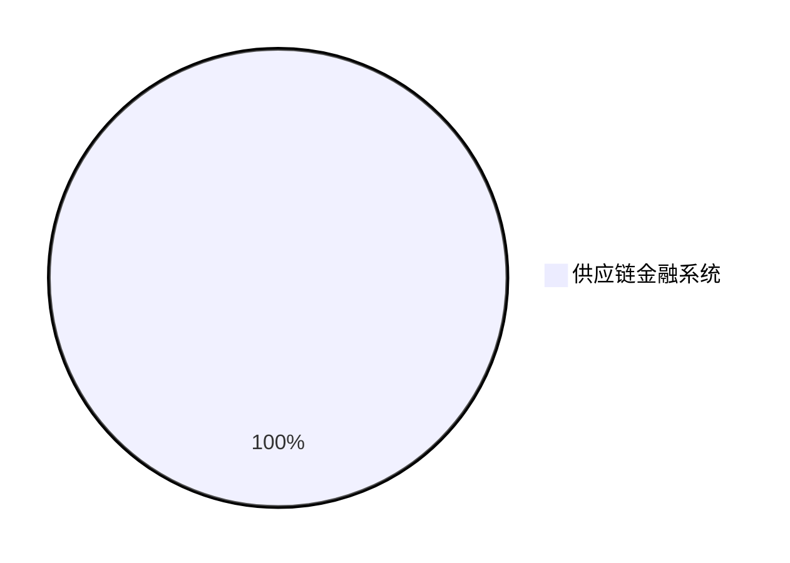
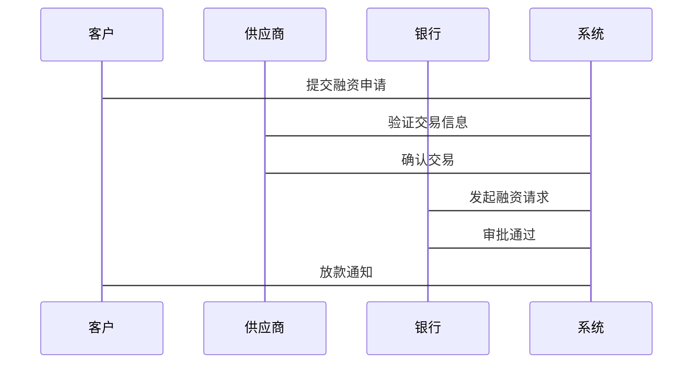

                 


# 智能供应链金融解决方案

> 关键词：供应链金融，人工智能，大数据，区块链，智能合约，金融科技

> 摘要：智能供应链金融解决方案通过整合大数据、人工智能和区块链等先进技术，优化供应链金融的各个流程，提高效率和透明度，降低风险。本文详细探讨了智能供应链金融的核心概念、技术基础、系统架构和实际应用，为读者提供全面的解决方案。

---

## 第一部分: 智能供应链金融的背景与概念

### 第1章: 供应链金融的定义与背景

#### 1.1 供应链金融的定义
##### 1.1.1 供应链金融的基本概念
供应链金融是通过整合供应链上的物流、信息流和资金流，为供应链中的企业提供融资支持的一种金融模式。其核心在于通过优化资金流动，降低企业的运营成本，提高供应链的整体效率。

##### 1.1.2 供应链金融的核心要素
供应链金融涉及多个关键要素，包括：
- **供应商**：提供原材料或服务的企业。
- **制造商**：生产产品的核心企业。
- **分销商**：将产品销售给最终客户的渠道。
- **零售商**：直接面对消费者的终端销售点。
- **金融机构**：提供融资服务的银行或其他金融机构。

##### 1.1.3 供应链金融的参与方与角色
在供应链金融中，各方参与者扮演着不同的角色：
- **企业**：包括供应商、制造商和分销商，通常作为融资的申请者。
- **金融机构**：提供融资服务，如银行、保理公司等。
- **技术平台**：提供智能供应链金融解决方案的技术服务商。

#### 1.2 智能供应链金融的背景
##### 1.2.1 传统供应链金融的痛点
传统供应链金融存在以下主要问题：
- **信息孤岛**：供应链中的各个企业之间信息不透明，导致金融机构难以全面评估风险。
- **融资效率低**：传统模式下，融资流程复杂，审批时间长，资金到账慢。
- **成本高**：高昂的中介费用和人工操作成本增加了企业的负担。

##### 1.2.2 数字化与智能化的驱动
随着大数据、人工智能和区块链等技术的快速发展，供应链金融逐渐向智能化方向转型。智能化技术的应用可以帮助企业实时监控供应链的各个环节，提高融资效率，降低风险。

##### 1.2.3 智能供应链金融的定义与特点
智能供应链金融是通过智能化技术优化供应链金融流程的一种创新模式。其特点包括：
- **数据驱动**：利用大数据分析优化供应链管理。
- **AI辅助决策**：通过人工智能技术进行风险评估和预测。
- **区块链信任机制**：利用区块链技术确保数据的真实性和不可篡改性。

#### 1.3 供应链金融的行业应用
##### 1.3.1 零售行业的供应链金融
在零售行业，供应链金融可以帮助企业优化库存管理，降低采购成本，同时加快资金周转。

##### 1.3.2 制造业的供应链金融
制造业中的供应链金融可以帮助企业解决原材料采购和生产资金不足的问题，优化生产流程。

##### 1.3.3 供应链金融在物流行业中的应用
物流行业通过供应链金融可以实现货物运输的全程监控，降低运输风险，提高物流效率。

#### 1.4 供应链金融的未来发展
##### 1.4.1 技术驱动的创新
未来，随着技术的进一步发展，供应链金融将更加智能化和自动化。

##### 1.4.2 供应链金融的全球化趋势
随着全球贸易的扩大，供应链金融将更加国际化，跨-border的供应链金融模式将逐渐普及。

##### 1.4.3 可持续发展与绿色供应链金融
绿色供应链金融将关注环境保护和可持续发展，推动供应链的绿色转型。

---

## 第2章: 智能供应链金融的核心概念与联系

### 2.1 核心概念原理
#### 2.1.1 数据驱动的供应链优化
通过收集和分析供应链中的数据，企业可以更好地优化库存管理、生产计划和物流安排。

#### 2.1.2 AI在供应链金融中的应用
人工智能技术可以用于预测市场需求、评估信用风险和优化融资方案。

#### 2.1.3 区块链技术在供应链金融中的作用
区块链技术可以提供透明的交易记录，确保数据的真实性和不可篡改性，从而降低信任成本。

### 2.2 核心概念属性特征对比表
以下是传统供应链金融与智能供应链金融的核心属性对比：

| 特性       | 传统供应链金融 | 智能供应链金融 |
|------------|----------------|----------------|
| 数据来源   | 离散数据       | 结构化+非结构化数据 |
| 处理方式   | 人工处理       | AI自动化处理     |
| 透明度     | 低             | 高             |
| 效率       | 低             | 高             |

### 2.3 ER实体关系图
以下是智能供应链金融的核心实体关系图：

```mermaid
erDiagram
    customer[客户] {
        <属性>
        id : integer
        name : string
        contact : string
    }
    supplier[供应商] {
        <属性>
        id : integer
        name : string
        contact : string
    }
    product[产品] {
        <属性>
        id : integer
        name : string
        price : decimal
    }
    transaction[交易] {
        <属性>
        id : integer
        amount : decimal
        date : date
    }
    bank[银行] {
        <属性>
        id : integer
        name : string
        contact : string
    }
    financing[融资] {
        <属性>
        id : integer
        amount : decimal
        date : date
    }
    customer -> transaction : 参与交易
    supplier -> transaction : 提供产品
    product -> transaction : 关联交易
    bank -> financing : 提供融资
    customer -> financing : 申请融资
    supplier -> financing : 获得融资支持
```

---

## 第3章: 智能供应链金融的技术基础

### 3.1 大数据技术
#### 3.1.1 数据收集与处理
通过物联网设备和API接口，实时收集供应链中的数据，包括物流、库存和销售数据。

#### 3.1.2 数据分析与挖掘
利用大数据分析技术，对收集到的数据进行处理和挖掘，提取有价值的信息，支持决策。

### 3.2 人工智能技术
#### 3.2.1 机器学习算法
使用机器学习算法进行需求预测、信用评估和风险控制。

#### 3.2.2 自然语言处理
通过自然语言处理技术，自动解析供应链中的文档和合同，提高处理效率。

### 3.3 区块链技术
#### 3.3.1 区块链的基本原理
区块链通过分布式账本和共识机制，确保数据的安全性和不可篡改性。

#### 3.3.2 区块链在供应链金融中的应用
在供应链金融中，区块链可以用于记录交易信息，确保数据的真实性和透明性。

---

## 第4章: 智能供应链金融的解决方案

### 4.1 问题场景介绍
供应链金融中常见的问题包括信息不对称、融资效率低、风险控制难等。

### 4.2 系统功能设计
系统功能包括：
- **数据采集**：实时采集供应链中的数据。
- **风险评估**：利用AI技术评估企业的信用风险。
- **融资申请**：企业可以通过系统提交融资申请。
- **智能合约**：通过区块链技术实现智能合约，自动执行交易。

### 4.3 系统架构设计
以下是智能供应链金融系统的架构图：



### 4.4 系统接口设计
系统接口包括：
- **API接口**：与供应链中的企业、银行和其他金融机构对接。
- **智能合约接口**：与区块链平台对接，实现智能合约的自动执行。

### 4.5 系统交互设计
以下是系统交互的序列图：



---

## 第5章: 智能供应链金融的项目实战

### 5.1 环境安装
项目需要以下环境：
- **Python**：3.8及以上版本
- **TensorFlow**：用于机器学习模型的训练
- **Hyperledger Fabric**：用于区块链开发
- **PostgreSQL**：用于数据库存储

### 5.2 核心实现
以下是核心代码实现：

```python
import tensorflow as tf
from tensorflow.keras import layers

# 数据预处理
def preprocess_data(data):
    # 数据清洗和特征提取
    pass

# 模型训练
def train_model():
    model = tf.keras.Sequential([
        layers.Dense(64, activation='relu'),
        layers.Dense(1, activation='sigmoid')
    ])
    model.compile(optimizer='adam', loss='binary_crossentropy', metrics=['accuracy'])
    return model

# 区块链集成
from fabric_client import FabricClient

client = FabricClient()
```

### 5.3 实际案例分析
以下是一个实际案例的分析：
- **公司背景**：某制造企业面临资金短缺问题，希望通过智能供应链金融优化融资流程。
- **解决方案**：利用区块链技术和AI算法，实现供应链中的数据共享和智能合约的自动执行。
- **结果**：融资效率提高，成本降低，供应链整体效率提升。

### 5.4 项目小结
通过本项目的实施，我们可以看到智能供应链金融在实际应用中的巨大潜力。

---

## 第6章: 优化与展望

### 6.1 最佳实践
- **数据质量管理**：确保数据的准确性和完整性。
- **技术选型**：根据具体需求选择合适的技术方案。
- **风险管理**：建立完善的风险控制机制。

### 6.2 小结
智能供应链金融通过整合先进技术和优化流程，为供应链中的企业和金融机构带来了显著的效益。

### 6.3 注意事项
- **数据隐私保护**：在数据共享过程中，必须保护企业的隐私数据。
- **技术可行性分析**：在实施前进行充分的技术可行性分析。

### 6.4 拓展阅读
建议读者进一步阅读以下资料：
- 《Blockchain Basics: A Non-Technical Introduction to Blockchain》
- 《Hands-On Machine Learning with Scikit-Learn, Keras, and TensorFlow》

---

## 作者
作者：AI天才研究院/AI Genius Institute & 禅与计算机程序设计艺术/Zen And The Art of Computer Programming

---

本文通过详细分析智能供应链金融的核心概念、技术基础和实际应用，为读者提供了一套完整的解决方案。希望本文能够为供应链金融的智能化转型提供有价值的参考和指导。

