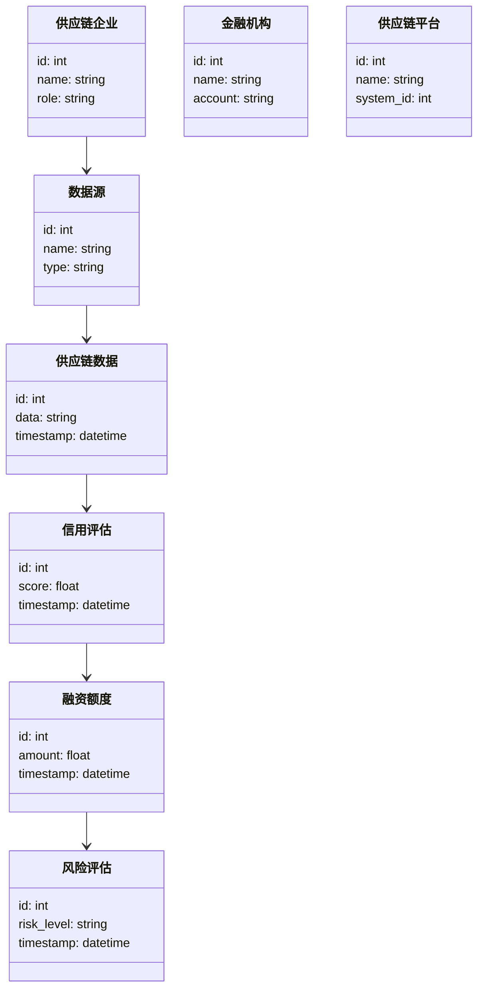
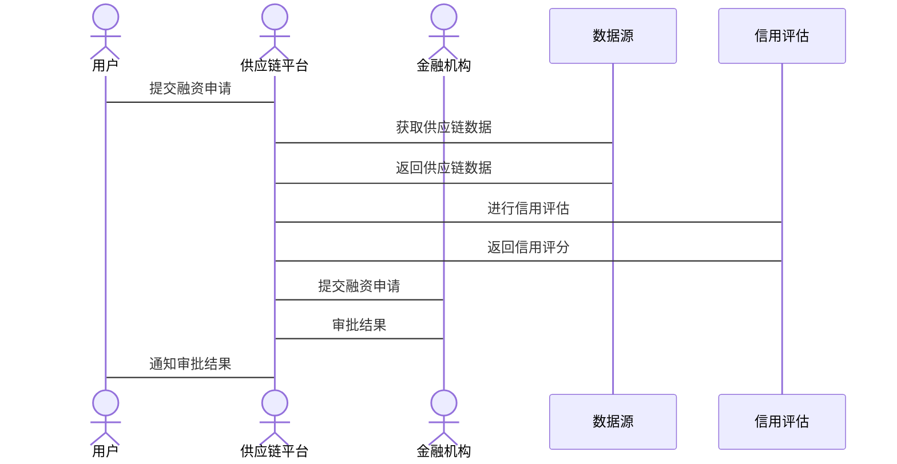

                 


# 智能供应链金融额度管理平台

> 关键词：供应链金融，智能额度管理，机器学习，数学模型，系统架构，项目实战

> 摘要：本文详细探讨了智能供应链金融额度管理平台的设计与实现，从背景分析到系统架构，再到算法实现和项目实战，全面解析了如何利用现代技术手段优化供应链金融的额度管理流程。文章结合实际案例，深入分析了平台的核心功能、技术实现和系统架构，为读者提供了从理论到实践的全面指导。

---

## 第一部分：智能供应链金融额度管理平台背景与概述

### 第1章：智能供应链金融额度管理平台概述

#### 1.1 供应链金融的背景与现状

##### 1.1.1 供应链金融的定义与特点
供应链金融是指通过整合供应链上下游企业的资金流、信息流和业务流，为供应链上的企业提供融资支持的一种金融模式。其特点包括：
- **融资便捷**：企业可通过供应链上的交易数据快速获得融资。
- **风险可控**：通过供应链的整体数据，银行或金融机构可以更准确地评估企业的信用风险。
- **高效协同**：供应链金融促进供应链上下游企业之间的协同合作。

##### 1.1.2 传统供应链金融的痛点与挑战
传统供应链金融存在以下痛点：
- **信息孤岛**：上下游企业之间信息不透明，导致融资效率低。
- **融资成本高**：传统模式下，融资审批流程复杂，成本较高。
- **风险控制难**：缺乏对供应链整体风险的评估手段，难以有效控制风险。

##### 1.1.3 智能化供应链金融的发展趋势
随着人工智能、大数据等技术的发展，供应链金融正在向智能化方向转型。智能化供应链金融的特点包括：
- **数据驱动**：利用大数据技术分析供应链上的交易数据。
- **智能决策**：通过机器学习算法，实现对供应链金融的智能化决策。
- **实时监控**：实时跟踪供应链上的资金流动和企业经营状况。

#### 1.2 智能供应链金融额度管理平台的定义
智能供应链金融额度管理平台是一个基于人工智能和大数据技术的金融管理平台，旨在通过整合供应链上下游企业的数据，实现对企业的信用评估和融资额度管理。

##### 1.2.1 平台的核心概念与目标
平台的核心概念包括：
- **供应链参与方**：包括核心企业、供应商、客户等。
- **信用评估**：基于供应链数据对企业信用进行评估。
- **融资额度管理**：根据信用评估结果，动态调整企业的融资额度。

平台的目标是通过智能化手段，提升供应链金融的效率和风险控制能力。

##### 1.2.2 平台的主要功能与价值
平台的主要功能包括：
- **数据采集与处理**：整合供应链上下游企业的交易数据。
- **信用评估**：基于机器学习算法对企业信用进行评估。
- **融资额度管理**：根据信用评估结果，动态调整企业的融资额度。
- **风险监控**：实时监控供应链上的资金流动和企业经营状况。

平台的价值体现在：
- **提升融资效率**：通过智能化手段快速审批融资申请。
- **降低融资成本**：减少人工干预，降低融资成本。
- **增强风险控制**：通过实时监控和数据分析，有效控制风险。

##### 1.2.3 平台的边界与外延
平台的边界包括供应链上下游企业的交易数据和信用数据。外延则包括与供应链金融相关的法律法规、市场环境等因素。

#### 1.3 供应链金融额度管理的关键要素

##### 1.3.1 供应链参与方的角色与关系
供应链参与方包括：
- **核心企业**：供应链中的主导企业。
- **供应商**：为核心企业提供原材料或服务的企业。
- **客户**：核心企业的下游客户。
- **金融机构**：为供应链企业提供融资服务的银行或其他金融机构。

##### 1.3.2 供应链金融的业务流程与数据流
供应链金融的业务流程包括：
1. **申请融资**：企业向金融机构提交融资申请。
2. **数据采集**：金融机构采集企业的交易数据和财务数据。
3. **信用评估**：金融机构对企业信用进行评估。
4. **融资审批**：金融机构审批融资申请。
5. **资金发放**：金融机构向企业发放融资资金。
6. **资金回收**：企业通过供应链上的交易偿还融资资金。

数据流包括：
- 交易数据：企业的销售、采购、库存等数据。
- 财务数据：企业的财务报表数据。
- 信用数据：企业的信用评分、违约记录等。

##### 1.3.3 智能化额度管理的核心要素
智能化额度管理的核心要素包括：
- **数据驱动**：利用大数据技术分析供应链数据。
- **机器学习**：通过机器学习算法实现信用评估和风险预测。
- **实时监控**：实时跟踪供应链上的资金流动和企业经营状况。

---

### 第2章：核心概念与原理

#### 2.1 智能供应链金融的原理

##### 2.1.1 数据流、业务流、资金流与信息流的整合
智能供应链金融的原理是通过整合供应链上的数据流、业务流、资金流和信息流，实现对供应链金融的智能化管理。

- **数据流**：包括企业的交易数据、财务数据等。
- **业务流**：包括供应链上的采购、生产、销售等业务流程。
- **资金流**：包括企业的融资、还款等资金流动。
- **信息流**：包括企业的信用信息、市场信息等。

##### 2.1.2 智能化额度管理的核心算法与模型
智能化额度管理的核心算法包括：
- **机器学习算法**：用于信用评估和风险预测。
- **图算法**：用于供应链关系分析。

##### 2.1.3 供应链金融的风险控制机制
风险控制机制包括：
- **信用评分模型**：根据企业的信用数据，评估企业的信用风险。
- **风险预警系统**：实时监控供应链上的资金流动和企业经营状况，及时发现潜在风险。

#### 2.2 核心概念的属性特征对比

##### 2.2.1 供应链参与方的属性对比

| 参与方角色 | 核心属性 | 属性描述 |
|------------|----------|----------|
| 核心企业    | 财务状况 | 包括资产、负债、利润等数据 |
| 供应商      | 交货能力 | 包括交货准时率、产品质量等 |
| 客户        | 支付能力 | 包括应收账款、付款及时性等 |

##### 2.2.2 供应链金融业务的属性对比

| 业务环节 | 核心属性 | 属性描述 |
|-----------|----------|----------|
| 融资申请   | 信用评分 | 包括企业的信用历史、财务状况等 |
| 融资审批   | 风险评估 | 包括企业的违约风险、还款能力等 |

##### 2.2.3 智能化额度管理的属性对比

| 管理环节 | 核心属性 | 属性描述 |
|----------|----------|----------|
| 数据采集 | 数据完整性 | 包括数据的准确性和全面性 |
| 信用评估 | 模型准确性 | 包括模型的预测准确性和稳定性 |

#### 2.3 ER实体关系图架构

```mermaid
erDiagram
    actor 供应链企业 {
        id: int
        name: string
        role: string
    }
    actor 金融机构 {
        id: int
        name: string
        account: string
    }
    actor 供应链平台 {
        id: int
        name: string
        system_id: int
    }
    actor 数据源 {
        id: int
        name: string
        type: string
    }
    database 供应链数据 {
        id: int
        data: string
        timestamp: datetime
    }
    database 信用评估 {
        id: int
        score: float
        timestamp: datetime
    }
    database 风险评估 {
        id: int
        risk_level: string
        timestamp: datetime
    }
    database 融资额度 {
        id: int
        amount: float
        timestamp: datetime
    }
```

---

### 第3章：算法原理与实现

#### 3.1 算法原理概述

##### 3.1.1 基于机器学习的信用评估
基于机器学习的信用评估模型包括：
- **特征提取**：从供应链数据中提取特征变量，如企业的销售收入、净利润等。
- **模型训练**：使用机器学习算法（如随机森林、逻辑回归等）训练信用评估模型。
- **模型预测**：根据企业的特征变量，预测企业的信用评分。

##### 3.1.2 基于规则的信用评分
基于规则的信用评分方法包括：
- **规则定义**：根据企业的历史数据和业务经验，定义信用评分规则。
- **评分计算**：根据企业的特征变量，按照规则计算信用评分。

##### 3.1.3 基于图的供应链关系分析
基于图的供应链关系分析方法包括：
- **图构建**：构建供应链参与方之间的关系图。
- **图分析**：通过图算法（如广度优先搜索、深度优先搜索等）分析供应链关系。

#### 3.2 算法实现流程

##### 3.2.1 数据预处理与特征提取

```python
import pandas as pd
from sklearn.preprocessing import StandardScaler

# 数据预处理
data = pd.read_csv('supply_chain_data.csv')
data.dropna(inplace=True)
data['label'] = data['label'].astype(int)

# 特征提取
features = data.drop(columns=['label'])
target = data['label']
```

##### 3.2.2 模型训练与优化

```python
from sklearn.model import RandomForestClassifier
from sklearn.metrics import accuracy_score

model = RandomForestClassifier(n_estimators=100, random_state=42)
model.fit(features, target)
```

##### 3.2.3 模型部署与应用

```python
# 模型预测
importances = model.feature_importances_
threshold = 0.1
important_features = features.columns[importances > threshold]

# 模型应用
new_data = pd.read_csv('new_supply_chain_data.csv')
new_data.dropna(inplace=True)
new_features = new_data.drop(columns=['label'])
predictions = model.predict(new_features)
```

#### 3.3 算法实现的代码示例

##### 3.3.1 数据处理代码

```python
import pandas as pd
from sklearn.impute import SimpleImputer

# 读取数据
data = pd.read_csv('supply_chain_data.csv')

# 处理缺失值
imputer = SimpleImputer(missing_values=np.nan, strategy='mean')
imputed_data = imputer.fit_transform(data)

# 转换为数据框
imputed_data_df = pd.DataFrame(imputed_data, columns=data.columns)
```

##### 3.3.2 模型训练代码

```python
from sklearn.model import RandomForestClassifier

# 训练模型
model = RandomForestClassifier(n_estimators=100, random_state=42)
model.fit(imputed_data_df.drop(columns=['label']), imputed_data_df['label'])
```

##### 3.3.3 模型预测代码

```python
# 预测新数据
new_data = pd.read_csv('new_supply_chain_data.csv')
imputed_new_data = imputer.transform(new_data)
predictions = model.predict(imputed_new_data)
```

---

### 第4章：数学模型与公式

#### 4.1 供应链金融的数学模型

##### 4.1.1 信用评分模型

$$ \text{信用评分} = \alpha \times \text{收入} + \beta \times \text{净利润} + \gamma \times \text{应收账款} $$

##### 4.1.2 风险评估模型

$$ \text{风险评分} = \sum_{i=1}^{n} w_i \times x_i $$

其中，$w_i$ 是特征 $x_i$ 的权重，$x_i$ 是特征的取值。

#### 4.2 数学模型的应用

##### 4.2.1 信用评分模型的应用
假设某企业的销售收入为 1000 万元，净利润为 200 万元，应收账款为 500 万元，$\alpha=0.5$，$\beta=0.3$，$\gamma=0.2$。

$$ \text{信用评分} = 0.5 \times 1000 + 0.3 \times 200 + 0.2 \times 500 = 500 + 60 + 100 = 660 $$

##### 4.2.2 风险评估模型的应用
假设某企业的风险特征包括销售收入、净利润和应收账款，权重分别为 0.4、0.3 和 0.3。

$$ \text{风险评分} = 0.4 \times 1000 + 0.3 \times 200 + 0.3 \times 500 = 400 + 60 + 150 = 610 $$

---

### 第5章：系统分析与架构设计方案

#### 5.1 问题场景介绍

##### 5.1.1 问题背景
供应链金融的智能化管理需要解决以下问题：
- **数据孤岛**：供应链上下游企业之间的数据不共享，导致融资效率低。
- **融资成本高**：传统融资模式下，融资成本高，审批流程复杂。
- **风险控制难**：缺乏对供应链整体风险的评估手段，难以有效控制风险。

##### 5.1.2 项目介绍
智能供应链金融额度管理平台是一个基于人工智能和大数据技术的金融管理平台，旨在通过整合供应链上下游企业的数据，实现对企业的信用评估和融资额度管理。

#### 5.2 系统功能设计

##### 5.2.1 领域模型设计



##### 5.2.2 系统架构设计


##### 5.2.3 系统接口设计



---

### 第6章：项目实战

#### 6.1 环境安装

##### 6.1.1 安装Python环境
```bash
python --version
pip install --upgrade pip
```

##### 6.1.2 安装依赖库
```bash
pip install pandas numpy scikit-learn mermaid4jupyter
```

#### 6.2 系统核心实现源代码

##### 6.2.1 数据处理代码

```python
import pandas as pd
from sklearn.impute import SimpleImputer

# 读取数据
data = pd.read_csv('supply_chain_data.csv')

# 处理缺失值
imputer = SimpleImputer(missing_values=np.nan, strategy='mean')
imputed_data = imputer.fit_transform(data)

# 转换为数据框
imputed_data_df = pd.DataFrame(imputed_data, columns=data.columns)
```

##### 6.2.2 模型训练代码

```python
from sklearn.model import RandomForestClassifier

# 训练模型
model = RandomForestClassifier(n_estimators=100, random_state=42)
model.fit(imputed_data_df.drop(columns=['label']), imputed_data_df['label'])
```

##### 6.2.3 模型预测代码

```python
# 预测新数据
new_data = pd.read_csv('new_supply_chain_data.csv')
imputed_new_data = imputer.transform(new_data)
predictions = model.predict(imputed_new_data)
```

#### 6.3 代码应用解读与分析

##### 6.3.1 数据处理解读
数据处理代码包括读取数据、处理缺失值和转换为数据框。通过处理缺失值，可以确保数据的完整性，从而提高模型的准确性。

##### 6.3.2 模型训练解读
模型训练代码使用随机森林算法训练信用评估模型。通过特征提取和模型训练，可以实现对企业的信用评估。

##### 6.3.3 模型预测解读
模型预测代码用于预测新企业的信用评分。通过预测结果，可以实现对企业的融资额度管理。

#### 6.4 实际案例分析与详细讲解

##### 6.4.1 案例背景
某制造企业希望获得供应链金融的融资支持，但缺乏足够的信用数据。

##### 6.4.2 数据采集与处理
从供应链平台获取企业的销售数据、财务数据等，通过数据处理代码进行数据清洗和转换。

##### 6.4.3 模型训练与预测
使用随机森林算法训练信用评估模型，预测企业的信用评分，并根据信用评分确定企业的融资额度。

##### 6.4.4 系统实现与应用
通过系统实现，企业可以快速获得融资支持，降低融资成本，提升供应链的效率。

---

### 第7章：最佳实践

#### 7.1 小结
智能供应链金融额度管理平台通过整合供应链数据，实现对企业的信用评估和融资额度管理，提升供应链金融的效率和风险控制能力。

#### 7.2 注意事项
- **数据隐私**：确保供应链数据的隐私和安全。
- **模型优化**：不断优化信用评估模型，提高模型的准确性和稳定性。
- **系统维护**：定期维护系统，确保系统的稳定运行。

#### 7.3 拓展阅读
- **《供应链金融的智能化转型》**
- **《人工智能在金融领域的应用》**
- **《大数据技术与供应链管理》**

---

作者：AI天才研究院/AI Genius Institute & 禅与计算机程序设计艺术 /Zen And The Art of Computer Programming

