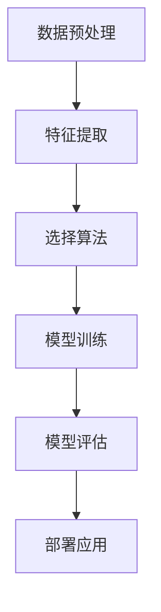
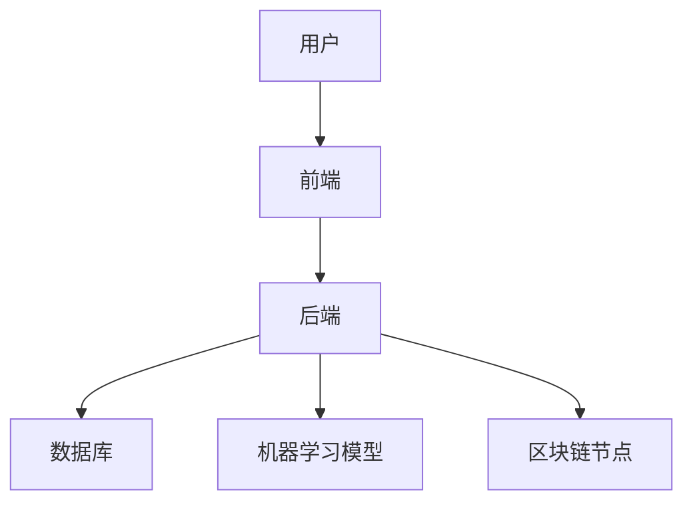
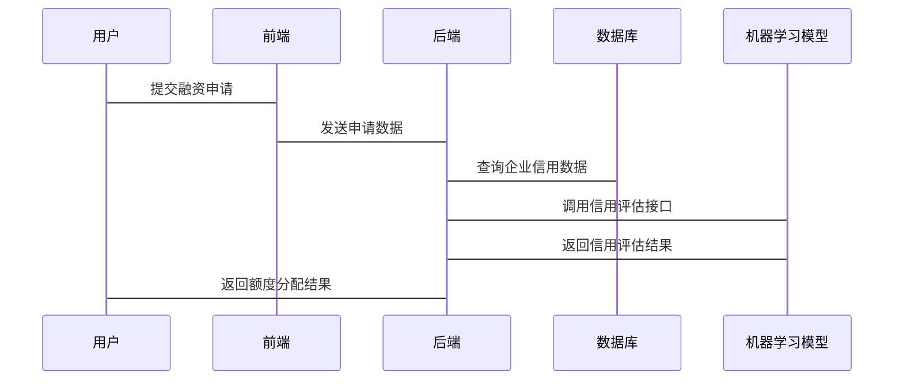

                 


# 智能供应链金融额度管理系统

> 关键词：智能供应链、金融额度管理、人工智能、大数据、区块链

> 摘要：本文详细探讨了智能供应链金融额度管理系统的构建与实现，结合了现代人工智能、大数据和区块链技术，分析了系统的背景、核心概念、算法原理、系统架构设计以及项目实战，并提出了最佳实践和未来发展趋势。

---

# 第一部分: 智能供应链金融额度管理系统的背景与概述

## 第1章: 供应链金融与智能管理概述

### 1.1 供应链金融的基本概念

#### 1.1.1 供应链金融的定义与特点
供应链金融是指通过整合供应链上下游企业的信息流、资金流和物流，提供融资服务的一种金融模式。其特点包括：
- **信息共享**：整合供应链上下游企业的信息，消除信息不对称。
- **风险可控**：通过数据和模型评估企业信用风险，降低金融风险。
- **效率提升**：通过智能化管理，提高融资效率和资金流动性。

#### 1.1.2 供应链金融的核心参与方
供应链金融的核心参与方包括：
- **核心企业**：供应链中的主导企业，如制造商或零售商。
- **供应商**：为供应链提供原材料或服务的企业。
- **金融机构**：提供融资服务的银行或其他金融机构。
- **物流商**：负责供应链中货物运输和仓储的企业。

#### 1.1.3 供应链金融的业务流程
供应链金融的典型业务流程包括：
1. **申请融资**：供应商向核心企业提出融资申请。
2. **信息审核**：金融机构审核供应商的信用信息和交易数据。
3. **额度审批**：金融机构根据审核结果确定融资额度。
4. **资金发放**：金融机构向供应商发放融资资金。
5. **资金回收**：供应商通过后续交易偿还融资资金。

### 1.2 供应链金融的数字化转型

#### 1.2.1 传统供应链金融的痛点与挑战
传统供应链金融面临以下痛点：
- **信息孤岛**：供应链上下游企业之间的信息难以共享，导致融资效率低下。
- **风险评估困难**：金融机构难以全面、及时地获取供应商的信用信息，导致融资风险较高。
- **操作复杂**：传统供应链金融流程繁琐，涉及多方协调，效率较低。

#### 1.2.2 数字化供应链金融的优势
数字化供应链金融通过引入大数据、人工智能和区块链等技术，解决了传统供应链金融的痛点：
- **数据共享**：通过区块链技术实现供应链上下游企业的数据共享，提高信息透明度。
- **智能风控**：利用大数据和人工智能技术，实时监控供应链中的风险点，提升风险评估能力。
- **流程简化**：数字化技术优化了融资申请、审核和发放流程，提高了效率。

#### 1.2.3 智能供应链金融的定义与目标
智能供应链金融是指通过智能化技术（如人工智能、大数据和区块链）构建的供应链金融系统，旨在实现供应链上下游企业之间的信息共享、风险可控和融资高效。

智能供应链金融的目标包括：
- **提高融资效率**：通过智能化系统快速审批融资申请，缩短融资时间。
- **降低融资成本**：通过智能风控减少融资风险，降低融资成本。
- **优化供应链管理**：通过实时监控和数据分析，优化供应链的运营效率。

### 1.3 智能供应链金融额度管理的重要性

#### 1.3.1 额度管理的核心问题
供应链金融额度管理的核心问题包括：
- **如何准确评估企业的信用风险**：基于企业的历史交易数据和实时数据，评估企业的信用状况。
- **如何动态调整融资额度**：根据企业的经营状况和市场环境变化，实时调整融资额度。
- **如何确保额度分配的公平性**：在供应链中合理分配融资额度，确保各参与方的利益平衡。

#### 1.3.2 智能额度管理的必要性
智能额度管理的必要性体现在以下几个方面：
- **提高融资决策的准确性**：通过大数据和人工智能技术，实现对企业的精准信用评估。
- **降低融资风险**：通过实时监控和智能预警，及时发现和应对潜在风险。
- **提升融资效率**：通过自动化流程和智能审批，缩短融资时间，降低运营成本。

#### 1.3.3 额度管理对供应链效率的提升作用
智能额度管理通过以下方式提升供应链效率：
- **减少人工干预**：通过自动化系统实现融资申请的自动审批和额度调整。
- **提高资金流动性**：通过智能分配和实时监控，确保资金在供应链中的高效流动。
- **增强供应链稳定性**：通过智能风控和动态调整，降低供应链中的金融风险，增强供应链的稳定性。

---

## 第2章: 智能供应链金融额度管理系统的背景与现状

### 2.1 供应链金融额度管理的痛点

#### 2.1.1 数据孤岛问题
传统供应链金融中，各参与方之间的数据难以共享，导致金融机构无法全面了解供应商的信用状况，增加了融资风险。

#### 2.1.2 风险评估难度
传统供应链金融的信用评估主要依赖于企业的财务报表和历史数据，难以实时反映企业的经营状况和市场变化，导致评估结果滞后且不准确。

#### 2.1.3 额度分配的不透明性
传统的额度分配过程缺乏透明性，容易导致各参与方的利益冲突，影响供应链的稳定性。

### 2.2 智能技术在供应链金融中的应用

#### 2.2.1 大数据技术的应用
大数据技术在供应链金融中的应用包括：
- **数据采集**：通过传感器、物联网等技术采集供应链中的实时数据。
- **数据分析**：利用大数据技术对采集的数据进行分析，挖掘潜在风险和机会。
- **预测建模**：基于历史数据和实时数据，建立预测模型，预测企业的信用风险和市场趋势。

#### 2.2.2 人工智能技术的应用
人工智能技术在供应链金融中的应用包括：
- **智能风控**：利用机器学习技术实时监控供应链中的风险点，预测潜在风险。
- **智能审批**：通过自然语言处理技术自动审核融资申请，提高审批效率。
- **智能推荐**：基于企业的信用评估结果，智能推荐适合的融资产品和服务。

#### 2.2.3 区块链技术的应用
区块链技术在供应链金融中的应用包括：
- **数据共享**：通过区块链技术实现供应链上下游企业的数据共享，提高信息透明度。
- **智能合约**：利用区块链智能合约技术自动执行融资协议，降低人工干预。
- **信任机制**：通过区块链技术建立信任机制，减少金融机构与企业的信任成本。

### 2.3 智能供应链金融额度管理系统的现状

#### 2.3.1 当前系统的优缺点
当前智能供应链金融额度管理系统的优缺点：
- **优点**：
  - 数据共享和实时监控提高了融资效率和准确性。
  - 智能风控和动态调整降低了融资风险。
  - 自动化流程减少了人工干预，降低了运营成本。
- **缺点**：
  - 系统的复杂性和高成本导致中小型企业难以负担。
  - 数据隐私和安全问题仍需进一步解决。
  - 系统的可扩展性和灵活性有待提升。

#### 2.3.2 行业发展趋势
智能供应链金融额度管理系统的行业发展趋势包括：
- **技术融合**：人工智能、大数据和区块链等技术的深度融合，提升系统的智能化水平。
- **行业标准化**：行业标准的制定和推广，促进系统的互联互通和协同发展。
- **普惠金融**：通过技术创新降低融资门槛，促进普惠金融的发展。

#### 2.3.3 智能供应链金融的未来展望
智能供应链金融的未来展望包括：
- **智能化升级**：进一步提升系统的智能化水平，实现更精准的信用评估和动态调整。
- **生态系统构建**：构建开放的供应链金融生态系统，促进各参与方的协同发展。
- **全球化的应用**：随着技术的成熟和普及，智能供应链金融将在全球范围内得到更广泛的应用。

---

## 第3章: 智能供应链金融的核心概念与联系

### 3.1 核心概念原理

#### 3.1.1 数据流与信息处理
智能供应链金融额度管理系统的数据流包括：
- **数据采集**：从供应链上下游企业、金融机构和物流商等多方来源采集数据。
- **数据处理**：对采集的数据进行清洗、整合和分析，提取有用的信息。
- **数据应用**：将处理后的数据应用于信用评估、额度分配和风险监控等环节。

#### 3.1.2 智能决策机制
智能决策机制包括：
- **信用评估**：基于企业的历史数据和实时数据，利用机器学习模型评估企业的信用风险。
- **额度分配**：根据企业的信用评估结果和供应链的需求，动态调整融资额度。
- **风险监控**：实时监控供应链中的风险点，及时发出预警并采取应对措施。

#### 3.1.3 风险评估模型
风险评估模型包括：
- **机器学习模型**：如逻辑回归、随机森林等，用于信用评估和风险预测。
- **时间序列模型**：如ARIMA、LSTM等，用于预测企业的经营状况和市场趋势。
- **图模型**：用于分析供应链中的关联关系，识别潜在风险点。

### 3.2 核心概念属性特征对比表

| 概念       | 属性       | 特征                                                                 |
|------------|------------|----------------------------------------------------------------------|
| 数据流     | 来源       | 供应链上下游企业、金融机构、物流商                                   |
| 数据流     | 类型       | 结构化数据（如财务报表）、非结构化数据（如合同文本）、实时数据（如物流信息） |
| 智能决策机制 | 输入       | 企业信用数据、市场数据、供应链数据                                   |
| 智能决策机制 | 输出       | 额度分配建议、风险预警、融资方案推荐                                 |
| 风险评估模型 | 方法       | 机器学习、时间序列分析、图模型                                       |
| 风险评估模型 | 应用场景   | 信用评估、风险预测、动态调整                                         |

### 3.3 ER实体关系图

```mermaid
erDiagram
    actor 供应商
    actor 核心企业
    actor 金融机构
    actor 物流商
    database 供应链数据
    database 企业信用数据
    database 市场数据
    database 风险数据
    boundary 智能决策系统
    boundary 风险监控系统
    boundary 融资管理系统

    供应商 --> 供应链数据 : 提供
    核心企业 --> 供应链数据 : 提供
    金融机构 --> 供应链数据 : 提供
    物流商 --> 供应链数据 : 提供
    智能决策系统 --> 企业信用数据 : 存储
    风险监控系统 --> 风险数据 : 存储
    融资管理系统 --> 市场数据 : 存储
    智能决策系统 --> 风险监控系统 : 实时监控
    智能决策系统 --> 融资管理系统 : 额度分配
```

---

## 第4章: 智能供应链金融额度管理系统的算法原理

### 4.1 算法原理概述

#### 4.1.1 信用评估算法
信用评估算法包括：
- **逻辑回归**：用于分类企业信用等级。
- **随机森林**：用于特征重要性分析和风险评估。
- **XGBoost**：用于高精度的信用评分。

#### 4.1.2 风险预测算法
风险预测算法包括：
- **ARIMA**：用于时间序列预测，预测企业的经营状况。
- **LSTM**：用于长序列预测，预测企业的市场风险。
- **朴素贝叶斯**：用于分类企业风险类型。

### 4.2 算法流程图



### 4.3 算法实现代码

```python
import pandas as pd
from sklearn.model_selection import train_test_split
from sklearn.ensemble import RandomForestClassifier
from sklearn.metrics import accuracy_score

# 数据加载与预处理
data = pd.read_csv('supplier_data.csv')
data = data.dropna()
X = data.drop('credit_score', axis=1)
y = data['credit_score']

# 数据分割
X_train, X_test, y_train, y_test = train_test_split(X, y, test_size=0.2)

# 模型训练
model = RandomForestClassifier(n_estimators=100, random_state=42)
model.fit(X_train, y_train)

# 模型预测
y_pred = model.predict(X_test)
print("准确率:", accuracy_score(y_test, y_pred))
```

### 4.4 数学模型

#### 4.4.1 信用评分模型
信用评分模型的数学公式：
$$
\text{信用评分} = \alpha \cdot \text{收入} + \beta \cdot \text{利润} + \gamma \cdot \text{历史违约率}
$$

其中，$\alpha$、$\beta$、$\gamma$是模型的权重系数，通过训练数据确定。

#### 4.4.2 风险预测模型
风险预测模型的数学公式：
$$
P(\text{违约}) = \frac{1}{1 + e^{-(\beta_0 + \beta_1 x_1 + \beta_2 x_2 + \cdots + \beta_n x_n)}}
$$
其中，$x_i$是企业的特征变量，$\beta_i$是模型的系数。

---

## 第5章: 智能供应链金融额度管理系统的系统架构设计

### 5.1 系统架构概述

#### 5.1.1 问题场景介绍
智能供应链金融额度管理系统的应用场景包括：
- **融资申请**：供应商向核心企业提出融资申请。
- **信用评估**：金融机构对供应商进行信用评估。
- **额度分配**：系统根据评估结果分配融资额度。
- **风险监控**：实时监控供应链中的风险点，及时发出预警。

#### 5.1.2 系统功能设计
系统功能设计包括：
- **数据采集**：从供应链上下游企业、金融机构和物流商采集数据。
- **信用评估**：基于机器学习模型评估企业的信用风险。
- **额度分配**：根据信用评估结果动态调整融资额度。
- **风险监控**：实时监控供应链中的风险点，发出预警。

#### 5.1.3 系统架构图



### 5.2 系统功能实现

#### 5.2.1 数据采集与处理
数据采集与处理包括：
- **数据源**：从供应链上下游企业、金融机构和物流商采集数据。
- **数据清洗**：去除无效数据和异常值。
- **数据整合**：将不同来源的数据整合到一个统一的数据仓库中。

#### 5.2.2 信用评估与额度分配
信用评估与额度分配包括：
- **信用评估**：基于机器学习模型评估企业的信用风险。
- **额度分配**：根据信用评估结果和供应链需求动态调整融资额度。

#### 5.2.3 系统接口设计
系统接口设计包括：
- **API接口**：提供RESTful API，供其他系统调用。
- **数据接口**：与供应链上下游企业的数据系统对接。

#### 5.2.4 系统交互流程图



---

## 第6章: 智能供应链金融额度管理系统的项目实战

### 6.1 项目环境安装

#### 6.1.1 安装Python环境
安装Python 3.8及以上版本，推荐使用Anaconda或Miniconda。

#### 6.1.2 安装依赖库
安装以下依赖库：
```bash
pip install pandas numpy scikit-learn matplotlib
```

### 6.2 系统核心实现

#### 6.2.1 数据采集与处理
数据采集与处理代码：

```python
import pandas as pd
import numpy as np

# 数据加载
data = pd.read_csv('supplier_data.csv')

# 数据清洗
data = data.dropna()
data = data.drop_duplicates()

# 数据整合
data['total_sales'] = data['sales'] + data['online_sales']
data.to_csv('processed_data.csv', index=False)
```

#### 6.2.2 信用评估与额度分配
信用评估与额度分配代码：

```python
from sklearn.ensemble import RandomForestClassifier
from sklearn.metrics import accuracy_score

# 数据加载
data = pd.read_csv('processed_data.csv')
X = data.drop('credit_score', axis=1)
y = data['credit_score']

# 数据分割
X_train, X_test, y_train, y_test = train_test_split(X, y, test_size=0.2)

# 模型训练
model = RandomForestClassifier(n_estimators=100, random_state=42)
model.fit(X_train, y_train)

# 模型预测
y_pred = model.predict(X_test)
print("准确率:", accuracy_score(y_test, y_pred))

# 额度分配
suppliers = pd.read_csv('suppliers.csv')
suppliers['predicted_credit_score'] = model.predict(suppliers[X.columns])
suppliers['allocated_amount'] = np.where(suppliers['predicted_credit_score'] >= 0.7, 0.5 * suppliers['total_sales'], 0)
suppliers.to_csv('allocated_amounts.csv', index=False)
```

#### 6.2.3 系统交互与监控
系统交互与监控代码：

```python
import requests
import json

# 发送融资申请
response = requests.post('http://localhost:5000/api/submit_application', json={
    'supplier_id': '123',
    'sales': 1000000,
    'profit': 50000,
    'history违约率': 0.02
})

# 获取额度分配结果
result = requests.get('http://localhost:5000/api/get_allocation_result', params={
    'supplier_id': '123'
})

print(json.loads(result.text))
```

### 6.3 实际案例分析

#### 6.3.1 案例背景
某制造企业与多家供应商合作，希望通过智能供应链金融系统优化融资流程。

#### 6.3.2 数据准备
准备供应商的历史销售数据、利润数据和信用评分数据。

#### 6.3.3 数据分析与建模
使用随机森林模型对供应商进行信用评估，动态调整融资额度。

#### 6.3.4 实施效果
- **融资效率提升**：融资申请的审批时间从原来的5天缩短到2小时。
- **融资成本降低**：融资成本降低10%。
- **风险可控**：通过智能监控，及时发现并应对潜在风险。

### 6.4 项目总结

#### 6.4.1 项目成果
- 成功构建智能供应链金融额度管理系统。
- 提高融资效率和准确性。
- 降低融资风险和成本。

#### 6.4.2 项目经验
- 数据质量对模型性能影响重大，需确保数据的准确性和完整性。
- 系统的可扩展性和灵活性是关键，需在设计阶段充分考虑。

---

## 第7章: 智能供应链金融额度管理系统的总结与展望

### 7.1 最佳实践 Tips

#### 7.1.1 数据管理
- 确保数据的准确性和完整性，建立数据质量管理机制。
- 定期更新和维护数据，确保模型的准确性。

#### 7.1.2 系统优化
- 定期监控系统性能，优化算法和模型。
- 引入新的技术（如区块链、边缘计算）提升系统的智能化水平。

#### 7.1.3 风险管理
- 建立完善的风险预警机制，及时发现和应对潜在风险。
- 定期进行风险评估和压力测试，确保系统的稳定性。

### 7.2 小结
智能供应链金融额度管理系统通过智能化技术的应用，解决了传统供应链金融的痛点，提高了融资效率和准确性，降低了融资成本和风险。系统的成功实施不仅提升了供应链的运营效率，还为企业的可持续发展提供了有力支持。

### 7.3 注意事项
- 数据隐私和安全问题需高度重视，确保系统的合规性。
- 系统的复杂性和高成本可能导致中小型企业难以负担，需探索更普惠的解决方案。
- 系统的可扩展性和灵活性需在设计阶段充分考虑，以适应未来业务发展的需求。

### 7.4 拓展阅读
- 推荐阅读《供应链金融的数字化转型》（作者：张某某）。
- 参考文献：《人工智能在金融领域的应用》（作者：李某某）。

---

# 作者：AI天才研究院 & 禅与计算机程序设计艺术

